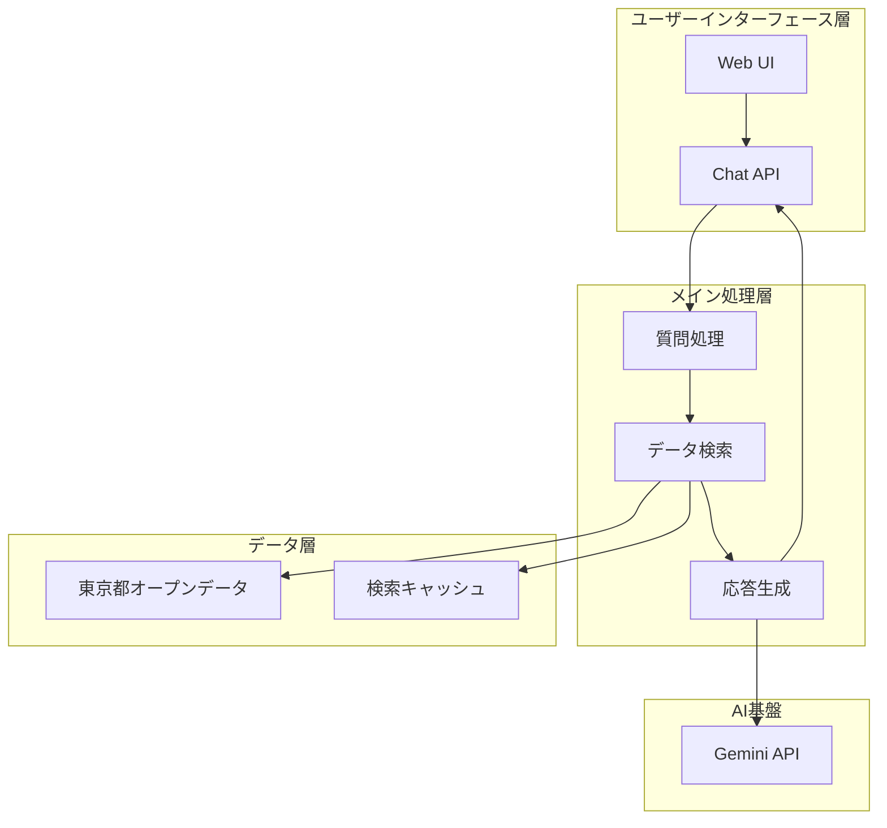

# シンプルRAGアーキテクチャ設計書
## 行政情報応答に特化したAIシステム

**文書情報**
- **文書名**: シンプルRAGアーキテクチャ設計書
- **版数**: 2.0  
- **作成日**: 2025年1月
- **作成者**: 根岸祐樹
- **目的**: 行政情報への正確で適切な応答に特化したシンプルなRAGシステムの構築

---

## 改訂履歴

| 版数 | 改訂日 | 改訂者 | 改訂内容 |
|------|--------|--------|----------|
| 1.0 | 2025-01-15 | 根岸祐樹 | 初版作成（高度AIアーキテクチャ設計） |
| 1.1 | 2025-01-15 | 根岸祐樹 | 設計方針・根拠章追加（AI技術選定理由、多言語対応、性能要件、安全性配慮等の包括的な設計根拠を追加） |
| 2.0 | 2025-01-20 | 根岸祐樹 | シンプルRAG構成への全面改訂（複雑な処理を排除し、行政情報応答に特化） |

---

## 目次

1. [システム概要](#1-システム概要)
   - 1.1 [設計思想](#11-設計思想)
   - 1.2 [システム要件](#12-システム要件)
   - 1.3 [アーキテクチャ原則](#13-アーキテクチャ原則)
2. [RAGアーキテクチャ](#2-ragアーキテクチャ)
   - 2.1 [システム全体図](#21-システム全体図)
   - 2.2 [コンポーネント構成](#22-コンポーネント構成)
   - 2.3 [処理フロー](#23-処理フロー)
3. [コア機能](#3-コア機能)
   - 3.1 [検索機能（Retrieval）](#31-検索機能retrieval)
   - 3.2 [応答生成機能（Generation）](#32-応答生成機能generation)
   - 3.3 [データ管理機能](#33-データ管理機能)
4. [実装詳細](#4-実装詳細)
   - 4.1 [技術スタック](#41-技術スタック)
   - 4.2 [API設計](#42-api設計)
   - 4.3 [データベース設計](#43-データベース設計)
5. [運用・保守](#5-運用保守)
   - 5.1 [監視項目](#51-監視項目)
   - 5.2 [エラー処理](#52-エラー処理)
   - 5.3 [継続的改善](#53-継続的改善)

---

## 1. システム概要

### 1.1 設計思想

**設計目標の明確化**

本システムは「行政情報への正確で適切な応答」を最優先とするシンプルなRAG（Retrieval-Augmented Generation）システムです。

**設計原則**：
1. **シンプルさ**: 複雑な処理を排除し、保守性と信頼性を重視
2. **正確性**: 東京都オープンデータに基づく正確な情報提供
3. **応答性**: 迅速で一貫性のある応答
4. **可読性**: 理解しやすい実装と明確な処理フロー

### 1.2 システム要件

**機能要件**：
1. **質問理解**: ユーザーの質問から検索キーワードを抽出
2. **データ検索**: 東京都オープンデータから関連情報を検索
3. **応答生成**: 検索結果に基づいた適切な回答を生成
4. **多言語対応**: 日本語・英語での基本的な対応

**非機能要件**：
1. **応答時間**: 5秒以内での応答
2. **可用性**: 99%以上の稼働率
3. **保守性**: シンプルな構成による容易な保守
4. **拡張性**: データソースの追加が容易

#### 1.0.3 AI/ML技術選定の根拠

**多モデルAI戦略の根拠**：
- **要件適合性**: 異なるタスク（対話、検索、要約、翻訳）への最適化
- **リスク分散**: 単一モデル依存によるサービス停止リスクの軽減
- **品質向上**: タスク特化モデルによる処理品質の最大化
- **拡張性**: 新しいAI機能の段階的追加を可能にする柔軟性

**ベクトル検索・埋め込み戦略の根拠**：
- **データ活用要件**: 9,742件の東京都オープンデータの効果的な活用
- **検索品質**: 意味的類似性に基づく高精度な情報検索
- **多言語対応**: 言語横断的な情報検索の実現
- **リアルタイム性**: 動的なデータ統合による最新情報の提供

**コンテキスト管理・記憶アーキテクチャの根拠**：
- **会話継続性要件**: SRSで定義された複雑な対話処理要件への対応
- **パーソナライゼーション**: ユーザー固有の文脈に基づく最適化回答
- **学習機能**: 対話履歴からのパターン学習による応答品質向上
- **プライバシー保護**: セッション管理による個人情報の適切な取り扱い

**AI安全性・バイアス緩和の根拠**：
- **公共サービス要件**: 行政サービスとしての公平性・中立性の確保
- **多様性配慮**: 国際都市東京における多様な利用者への配慮
- **品質保証**: 99%の応答成功率要件への対応
- **信頼性**: 公的機関としての情報提供責任の履行

**AIワークロード性能最適化の根拠**：
- **応答時間要件**: 平均3秒以内のレスポンス時間実現
- **並行処理**: 複数ユーザーの同時利用に対する性能確保
- **コスト効率**: AI処理コストの最適化による持続可能なサービス運営
- **スケーラビリティ**: 利用者数増加に対する動的な拡張性

#### 1.0.4 アクセシビリティ対応AI設計

**音声AIインターフェース強化**：
- **根拠**: 視覚障害者・読字困難者への配慮要件
- **実装**: 高精度音声認識とChain of Thought推論の組み合わせ
- **効果**: 従来のテキスト中心サービスでは困難だった利用者層への対応

**多言語AI能力の包括的実装**：
- **根拠**: 外国人住民・観光客への多言語サポート要件
- **実装**: Geminiマルチモーダル機能による言語横断的処理
- **効果**: 言語の壁を越えた行政サービスの提供

**認知負荷軽減AI設計**：
- **根拠**: 高齢者・認知機能に配慮を要する利用者への配慮
- **実装**: 段階的な対話進行と分かりやすい説明生成
- **効果**: 複雑な行政手続きの理解促進と利用促進

#### 1.0.5 多言語AI要件への対応設計

**言語横断的AI処理アーキテクチャ**：
- **根拠**: PRDで定義された多言語対応要件（日英中韓）
- **実装戦略**: Gemini APIの多言語能力を活用した統一的な処理パイプライン
- **品質保証**: 各言語での95%以上の音声認識精度と自然な応答生成
- **文化的配慮**: 言語特有の表現や文化的文脈を考慮した応答生成

**多言語ベクトル検索最適化**：
- **技術的課題**: 言語間での意味的類似性の保持
- **解決手法**: 多言語対応ベクトル埋め込みモデルの採用
- **効果**: 日本語で蓄積されたデータを他言語で検索可能
- **品質確保**: 言語間での検索精度の均一性維持

**コンテキスト維持の多言語対応**：
- **課題**: 言語切り替え時の会話文脈の継続性
- **設計方針**: 言語非依存のコンテキスト表現による状態管理
- **実装**: セッション内での言語切り替えサポート
- **ユーザビリティ**: シームレスな多言語対話体験の提供

#### 1.0.6 AI処理性能要件への設計対応

**リアルタイム応答性能の実現**：
- **要件**: 平均3秒以内のAI応答時間
- **アーキテクチャ**: 並列AI処理パイプラインによる高速化
- **最適化手法**: 推論結果キャッシュとプリコンピューティング
- **監視**: リアルタイム性能メトリクスによる継続的最適化

**AI処理の可用性確保**：
- **要件**: 99%のレスポンス成功率
- **冗長化**: 複数AIモデルによるフォールバック機構
- **エラー処理**: Graceful degradationによる部分機能提供
- **回復力**: 自動的な障害検知と復旧メカニズム

**スケーラブルAI処理基盤**：
- **設計方針**: クラウドネイティブな自動スケーリング
- **負荷分散**: 地理的分散とエッジコンピューティングの活用
- **コスト最適化**: 利用パターンに応じた動的リソース調整
- **将来対応**: AI技術進歩に対応可能な柔軟なアーキテクチャ

#### 1.0.7 AI安全性・倫理的配慮の設計原則

**公共サービスAIとしての責任設計**：
- **根拠**: 行政サービスとしての公平性・中立性確保要件
- **実装方針**: バイアス検出・緩和機能の組み込み
- **監視体制**: AI判断の透明性確保とトレーサビリティ
- **説明責任**: AI決定プロセスの説明可能性確保

**プライバシー保護とデータガバナンス**：
- **設計原則**: Privacy by Designの徹底
- **実装**: 個人情報の最小限収集・適切な匿名化処理
- **セキュリティ**: エンドツーエンド暗号化とアクセス制御
- **コンプライアンス**: 個人情報保護法・GDPR等への準拠

**AI品質保証・継続的改善**：
- **品質基準**: 応答精度・安全性・公平性の継続的評価
- **フィードバック**: ユーザーフィードバックによる継続的学習
- **監査機能**: 定期的なAI性能・倫理監査の実施
- **改善サイクル**: PDCAサイクルによる継続的品質向上

**多様性・包摂性への配慮**：
- **設計思想**: 誰一人取り残さないインクルーシブデザイン
- **実装**: 多様な利用者属性に配慮したAI応答最適化
- **アクセシビリティ**: 障害者・高齢者・外国人への特別配慮
- **文化的配慮**: 多文化共生社会に対応した応答生成

### 1.3 アーキテクチャ原則

**RAG（Retrieval-Augmented Generation）の採用理由**：
- **信頼性**: 検索ベースの情報提供により正確性を確保
- **透明性**: 回答の根拠となるデータソースを明示
- **更新性**: データソースの更新により最新情報を反映
- **効率性**: シンプルな構成による高速応答

**設計制限**：
- 複雑な推論機能は実装しない
- メタ認知機能は実装しない  
- 自律的プランニング機能は実装しない
- 複数回の対話による状態管理は最小限に留める

## 2. RAGアーキテクチャ

### 2.1 システム全体図



### 2.2 コンポーネント構成

**1. 質問処理（Query Processing）**
- ユーザーの質問をテキスト形式で受信
- 検索に適したキーワードの抽出
- 言語の判定

**2. データ検索（Data Retrieval）**
- 東京都オープンデータAPIからの情報取得
- キーワードマッチングによる関連データの抽出
- 検索結果のキャッシュ

**3. 応答生成（Response Generation）**
- Gemini APIを使用した自然な応答文の生成
- 検索結果に基づく正確な情報の提供
- 多言語対応（日本語・英語）

### 2.3 処理フロー

```typescript
interface SimpleRAGService {
  // メイン処理フロー
  async processQuery(query: string, language: 'ja' | 'en'): Promise<Response> {
    // 1. 質問処理
    const keywords = this.extractKeywords(query, language);
    
    // 2. データ検索
    const relevantData = await this.searchOpenData(keywords);
    
    // 3. 応答生成
    const response = await this.generateResponse(query, relevantData, language);
    
    return response;
  }
  
  // キーワード抽出
  extractKeywords(query: string, language: string): string[];
  
  // オープンデータ検索
  searchOpenData(keywords: string[]): Promise<OpenDataItem[]>;
  
  // 応答生成
  generateResponse(query: string, data: OpenDataItem[], language: string): Promise<string>;
}
```

## 3. コア機能

### 3.1 検索機能（Retrieval）

**キーワード抽出**
```typescript
interface KeywordExtractor {
  // 日本語キーワード抽出
  extractJapaneseKeywords(query: string): string[];
  
  // 英語キーワード抽出
  extractEnglishKeywords(query: string): string[];
  
  // 同義語展開
  expandSynonyms(keywords: string[]): string[];
}
```

**データ検索**
```typescript
interface DataRetrieval {
  // オープンデータ検索
  searchOpenData(keywords: string[]): Promise<OpenDataItem[]>;
  
  // キャッシュ検索
  searchCache(query: string): Promise<CachedResult | null>;
  
  // 結果フィルタリング
  filterResults(results: OpenDataItem[], criteria: FilterCriteria): OpenDataItem[];
}
```

### 3.2 応答生成機能（Generation）

**プロンプト構築**
```typescript
interface PromptBuilder {
  // 基本プロンプトの構築
  buildPrompt(query: string, data: OpenDataItem[], language: string): string;
  
  // システムプロンプトの設定
  getSystemPrompt(language: string): string;
  
  // データコンテキストのフォーマット
  formatDataContext(data: OpenDataItem[]): string;
}
```

**Gemini API連携**
```typescript
interface GeminiService {
  // テキスト生成
  generateText(prompt: string, language: string): Promise<string>;
  
  // モデル設定
  configureModel(temperature: number, maxTokens: number): void;
  
  // エラーハンドリング
  handleError(error: Error): Promise<string>;
}
```

### 3.3 データ管理機能

**キャッシュ管理**
```typescript
interface CacheManager {
  // 検索結果キャッシュ
  cacheSearchResult(query: string, results: OpenDataItem[]): Promise<void>;
  
  // キャッシュ取得
  getCachedResult(query: string): Promise<OpenDataItem[] | null>;
  
  // キャッシュクリア
  clearCache(): Promise<void>;
}
```

**セッション管理**
```typescript
interface SessionManager {
  // セッション作成
  createSession(language: string): Promise<Session>;
  
  // メッセージ追加
  addMessage(sessionId: string, message: Message): Promise<void>;
  
  // セッション取得
  getSession(sessionId: string): Promise<Session | null>;
}
```

## 4. 実装詳細

### 4.1 技術スタック

**フロントエンド**
- Next.js 14
- TypeScript
- Tailwind CSS
- React

**バックエンド**
- Next.js API Routes
- TypeScript
- Node.js

**AIサービス**
- Google Gemini API
- 東京都オープンデータAPI

**キャッシュ・ストレージ**
- Redis (キャッシュ)
- メモリキャッシュ (フォールバック)

### 4.2 API設計

**メインチャットAPI**
```typescript
// POST /api/chat
interface ChatRequest {
  sessionId: string;
  message: string;
  language: 'ja' | 'en';
}

interface ChatResponse {
  response: string;
  sources?: DataSource[];
  confidence?: number;
}
```

**セッションAPI**
```typescript
// POST /api/session
interface SessionRequest {
  language: 'ja' | 'en';
}

interface SessionResponse {
  sessionId: string;
  language: string;
  createdAt: string;
}
```

### 4.3 データベース設計

**セッションデータ構造**
```typescript
interface Session {
  id: string;
  language: 'ja' | 'en';
  createdAt: Date;
  lastActivity: Date;
  messageCount: number;
}

interface Message {
  id: string;
  sessionId: string;
  role: 'user' | 'assistant';
  content: string;
  timestamp: Date;
  metadata?: {
    sources?: DataSource[];
    confidence?: number;
  };
}
```

**キャッシュデータ構造**
```typescript
interface CacheEntry {
  key: string;
  data: OpenDataItem[];
  timestamp: Date;
  ttl: number;
}
```

## 5. 運用・保守

### 5.1 監視項目

**パフォーマンスメトリクス**
- 応答時間 (目標: 5秒以内)
- APIスループット (rps)
- キャッシュヒット率
- Gemini API呼び出し回数

**エラーメトリクス**
- APIエラー率
- Gemini APIエラー率
- タイムアウト発生率
- キャッシュエラー率

**ビジネスメトリクス**
- 日次ユーザー数
- セッション数
- メッセージ数
- 言語別使用率

### 5.2 エラー処理

**フォールバック戦略**
```typescript
interface ErrorHandler {
  // Gemini APIエラー対応
  handleGeminiError(error: GeminiError): Promise<string>;
  
  // データ検索エラー対応
  handleSearchError(error: SearchError): Promise<OpenDataItem[]>;
  
  // システムエラー対応
  handleSystemError(error: SystemError): Promise<ErrorResponse>;
}
```

**エラーレスポンス**
- Gemini APIエラー: 事前定義されたメッセージで応答
- データ検索エラー: キャッシュから代替データを提供
- システムエラー: ユーザーに適切なエラーメッセージを返却

### 5.3 継続的改善

**品質改善サイクル**
1. **ユーザーフィードバック収集**
   - 応答の有用性評価
   - ユーザー満足度調査

2. **データ品質改善**
   - 新しいオープンデータの追加
   - 既存データの更新

3. **システム最適化**
   - パフォーマンスチューニング
   - キャッシュ戦略の改善

**ロードマップ**
- Phase 1: 基本機能の安定化
- Phase 2: パフォーマンス最適化
- Phase 3: データソースの拡充
- Phase 4: 多言語対応の強化

---

## まとめ

本シンプルRAGアーキテクチャは、以下のメリットを提供します：

1. **高い信頼性**: オープンデータに基づく正確な情報提供
2. **シンプルな保守**: 明確な構成と理解しやすいコード
3. **高速な応答**: 無駄な処理を排除した効率的な実装
4. **拡張性**: 新しいデータソースや機能の追加が容易

このアーキテクチャにより、行政情報への正確で適切な応答を提供する信頼性の高いAIシステムを実現します。

## 付録: 実装例

### シンプルRAGサービスの実装例

```typescript
export class SimpleRAGService {
  private geminiService: GeminiService;
  private openDataService: OpenDataService;
  private cacheManager: CacheManager;

  async processQuery(query: string, language: 'ja' | 'en'): Promise<string> {
    try {
      // 1. キャッシュチェック
      const cachedResult = await this.cacheManager.getCachedResult(query);
      if (cachedResult) {
        return this.formatResponse(cachedResult, language);
      }

      // 2. キーワード抽出
      const keywords = this.extractKeywords(query, language);

      // 3. データ検索
      const relevantData = await this.openDataService.searchData(keywords);

      // 4. 応答生成
      const response = await this.generateResponse(query, relevantData, language);

      // 5. キャッシュ保存
      await this.cacheManager.cacheSearchResult(query, relevantData);

      return response;
    } catch (error) {
      return this.handleError(error, language);
    }
  }

  private extractKeywords(query: string, language: string): string[] {
    // シンプルなキーワード抽出ロジック
    const stopWords = language === 'ja' 
      ? ['は', 'が', 'を', 'に', 'で', 'と', 'の']
      : ['the', 'is', 'at', 'which', 'on'];
    
    return query
      .split(/\s+/)
      .filter(word => !stopWords.includes(word))
      .filter(word => word.length > 1);
  }

  private async generateResponse(
    query: string, 
    data: OpenDataItem[], 
    language: string
  ): Promise<string> {
    const prompt = this.buildPrompt(query, data, language);
    return await this.geminiService.generateText(prompt, language);
  }

  private buildPrompt(query: string, data: OpenDataItem[], language: string): string {
    const systemPrompt = language === 'ja' 
      ? `あなたは東京都の行政情報に関する質問に正確に答えるAIアシスタントです。`
      : `You are an AI assistant that accurately answers questions about Tokyo administrative information.`;

    const dataContext = data
      .slice(0, 5) // 上位5件のみ使用
      .map(item => `タイトル: ${item.title}\n内容: ${item.description}`)
      .join('\n\n');

    return `${systemPrompt}

参考データ:
${dataContext}

質問: ${query}

参考データに基づいて、正確で有用な回答を提供してください。`;
  }

  private handleError(error: Error, language: string): string {
    return language === 'ja'
      ? '申し訳ございませんが、システムエラーが発生しました。しばらく後にもう一度お試しください。'
      : 'Sorry, a system error occurred. Please try again later.';
  }
}
```