# Tokyo Open Data AI Voice Chat Application - システムアーキテクチャ図

## 1. 全体システムアーキテクチャ

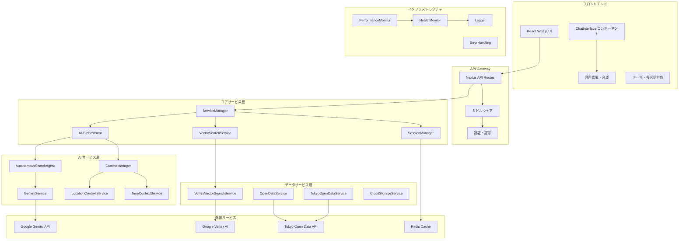

## 2. AI システムアーキテクチャ

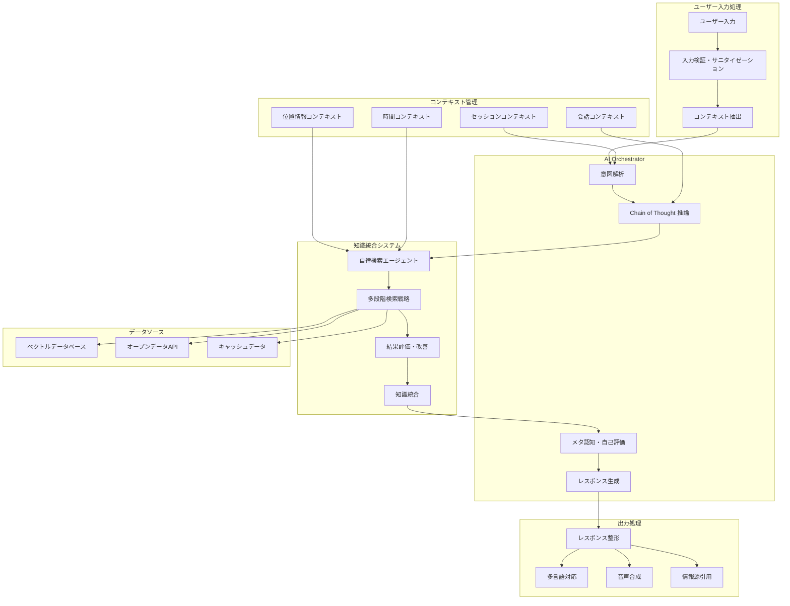

## 3. データフローアーキテクチャ

```mermaid
flowchart LR
    %% User Interaction
    User[ユーザー] --> WebUI[Webインターフェース]
    User --> VoiceInput[音声入力]

    %% Input Processing
    WebUI --> InputValidation[入力検証]
    VoiceInput --> SpeechRecognition[音声認識]
    SpeechRecognition --> InputValidation

    %% Session Management
    InputValidation --> SessionCheck[セッション確認]
    SessionCheck --> SessionCreate[新規セッション作成]
    SessionCheck --> SessionRetrieve[既存セッション取得]

    %% Core Processing
    SessionRetrieve --> AIProcessing[AI処理]
    SessionCreate --> AIProcessing
    AIProcessing --> ContextExtraction[コンテキスト抽出]
    ContextExtraction --> IntentAnalysis[意図解析]
    
    %% Knowledge Gathering
    IntentAnalysis --> SearchStrategy[検索戦略決定]
    SearchStrategy --> VectorSearch[ベクトル検索]
    SearchStrategy --> OpenDataSearch[オープンデータ検索]
    
    %% Data Integration
    VectorSearch --> DataIntegration[データ統合]
    OpenDataSearch --> DataIntegration
    DataIntegration --> ResponseGeneration[レスポンス生成]
    
    %% Output Processing
    ResponseGeneration --> LanguageAdaptation[言語適応]
    LanguageAdaptation --> VoiceOutput[音声出力]
    LanguageAdaptation --> TextOutput[テキスト出力]
    
    %% Caching and Monitoring
    DataIntegration --> CacheUpdate[キャッシュ更新]
    ResponseGeneration --> PerformanceLog[パフォーマンス記録]
    
    %% External Services
    VectorSearch -.-> VertexAI[Vertex AI]
    OpenDataSearch -.-> TokyoOpenData[Tokyo Open Data]
    VoiceOutput -.-> SpeechSynthesis[音声合成API]
    CacheUpdate -.-> Redis[Redis Cache]
```

## 4. セキュリティ・アーキテクチャ

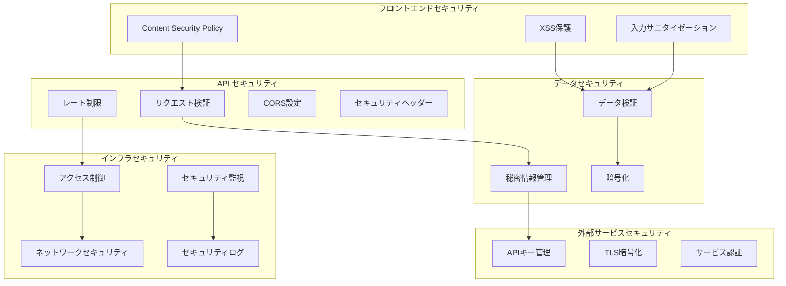

## 5. スケーラビリティ・アーキテクチャ

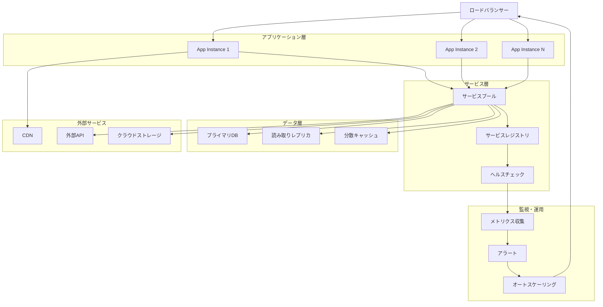

## 6. 開発・デプロイメントアーキテクチャ

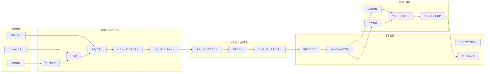

## 7. コンポーネント関係図

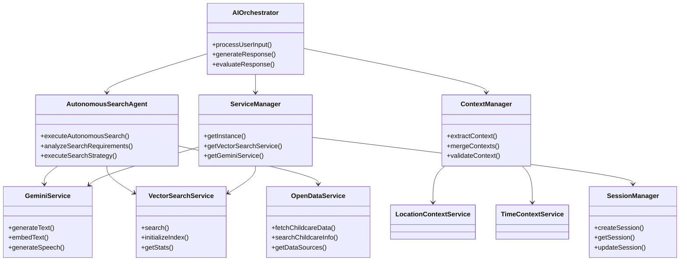

## 8. アーキテクチャの特徴

### 8.1 設計原則
- **モジュール性**: 各コンポーネントは独立して開発・テスト可能
- **スケーラビリティ**: 水平・垂直スケーリングに対応
- **可観測性**: 包括的な監視・ログ・メトリクス
- **セキュリティ**: 多層防御とゼロトラストアーキテクチャ
- **保守性**: 清潔なコード、適切な抽象化、豊富なドキュメント

### 8.2 技術スタック
- **フロントエンド**: React 18, Next.js 14, TypeScript
- **バックエンド**: Next.js API Routes, TypeScript
- **AI/ML**: Google Gemini, Vertex AI, カスタムAI Orchestrator
- **データベース**: Vector Database, Redis Cache
- **インフラ**: Google Cloud Platform, Vercel
- **監視**: カスタム監視システム, パフォーマンス監視

### 8.3 品質特性
- **パフォーマンス**: レスポンス時間最適化、キャッシュ戦略
- **可用性**: 冗長化、自動復旧、ヘルスチェック
- **信頼性**: エラーハンドリング、グレースフルデグラデーション
- **ユーザビリティ**: 直感的なUI、音声対応、多言語サポート
- **アクセシビリティ**: WCAG準拠、スクリーンリーダー対応

このアーキテクチャは、東京オープンデータを活用した音声対応AIチャットアプリケーションの要件を満たし、将来の拡張性と保守性を考慮して設計されています。

---

## 9. 設計方針・根拠

### 9.1 設計目標・上位要件からの導出

#### 9.1.1 政府サービス要件への対応

**インクルーシブな行政サービス実現**
- **音声優先設計**: 視覚・身体的制約を持つ市民への配慮
- **多言語対応**: 外国人住民への情報アクセス平等性確保
- **24時間対応**: 勤務時間外でも利用可能な市民サービス

本アーキテクチャは、「誰一人取り残さない」という政府DX基本方針を技術的に実現するため、アクセシビリティを最優先とした設計を採用しています。

#### 9.1.2 パフォーマンス・可用性要件

**政府系システムに求められる品質**
- **高可用性**: 99.5%以上のシステム稼働率
- **低レイテンシ**: 平均応答時間3秒以内
- **同時接続**: 1000人同時利用への対応
- **セキュリティ**: 政府情報システムセキュリティ要件準拠

### 9.2 アーキテクチャ選択の根拠

#### 9.2.1 モノリス vs マイクロサービス

**マイクロサービス志向を採用した根拠**

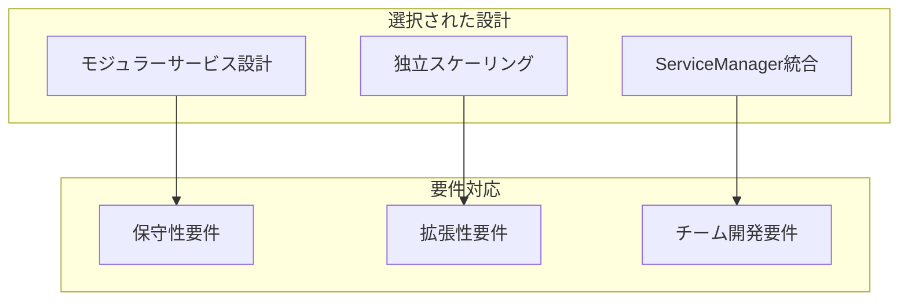

**採用理由**:
1. **保守性**: 各サービスの独立更新・テストが可能
2. **拡張性**: AI機能・データソース・UI機能の独立拡張
3. **並行開発**: フロントエンド・AI・データチームの並行開発効率化
4. **障害分離**: 特定サービス障害時の全体影響最小化

**マイクロサービスの課題とその対策**:
- **複雑性**: ServiceManagerパターンによる統合管理
- **一貫性**: TypeScript型システムによる型安全性確保
- **デバッグ**: 統合ログ・監視システムによる可観測性向上

#### 9.2.2 フロントエンド・バックエンド分離設計

**Next.js Full-Stack採用の根拠**

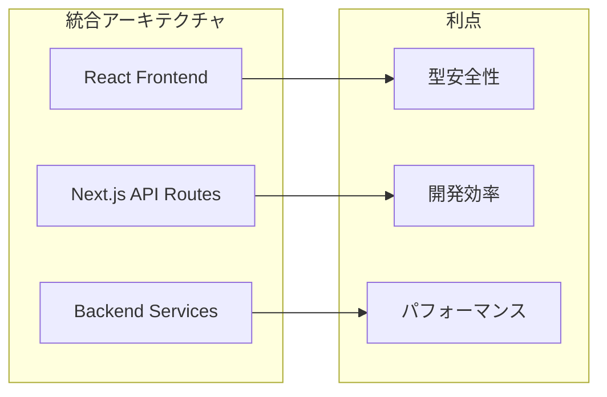

**技術選定理由**:
1. **開発効率**: フロントエンド・バックエンド共通TypeScript環境
2. **パフォーマンス**: Edge Runtime、SSR、ISRによる最適化
3. **保守性**: 単一リポジトリでの統合管理
4. **拡張性**: API Routes → マイクロサービス移行の容易性

#### 9.2.3 AI統合アーキテクチャ設計

**AI-First設計の根拠**

本システムの核心価値は「高度なAI対話」であるため、AIサービスを中心とした設計を採用:

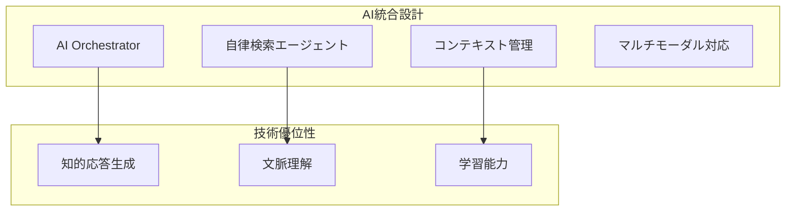

**設計原則**:
1. **Chain of Thought推論**: 段階的思考プロセスによる回答品質向上
2. **メタ認知機能**: 自己評価・改善機能による継続的品質向上
3. **自律検索**: ユーザー意図に基づく動的データ検索・統合
4. **マルチモーダル**: 音声・テキスト・視覚情報の統合処理

### 9.3 データアーキテクチャ設計根拠

#### 9.3.1 オープンデータ統合戦略

**9,742件のオープンデータ活用設計**

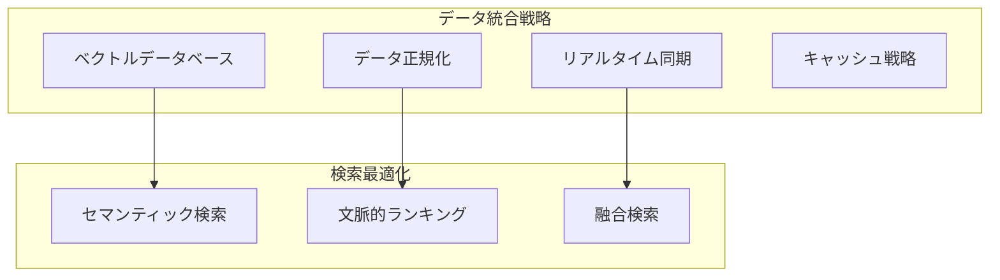

**設計根拠**:
1. **ベクトル検索**: 自然言語クエリに対する意味的検索実現
2. **階層化キャッシュ**: 頻繁アクセスデータの高速化
3. **バッチ処理**: 大量データ更新の効率化
4. **品質保証**: データ検証・クリーニングの自動化

#### 9.3.2 キャッシュ・セッション管理

**Redis分散キャッシュ採用根拠**

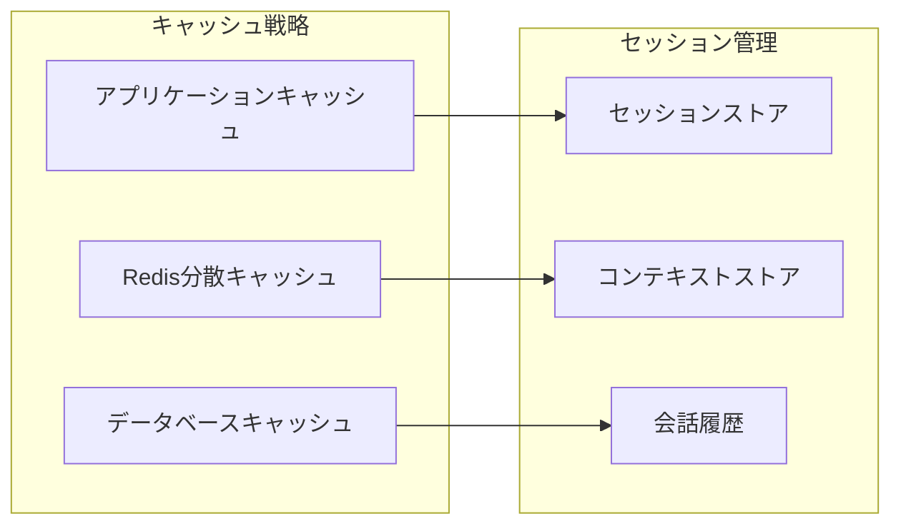

**技術選定理由**:
1. **パフォーマンス**: インメモリ処理による高速アクセス
2. **スケーラビリティ**: 分散環境でのセッション共有
3. **永続性**: RDB Snapshot機能による障害時復旧
4. **柔軟性**: 様々なデータ構造への対応

### 9.4 セキュリティアーキテクチャ根拠

#### 9.4.1 多層防御戦略

**政府系システムセキュリティ要件対応**

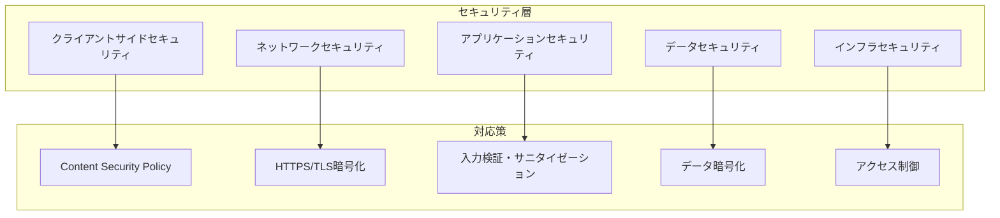

**セキュリティ設計原則**:
1. **ゼロトラスト**: 全てのアクセスを検証・認証
2. **最小権限**: 必要最小限のアクセス権限付与
3. **深層防御**: 複数のセキュリティ層による保護
4. **監査ログ**: 全アクセス・操作の記録・監視

#### 9.4.2 プライバシー保護設計

**個人情報保護・データガバナンス**

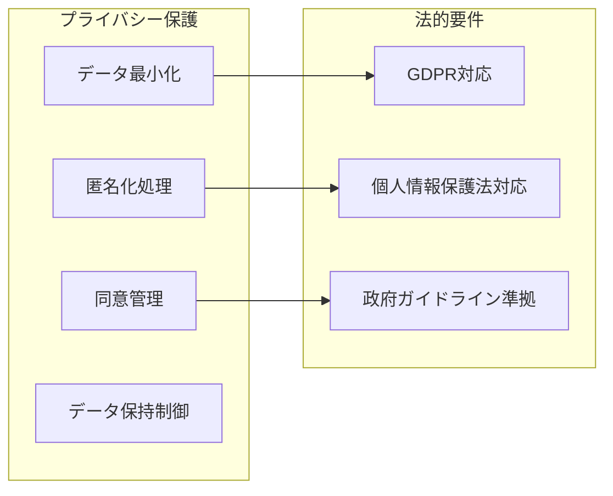

### 9.5 スケーラビリティ設計根拠

#### 9.5.1 水平・垂直スケーリング戦略

**負荷増大への対応設計**

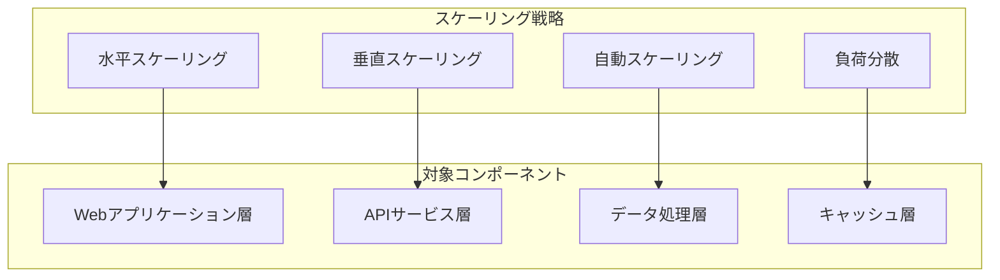

**スケーラビリティ設計原則**:
1. **ステートレス設計**: サーバー間の状態共有最小化
2. **非同期処理**: 重い処理の非同期化によるレスポンス向上
3. **リソース監視**: メトリクス監視による予防的スケーリング
4. **障害分離**: 部分障害時の影響範囲限定

#### 9.5.2 パフォーマンス最適化戦略

**レスポンス時間最適化**

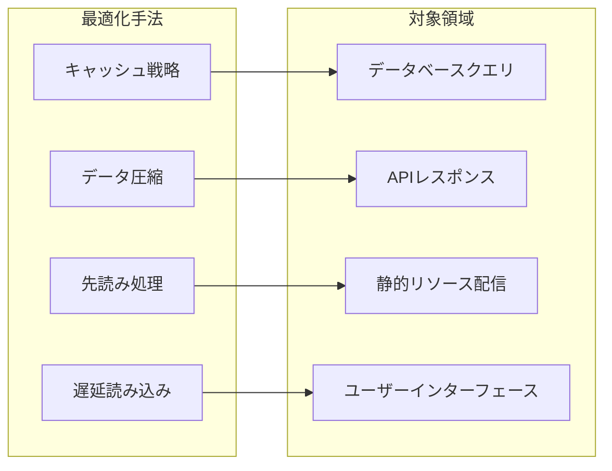

### 9.6 運用・監視アーキテクチャ根拠

#### 9.6.1 可観測性設計

**運用効率・障害対応の最適化**

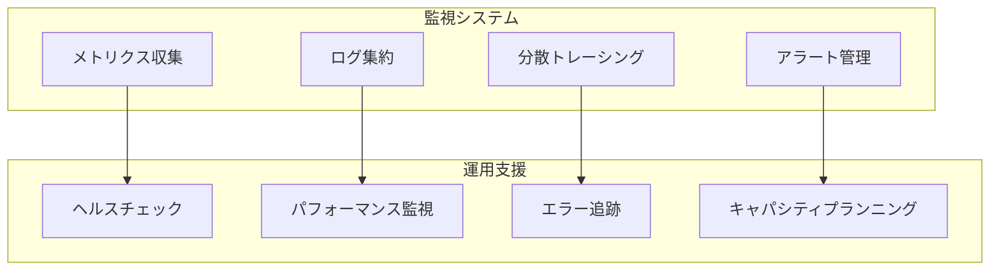

**可観測性の重要性**:
1. **早期問題検出**: プロアクティブな問題発見・対処
2. **根本原因分析**: 詳細なログ・トレースによる迅速な障害解析
3. **容量計画**: 利用傾向分析による適切なリソース配置
4. **継続改善**: パフォーマンスデータに基づく最適化

### 9.7 将来拡張性への配慮

#### 9.7.1 技術進化への適応設計

**新技術導入・機能拡張への準備**

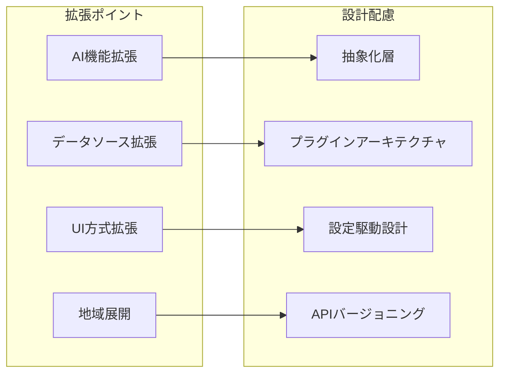

**拡張性設計原則**:
1. **抽象化**: 実装詳細の隠蔽による変更容易性
2. **インターフェース設計**: 標準化されたAPI・契約による結合度低減
3. **設定外部化**: ハードコード排除による柔軟性確保
4. **モジュール化**: 機能単位での独立開発・展開

#### 9.7.2 国際展開・多地域対応

**他地域・国家での利用展開への準備**

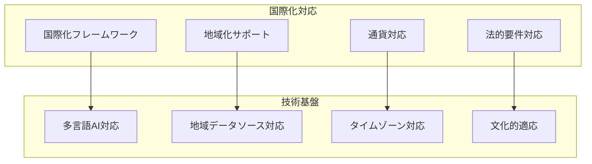

### 9.8 設計トレードオフとその判断根拠

#### 9.8.1 複雑性 vs 柔軟性

**設計複雑性の受容理由**:
- **要件の多様性**: 音声・テキスト・多言語・アクセシビリティ対応
- **将来拡張性**: 新機能・新データソース・新AI技術への対応
- **運用要件**: 高可用性・セキュリティ・監視・保守性

**複雑性管理手法**:
- **レイヤー分離**: 関心事の分離による理解容易性
- **ドキュメント充実**: アーキテクチャ・設計根拠の明文化
- **標準化**: 命名規則・コーディング規約・設計パターンの統一

#### 9.8.2 パフォーマンス vs コスト

**パフォーマンス優先判断の根拠**:
- **ユーザー体験**: 音声対話における応答速度の重要性
- **政府サービス**: 市民サービス品質への責任
- **差別化要因**: 民間チャットボットとの差別化ポイント

**コスト最適化配慮**:
- **段階的拡張**: MVP → 段階的機能拡張による投資リスク分散
- **オープンソース活用**: 商用ライセンス費用最小化
- **クラウド最適化**: 従量課金による無駄なリソース削減

この設計方針・根拠により、本アーキテクチャは政府サービスとして求められる品質・信頼性・拡張性を確保しながら、市民にとって価値のあるAI音声対話機能を提供することができます。