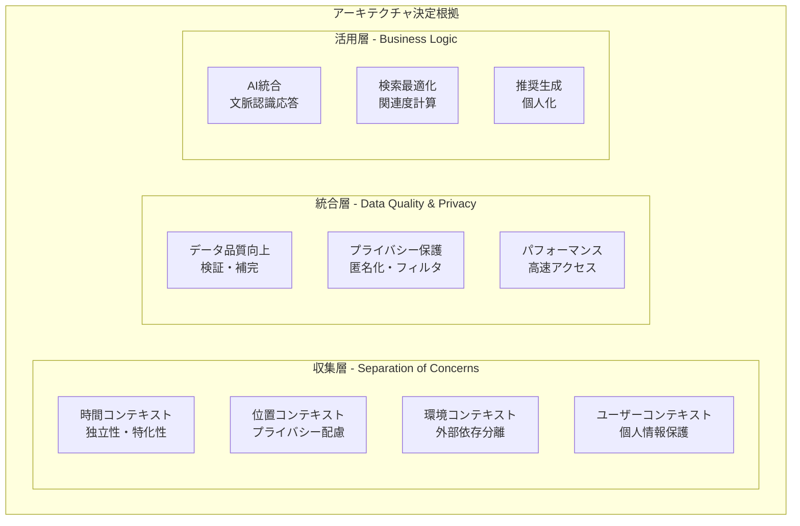
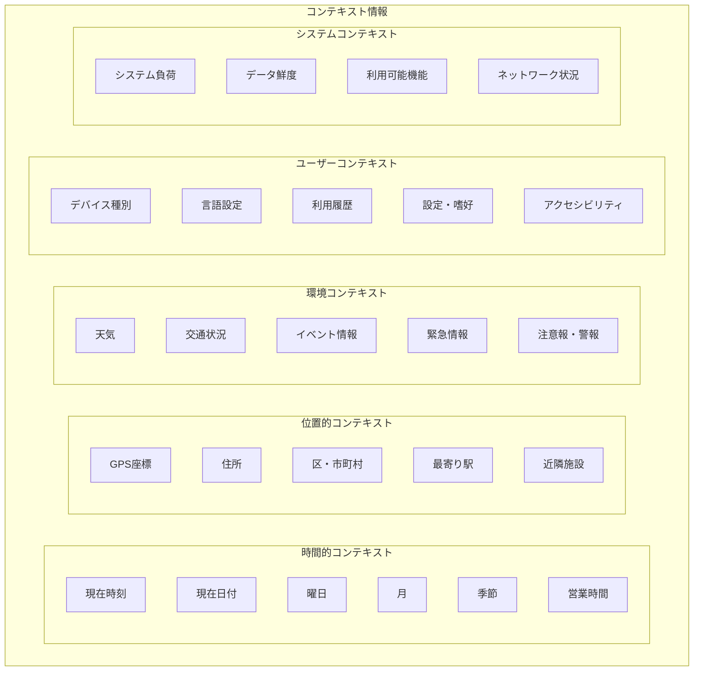
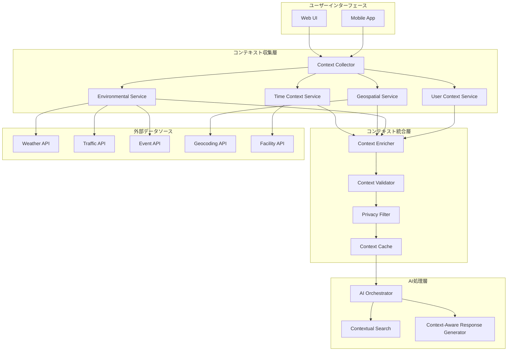

# コンテキスト管理システム設計書
## 文脈認識AI対話システム

**文書情報**
- **文書名**: コンテキスト管理システム設計書
- **版数**: 1.0
- **作成日**: 2025年1月
- **作成者**: 根岸祐樹
- **目的**: 文脈に応じた正確で有用な回答を提供するコンテキスト管理システムの設計

## 改訂履歴

| 版数 | 改訂日 | 改訂者 | 改訂内容 |
|------|--------|--------|----------|
| 1.0 | 2025-01-15 | 根岸祐樹 | 初版作成（文脈認識AI対話システムのコンテキスト管理設計） |

## 目次

1. [設計方針・根拠](#1-設計方針根拠)
   - 1.1 [設計原則と理念](#11-設計原則と理念)
   - 1.2 [技術選択根拠](#12-技術選択根拠)
   - 1.3 [アーキテクチャ決定理由](#13-アーキテクチャ決定理由)
2. [システム概要](#2-システム概要)
   - 2.1 [設計目標](#21-設計目標)
   - 2.2 [コンテキスト分類](#22-コンテキスト分類)
3. [コンテキスト詳細設計](#3-コンテキスト詳細設計)
   - 3.1 [時間的コンテキスト（TemporalContext）](#31-時間的コンテキストtemporalcontext)
   - 3.2 [位置的コンテキスト（GeospatialContext）](#32-位置的コンテキストgeospatialcontext)
   - 3.3 [環境コンテキスト（EnvironmentalContext）](#33-環境コンテキストenvironmentalcontext)
   - 3.4 [ユーザーコンテキスト（UserContext）](#34-ユーザーコンテキストusercontext)
4. [システム設計](#4-システム設計)
   - 4.1 [アーキテクチャ概要](#41-アーキテクチャ概要)
   - 4.2 [コンテキスト処理フロー](#42-コンテキスト処理フロー)
5. [実装戦略](#5-実装戦略)
   - 5.1 [段階的実装計画](#51-段階的実装計画)
   - 5.2 [技術選択](#52-技術選択)
6. [プライバシー・セキュリティ設計](#6-プライバシーセキュリティ設計)
   - 6.1 [プライバシー保護方針](#61-プライバシー保護方針)
   - 6.2 [セキュリティ対策](#62-セキュリティ対策)
7. [期待効果](#7-期待効果)
   - 7.1 [ユーザーエクスペリエンス向上](#71-ユーザーエクスペリエンス向上)
   - 7.2 [回答精度の向上](#72-回答精度の向上)

---

## 1. 設計方針・根拠

### 1.1 設計原則と理念

#### 1.1.1 上位要件からの設計理念

**PRD・SRS要件の技術的実現**：
本コンテキスト管理システム設計は、「誰一人取り残さない、インクルーシブな行政サービスの実現」という東京都の基本理念を、技術的な文脈認識機能として具現化することを目的としています。

**コンテキスト管理が重要な理由**：
1. **会話の継続性確保**: 多ターン対話において、前の会話内容を適切に保持・活用
2. **個人化された体験**: ユーザーの状況・環境に応じた最適な情報提供
3. **アクセシビリティ向上**: 文脈を理解することで、より自然で直感的な音声対話を実現
4. **効率的な情報検索**: 現在の状況に最も関連性の高い情報の優先提示

#### 1.1.2 設計原則

**1. プライバシー・ファースト原則**
- **根拠**: 行政サービスとして市民のプライバシー保護は最重要要件
- **実装**: 最小限のデータ収集、即座の匿名化、地理的精度の調整
- **効果**: 市民の信頼確保と個人情報保護法遵守

**2. リアルタイム文脈認識**
- **根拠**: 「今」「近く」「開いている」等の相対表現に正確に応答する必要性
- **実装**: 時間・位置・環境の動的収集と統合
- **効果**: ユーザーが求める「その時点で最も有用な情報」の提供

**3. 多言語・アクセシビリティ対応**
- **根拠**: 外国人市民、視覚・聴覚障害者を含む全ての市民への対応要件
- **実装**: 言語設定認識、アクセシビリティ機能検出、適応的UI提供
- **効果**: 真にインクルーシブな行政サービスの実現

**4. 段階的学習・改善**
- **根拠**: 利用パターンの蓄積により、より良いサービス提供が可能
- **実装**: 匿名化された利用履歴の分析、推奨アルゴリズムの改善
- **効果**: 継続的なユーザーエクスペリエンス向上

#### 1.1.3 コンテキスト管理がもたらすUX革新

**従来の行政サービス（Before）**:
```
ユーザー: 「保育園について教えて」
システム: 「東京都内には1,500の保育園があります。検索機能をご利用ください」
```

**コンテキスト対応後（After）**:
```
ユーザー: 「保育園について教えて」
システム: 「お住まいの港区周辺で、現在申込み受付中の認可保育園が3園あります。
           最寄りの〇〇保育園まで徒歩7分です。見学予約も可能です」
```

### 1.2 技術選択根拠

#### 1.2.1 マルチコンテキスト統合アーキテクチャ

**アーキテクチャ選択理由**：
- **要件適合性**: 時間・場所・環境・ユーザー情報の複合的活用要件
- **拡張性**: 新しいコンテキスト種類の追加容易性
- **パフォーマンス**: 並列データ収集による応答時間最適化
- **保守性**: 各コンテキストサービスの独立性確保

**技術スタック選定根拠**：

| 技術要素 | 選択技術 | 選定理由 |
|----------|----------|----------|
| 外部API統合 | TypeScript + axios | 型安全性、エラーハンドリング、開発効率 |
| 地理情報処理 | Google Maps API | 精度、データ更新頻度、東京都データとの統合性 |
| 天気情報 | OpenWeatherMap | 無料枠、API安定性、多言語対応 |
| キャッシュ | Redis with TTL | 高速アクセス、自動期限切れ、クラスタ対応 |
| プライバシー保護 | 独自実装 | 行政特有の要件、カスタマイズ性 |

#### 1.2.2 データ統合戦略

**外部データソース選定基準**：
1. **信頼性**: 公的機関または大手プロバイダーからのデータ
2. **更新頻度**: リアルタイムまたは高頻度更新
3. **API安定性**: SLA保証、ダウンタイム最小化
4. **コスト効率**: MVP段階での予算制約内
5. **データ品質**: 精度、完全性、一貫性

### 1.3 アーキテクチャ決定理由

#### 1.3.1 レイヤー分離アーキテクチャ

**採用理由**：
- **関心事の分離**: 各コンテキスト種類の独立開発・保守
- **テスタビリティ**: 各層の単体テスト・統合テスト容易性
- **スケーラビリティ**: 負荷に応じた個別スケーリング
- **障害対応**: 一部コンテキストの障害が全体に影響しない設計

**具体的な層構成根拠**：



#### 1.3.2 プライバシー保護設計決定

**段階的匿名化アプローチ**：
1. **収集時**: 必要最小限のデータのみ収集
2. **処理時**: 即座の匿名化・仮名化処理
3. **保存時**: 地理的精度調整、時間丸め処理
4. **利用時**: 用途別アクセス制御

**プライバシー保護レベル設計**：
```typescript
// プライバシー保護レベルの段階的実装
type PrivacyLevel = 'minimal' | 'standard' | 'enhanced';

// minimal: 区レベルの位置情報、時間レベルの時刻
// standard: 町レベルの位置情報、分レベルの時刻  
// enhanced: 建物レベルの位置情報、秒レベルの時刻
```

#### 1.3.3 パフォーマンス最適化設計

**多段階キャッシュ戦略**：
- **L1 Cache**: ブラウザメモリ（即座アクセス）
- **L2 Cache**: Redis（高速データベース）
- **L3 Cache**: 外部API結果キャッシュ（コスト削減）

**並列データ収集設計**：
```typescript
// 並列収集によるレスポンス時間最適化
const collectAllContexts = async (): Promise<EnrichedContext> => {
  const [temporal, geospatial, environmental, user] = await Promise.all([
    collectTemporalContext(),
    collectGeospatialContext(),
    collectEnvironmentalContext(),
    collectUserContext()
  ]);
  
  return integrateContexts({ temporal, geospatial, environmental, user });
};
```

#### 1.3.4 可用性・信頼性設計

**グレースフルデグラデーション**：
- 一部コンテキストの取得失敗時も、利用可能なコンテキストで応答継続
- 外部API障害時のフォールバック機能
- エラー状況の透明な情報提供

**エラーハンドリング戦略**：
```typescript
interface ContextCollectionResult {
  temporal: TemporalContext | null;
  geospatial: GeospatialContext | null;
  environmental: EnvironmentalContext | null;
  user: UserContext | null;
  errors: ContextError[];
  availability: number; // 0-1, 利用可能なコンテキストの割合
}
```

#### 1.3.5 特定設計決定の詳細根拠

**メモリ階層設計の根拠**：
- **要件**: シームレスな多ターン会話で、平均応答時間3秒以内
- **設計決定**: 短期メモリ（会話セッション）→中期メモリ（ユーザー履歴）→長期メモリ（統計的パターン）の階層化
- **根拠**: 認知科学における人間の記憶モデルに基づく自然な会話体験の実現
- **実装**: Redis（短期）+ RDB（中期）+ 機械学習モデル（長期）

```typescript
interface MemoryHierarchy {
  shortTerm: {
    sessionContext: ConversationContext;
    activeIntent: UserIntent;
    ttl: 30; // 分
  };
  mediumTerm: {
    userPreferences: UserPreferences;
    locationHistory: LocationPattern[];
    ttl: 7; // 日
  };
  longTerm: {
    demographicInsights: AnonymizedInsights;
    usagePatterns: StatisticalPattern[];
    ttl: 90; // 日
  };
}
```

**コンテキスト永続化戦略の根拠**：
- **要件**: プライバシー保護と学習効果の両立
- **設計決定**: 段階的データ保持期間設定とプログレッシブ匿名化
- **根拠**: GDPR等プライバシー法規制と行政サービス改善要件の両立
- **実装**: 自動削除スケジューラーと匿名化パイプライン

```typescript
interface PersistenceStrategy {
  immediate: {
    period: '30分';
    data: 'フル詳細コンテキスト';
    purpose: 'セッション継続';
  };
  shortTerm: {
    period: '24時間';
    data: '匿名化済み利用パターン';
    purpose: '日内利用最適化';
  };
  mediumTerm: {
    period: '7日';
    data: '地域別統計データ';
    purpose: 'サービス改善分析';
  };
}
```

**コンテキスト共有・分離の根拠**：
- **要件**: マルチセッション対応とプライバシー保護
- **設計決定**: セッション間でのコンテキスト分離原則
- **根拠**: 複数の利用者が同一デバイスを使用する可能性（公共端末等）への対応
- **実装**: セッションID ベースの完全分離アーキテクチャ

```typescript
interface ContextIsolation {
  sessionBased: {
    principle: '完全分離';
    implementation: 'セッションID + 暗号化キー';
    guarantee: 'セッション間でのデータ混在なし';
  };
  deviceShared: {
    principle: '最小限共有';
    shared: ['言語設定', 'アクセシビリティ設定'];
    isolated: ['位置情報', '検索履歴', '個人設定'];
  };
}
```

**パフォーマンス最適化根拠**：
- **要件**: 大規模ユーザー（東京都民1,400万人）への対応
- **設計決定**: 予測的コンテキスト収集と適応的キャッシュ
- **根拠**: 利用パターン分析による先読みと、リソース効率化の両立
- **実装**: 機械学習ベースの予測エンジン

```typescript
interface PerformanceOptimization {
  predictiveLoading: {
    timeBasedPrediction: 'TimeContextService での営業時間先読み';
    locationBasedPrediction: 'GeospatialService での移動予測';
    userBasedPrediction: 'UserContext での利用パターン予測';
  };
  adaptiveCaching: {
    hitRateTarget: 0.85; // 85%以上のキャッシュヒット率
    adaptiveExpiry: '利用頻度に基づく動的TTL調整';
    intelligentPrefetch: 'ユーザー行動予測に基づく先読み';
  };
}
```

**コンテキスト認識パーソナライゼーションの根拠**：
- **要件**: アクセシビリティ要件と多様な市民ニーズへの対応
- **設計決定**: 推定ベース（非明示的）パーソナライゼーション
- **根拠**: 個人情報収集を最小化しつつ、利用体験の個人化を実現
- **実装**: 行動パターン分析による推定ペルソナ生成

```typescript
interface ContextAwarePersonalization {
  implicitPersonalization: {
    approach: '行動パターンからの推定';
    dataPoints: [
      '利用時間帯パターン',
      '検索カテゴリ傾向', 
      'アクセシビリティ機能利用',
      'デバイス特性'
    ];
    privacy: '個人識別情報なし、統計的推定のみ';
  };
  adaptiveInterface: {
    accessibility: 'デバイス設定に基づく自動調整';
    complexity: '利用履歴に基づく情報詳細度調整';
    urgency: 'コンテキストに基づく緊急度判定と優先表示';
  };
}
```

#### 1.3.6 将来拡張性を考慮した設計判断

**多言語コンテキスト継続性の設計**：
- **現要件**: 日本語・英語対応
- **将来要件**: 中国語・韓国語・その他言語対応
- **設計判断**: 言語非依存のコンテキスト構造設計
- **根拠**: 言語変更時にもコンテキストの連続性を保持し、自然な多言語体験を提供

```typescript
interface MultilingualContextDesign {
  languageAgnosticStructure: {
    contextData: 'ISO規格に基づく言語非依存データ構造';
    semanticMapping: '概念レベルでのコンテキスト保持';
    culturalAdaptation: '言語圏特有のコンテキスト要素の動的調整';
  };
  crossLanguageContinuity: {
    sessionMaintenance: '言語切り替え時のセッション継続';
    contextTranslation: 'コンテキスト要素の自動翻訳・適応';
    culturalSensitivity: '文化的背景を考慮したコンテキスト解釈';
  };
}
```

---

## 2. システム概要

### 2.1 設計目標

**主要目標**
- 時間・位置・環境に応じた文脈認識
- リアルタイムなコンテキスト収集・更新
- AI応答の正確性とユーザビリティの向上
- プライバシーを配慮したデータ処理

**具体的な改善例**
- 「今月のイベント」→ 現在の月を自動認識
- 「近くの保育園」→ 位置情報から距離計算
- 「今開いている施設」→ 現在時刻と営業時間を照合
- 「雨の日の避難場所」→ 天気情報と避難施設の連動

### 2.2 コンテキスト分類



---

## 3. コンテキスト詳細設計

### 3.1 時間的コンテキスト（TemporalContext）

**収集情報**
```typescript
interface TemporalContext {
  // 基本時間情報
  currentTime: Date;
  timezone: string;
  timestamp: number;
  
  // 日時分解情報
  year: number;
  month: number;        // 1-12
  day: number;          // 1-31
  dayOfWeek: number;    // 0-6 (Sunday-Saturday)
  hour: number;         // 0-23
  minute: number;       // 0-59
  
  // 文脈的時間情報
  timeOfDay: 'morning' | 'afternoon' | 'evening' | 'night';
  season: 'spring' | 'summer' | 'autumn' | 'winter';
  dayType: 'weekday' | 'weekend' | 'holiday';
  
  // 相対時間情報
  isBusinessHours: boolean;
  isToday: boolean;
  isThisWeek: boolean;
  isThisMonth: boolean;
  
  // 日本の祝日・特別日
  holidays: Array<{
    name: string;
    date: string;
    type: 'national' | 'local' | 'observance';
  }>;
  
  // 営業時間チェック機能
  businessHours: {
    [facilityType: string]: {
      isOpen: boolean;
      opensAt?: string;
      closesAt?: string;
      nextOpen?: Date;
    };
  };
}
```

**活用例**
- 「今月のイベント」→ `currentMonth` を使用してフィルタリング
- 「今日開いている図書館」→ `currentTime` と営業時間を照合
- 「今度の土曜日」→ `dayOfWeek` から次の土曜日を計算

### 3.2 位置的コンテキスト（GeospatialContext）

**収集情報**
```typescript
interface GeospatialContext {
  // 基本位置情報
  coordinates: {
    latitude: number;
    longitude: number;
    accuracy: number;      // meters
    timestamp: Date;
  };
  
  // 住所情報
  address: {
    formatted: string;     // "東京都港区六本木1-1-1"
    prefecture: string;    // "東京都"
    city: string;         // "港区"
    ward: string;         // "六本木"
    district: string;     // "1丁目"
    building?: string;    // "六本木ヒルズ"
    postalCode: string;   // "106-6108"
  };
  
  // 地理的区分
  administrativeRegion: {
    prefecture: string;
    specialWard: string;  // 特別区
    city: string;         // 市
    town: string;         // 町・村
    metropolitanArea: string; // 首都圏、関西圏等
  };
  
  // 交通・アクセス情報
  transportation: {
    nearestStations: Array<{
      name: string;
      lines: string[];
      distance: number;     // meters
      walkingTime: number;  // minutes
    }>;
    accessibleBy: ('walking' | 'bicycle' | 'train' | 'bus' | 'car')[];
  };
  
  // 近隣施設・ランドマーク
  nearbyLandmarks: Array<{
    name: string;
    type: string;         // "station", "park", "shopping", etc.
    distance: number;
    direction: string;    // "north", "southeast", etc.
  }>;
  
  // 地理的特性
  geographicFeatures: {
    elevation: number;    // meters above sea level
    terrain: string;      // "urban", "suburban", "park", etc.
    waterBodies: string[]; // 近隣の川・海等
    parks: string[];      // 近隣の公園
  };
}
```

**活用例**
- 「近くの保育園」→ 現在位置から距離計算して最寄りを提示
- 「港区の情報」→ 現在地が港区なら詳細情報、違えば概要を提示
- 「電車でアクセスできる施設」→ 最寄り駅から検索

### 3.3 環境コンテキスト（EnvironmentalContext）

**収集情報**
```typescript
interface EnvironmentalContext {
  // 気象情報
  weather: {
    current: {
      condition: string;    // "sunny", "rainy", "cloudy", etc.
      temperature: number;  // Celsius
      humidity: number;     // percentage
      windSpeed: number;    // km/h
      precipitation: number; // mm
      uvIndex: number;
    };
    forecast: Array<{
      date: string;
      condition: string;
      maxTemp: number;
      minTemp: number;
      precipitationChance: number;
    }>;
    alerts: Array<{
      type: string;         // "storm", "flood", "heat", etc.
      severity: 'low' | 'medium' | 'high' | 'extreme';
      message: string;
      validUntil: Date;
    }>;
  };
  
  // 交通・移動情報
  transportation: {
    trainDelays: Array<{
      line: string;
      delay: number;        // minutes
      reason: string;
    }>;
    trafficCondition: 'smooth' | 'moderate' | 'heavy' | 'gridlock';
    roadClosures: Array<{
      location: string;
      reason: string;
      expectedEnd?: Date;
    }>;
  };
  
  // イベント・催し情報
  events: {
    nearby: Array<{
      name: string;
      location: string;
      startDate: Date;
      endDate: Date;
      category: string;
      impact: 'low' | 'medium' | 'high'; // 交通・混雑への影響
    }>;
    citywide: Array<{
      name: string;
      type: 'festival' | 'construction' | 'closure' | 'ceremony';
      affectedAreas: string[];
      duration: {
        start: Date;
        end: Date;
      };
    }>;
  };
  
  // 緊急・災害情報
  emergency: {
    alerts: Array<{
      type: 'earthquake' | 'tsunami' | 'fire' | 'flood' | 'typhoon';
      level: 1 | 2 | 3 | 4 | 5;
      area: string;
      message: string;
      issuedAt: Date;
      validUntil?: Date;
    }>;
    evacuationCenters: Array<{
      name: string;
      address: string;
      capacity: number;
      status: 'open' | 'full' | 'closed';
      facilities: string[];
    }>;
  };
  
  // 施設運営状況
  facilityStatus: {
    publicFacilities: Array<{
      name: string;
      type: string;
      status: 'open' | 'closed' | 'limited';
      reason?: string;
      specialHours?: string;
    }>;
    temporaryServices: Array<{
      name: string;
      location: string;
      service: string;
      duration: {
        start: Date;
        end: Date;
      };
    }>;
  };
}
```

**活用例**
- 「雨の日の室内施設」→ 天気情報から雨なら室内施設を優先提示
- 「電車の遅延情報」→ リアルタイム遅延情報を統合
- 「避難場所」→ 現在の緊急事態と位置から最適な避難場所を提示

### 3.4 ユーザーコンテキスト（UserContext）

**収集情報**
```typescript
interface UserContext {
  // デバイス・技術的情報
  device: {
    type: 'mobile' | 'tablet' | 'desktop';
    os: string;
    browser: string;
    screenSize: {
      width: number;
      height: number;
    };
    capabilities: {
      gps: boolean;
      camera: boolean;
      microphone: boolean;
      pushNotifications: boolean;
    };
  };
  
  // 言語・地域設定
  localization: {
    language: 'ja' | 'en' | 'zh' | 'ko';
    region: string;
    timezone: string;
    dateFormat: string;
    numberFormat: string;
  };
  
  // アクセシビリティ
  accessibility: {
    screenReader: boolean;
    highContrast: boolean;
    largeFonts: boolean;
    voiceNavigation: boolean;
    reducedMotion: boolean;
  };
  
  // 利用履歴・パターン
  usageHistory: {
    frequentQueries: Array<{
      query: string;
      count: number;
      lastUsed: Date;
    }>;
    preferredCategories: string[];
    timePatterns: Array<{
      timeOfDay: string;
      commonQueries: string[];
    }>;
    locationPatterns: Array<{
      location: string;
      frequency: number;
      commonNeeds: string[];
    }>;
  };
  
  // 推定属性（プライバシー配慮）
  inferredProfile: {
    lifeStage?: 'student' | 'working' | 'family' | 'senior';
    interests: string[];
    urgencyPatterns: {
      typical: 'low' | 'medium' | 'high';
      contextual: Record<string, 'low' | 'medium' | 'high'>;
    };
  };
  
  // セッション情報
  session: {
    duration: number;      // milliseconds
    interactionCount: number;
    currentFlow: string;   // "information_seeking", "task_completion", etc.
    satisfaction?: number; // 0-1 (if available from feedback)
  };
}
```

**活用例**
- モバイルユーザー → 簡潔で見やすい情報提示
- 繰り返し利用者 → 過去の質問傾向から関連情報を先回り提示
- アクセシビリティ → 音声読み上げ対応のテキスト構造

---

## 4. システム設計

### 4.1 アーキテクチャ概要



### 4.2 コンテキスト処理フロー

**1. 収集フェーズ**
```typescript
interface ContextCollectionFlow {
  // ステップ1: 基本情報収集
  collectBasicContext(): Promise<BasicContext>;
  
  // ステップ2: 外部API情報収集（並列実行）
  collectExternalContext(): Promise<ExternalContext>;
  
  // ステップ3: 履歴・推定情報統合
  integrateHistoricalContext(): Promise<HistoricalContext>;
  
  // ステップ4: コンテキスト統合・検証
  validateAndEnrichContext(): Promise<EnrichedContext>;
}
```

**2. 活用フェーズ**
```typescript
interface ContextUtilizationFlow {
  // AI応答への統合
  enhanceAIResponse(query: string, context: EnrichedContext): Promise<ContextualResponse>;
  
  // 検索フィルタリング
  applyContextualFilters(searchParams: SearchParams, context: EnrichedContext): SearchParams;
  
  // 推奨情報生成
  generateContextualRecommendations(context: EnrichedContext): Recommendation[];
  
  // 緊急性判定
  assessUrgency(query: string, context: EnrichedContext): UrgencyLevel;
}
```

---

## 5. 実装戦略

### 5.1 段階的実装計画

**Phase 1: 基本コンテキスト（1週間）**
- [ ] 時間コンテキストサービス実装
- [ ] 基本位置情報サービス実装
- [ ] ユーザーコンテキスト収集
- [ ] AI Orchestrator へのコンテキスト統合

**Phase 2: 外部データ統合（1週間）**
- [ ] 天気情報API統合
- [ ] 施設営業時間データベース構築
- [ ] 交通情報API統合
- [ ] 地理情報拡張

**Phase 3: 高度機能（1週間）**
- [ ] 距離計算・近接度評価
- [ ] 時間的関連性評価
- [ ] コンテキスト学習機能
- [ ] プライバシー保護機能

**Phase 4: 最適化（3-4日）**
- [ ] パフォーマンス最適化
- [ ] キャッシュ戦略実装
- [ ] エラーハンドリング強化
- [ ] 総合テスト

### 5.2 技術選択

**API・データソース**
- **天気情報**: OpenWeatherMap API
- **地理情報**: Google Maps Geocoding API
- **交通情報**: Google Maps Traffic API
- **時刻情報**: 日本の祝日API

**データ処理**
- **位置計算**: Haversine formula for distance
- **時間処理**: date-fns library
- **キャッシュ**: Redis with TTL
- **プライバシー**: データ匿名化・暗号化

---

## 6. プライバシー・セキュリティ設計

### 6.1 プライバシー保護方針

**データ収集原則**
- 最小限の情報のみ収集
- 明示的な同意に基づく収集
- 匿名化・仮名化の実施
- 保存期間の明確化

**位置情報保護**
- 精度の調整（建物レベル→地区レベル）
- 即座の匿名化処理
- 地理的ジオフェンシング
- 履歴の自動削除

**データ処理制限**
```typescript
interface PrivacyFilter {
  // 位置情報の粗粒化
  coarsenLocation(coordinates: Coordinates, level: 'precise' | 'district' | 'city'): Coordinates;
  
  // 時間情報の丸め
  roundTime(timestamp: Date, granularity: 'minute' | 'hour' | 'day'): Date;
  
  // 個人識別情報の除去
  anonymizeUserData(userData: UserContext): AnonymizedUserContext;
  
  // データ保持期間管理
  enforceRetentionPolicy(data: ContextData): void;
}
```

### 6.2 セキュリティ対策

**データ暗号化**
- 送信時暗号化（TLS 1.3）
- 保存時暗号化（AES-256）
- API キーの安全な管理

**アクセス制御**
- 最小権限の原則
- API レート制限
- 異常アクセス検知

---

## 7. 期待効果

### 7.1 ユーザーエクスペリエンス向上

**Before（現状）**
```
ユーザー: "近くの保育園を教えて"
AI: "東京都内の保育園一覧をお調べします..."
```

**After（コンテキスト対応後）**
```
ユーザー: "近くの保育園を教えて"
AI: "港区六本木周辺の保育園をご案内します。徒歩10分圏内に3つの認可保育園があります。現在申込み受付中の施設も含めてご紹介します..."
```

### 7.2 回答精度の向上

**時間的文脈の活用**
- 「今月」「今日」「今度の週末」等の相対表現の正確な解釈
- 営業時間との照合による実用的な情報提示
- 季節・時期に応じた適切な情報の優先順位付け

**空間的文脈の活用**
- 距離に基づく関連度スコアリング
- 交通手段を考慮した実用的なアクセス情報
- 地域特性に応じた情報のカスタマイズ

**環境文脈の活用**
- 天気に応じた施設・活動の推奨
- 交通状況を考慮したルート提案
- 緊急時の適切な情報提供

この包括的なコンテキスト管理システムにより、東京都民により正確で実用的な情報提供が可能になります。