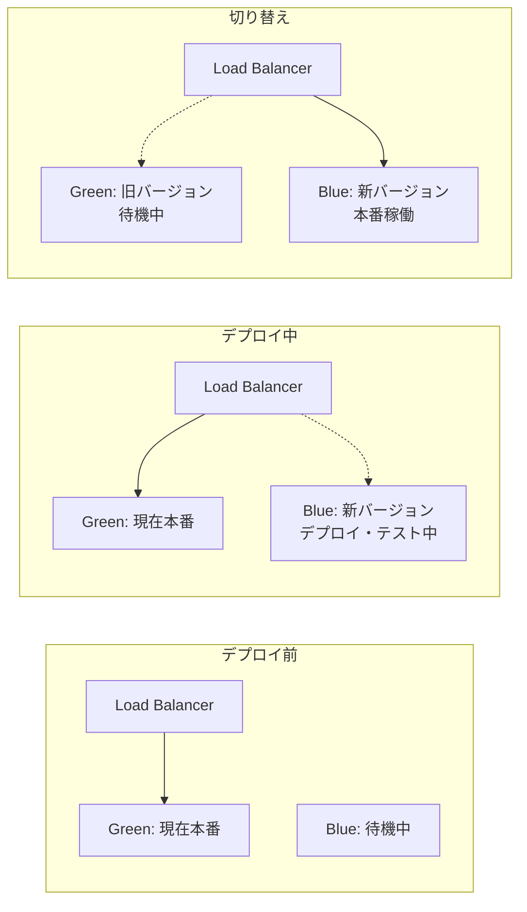
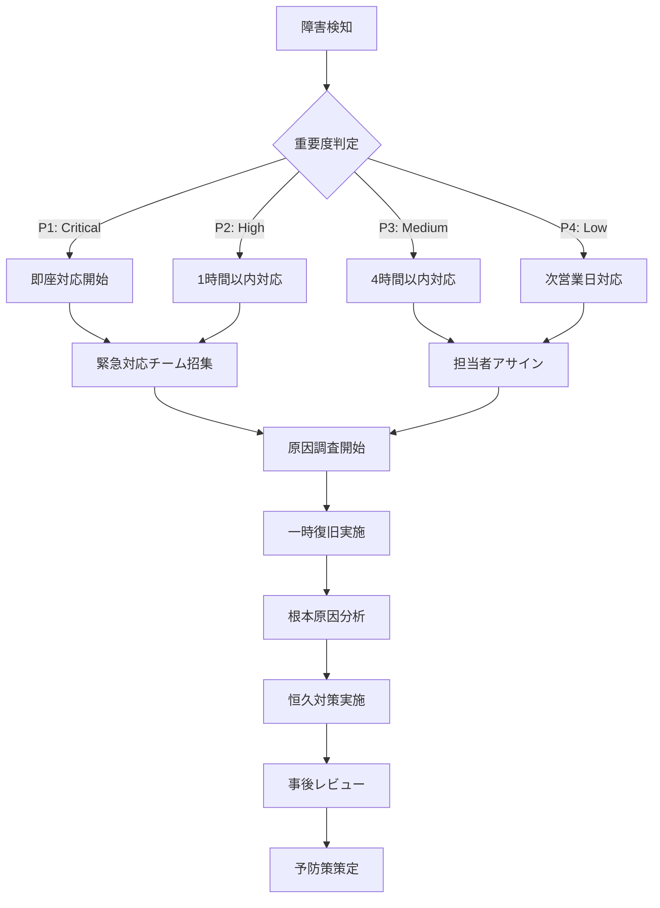

# 東京都公式アプリ AI音声対話機能
## 運用・デプロイ設計書（MVP版）

**文書情報**
- **文書名**: 東京都公式アプリ AI音声対話機能 運用・デプロイ設計書（MVP版）
- **版数**: 1.0
- **作成日**: 2025年1月
- **作成者**: 根岸祐樹
- **備考**: MVP機能に限定した運用・デプロイ設計書

---

## 1. 運用・デプロイ概要

### 1.1 インフラ全体構成

```mermaid
graph TB
    subgraph "本番環境 (Production)"
        subgraph "External Users"
            U1[都民]
            U2[外国人住民]
            U3[観光客]
        end
        
        subgraph "Cloud Load Balancer"
            LB[Google Cloud Load Balancer]
        end
        
        subgraph "Cloud Run Services"
            CR1[Next.js App Instance 1]
            CR2[Next.js App Instance 2]
            CR3[Next.js App Instance 3]
        end
        
        subgraph "Storage Services"
            CS[Cloud Storage]
            REDIS[Cloud Memorystore<br/>(Redis)]
            VVS[Vertex Vector Search]
        end
        
        subgraph "External APIs"
            GEMINI[Gemini API]
            OPENDATA[東京都オープンデータ]
        end
        
        subgraph "Monitoring & Logging"
            CM[Cloud Monitoring]
            CL[Cloud Logging]
            CA[Cloud Alerting]
        end
    end
    
    subgraph "ステージング環境 (Staging)"
        STG_CR[Cloud Run Staging]
        STG_REDIS[Redis Staging]
        STG_CS[Storage Staging]
    end
    
    subgraph "開発環境 (Development)"
        DEV_LOCAL[Local Development]
        DEV_DOCKER[Docker Compose]
    end
    
    U1 --> LB
    U2 --> LB
    U3 --> LB
    LB --> CR1
    LB --> CR2
    LB --> CR3
    CR1 --> CS
    CR1 --> REDIS
    CR1 --> VVS
    CR1 --> GEMINI
    CR1 --> OPENDATA
    CR2 --> CS
    CR2 --> REDIS
    CR2 --> VVS
    CR3 --> CS
    CR3 --> REDIS
    CR3 --> VVS
    
    CR1 --> CM
    CR1 --> CL
    CM --> CA
```

### 1.2 環境構成

| 環境 | 用途 | インスタンス数 | 想定ユーザー数 | アクセス制限 |
|------|------|----------------|----------------|--------------|
| **本番** | 一般ユーザー向けサービス | 3-10 (auto-scaling) | 10,000/日 | 公開 |
| **ステージング** | 本番前テスト | 1 | 10 | 内部のみ |
| **開発** | 開発・デバッグ | 1 | 5 | 開発者のみ |

---

## 2. デプロイメント設計

### 2.1 CI/CDパイプライン

#### 2.1.1 GitHub Actions ワークフロー

```yaml
# .github/workflows/deploy.yml
name: Deploy Tokyo AI Chat MVP

on:
  push:
    branches:
      - main        # 本番デプロイ
      - develop     # ステージングデプロイ
  pull_request:
    branches:
      - main        # PR時のテスト

env:
  PROJECT_ID: tokyo-ai-chat-mvp
  GAR_LOCATION: asia-northeast1
  REPOSITORY: tokyo-ai-chat
  SERVICE: tokyo-ai-chat-service

jobs:
  test:
    runs-on: ubuntu-latest
    steps:
      - name: Checkout
        uses: actions/checkout@v4
      
      - name: Setup Node.js
        uses: actions/setup-node@v4
        with:
          node-version: '20'
          cache: 'npm'
      
      - name: Install dependencies
        run: npm ci
      
      - name: Run linting
        run: npm run lint
      
      - name: Run type checking
        run: npm run type-check
      
      - name: Run unit tests
        run: npm run test:unit
      
      - name: Run integration tests
        run: npm run test:integration
        env:
          NODE_ENV: test
          REDIS_URL: redis://localhost:6379
          GEMINI_API_KEY: ${{ secrets.GEMINI_API_KEY_TEST }}

  security-scan:
    runs-on: ubuntu-latest
    needs: test
    steps:
      - name: Checkout
        uses: actions/checkout@v4
      
      - name: Run dependency vulnerability scan
        run: npm audit --audit-level high
      
      - name: Run security linting
        run: npx eslint . --ext .ts,.tsx --config .eslintrc.security.js
      
      - name: Run SAST scan
        uses: github/codeql-action/analyze@v2
        with:
          languages: typescript

  build-and-deploy:
    runs-on: ubuntu-latest
    needs: [test, security-scan]
    if: github.ref == 'refs/heads/main' || github.ref == 'refs/heads/develop'
    
    steps:
      - name: Checkout
        uses: actions/checkout@v4
      
      - name: Google Auth
        uses: google-github-actions/auth@v2
        with:
          credentials_json: ${{ secrets.GCP_SA_KEY }}
      
      - name: Set up Cloud SDK
        uses: google-github-actions/setup-gcloud@v2
      
      - name: Configure Docker
        run: gcloud auth configure-docker $GAR_LOCATION-docker.pkg.dev
      
      - name: Build image
        run: |
          docker build -t $GAR_LOCATION-docker.pkg.dev/$PROJECT_ID/$REPOSITORY/$SERVICE:$GITHUB_SHA .
          docker build -t $GAR_LOCATION-docker.pkg.dev/$PROJECT_ID/$REPOSITORY/$SERVICE:latest .
      
      - name: Push image
        run: |
          docker push $GAR_LOCATION-docker.pkg.dev/$PROJECT_ID/$REPOSITORY/$SERVICE:$GITHUB_SHA
          docker push $GAR_LOCATION-docker.pkg.dev/$PROJECT_ID/$REPOSITORY/$SERVICE:latest
      
      - name: Deploy to Cloud Run (Staging)
        if: github.ref == 'refs/heads/develop'
        run: |
          gcloud run deploy $SERVICE-staging \
            --image $GAR_LOCATION-docker.pkg.dev/$PROJECT_ID/$REPOSITORY/$SERVICE:$GITHUB_SHA \
            --region $GAR_LOCATION \
            --platform managed \
            --allow-unauthenticated \
            --set-env-vars NODE_ENV=staging \
            --set-env-vars REDIS_URL=${{ secrets.REDIS_URL_STAGING }} \
            --set-env-vars GEMINI_API_KEY=${{ secrets.GEMINI_API_KEY_STAGING }} \
            --memory 2Gi \
            --cpu 1 \
            --min-instances 1 \
            --max-instances 3
      
      - name: Deploy to Cloud Run (Production)
        if: github.ref == 'refs/heads/main'
        run: |
          gcloud run deploy $SERVICE \
            --image $GAR_LOCATION-docker.pkg.dev/$PROJECT_ID/$REPOSITORY/$SERVICE:$GITHUB_SHA \
            --region $GAR_LOCATION \
            --platform managed \
            --allow-unauthenticated \
            --set-env-vars NODE_ENV=production \
            --set-env-vars REDIS_URL=${{ secrets.REDIS_URL_PROD }} \
            --set-env-vars GEMINI_API_KEY=${{ secrets.GEMINI_API_KEY_PROD }} \
            --memory 4Gi \
            --cpu 2 \
            --min-instances 3 \
            --max-instances 10 \
            --cpu-throttling \
            --concurrency 80
      
      - name: Run smoke tests
        run: |
          ENDPOINT=$(gcloud run services describe $SERVICE --region $GAR_LOCATION --format 'value(status.url)')
          npm run test:smoke -- --endpoint $ENDPOINT
        env:
          NODE_ENV: production

  notify:
    runs-on: ubuntu-latest
    needs: build-and-deploy
    if: always()
    steps:
      - name: Notify deployment status
        uses: 8398a7/action-slack@v3
        with:
          status: ${{ job.status }}
          channel: '#deployments'
          webhook_url: ${{ secrets.SLACK_WEBHOOK }}
```

#### 2.1.2 Dockerコンテナ設定

```dockerfile
# Dockerfile
FROM node:20-alpine AS base

# Dependencies
FROM base AS deps
WORKDIR /app
COPY package.json package-lock.json ./
RUN npm ci --only=production && npm cache clean --force

# Build
FROM base AS builder
WORKDIR /app
COPY package.json package-lock.json ./
RUN npm ci
COPY . .
ENV NODE_ENV=production
ENV NEXT_TELEMETRY_DISABLED=1
RUN npm run build

# Runtime
FROM base AS runner
WORKDIR /app

ENV NODE_ENV=production
ENV NEXT_TELEMETRY_DISABLED=1

# セキュリティ設定
RUN addgroup --system --gid 1001 nodejs
RUN adduser --system --uid 1001 nextjs

# ファイルコピー
COPY --from=builder /app/public ./public
COPY --from=builder --chown=nextjs:nodejs /app/.next/standalone ./
COPY --from=builder --chown=nextjs:nodejs /app/.next/static ./.next/static

USER nextjs

EXPOSE 3000
ENV PORT=3000
ENV HOSTNAME="0.0.0.0"

# ヘルスチェック
HEALTHCHECK --interval=30s --timeout=10s --start-period=5s --retries=3 \
  CMD node healthcheck.js

CMD ["node", "server.js"]
```

#### 2.1.3 ヘルスチェック実装

```javascript
// healthcheck.js
const http = require('http');

const options = {
  hostname: 'localhost',
  port: 3000,
  path: '/api/health',
  method: 'GET',
  timeout: 5000
};

const req = http.request(options, (res) => {
  if (res.statusCode === 200) {
    process.exit(0);
  } else {
    console.error(`Health check failed with status ${res.statusCode}`);
    process.exit(1);
  }
});

req.on('error', (err) => {
  console.error('Health check request failed:', err);
  process.exit(1);
});

req.on('timeout', () => {
  console.error('Health check request timed out');
  req.destroy();
  process.exit(1);
});

req.end();
```

### 2.2 ブルーグリーンデプロイメント

#### 2.2.1 デプロイ戦略



#### 2.2.2 切り替えスクリプト

```bash
#!/bin/bash
# deploy-switch.sh

set -e

PROJECT_ID="tokyo-ai-chat-mvp"
REGION="asia-northeast1"
SERVICE_NAME="tokyo-ai-chat-service"

# 現在のトラフィック分散を確認
echo "=== Current Traffic Allocation ==="
gcloud run services describe $SERVICE_NAME \
  --region=$REGION \
  --format="table(spec.traffic[].revisionName,spec.traffic[].percent)"

# 新しいリビジョンをデプロイ（トラフィック0%）
echo "=== Deploying new revision ==="
NEW_REVISION="${SERVICE_NAME}-$(date +%Y%m%d-%H%M%S)"

gcloud run deploy $SERVICE_NAME \
  --image=$GAR_LOCATION-docker.pkg.dev/$PROJECT_ID/$REPOSITORY/$SERVICE:$GITHUB_SHA \
  --region=$REGION \
  --revision-suffix=$(date +%Y%m%d-%H%M%S) \
  --no-traffic \
  --tag=blue

# ヘルスチェック実行
echo "=== Running health checks on new revision ==="
BLUE_URL=$(gcloud run services describe $SERVICE_NAME \
  --region=$REGION \
  --format="value(status.traffic[?tag=blue].url)")

if curl -f --max-time 30 "$BLUE_URL/api/health" > /dev/null 2>&1; then
  echo "✓ Health check passed"
else
  echo "✗ Health check failed"
  exit 1
fi

# 統合テスト実行
echo "=== Running integration tests ==="
npm run test:integration -- --endpoint="$BLUE_URL"

if [ $? -eq 0 ]; then
  echo "✓ Integration tests passed"
else
  echo "✗ Integration tests failed"
  exit 1
fi

# カナリアリリース（10%トラフィック）
echo "=== Starting canary release (10% traffic) ==="
gcloud run services update-traffic $SERVICE_NAME \
  --region=$REGION \
  --to-tags=blue=10

# 5分間モニタリング
echo "=== Monitoring canary for 5 minutes ==="
sleep 300

# エラー率チェック
ERROR_RATE=$(curl -s "$BLUE_URL/api/health" | jq -r '.data.metrics.errorRate // 0')
if (( $(echo "$ERROR_RATE > 0.05" | bc -l) )); then
  echo "✗ High error rate detected: $ERROR_RATE"
  echo "=== Rolling back ==="
  gcloud run services update-traffic $SERVICE_NAME \
    --region=$REGION \
    --to-tags=blue=0
  exit 1
fi

# 全トラフィック切り替え
echo "=== Switching 100% traffic to new revision ==="
gcloud run services update-traffic $SERVICE_NAME \
  --region=$REGION \
  --to-tags=blue=100

echo "=== Deployment completed successfully ==="
```

---

## 3. 監視・アラート設計

### 3.1 監視メトリクス

#### 3.1.1 アプリケーションメトリクス

```yaml
# monitoring-config.yaml
monitoring:
  metrics:
    # リクエストメトリクス
    request_count:
      type: counter
      labels: [method, endpoint, status_code]
      description: "Total number of HTTP requests"
    
    request_duration:
      type: histogram
      labels: [method, endpoint]
      buckets: [0.1, 0.3, 1.0, 3.0, 10.0]
      description: "HTTP request duration in seconds"
    
    # ビジネスメトリクス
    chat_messages_total:
      type: counter
      labels: [language, user_type]
      description: "Total number of chat messages"
    
    voice_recognition_total:
      type: counter
      labels: [language, success]
      description: "Total number of voice recognition requests"
    
    voice_synthesis_total:
      type: counter
      labels: [language]
      description: "Total number of voice synthesis requests"
    
    # エラーメトリクス
    errors_total:
      type: counter
      labels: [error_type, severity]
      description: "Total number of errors"
    
    # 外部サービスメトリクス
    external_api_requests:
      type: counter
      labels: [service, status]
      description: "External API requests"
    
    external_api_duration:
      type: histogram
      labels: [service]
      buckets: [0.5, 1.0, 2.0, 5.0, 10.0]
      description: "External API response time"

  alerts:
    # サービス可用性
    high_error_rate:
      condition: "rate(errors_total[5m]) > 0.05"
      severity: critical
      description: "Error rate above 5%"
      
    high_latency:
      condition: "histogram_quantile(0.95, request_duration) > 5"
      severity: warning
      description: "95th percentile latency above 5 seconds"
    
    # 外部サービス
    gemini_api_errors:
      condition: "rate(external_api_requests{service='gemini',status='error'}[5m]) > 0.1"
      severity: critical
      description: "High error rate from Gemini API"
    
    # リソース使用量
    high_memory_usage:
      condition: "container_memory_usage_bytes / container_spec_memory_limit_bytes > 0.9"
      severity: warning
      description: "Memory usage above 90%"
    
    high_cpu_usage:
      condition: "rate(container_cpu_usage_seconds_total[5m]) > 0.8"
      severity: warning
      description: "CPU usage above 80%"
```

#### 3.1.2 カスタムメトリクス実装

```typescript
// src/lib/metrics.ts
import { register, Counter, Histogram, Gauge } from 'prom-client';

// リクエストメトリクス
export const httpRequestsTotal = new Counter({
  name: 'http_requests_total',
  help: 'Total number of HTTP requests',
  labelNames: ['method', 'endpoint', 'status_code']
});

export const httpRequestDuration = new Histogram({
  name: 'http_request_duration_seconds',
  help: 'HTTP request duration in seconds',
  labelNames: ['method', 'endpoint'],
  buckets: [0.1, 0.3, 1.0, 3.0, 10.0]
});

// ビジネスメトリクス
export const chatMessagesTotal = new Counter({
  name: 'chat_messages_total',
  help: 'Total number of chat messages',
  labelNames: ['language', 'user_type']
});

export const voiceRecognitionTotal = new Counter({
  name: 'voice_recognition_total',
  help: 'Total number of voice recognition requests',
  labelNames: ['language', 'success']
});

export const activeSessions = new Gauge({
  name: 'active_sessions_total',
  help: 'Number of active sessions',
  async collect() {
    const count = await getActiveSessionCount();
    this.set(count);
  }
});

// 外部サービスメトリクス
export const externalApiRequests = new Counter({
  name: 'external_api_requests_total',
  help: 'External API requests',
  labelNames: ['service', 'status']
});

export const externalApiDuration = new Histogram({
  name: 'external_api_duration_seconds',
  help: 'External API response time',
  labelNames: ['service'],
  buckets: [0.5, 1.0, 2.0, 5.0, 10.0]
});

// メトリクス記録ミドルウェア
export function metricsMiddleware(req: NextRequest, res: NextResponse) {
  const start = Date.now();
  
  res.addEventListener('finish', () => {
    const duration = (Date.now() - start) / 1000;
    const endpoint = req.nextUrl.pathname;
    const method = req.method;
    const statusCode = res.status.toString();
    
    httpRequestsTotal
      .labels({ method, endpoint, status_code: statusCode })
      .inc();
    
    httpRequestDuration
      .labels({ method, endpoint })
      .observe(duration);
  });
}

// メトリクス公開エンドポイント
register.registerMetric(httpRequestsTotal);
register.registerMetric(httpRequestDuration);
register.registerMetric(chatMessagesTotal);
register.registerMetric(voiceRecognitionTotal);
register.registerMetric(activeSessions);
register.registerMetric(externalApiRequests);
register.registerMetric(externalApiDuration);
```

### 3.2 ログ管理

#### 3.2.1 構造化ログ設計

```typescript
// src/lib/logger.ts
import winston from 'winston';
import { LoggingWinston } from '@google-cloud/logging-winston';

// ログレベル定義
enum LogLevel {
  ERROR = 'error',
  WARN = 'warn',
  INFO = 'info',
  DEBUG = 'debug'
}

// ログ構造
interface LogEntry {
  timestamp: string;
  level: LogLevel;
  message: string;
  service: string;
  version: string;
  environment: string;
  requestId?: string;
  sessionId?: string;
  userId?: string;
  context?: any;
  error?: {
    message: string;
    stack?: string;
    code?: string;
  };
  metrics?: {
    duration?: number;
    memory?: number;
    cpu?: number;
  };
}

// Logger設定
const transports: winston.transport[] = [
  new winston.transports.Console({
    format: winston.format.combine(
      winston.format.timestamp(),
      winston.format.errors({ stack: true }),
      winston.format.json()
    )
  })
];

// 本番環境ではCloud Loggingを使用
if (process.env.NODE_ENV === 'production') {
  transports.push(new LoggingWinston({
    projectId: process.env.GOOGLE_CLOUD_PROJECT,
    keyFilename: process.env.GOOGLE_APPLICATION_CREDENTIALS,
    logName: 'tokyo-ai-chat-app',
    serviceContext: {
      service: 'tokyo-ai-chat',
      version: process.env.APP_VERSION || '1.0.0'
    }
  }));
}

export const logger = winston.createLogger({
  level: process.env.LOG_LEVEL || 'info',
  format: winston.format.combine(
    winston.format.timestamp(),
    winston.format.errors({ stack: true }),
    winston.format.json()
  ),
  defaultMeta: {
    service: 'tokyo-ai-chat',
    version: process.env.APP_VERSION || '1.0.0',
    environment: process.env.NODE_ENV || 'development'
  },
  transports
});

// 構造化ログヘルパー
export class StructuredLogger {
  constructor(
    private readonly requestId?: string,
    private readonly sessionId?: string
  ) {}

  info(message: string, context?: any, metrics?: any): void {
    logger.info(message, {
      requestId: this.requestId,
      sessionId: this.sessionId,
      context,
      metrics
    });
  }

  warn(message: string, context?: any): void {
    logger.warn(message, {
      requestId: this.requestId,
      sessionId: this.sessionId,
      context
    });
  }

  error(message: string, error?: Error, context?: any): void {
    logger.error(message, {
      requestId: this.requestId,
      sessionId: this.sessionId,
      context,
      error: error ? {
        message: error.message,
        stack: error.stack,
        code: (error as any).code
      } : undefined
    });
  }

  // セキュリティログ
  security(event: string, context: any): void {
    logger.warn(`SECURITY: ${event}`, {
      requestId: this.requestId,
      sessionId: this.sessionId,
      context,
      security: true
    });
  }

  // パフォーマンスログ
  performance(operation: string, duration: number, context?: any): void {
    logger.info(`PERFORMANCE: ${operation}`, {
      requestId: this.requestId,
      sessionId: this.sessionId,
      context,
      metrics: { duration }
    });
  }
}
```

#### 3.2.2 ログ分析・アラート

```yaml
# log-based-alerts.yaml
logBasedAlerts:
  # エラー率アラート
  - name: "High Error Rate"
    filter: |
      resource.type="cloud_run_revision"
      resource.labels.service_name="tokyo-ai-chat-service"
      severity>=ERROR
    condition:
      thresholdValue: 10
      comparisonType: COMPARISON_GREATER_THAN
      duration: "300s"
    notification:
      channels: ["projects/tokyo-ai-chat-mvp/notificationChannels/slack-critical"]
  
  # セキュリティイベント
  - name: "Security Event Detected"
    filter: |
      resource.type="cloud_run_revision"
      jsonPayload.security=true
    condition:
      thresholdValue: 1
      comparisonType: COMPARISON_GREATER_THAN
      duration: "60s"
    notification:
      channels: ["projects/tokyo-ai-chat-mvp/notificationChannels/slack-security"]
  
  # API障害
  - name: "External API Failures"
    filter: |
      resource.type="cloud_run_revision"
      jsonPayload.context.service="gemini"
      jsonPayload.level="error"
    condition:
      thresholdValue: 5
      comparisonType: COMPARISON_GREATER_THAN
      duration: "300s"
    notification:
      channels: ["projects/tokyo-ai-chat-mvp/notificationChannels/slack-ops"]
```

### 3.3 アラート通知

#### 3.3.1 通知チャンネル設定

```typescript
// src/lib/notifications.ts
interface NotificationChannel {
  type: 'slack' | 'email' | 'webhook';
  config: any;
  severity: AlertSeverity[];
}

enum AlertSeverity {
  CRITICAL = 'critical',
  WARNING = 'warning',
  INFO = 'info'
}

const NOTIFICATION_CHANNELS: NotificationChannel[] = [
  {
    type: 'slack',
    config: {
      webhook: process.env.SLACK_WEBHOOK_CRITICAL,
      channel: '#alerts-critical',
      username: 'Tokyo AI Chat Alert'
    },
    severity: [AlertSeverity.CRITICAL]
  },
  {
    type: 'slack',
    config: {
      webhook: process.env.SLACK_WEBHOOK_OPS,
      channel: '#ops-alerts',
      username: 'Tokyo AI Chat Alert'
    },
    severity: [AlertSeverity.WARNING, AlertSeverity.INFO]
  },
  {
    type: 'email',
    config: {
      to: ['ops-team@metro.tokyo.lg.jp'],
      from: 'noreply@metro.tokyo.lg.jp'
    },
    severity: [AlertSeverity.CRITICAL]
  }
];

// アラート送信
export class AlertNotifier {
  async sendAlert(alert: Alert): Promise<void> {
    const channels = NOTIFICATION_CHANNELS.filter(
      ch => ch.severity.includes(alert.severity)
    );

    const promises = channels.map(channel => {
      switch (channel.type) {
        case 'slack':
          return this.sendSlackAlert(alert, channel.config);
        case 'email':
          return this.sendEmailAlert(alert, channel.config);
        case 'webhook':
          return this.sendWebhookAlert(alert, channel.config);
      }
    });

    await Promise.allSettled(promises);
  }

  private async sendSlackAlert(alert: Alert, config: any): Promise<void> {
    const color = this.getSeverityColor(alert.severity);
    const payload = {
      channel: config.channel,
      username: config.username,
      attachments: [{
        color,
        title: `🚨 ${alert.title}`,
        fields: [
          {
            title: "Severity",
            value: alert.severity.toUpperCase(),
            short: true
          },
          {
            title: "Service",
            value: "Tokyo AI Chat MVP",
            short: true
          },
          {
            title: "Environment",
            value: process.env.NODE_ENV,
            short: true
          },
          {
            title: "Time",
            value: new Date().toISOString(),
            short: true
          }
        ],
        text: alert.description,
        footer: "Tokyo AI Chat Monitoring",
        ts: Math.floor(Date.now() / 1000)
      }]
    };

    await fetch(config.webhook, {
      method: 'POST',
      headers: { 'Content-Type': 'application/json' },
      body: JSON.stringify(payload)
    });
  }

  private getSeverityColor(severity: AlertSeverity): string {
    switch (severity) {
      case AlertSeverity.CRITICAL: return 'danger';
      case AlertSeverity.WARNING: return 'warning';
      case AlertSeverity.INFO: return 'good';
      default: return '#808080';
    }
  }
}
```

---

## 4. 運用手順

### 4.1 日常運用

#### 4.1.1 運用チェックリスト

```markdown
# 日次運用チェックリスト

## 毎朝（9:00）
- [ ] システム稼働状況確認
  - [ ] Cloud Run サービス状態
  - [ ] Redis接続性
  - [ ] 外部API応答性
- [ ] 前日の障害・アラート確認
- [ ] エラーログ確認（ERROR レベル以上）
- [ ] パフォーマンスメトリクス確認
  - [ ] 応答時間 P95 < 3秒
  - [ ] エラー率 < 1%
  - [ ] リクエスト数確認

## 毎夕（18:00）
- [ ] 本日の利用統計確認
- [ ] アクセスパターン異常確認
- [ ] セキュリティアラート確認
- [ ] 翌日の計画メンテナンス確認

## 週次（月曜朝）
- [ ] 週次レポート作成
- [ ] セキュリティパッチ確認
- [ ] バックアップ状況確認
- [ ] 費用レビュー
- [ ] パフォーマンストレンド分析

## 月次（第1営業日）
- [ ] 月次レポート作成
- [ ] SLA達成状況確認
- [ ] 費用分析・予算チェック
- [ ] セキュリティ監査
- [ ] 容量計画見直し
```

#### 4.1.2 運用自動化スクリプト

```bash
#!/bin/bash
# daily-health-check.sh

set -e

PROJECT_ID="tokyo-ai-chat-mvp"
SERVICE="tokyo-ai-chat-service"
REGION="asia-northeast1"

echo "=== Tokyo AI Chat Daily Health Check ==="
echo "Date: $(date)"
echo "Environment: $NODE_ENV"
echo

# Cloud Run サービス状態確認
echo "=== Cloud Run Service Status ==="
gcloud run services describe $SERVICE \
  --region=$REGION \
  --format="table(metadata.name,status.conditions[0].type,status.conditions[0].status)"

# Redis接続確認
echo "=== Redis Connectivity ==="
if timeout 10 redis-cli -u $REDIS_URL ping > /dev/null; then
  echo "✓ Redis: Connected"
else
  echo "✗ Redis: Connection failed"
  exit 1
fi

# 外部API確認
echo "=== External API Health ==="
# Gemini API確認
if curl -s -o /dev/null -w "%{http_code}" \
   "https://generativelanguage.googleapis.com/v1/models" \
   -H "Authorization: Bearer $GEMINI_API_KEY" | grep -q "200"; then
  echo "✓ Gemini API: Available"
else
  echo "✗ Gemini API: Unavailable"
fi

# エラーログ確認
echo "=== Recent Error Logs ==="
gcloud logging read \
  "resource.type=cloud_run_revision AND resource.labels.service_name=$SERVICE AND severity>=ERROR" \
  --format="table(timestamp,severity,jsonPayload.message)" \
  --limit=10 \
  --freshness=1d

# メトリクス確認
echo "=== Performance Metrics (Last 24h) ==="
gcloud monitoring metrics list \
  --filter="metric.type:custom.googleapis.com/http_requests_total" \
  --format="table(metric.type,resource.type)"

echo "=== Health Check Completed ==="
```

### 4.2 障害対応

#### 4.2.1 障害対応手順



#### 4.2.2 障害対応プレイブック

```yaml
# incident-response-playbook.yaml
incidents:
  high_error_rate:
    detection:
      - "Error rate > 5% for 5 minutes"
      - "Multiple user complaints"
    immediate_actions:
      - "Check Cloud Run service logs"
      - "Verify external API status"
      - "Check recent deployments"
    investigation:
      - "Analyze error patterns"
      - "Check resource utilization"
      - "Review recent changes"
    mitigation:
      - "Rollback if deployment-related"
      - "Scale up if resource-related"
      - "Circuit breaker if external API issue"
    
  service_unavailable:
    detection:
      - "Service returning 5xx errors"
      - "Health check failures"
    immediate_actions:
      - "Check Cloud Run service status"
      - "Verify network connectivity"
      - "Check Cloud SQL/Redis status"
    investigation:
      - "Review infrastructure logs"
      - "Check resource quotas"
      - "Verify configurations"
    mitigation:
      - "Restart service instances"
      - "Scale up resources"
      - "Failover to backup region"
  
  security_incident:
    detection:
      - "Security alerts triggered"
      - "Unusual access patterns"
    immediate_actions:
      - "Block suspicious IP addresses"
      - "Review access logs"
      - "Notify security team"
    investigation:
      - "Forensic analysis"
      - "Data breach assessment"
      - "Compliance review"
    mitigation:
      - "Isolate affected systems"
      - "Reset credentials"
      - "Apply security patches"
```

### 4.3 メンテナンス

#### 4.3.1 定期メンテナンス

```bash
#!/bin/bash
# scheduled-maintenance.sh

set -e

MAINTENANCE_WINDOW="02:00-04:00 JST"
NOTIFICATION_LEAD_TIME="24h"

echo "=== Scheduled Maintenance Start ==="
echo "Window: $MAINTENANCE_WINDOW"
echo "Start Time: $(date)"

# 事前通知確認
echo "=== Pre-maintenance Checks ==="
if [ ! -f "/tmp/maintenance-notification-sent" ]; then
  echo "Error: Maintenance notification not sent"
  exit 1
fi

# メンテナンスモード有効化
echo "=== Enabling Maintenance Mode ==="
gcloud run services update tokyo-ai-chat-service \
  --region=asia-northeast1 \
  --set-env-vars MAINTENANCE_MODE=true

# データベースメンテナンス
echo "=== Database Maintenance ==="
# Redis メモリ最適化
redis-cli -u $REDIS_URL MEMORY DOCTOR
redis-cli -u $REDIS_URL MEMORY PURGE

# データバックアップ
echo "=== Creating Backup ==="
gsutil -m cp -r gs://tokyo-ai-chat-data gs://tokyo-ai-chat-backup/$(date +%Y%m%d-%H%M%S)

# セキュリティアップデート
echo "=== Security Updates ==="
npm audit fix --force
npm update

# 新バージョンデプロイ
echo "=== Deploying Updates ==="
./deploy.sh --environment=production --maintenance=true

# ヘルスチェック
echo "=== Post-deployment Health Check ==="
sleep 60
./health-check.sh

# メンテナンスモード解除
echo "=== Disabling Maintenance Mode ==="
gcloud run services update tokyo-ai-chat-service \
  --region=asia-northeast1 \
  --remove-env-vars MAINTENANCE_MODE

# 完了通知
echo "=== Maintenance Completed ==="
curl -X POST $SLACK_WEBHOOK \
  -H 'Content-type: application/json' \
  --data '{"text":"🔧 Scheduled maintenance completed successfully"}'

echo "End Time: $(date)"
```

---

## 5. 容量計画・スケーリング

### 5.1 容量設計

#### 5.1.1 予想負荷

| 期間 | DAU | 同時接続数 | RPS | ストレージ | 帯域幅 |
|------|-----|------------|-----|------------|--------|
| **MVP開始** | 100 | 10 | 5 | 10GB | 10Mbps |
| **3ヶ月後** | 1,000 | 100 | 50 | 100GB | 100Mbps |
| **6ヶ月後** | 5,000 | 500 | 250 | 500GB | 500Mbps |
| **1年後** | 10,000 | 1,000 | 500 | 1TB | 1Gbps |

#### 5.1.2 リソース設計

```yaml
# resource-planning.yaml
environments:
  production:
    cloud_run:
      min_instances: 3
      max_instances: 20
      cpu: "2"
      memory: "4Gi"
      concurrency: 80
      
    redis:
      tier: "standard"
      memory: "5GB"
      replicas: 1
      
    storage:
      class: "REGIONAL"
      size: "1TB"
      backup_retention: "30d"
      
    monitoring:
      retention: "30d"
      log_volume: "100GB/month"

  scaling_triggers:
    cpu_utilization: 70%
    memory_utilization: 80%
    request_latency_p95: 3000ms
    error_rate: 1%
```

### 5.2 自動スケーリング

#### 5.2.1 Cloud Run スケーリング設定

```bash
#!/bin/bash
# configure-scaling.sh

gcloud run services update tokyo-ai-chat-service \
  --region=asia-northeast1 \
  --min-instances=3 \
  --max-instances=20 \
  --cpu=2 \
  --memory=4Gi \
  --concurrency=80 \
  --cpu-throttling \
  --execution-environment=gen2
```

#### 5.2.2 スケーリングポリシー

```typescript
// src/lib/scaling.ts
interface ScalingPolicy {
  metric: string;
  threshold: number;
  cooldown: number;
  scaleUp: ScalingAction;
  scaleDown: ScalingAction;
}

interface ScalingAction {
  increment: number;
  maxInstances: number;
  minInstances: number;
}

const SCALING_POLICIES: ScalingPolicy[] = [
  {
    metric: 'cpu_utilization',
    threshold: 70,
    cooldown: 300, // 5分
    scaleUp: {
      increment: 2,
      maxInstances: 20,
      minInstances: 3
    },
    scaleDown: {
      increment: -1,
      maxInstances: 20,
      minInstances: 3
    }
  },
  {
    metric: 'request_rate',
    threshold: 100, // RPS
    cooldown: 180, // 3分
    scaleUp: {
      increment: 3,
      maxInstances: 20,
      minInstances: 3
    },
    scaleDown: {
      increment: -2,
      maxInstances: 20,
      minInstances: 3
    }
  }
];

// 予測スケーリング
export class PredictiveScaling {
  async predictLoad(timeWindow: number): Promise<LoadPrediction> {
    // 過去のトラフィックパターンから予測
    const historicalData = await this.getHistoricalMetrics(timeWindow);
    const seasonalPattern = this.detectSeasonalPattern(historicalData);
    const trendAnalysis = this.analyzeTrend(historicalData);
    
    return {
      predictedRPS: this.predictRPS(seasonalPattern, trendAnalysis),
      predictedUsers: this.predictUsers(seasonalPattern, trendAnalysis),
      confidence: this.calculateConfidence(historicalData),
      recommendedInstances: this.calculateInstanceRequirement()
    };
  }
  
  async preemptiveScale(prediction: LoadPrediction): Promise<void> {
    if (prediction.confidence > 0.8) {
      const targetInstances = Math.min(
        prediction.recommendedInstances,
        20 // max instances
      );
      
      await this.scaleToTarget(targetInstances);
      
      logger.info('Preemptive scaling executed', {
        prediction,
        targetInstances
      });
    }
  }
}
```

---

## 6. バックアップ・災害復旧

### 6.1 バックアップ戦略

#### 6.1.1 バックアップスケジュール

```yaml
# backup-strategy.yaml
backup_schedule:
  data:
    frequency: "daily"
    time: "02:00 JST"
    retention: "30 days"
    destinations:
      - "gs://tokyo-ai-chat-backup-primary"
      - "gs://tokyo-ai-chat-backup-secondary" # 別リージョン
  
  code:
    frequency: "on_commit"
    retention: "permanent"
    destinations:
      - "GitHub repository"
      - "Container Registry"
  
  configuration:
    frequency: "on_change"
    retention: "90 days"
    destinations:
      - "gs://tokyo-ai-chat-config-backup"

backup_verification:
  frequency: "weekly"
  method: "restore_test"
  environment: "staging"
```

#### 6.1.2 自動バックアップスクリプト

```bash
#!/bin/bash
# automated-backup.sh

set -e

BACKUP_DATE=$(date +%Y%m%d-%H%M%S)
BACKUP_BUCKET="gs://tokyo-ai-chat-backup-primary"
SECONDARY_BUCKET="gs://tokyo-ai-chat-backup-secondary"

echo "=== Starting Automated Backup ==="
echo "Backup ID: $BACKUP_DATE"

# Redis データバックアップ
echo "=== Backing up Redis ==="
redis-cli -u $REDIS_URL --rdb /tmp/redis-backup-$BACKUP_DATE.rdb
gsutil cp /tmp/redis-backup-$BACKUP_DATE.rdb $BACKUP_BUCKET/redis/
rm /tmp/redis-backup-$BACKUP_DATE.rdb

# Cloud Storage データバックアップ
echo "=== Backing up Cloud Storage ==="
gsutil -m cp -r gs://tokyo-ai-chat-data $BACKUP_BUCKET/storage/$BACKUP_DATE/

# 設定ファイルバックアップ
echo "=== Backing up Configuration ==="
kubectl get configmaps -o yaml > /tmp/configmaps-$BACKUP_DATE.yaml
kubectl get secrets -o yaml > /tmp/secrets-$BACKUP_DATE.yaml
gsutil cp /tmp/configmaps-$BACKUP_DATE.yaml $BACKUP_BUCKET/config/
gsutil cp /tmp/secrets-$BACKUP_DATE.yaml $BACKUP_BUCKET/config/

# セカンダリロケーションにレプリケーション
echo "=== Replicating to Secondary Location ==="
gsutil -m rsync -r $BACKUP_BUCKET/redis/ $SECONDARY_BUCKET/redis/
gsutil -m rsync -r $BACKUP_BUCKET/storage/ $SECONDARY_BUCKET/storage/
gsutil -m rsync -r $BACKUP_BUCKET/config/ $SECONDARY_BUCKET/config/

# 古いバックアップ削除
echo "=== Cleaning up old backups ==="
gsutil -m rm -r $(gsutil ls $BACKUP_BUCKET/storage/ | head -n -30)

# バックアップ検証
echo "=== Verifying Backup Integrity ==="
BACKUP_SIZE=$(gsutil du -s $BACKUP_BUCKET/storage/$BACKUP_DATE/ | awk '{print $1}')
if [ $BACKUP_SIZE -gt 0 ]; then
  echo "✓ Backup verification passed: $BACKUP_SIZE bytes"
else
  echo "✗ Backup verification failed"
  exit 1
fi

echo "=== Backup Completed Successfully ==="
```

### 6.2 災害復旧計画

#### 6.2.1 RTO/RPO目標

| シナリオ | RTO (復旧時間目標) | RPO (復旧ポイント目標) | 優先度 |
|----------|-------------------|----------------------|--------|
| **アプリケーション障害** | 15分 | 5分 | P1 |
| **データベース障害** | 30分 | 10分 | P1 |
| **リージョン障害** | 2時間 | 1時間 | P2 |
| **完全災害** | 4時間 | 24時間 | P3 |

#### 6.2.2 災害復旧手順

```bash
#!/bin/bash
# disaster-recovery.sh

set -e

DISASTER_TYPE=$1
BACKUP_DATE=${2:-"latest"}

echo "=== Tokyo AI Chat Disaster Recovery ==="
echo "Disaster Type: $DISASTER_TYPE"
echo "Backup Date: $BACKUP_DATE"
echo "Recovery Start: $(date)"

case $DISASTER_TYPE in
  "app_failure")
    echo "=== Application Failure Recovery ==="
    # 最新のコンテナイメージで再デプロイ
    gcloud run deploy tokyo-ai-chat-service \
      --image=asia-northeast1-docker.pkg.dev/tokyo-ai-chat-mvp/tokyo-ai-chat/tokyo-ai-chat-service:latest \
      --region=asia-northeast1
    ;;
    
  "db_failure")
    echo "=== Database Failure Recovery ==="
    # Redisインスタンス再作成
    gcloud redis instances create tokyo-ai-chat-redis \
      --size=5 \
      --region=asia-northeast1 \
      --redis-version=redis_6_x
    
    # バックアップからデータ復旧
    LATEST_BACKUP=$(gsutil ls gs://tokyo-ai-chat-backup-primary/redis/ | tail -1)
    gsutil cp $LATEST_BACKUP /tmp/redis-restore.rdb
    redis-cli -u $REDIS_URL --pipe < /tmp/redis-restore.rdb
    ;;
    
  "region_failure")
    echo "=== Region Failure Recovery ==="
    # 別リージョンにサービス展開
    gcloud run deploy tokyo-ai-chat-service \
      --image=asia-northeast1-docker.pkg.dev/tokyo-ai-chat-mvp/tokyo-ai-chat/tokyo-ai-chat-service:latest \
      --region=us-central1 \
      --allow-unauthenticated
    
    # DNS切り替え
    gcloud dns record-sets transaction start --zone=tokyo-ai-chat-zone
    gcloud dns record-sets transaction remove \
      --name=api.tokyo-ai-chat.metro.tokyo.lg.jp. \
      --ttl=300 \
      --type=A \
      --zone=tokyo-ai-chat-zone \
      "OLD_IP_ADDRESS"
    gcloud dns record-sets transaction add \
      --name=api.tokyo-ai-chat.metro.tokyo.lg.jp. \
      --ttl=300 \
      --type=A \
      --zone=tokyo-ai-chat-zone \
      "NEW_IP_ADDRESS"
    gcloud dns record-sets transaction execute --zone=tokyo-ai-chat-zone
    ;;
    
  "complete_disaster")
    echo "=== Complete Disaster Recovery ==="
    # 完全復旧シーケンス
    ./restore-infrastructure.sh
    ./restore-data.sh $BACKUP_DATE
    ./restore-application.sh
    ./verify-recovery.sh
    ;;
    
  *)
    echo "Unknown disaster type: $DISASTER_TYPE"
    exit 1
    ;;
esac

# 復旧後検証
echo "=== Post-Recovery Verification ==="
sleep 60
./health-check.sh

if [ $? -eq 0 ]; then
  echo "✓ Recovery completed successfully"
  echo "Recovery End: $(date)"
  
  # 復旧完了通知
  curl -X POST $SLACK_WEBHOOK \
    -H 'Content-type: application/json' \
    --data "{\"text\":\"🚑 Disaster recovery completed for $DISASTER_TYPE\"}"
else
  echo "✗ Recovery verification failed"
  exit 1
fi
```

この運用・デプロイ設計書により、MVP版システムの安定運用が可能になります。最後に、テスト設計書を作成します。