# 東京都公式アプリ AI音声対話機能
## 運用・デプロイ設計書（MVP版）

**文書情報**
- **文書名**: 東京都公式アプリ AI音声対話機能 運用・デプロイ設計書（MVP版）
- **版数**: 1.0
- **作成日**: 2025年1月
- **作成者**: 根岸祐樹
- **備考**: MVP機能に限定した運用・デプロイ設計書

## 改訂履歴

| 版数 | 改訂日 | 改訂者 | 改訂内容 |
|------|--------|--------|----------|
| 1.0 | 2025-01-15 | 根岸祐樹 | 初版作成（MVP版運用・デプロイ設計） |

## 目次

1. [設計方針・根拠](#1-設計方針根拠)
   - 1.1 [デプロイメントプラットフォーム選定根拠](#11-デプロイメントプラットフォーム選定根拠)
   - 1.2 [アーキテクチャ方針](#12-アーキテクチャ方針)
   - 1.3 [技術選定根拠](#13-技術選定根拠)
2. [運用・デプロイ概要](#2-運用デプロイ概要)
   - 2.1 [インフラ全体構成](#21-インフラ全体構成)
   - 2.2 [環境構成](#22-環境構成)
3. [デプロイメント設計](#3-デプロイメント設計)
   - 3.1 [CI/CDパイプライン](#31-cicdパイプライン)
   - 3.2 [ブルーグリーンデプロイメント](#32-ブルーグリーンデプロイメント)
4. [監視・アラート設計](#4-監視アラート設計)
   - 4.1 [監視メトリクス](#41-監視メトリクス)
   - 4.2 [ログ管理](#42-ログ管理)
   - 4.3 [アラート通知](#43-アラート通知)
5. [運用手順](#5-運用手順)
   - 5.1 [日常運用](#51-日常運用)
   - 5.2 [障害対応](#52-障害対応)
   - 5.3 [メンテナンス](#53-メンテナンス)
6. [容量計画・スケーリング](#6-容量計画スケーリング)
   - 6.1 [容量設計](#61-容量設計)
   - 6.2 [自動スケーリング](#62-自動スケーリング)
7. [バックアップ・災害復旧](#7-バックアップ災害復旧)
   - 7.1 [バックアップ戦略](#71-バックアップ戦略)
   - 7.2 [災害復旧計画](#72-災害復旧計画)

---

## 1. 設計方針・根拠

### 1.1 デプロイメントプラットフォーム選定根拠

#### 1.1.1 Google Cloud Platform選定理由

**パフォーマンス要件への対応**
- **要件**: サブ秒応答時間（＜1秒）の実現
- **根拠**: Google Cloudのグローバルネットワークインフラストラクチャにより、東京リージョン（asia-northeast1）からの低レイテンシーアクセスを実現
- **技術的根拠**: Cloud Runの自動スケーリング機能により、負荷に応じたインスタンス数調整で一貫した応答性能を保証

**スケーラビリティ要件への対応**
- **要件**: 複数同時ユーザーサポート（目標：10,000 DAU）
- **根拠**: Cloud Runのサーバーレスアーキテクチャにより、トラフィック変動に応じた自動的なリソース調整
- **技術的根拠**: 水平スケーリング（3-20インスタンス）により、ピーク時の負荷分散を実現

**可用性要件への対応**
- **要件**: 高可用性（99.9%以上）とフォルトトレラント設計
- **根拠**: Google Cloudの標準SLA（99.95%）により要件を上回る可用性を提供
- **技術的根拠**: マルチゾーン配置とロードバランサーによる自動的な障害時フェイルオーバー

**コスト効率性**
- **要件**: 最適化されたリソース使用とコスト管理
- **根拠**: サーバーレス課金モデルにより、実際の使用量に応じたコスト最適化
- **技術的根拠**: 自動スケールダウン（最小3インスタンス）により、低トラフィック時のコスト削減

#### 1.1.2 セキュリティ・ガバナンス考慮

**官公庁向けセキュリティ要件**
- Google Cloudの政府機関向けセキュリティ認証（FedRAMP、ISO 27001、SOC 2）
- データ所在地保証（日本リージョン内でのデータ処理）
- 暗号化通信（TLS 1.3）とデータ暗号化（Cloud KMS）の標準サポート

**アクセシビリティ・多言語対応**
- Cloud Translation APIとの統合によるリアルタイム多言語サポート
- CDNによる均一なアクセス性能（地理的制約の軽減）

### 1.2 アーキテクチャ方針

#### 1.2.1 マイクロサービス指向アーキテクチャ

**サービス分離の設計方針**
```
┌─────────────────┐    ┌─────────────────┐    ┌─────────────────┐
│   Presentation  │    │   Application   │    │   Data Layer    │
│     Layer       │    │     Layer       │    │                 │
├─────────────────┤    ├─────────────────┤    ├─────────────────┤
│ • UI Components │────│ • Business Logic│────│ • Vector Search │
│ • Voice Interface│    │ • AI Orchestr.  │    │ • Session Store │
│ • Chat Interface│    │ • Search Service│    │ • Cache Layer   │
└─────────────────┘    └─────────────────┘    └─────────────────┘
```

**分離による利点**
- **保守性**: 各層の独立した開発・デプロイが可能
- **拡張性**: 個別サービスの独立したスケーリング
- **テスト性**: 層別の単体・統合テスト実施

#### 1.2.2 イベント駆動アーキテクチャ

**非同期処理による応答性向上**
- 音声認識処理の非同期化により、UIの応答性を維持
- WebSocketによるリアルタイム通信でユーザー体験を向上
- バックグラウンド処理によるシステム全体のスループット向上

#### 1.2.3 レジリエンス設計

**サーキットブレーカーパターン**
```typescript
// 外部API呼び出しの障害対応例
const circuitBreakerConfig = {
  timeout: 5000,        // 5秒でタイムアウト
  errorThreshold: 50,   // 50%のエラー率でopen
  resetTimeout: 30000   // 30秒後にhalf-open状態
};
```

**グレースフルデグラデーション**
- Gemini API障害時のフォールバック応答機能
- オープンデータAPIの部分障害対応
- キャッシュ層による外部依存の軽減

### 1.3 技術選定根拠

#### 1.3.1 コンテナ化戦略

**Docker採用根拠**
- **ポータビリティ**: 開発・ステージング・本番環境の一致
- **スケーラビリティ**: Cloud Runとの親和性によるサーバーレス実行
- **セキュリティ**: イミュータブルインフラストラクチャによる設定ドリフト防止

**マルチステージビルド設計**
```dockerfile
# 最適化されたイメージサイズ
FROM node:20-alpine AS base      # 軽量ベースイメージ
FROM base AS deps               # 依存関係インストール
FROM base AS builder            # アプリケーションビルド
FROM base AS runner             # 実行時最小構成
```

**セキュリティハードニング**
- 非rootユーザーでの実行（nextjs:1001）
- 最小権限の原則適用
- 定期的なベースイメージ更新

#### 1.3.2 CI/CDパイプライン設計根拠

**GitHub Actions選定理由**
- **統合性**: ソースコード管理との一体化によるDevOps効率化
- **拡張性**: 豊富なアクション・プラグインエコシステム
- **コスト**: OSS利用による導入コスト削減

**セキュリティファースト設計**
```yaml
# セキュリティゲート例
jobs:
  security-scan:
    steps:
      - name: Dependency vulnerability scan
        run: npm audit --audit-level high
      - name: SAST scan
        uses: github/codeql-action/analyze@v2
      - name: Container image scan
        uses: aquasecurity/trivy-action@master
```

**品質ゲート設計**
- リンター・型チェック・テストの全パス必須
- セキュリティスキャンのクリア必須
- パフォーマンステストの基準値クリア必須

#### 1.3.3 ブルーグリーンデプロイメント採用根拠

**ダウンタイム最小化**
- **要件**: 24時間365日サービス提供
- **根拠**: ブルーグリーン切り替えによる瞬時デプロイメント
- **技術的実現**: Cloud Runのトラフィック分散機能を活用

**リスク軽減**
- カナリアリリース（10%トラフィック）による段階的展開
- 自動ロールバック機能による障害時即座復旧
- 本番前検証による品質担保

#### 1.3.4 監視・可観測性戦略

**メトリクス設計方針**
```
┌─────────────────┐
│ Business Metrics│  - チャット数、音声認識数
├─────────────────┤
│ Application     │  - 応答時間、エラー率
│ Metrics         │
├─────────────────┤
│ Infrastructure  │  - CPU、メモリ、ネットワーク
│ Metrics         │
└─────────────────┘
```

**構造化ログ設計**
- JSON形式による機械可読性確保
- トレースID付与による分散トレーシング対応
- セキュリティイベントの専用ログストリーム

**アラート設計原則**
- アクショナブルなアラートのみ送信
- 重要度に応じた通知チャンネル分離
- エスカレーション手順の自動化

#### 1.3.5 自動スケーリング戦略根拠

**予測的スケーリング**
```typescript
// 履歴データに基づく負荷予測
const predictiveScaling = {
  metrics: ['cpu_utilization', 'request_rate', 'memory_usage'],
  lookbackWindow: '7d',        // 1週間の履歴
  predictionWindow: '1h',      // 1時間先予測
  confidenceThreshold: 0.8     // 80%以上の確度で実行
};
```

**コスト最適化**
- 最小インスタンス数（3）による基本可用性確保
- 最大インスタンス数（20）による コスト上限設定
- クールダウン期間設定によるスケールフラッピング防止

#### 1.3.6 データ戦略・バックアップ設計

**3-2-1バックアップ戦略**
- **3つのコピー**: 本番 + プライマリバックアップ + セカンダリバックアップ
- **2つの異なるメディア**: Cloud Storage（プライマリ）+ 別リージョンストレージ（セカンダリ）
- **1つのオフサイト**: 異なるリージョンでの地理的分散

**RPO/RTO設計根拠**
| 障害レベル | RPO | RTO | 根拠 |
|-----------|-----|-----|------|
| アプリ障害 | 5分 | 15分 | Cloud Runの自動復旧 + ヘルスチェック |
| DB障害 | 10分 | 30分 | Redis自動バックアップ + 高速復旧 |
| リージョン障害 | 1時間 | 2時間 | 別リージョンでの完全復旧 |

---

## 2. 運用・デプロイ概要

### 2.1 インフラ全体構成

```mermaid
graph TB
    subgraph "本番環境 (Production)"
        subgraph "External Users"
            U1[都民]
            U2[外国人住民]
            U3[観光客]
        end
        
        subgraph "Cloud Load Balancer"
            LB[Google Cloud Load Balancer]
        end
        
        subgraph "Cloud Run Services"
            CR1[Next.js App Instance 1]
            CR2[Next.js App Instance 2]
            CR3[Next.js App Instance 3]
        end
        
        subgraph "Storage Services"
            CS[Cloud Storage]
            REDIS[Cloud Memorystore<br/>(Redis)]
            VVS[Vertex Vector Search]
        end
        
        subgraph "External APIs"
            GEMINI[Gemini API]
            OPENDATA[東京都オープンデータ]
        end
        
        subgraph "Monitoring & Logging"
            CM[Cloud Monitoring]
            CL[Cloud Logging]
            CA[Cloud Alerting]
        end
    end
    
    subgraph "ステージング環境 (Staging)"
        STG_CR[Cloud Run Staging]
        STG_REDIS[Redis Staging]
        STG_CS[Storage Staging]
    end
    
    subgraph "開発環境 (Development)"
        DEV_LOCAL[Local Development]
        DEV_DOCKER[Docker Compose]
    end
    
    U1 --> LB
    U2 --> LB
    U3 --> LB
    LB --> CR1
    LB --> CR2
    LB --> CR3
    CR1 --> CS
    CR1 --> REDIS
    CR1 --> VVS
    CR1 --> GEMINI
    CR1 --> OPENDATA
    CR2 --> CS
    CR2 --> REDIS
    CR2 --> VVS
    CR3 --> CS
    CR3 --> REDIS
    CR3 --> VVS
    
    CR1 --> CM
    CR1 --> CL
    CM --> CA
```

### 2.2 環境構成

| 環境 | 用途 | インスタンス数 | 想定ユーザー数 | アクセス制限 |
|------|------|----------------|----------------|--------------|
| **本番** | 一般ユーザー向けサービス | 3-10 (auto-scaling) | 10,000/日 | 公開 |
| **ステージング** | 本番前テスト | 1 | 10 | 内部のみ |
| **開発** | 開発・デバッグ | 1 | 5 | 開発者のみ |

---

## 3. デプロイメント設計

### 3.1 CI/CDパイプライン

#### 3.1.1 GitHub Actions ワークフロー

```yaml
# .github/workflows/deploy.yml
name: Deploy Tokyo AI Chat MVP

on:
  push:
    branches:
      - main        # 本番デプロイ
      - develop     # ステージングデプロイ
  pull_request:
    branches:
      - main        # PR時のテスト

env:
  PROJECT_ID: tokyo-ai-chat-mvp
  GAR_LOCATION: asia-northeast1
  REPOSITORY: tokyo-ai-chat
  SERVICE: tokyo-ai-chat-service

jobs:
  test:
    runs-on: ubuntu-latest
    steps:
      - name: Checkout
        uses: actions/checkout@v4
      
      - name: Setup Node.js
        uses: actions/setup-node@v4
        with:
          node-version: '20'
          cache: 'npm'
      
      - name: Install dependencies
        run: npm ci
      
      - name: Run linting
        run: npm run lint
      
      - name: Run type checking
        run: npm run type-check
      
      - name: Run unit tests
        run: npm run test:unit
      
      - name: Run integration tests
        run: npm run test:integration
        env:
          NODE_ENV: test
          REDIS_URL: redis://localhost:6379
          GEMINI_API_KEY: ${{ secrets.GEMINI_API_KEY_TEST }}

  security-scan:
    runs-on: ubuntu-latest
    needs: test
    steps:
      - name: Checkout
        uses: actions/checkout@v4
      
      - name: Run dependency vulnerability scan
        run: npm audit --audit-level high
      
      - name: Run security linting
        run: npx eslint . --ext .ts,.tsx --config .eslintrc.security.js
      
      - name: Run SAST scan
        uses: github/codeql-action/analyze@v2
        with:
          languages: typescript

  build-and-deploy:
    runs-on: ubuntu-latest
    needs: [test, security-scan]
    if: github.ref == 'refs/heads/main' || github.ref == 'refs/heads/develop'
    
    steps:
      - name: Checkout
        uses: actions/checkout@v4
      
      - name: Google Auth
        uses: google-github-actions/auth@v2
        with:
          credentials_json: ${{ secrets.GCP_SA_KEY }}
      
      - name: Set up Cloud SDK
        uses: google-github-actions/setup-gcloud@v2
      
      - name: Configure Docker
        run: gcloud auth configure-docker $GAR_LOCATION-docker.pkg.dev
      
      - name: Build image
        run: |
          docker build -t $GAR_LOCATION-docker.pkg.dev/$PROJECT_ID/$REPOSITORY/$SERVICE:$GITHUB_SHA .
          docker build -t $GAR_LOCATION-docker.pkg.dev/$PROJECT_ID/$REPOSITORY/$SERVICE:latest .
      
      - name: Push image
        run: |
          docker push $GAR_LOCATION-docker.pkg.dev/$PROJECT_ID/$REPOSITORY/$SERVICE:$GITHUB_SHA
          docker push $GAR_LOCATION-docker.pkg.dev/$PROJECT_ID/$REPOSITORY/$SERVICE:latest
      
      - name: Deploy to Cloud Run (Staging)
        if: github.ref == 'refs/heads/develop'
        run: |
          gcloud run deploy $SERVICE-staging \
            --image $GAR_LOCATION-docker.pkg.dev/$PROJECT_ID/$REPOSITORY/$SERVICE:$GITHUB_SHA \
            --region $GAR_LOCATION \
            --platform managed \
            --allow-unauthenticated \
            --set-env-vars NODE_ENV=staging \
            --set-env-vars REDIS_URL=${{ secrets.REDIS_URL_STAGING }} \
            --set-env-vars GEMINI_API_KEY=${{ secrets.GEMINI_API_KEY_STAGING }} \
            --memory 2Gi \
            --cpu 1 \
            --min-instances 1 \
            --max-instances 3
      
      - name: Deploy to Cloud Run (Production)
        if: github.ref == 'refs/heads/main'
        run: |
          gcloud run deploy $SERVICE \
            --image $GAR_LOCATION-docker.pkg.dev/$PROJECT_ID/$REPOSITORY/$SERVICE:$GITHUB_SHA \
            --region $GAR_LOCATION \
            --platform managed \
            --allow-unauthenticated \
            --set-env-vars NODE_ENV=production \
            --set-env-vars REDIS_URL=${{ secrets.REDIS_URL_PROD }} \
            --set-env-vars GEMINI_API_KEY=${{ secrets.GEMINI_API_KEY_PROD }} \
            --memory 4Gi \
            --cpu 2 \
            --min-instances 3 \
            --max-instances 10 \
            --cpu-throttling \
            --concurrency 80
      
      - name: Run smoke tests
        run: |
          ENDPOINT=$(gcloud run services describe $SERVICE --region $GAR_LOCATION --format 'value(status.url)')
          npm run test:smoke -- --endpoint $ENDPOINT
        env:
          NODE_ENV: production

  notify:
    runs-on: ubuntu-latest
    needs: build-and-deploy
    if: always()
    steps:
      - name: Notify deployment status
        uses: 8398a7/action-slack@v3
        with:
          status: ${{ job.status }}
          channel: '#deployments'
          webhook_url: ${{ secrets.SLACK_WEBHOOK }}
```

#### 3.1.2 Dockerコンテナ設定

```dockerfile
# Dockerfile
FROM node:20-alpine AS base

# Dependencies
FROM base AS deps
WORKDIR /app
COPY package.json package-lock.json ./
RUN npm ci --only=production && npm cache clean --force

# Build
FROM base AS builder
WORKDIR /app
COPY package.json package-lock.json ./
RUN npm ci
COPY . .
ENV NODE_ENV=production
ENV NEXT_TELEMETRY_DISABLED=1
RUN npm run build

# Runtime
FROM base AS runner
WORKDIR /app

ENV NODE_ENV=production
ENV NEXT_TELEMETRY_DISABLED=1

# セキュリティ設定
RUN addgroup --system --gid 1001 nodejs
RUN adduser --system --uid 1001 nextjs

# ファイルコピー
COPY --from=builder /app/public ./public
COPY --from=builder --chown=nextjs:nodejs /app/.next/standalone ./
COPY --from=builder --chown=nextjs:nodejs /app/.next/static ./.next/static

USER nextjs

EXPOSE 3000
ENV PORT=3000
ENV HOSTNAME="0.0.0.0"

# ヘルスチェック
HEALTHCHECK --interval=30s --timeout=10s --start-period=5s --retries=3 \
  CMD node healthcheck.js

CMD ["node", "server.js"]
```

#### 3.1.3 ヘルスチェック実装

```javascript
// healthcheck.js
const http = require('http');

const options = {
  hostname: 'localhost',
  port: 3000,
  path: '/api/health',
  method: 'GET',
  timeout: 5000
};

const req = http.request(options, (res) => {
  if (res.statusCode === 200) {
    process.exit(0);
  } else {
    console.error(`Health check failed with status ${res.statusCode}`);
    process.exit(1);
  }
});

req.on('error', (err) => {
  console.error('Health check request failed:', err);
  process.exit(1);
});

req.on('timeout', () => {
  console.error('Health check request timed out');
  req.destroy();
  process.exit(1);
});

req.end();
```

### 3.2 ブルーグリーンデプロイメント

#### 3.2.1 デプロイ戦略

```mermaid
graph LR
    subgraph "デプロイ前"
        LB1[Load Balancer] --> GREEN1[Green: 現在本番]
        BLUE1[Blue: 待機中]
    end
    
    subgraph "デプロイ中"
        LB2[Load Balancer] --> GREEN2[Green: 現在本番]
        LB2 -.-> BLUE2[Blue: 新バージョン<br/>デプロイ・テスト中]
    end
    
    subgraph "切り替え"
        LB3[Load Balancer] -.-> GREEN3[Green: 旧バージョン<br/>待機中]
        LB3 --> BLUE3[Blue: 新バージョン<br/>本番稼働]
    end
```



#### 3.2.2 切り替えスクリプト

```bash
#!/bin/bash
# deploy-switch.sh

set -e

PROJECT_ID="tokyo-ai-chat-mvp"
REGION="asia-northeast1"
SERVICE_NAME="tokyo-ai-chat-service"

# 現在のトラフィック分散を確認
echo "=== Current Traffic Allocation ==="
gcloud run services describe $SERVICE_NAME \
  --region=$REGION \
  --format="table(spec.traffic[].revisionName,spec.traffic[].percent)"

# 新しいリビジョンをデプロイ（トラフィック0%）
echo "=== Deploying new revision ==="
NEW_REVISION="${SERVICE_NAME}-$(date +%Y%m%d-%H%M%S)"

gcloud run deploy $SERVICE_NAME \
  --image=$GAR_LOCATION-docker.pkg.dev/$PROJECT_ID/$REPOSITORY/$SERVICE:$GITHUB_SHA \
  --region=$REGION \
  --revision-suffix=$(date +%Y%m%d-%H%M%S) \
  --no-traffic \
  --tag=blue

# ヘルスチェック実行
echo "=== Running health checks on new revision ==="
BLUE_URL=$(gcloud run services describe $SERVICE_NAME \
  --region=$REGION \
  --format="value(status.traffic[?tag=blue].url)")

if curl -f --max-time 30 "$BLUE_URL/api/health" > /dev/null 2>&1; then
  echo "✓ Health check passed"
else
  echo "✗ Health check failed"
  exit 1
fi

# 統合テスト実行
echo "=== Running integration tests ==="
npm run test:integration -- --endpoint="$BLUE_URL"

if [ $? -eq 0 ]; then
  echo "✓ Integration tests passed"
else
  echo "✗ Integration tests failed"
  exit 1
fi

# カナリアリリース（10%トラフィック）
echo "=== Starting canary release (10% traffic) ==="
gcloud run services update-traffic $SERVICE_NAME \
  --region=$REGION \
  --to-tags=blue=10

# 5分間モニタリング
echo "=== Monitoring canary for 5 minutes ==="
sleep 300

# エラー率チェック
ERROR_RATE=$(curl -s "$BLUE_URL/api/health" | jq -r '.data.metrics.errorRate // 0')
if (( $(echo "$ERROR_RATE > 0.05" | bc -l) )); then
  echo "✗ High error rate detected: $ERROR_RATE"
  echo "=== Rolling back ==="
  gcloud run services update-traffic $SERVICE_NAME \
    --region=$REGION \
    --to-tags=blue=0
  exit 1
fi

# 全トラフィック切り替え
echo "=== Switching 100% traffic to new revision ==="
gcloud run services update-traffic $SERVICE_NAME \
  --region=$REGION \
  --to-tags=blue=100

echo "=== Deployment completed successfully ==="
```

---

## 4. 監視・アラート設計

### 4.1 監視メトリクス

#### 4.1.1 アプリケーションメトリクス

```yaml
# monitoring-config.yaml
monitoring:
  metrics:
    # リクエストメトリクス
    request_count:
      type: counter
      labels: [method, endpoint, status_code]
      description: "Total number of HTTP requests"
    
    request_duration:
      type: histogram
      labels: [method, endpoint]
      buckets: [0.1, 0.3, 1.0, 3.0, 10.0]
      description: "HTTP request duration in seconds"
    
    # ビジネスメトリクス
    chat_messages_total:
      type: counter
      labels: [language, user_type]
      description: "Total number of chat messages"
    
    voice_recognition_total:
      type: counter
      labels: [language, success]
      description: "Total number of voice recognition requests"
    
    voice_synthesis_total:
      type: counter
      labels: [language]
      description: "Total number of voice synthesis requests"
    
    # エラーメトリクス
    errors_total:
      type: counter
      labels: [error_type, severity]
      description: "Total number of errors"
    
    # 外部サービスメトリクス
    external_api_requests:
      type: counter
      labels: [service, status]
      description: "External API requests"
    
    external_api_duration:
      type: histogram
      labels: [service]
      buckets: [0.5, 1.0, 2.0, 5.0, 10.0]
      description: "External API response time"

  alerts:
    # サービス可用性
    high_error_rate:
      condition: "rate(errors_total[5m]) > 0.05"
      severity: critical
      description: "Error rate above 5%"
      
    high_latency:
      condition: "histogram_quantile(0.95, request_duration) > 5"
      severity: warning
      description: "95th percentile latency above 5 seconds"
    
    # 外部サービス
    gemini_api_errors:
      condition: "rate(external_api_requests{service='gemini',status='error'}[5m]) > 0.1"
      severity: critical
      description: "High error rate from Gemini API"
    
    # リソース使用量
    high_memory_usage:
      condition: "container_memory_usage_bytes / container_spec_memory_limit_bytes > 0.9"
      severity: warning
      description: "Memory usage above 90%"
    
    high_cpu_usage:
      condition: "rate(container_cpu_usage_seconds_total[5m]) > 0.8"
      severity: warning
      description: "CPU usage above 80%"
```

#### 4.1.2 カスタムメトリクス実装

```typescript
// src/lib/metrics.ts
import { register, Counter, Histogram, Gauge } from 'prom-client';

// リクエストメトリクス
export const httpRequestsTotal = new Counter({
  name: 'http_requests_total',
  help: 'Total number of HTTP requests',
  labelNames: ['method', 'endpoint', 'status_code']
});

export const httpRequestDuration = new Histogram({
  name: 'http_request_duration_seconds',
  help: 'HTTP request duration in seconds',
  labelNames: ['method', 'endpoint'],
  buckets: [0.1, 0.3, 1.0, 3.0, 10.0]
});

// ビジネスメトリクス
export const chatMessagesTotal = new Counter({
  name: 'chat_messages_total',
  help: 'Total number of chat messages',
  labelNames: ['language', 'user_type']
});

export const voiceRecognitionTotal = new Counter({
  name: 'voice_recognition_total',
  help: 'Total number of voice recognition requests',
  labelNames: ['language', 'success']
});

export const activeSessions = new Gauge({
  name: 'active_sessions_total',
  help: 'Number of active sessions',
  async collect() {
    const count = await getActiveSessionCount();
    this.set(count);
  }
});

// 外部サービスメトリクス
export const externalApiRequests = new Counter({
  name: 'external_api_requests_total',
  help: 'External API requests',
  labelNames: ['service', 'status']
});

export const externalApiDuration = new Histogram({
  name: 'external_api_duration_seconds',
  help: 'External API response time',
  labelNames: ['service'],
  buckets: [0.5, 1.0, 2.0, 5.0, 10.0]
});

// メトリクス記録ミドルウェア
export function metricsMiddleware(req: NextRequest, res: NextResponse) {
  const start = Date.now();
  
  res.addEventListener('finish', () => {
    const duration = (Date.now() - start) / 1000;
    const endpoint = req.nextUrl.pathname;
    const method = req.method;
    const statusCode = res.status.toString();
    
    httpRequestsTotal
      .labels({ method, endpoint, status_code: statusCode })
      .inc();
    
    httpRequestDuration
      .labels({ method, endpoint })
      .observe(duration);
  });
}

// メトリクス公開エンドポイント
register.registerMetric(httpRequestsTotal);
register.registerMetric(httpRequestDuration);
register.registerMetric(chatMessagesTotal);
register.registerMetric(voiceRecognitionTotal);
register.registerMetric(activeSessions);
register.registerMetric(externalApiRequests);
register.registerMetric(externalApiDuration);
```

### 4.2 ログ管理

#### 4.2.1 構造化ログ設計

```typescript
// src/lib/logger.ts
import winston from 'winston';
import { LoggingWinston } from '@google-cloud/logging-winston';

// ログレベル定義
enum LogLevel {
  ERROR = 'error',
  WARN = 'warn',
  INFO = 'info',
  DEBUG = 'debug'
}

// ログ構造
interface LogEntry {
  timestamp: string;
  level: LogLevel;
  message: string;
  service: string;
  version: string;
  environment: string;
  requestId?: string;
  sessionId?: string;
  userId?: string;
  context?: any;
  error?: {
    message: string;
    stack?: string;
    code?: string;
  };
  metrics?: {
    duration?: number;
    memory?: number;
    cpu?: number;
  };
}

// Logger設定
const transports: winston.transport[] = [
  new winston.transports.Console({
    format: winston.format.combine(
      winston.format.timestamp(),
      winston.format.errors({ stack: true }),
      winston.format.json()
    )
  })
];

// 本番環境ではCloud Loggingを使用
if (process.env.NODE_ENV === 'production') {
  transports.push(new LoggingWinston({
    projectId: process.env.GOOGLE_CLOUD_PROJECT,
    keyFilename: process.env.GOOGLE_APPLICATION_CREDENTIALS,
    logName: 'tokyo-ai-chat-app',
    serviceContext: {
      service: 'tokyo-ai-chat',
      version: process.env.APP_VERSION || '1.0.0'
    }
  }));
}

export const logger = winston.createLogger({
  level: process.env.LOG_LEVEL || 'info',
  format: winston.format.combine(
    winston.format.timestamp(),
    winston.format.errors({ stack: true }),
    winston.format.json()
  ),
  defaultMeta: {
    service: 'tokyo-ai-chat',
    version: process.env.APP_VERSION || '1.0.0',
    environment: process.env.NODE_ENV || 'development'
  },
  transports
});

// 構造化ログヘルパー
export class StructuredLogger {
  constructor(
    private readonly requestId?: string,
    private readonly sessionId?: string
  ) {}

  info(message: string, context?: any, metrics?: any): void {
    logger.info(message, {
      requestId: this.requestId,
      sessionId: this.sessionId,
      context,
      metrics
    });
  }

  warn(message: string, context?: any): void {
    logger.warn(message, {
      requestId: this.requestId,
      sessionId: this.sessionId,
      context
    });
  }

  error(message: string, error?: Error, context?: any): void {
    logger.error(message, {
      requestId: this.requestId,
      sessionId: this.sessionId,
      context,
      error: error ? {
        message: error.message,
        stack: error.stack,
        code: (error as any).code
      } : undefined
    });
  }

  // セキュリティログ
  security(event: string, context: any): void {
    logger.warn(`SECURITY: ${event}`, {
      requestId: this.requestId,
      sessionId: this.sessionId,
      context,
      security: true
    });
  }

  // パフォーマンスログ
  performance(operation: string, duration: number, context?: any): void {
    logger.info(`PERFORMANCE: ${operation}`, {
      requestId: this.requestId,
      sessionId: this.sessionId,
      context,
      metrics: { duration }
    });
  }
}
```

#### 4.2.2 ログ分析・アラート

```yaml
# log-based-alerts.yaml
logBasedAlerts:
  # エラー率アラート
  - name: "High Error Rate"
    filter: |
      resource.type="cloud_run_revision"
      resource.labels.service_name="tokyo-ai-chat-service"
      severity>=ERROR
    condition:
      thresholdValue: 10
      comparisonType: COMPARISON_GREATER_THAN
      duration: "300s"
    notification:
      channels: ["projects/tokyo-ai-chat-mvp/notificationChannels/slack-critical"]
  
  # セキュリティイベント
  - name: "Security Event Detected"
    filter: |
      resource.type="cloud_run_revision"
      jsonPayload.security=true
    condition:
      thresholdValue: 1
      comparisonType: COMPARISON_GREATER_THAN
      duration: "60s"
    notification:
      channels: ["projects/tokyo-ai-chat-mvp/notificationChannels/slack-security"]
  
  # API障害
  - name: "External API Failures"
    filter: |
      resource.type="cloud_run_revision"
      jsonPayload.context.service="gemini"
      jsonPayload.level="error"
    condition:
      thresholdValue: 5
      comparisonType: COMPARISON_GREATER_THAN
      duration: "300s"
    notification:
      channels: ["projects/tokyo-ai-chat-mvp/notificationChannels/slack-ops"]
```

### 4.3 アラート通知

#### 4.3.1 通知チャンネル設定

```typescript
// src/lib/notifications.ts
interface NotificationChannel {
  type: 'slack' | 'email' | 'webhook';
  config: any;
  severity: AlertSeverity[];
}

enum AlertSeverity {
  CRITICAL = 'critical',
  WARNING = 'warning',
  INFO = 'info'
}

const NOTIFICATION_CHANNELS: NotificationChannel[] = [
  {
    type: 'slack',
    config: {
      webhook: process.env.SLACK_WEBHOOK_CRITICAL,
      channel: '#alerts-critical',
      username: 'Tokyo AI Chat Alert'
    },
    severity: [AlertSeverity.CRITICAL]
  },
  {
    type: 'slack',
    config: {
      webhook: process.env.SLACK_WEBHOOK_OPS,
      channel: '#ops-alerts',
      username: 'Tokyo AI Chat Alert'
    },
    severity: [AlertSeverity.WARNING, AlertSeverity.INFO]
  },
  {
    type: 'email',
    config: {
      to: ['ops-team@metro.tokyo.lg.jp'],
      from: 'noreply@metro.tokyo.lg.jp'
    },
    severity: [AlertSeverity.CRITICAL]
  }
];

// アラート送信
export class AlertNotifier {
  async sendAlert(alert: Alert): Promise<void> {
    const channels = NOTIFICATION_CHANNELS.filter(
      ch => ch.severity.includes(alert.severity)
    );

    const promises = channels.map(channel => {
      switch (channel.type) {
        case 'slack':
          return this.sendSlackAlert(alert, channel.config);
        case 'email':
          return this.sendEmailAlert(alert, channel.config);
        case 'webhook':
          return this.sendWebhookAlert(alert, channel.config);
      }
    });

    await Promise.allSettled(promises);
  }

  private async sendSlackAlert(alert: Alert, config: any): Promise<void> {
    const color = this.getSeverityColor(alert.severity);
    const payload = {
      channel: config.channel,
      username: config.username,
      attachments: [{
        color,
        title: `🚨 ${alert.title}`,
        fields: [
          {
            title: "Severity",
            value: alert.severity.toUpperCase(),
            short: true
          },
          {
            title: "Service",
            value: "Tokyo AI Chat MVP",
            short: true
          },
          {
            title: "Environment",
            value: process.env.NODE_ENV,
            short: true
          },
          {
            title: "Time",
            value: new Date().toISOString(),
            short: true
          }
        ],
        text: alert.description,
        footer: "Tokyo AI Chat Monitoring",
        ts: Math.floor(Date.now() / 1000)
      }]
    };

    await fetch(config.webhook, {
      method: 'POST',
      headers: { 'Content-Type': 'application/json' },
      body: JSON.stringify(payload)
    });
  }

  private getSeverityColor(severity: AlertSeverity): string {
    switch (severity) {
      case AlertSeverity.CRITICAL: return 'danger';
      case AlertSeverity.WARNING: return 'warning';
      case AlertSeverity.INFO: return 'good';
      default: return '#808080';
    }
  }
}
```

---

## 5. 運用手順

### 5.1 日常運用

#### 5.1.1 運用チェックリスト

```markdown
# 日次運用チェックリスト

## 毎朝（9:00）
- [ ] システム稼働状況確認
  - [ ] Cloud Run サービス状態
  - [ ] Redis接続性
  - [ ] 外部API応答性
- [ ] 前日の障害・アラート確認
- [ ] エラーログ確認（ERROR レベル以上）
- [ ] パフォーマンスメトリクス確認
  - [ ] 応答時間 P95 < 3秒
  - [ ] エラー率 < 1%
  - [ ] リクエスト数確認

## 毎夕（18:00）
- [ ] 本日の利用統計確認
- [ ] アクセスパターン異常確認
- [ ] セキュリティアラート確認
- [ ] 翌日の計画メンテナンス確認

## 週次（月曜朝）
- [ ] 週次レポート作成
- [ ] セキュリティパッチ確認
- [ ] バックアップ状況確認
- [ ] 費用レビュー
- [ ] パフォーマンストレンド分析

## 月次（第1営業日）
- [ ] 月次レポート作成
- [ ] SLA達成状況確認
- [ ] 費用分析・予算チェック
- [ ] セキュリティ監査
- [ ] 容量計画見直し
```

#### 5.1.2 運用自動化スクリプト

```bash
#!/bin/bash
# daily-health-check.sh

set -e

PROJECT_ID="tokyo-ai-chat-mvp"
SERVICE="tokyo-ai-chat-service"
REGION="asia-northeast1"

echo "=== Tokyo AI Chat Daily Health Check ==="
echo "Date: $(date)"
echo "Environment: $NODE_ENV"
echo

# Cloud Run サービス状態確認
echo "=== Cloud Run Service Status ==="
gcloud run services describe $SERVICE \
  --region=$REGION \
  --format="table(metadata.name,status.conditions[0].type,status.conditions[0].status)"

# Redis接続確認
echo "=== Redis Connectivity ==="
if timeout 10 redis-cli -u $REDIS_URL ping > /dev/null; then
  echo "✓ Redis: Connected"
else
  echo "✗ Redis: Connection failed"
  exit 1
fi

# 外部API確認
echo "=== External API Health ==="
# Gemini API確認
if curl -s -o /dev/null -w "%{http_code}" \
   "https://generativelanguage.googleapis.com/v1/models" \
   -H "Authorization: Bearer $GEMINI_API_KEY" | grep -q "200"; then
  echo "✓ Gemini API: Available"
else
  echo "✗ Gemini API: Unavailable"
fi

# エラーログ確認
echo "=== Recent Error Logs ==="
gcloud logging read \
  "resource.type=cloud_run_revision AND resource.labels.service_name=$SERVICE AND severity>=ERROR" \
  --format="table(timestamp,severity,jsonPayload.message)" \
  --limit=10 \
  --freshness=1d

# メトリクス確認
echo "=== Performance Metrics (Last 24h) ==="
gcloud monitoring metrics list \
  --filter="metric.type:custom.googleapis.com/http_requests_total" \
  --format="table(metric.type,resource.type)"

echo "=== Health Check Completed ==="
```

### 5.2 障害対応

#### 5.2.1 障害対応手順

```mermaid
flowchart TD
    A[障害検知] --> B{重要度判定}
    B -->|P1: Critical| C[即座対応開始]
    B -->|P2: High| D[1時間以内対応]
    B -->|P3: Medium| E[4時間以内対応]
    B -->|P4: Low| F[次営業日対応]
    
    C --> G[緊急対応チーム招集]
    D --> G
    E --> H[担当者アサイン]
    F --> H
    
    G --> I[原因調査開始]
    H --> I
    
    I --> J[一時復旧実施]
    J --> K[根本原因分析]
    K --> L[恒久対策実施]
    L --> M[事後レビュー]
    M --> N[予防策策定]
```



#### 5.2.2 障害対応プレイブック

```yaml
# incident-response-playbook.yaml
incidents:
  high_error_rate:
    detection:
      - "Error rate > 5% for 5 minutes"
      - "Multiple user complaints"
    immediate_actions:
      - "Check Cloud Run service logs"
      - "Verify external API status"
      - "Check recent deployments"
    investigation:
      - "Analyze error patterns"
      - "Check resource utilization"
      - "Review recent changes"
    mitigation:
      - "Rollback if deployment-related"
      - "Scale up if resource-related"
      - "Circuit breaker if external API issue"
    
  service_unavailable:
    detection:
      - "Service returning 5xx errors"
      - "Health check failures"
    immediate_actions:
      - "Check Cloud Run service status"
      - "Verify network connectivity"
      - "Check Cloud SQL/Redis status"
    investigation:
      - "Review infrastructure logs"
      - "Check resource quotas"
      - "Verify configurations"
    mitigation:
      - "Restart service instances"
      - "Scale up resources"
      - "Failover to backup region"
  
  security_incident:
    detection:
      - "Security alerts triggered"
      - "Unusual access patterns"
    immediate_actions:
      - "Block suspicious IP addresses"
      - "Review access logs"
      - "Notify security team"
    investigation:
      - "Forensic analysis"
      - "Data breach assessment"
      - "Compliance review"
    mitigation:
      - "Isolate affected systems"
      - "Reset credentials"
      - "Apply security patches"
```

### 5.3 メンテナンス

#### 5.3.1 定期メンテナンス

```bash
#!/bin/bash
# scheduled-maintenance.sh

set -e

MAINTENANCE_WINDOW="02:00-04:00 JST"
NOTIFICATION_LEAD_TIME="24h"

echo "=== Scheduled Maintenance Start ==="
echo "Window: $MAINTENANCE_WINDOW"
echo "Start Time: $(date)"

# 事前通知確認
echo "=== Pre-maintenance Checks ==="
if [ ! -f "/tmp/maintenance-notification-sent" ]; then
  echo "Error: Maintenance notification not sent"
  exit 1
fi

# メンテナンスモード有効化
echo "=== Enabling Maintenance Mode ==="
gcloud run services update tokyo-ai-chat-service \
  --region=asia-northeast1 \
  --set-env-vars MAINTENANCE_MODE=true

# データベースメンテナンス
echo "=== Database Maintenance ==="
# Redis メモリ最適化
redis-cli -u $REDIS_URL MEMORY DOCTOR
redis-cli -u $REDIS_URL MEMORY PURGE

# データバックアップ
echo "=== Creating Backup ==="
gsutil -m cp -r gs://tokyo-ai-chat-data gs://tokyo-ai-chat-backup/$(date +%Y%m%d-%H%M%S)

# セキュリティアップデート
echo "=== Security Updates ==="
npm audit fix --force
npm update

# 新バージョンデプロイ
echo "=== Deploying Updates ==="
./deploy.sh --environment=production --maintenance=true

# ヘルスチェック
echo "=== Post-deployment Health Check ==="
sleep 60
./health-check.sh

# メンテナンスモード解除
echo "=== Disabling Maintenance Mode ==="
gcloud run services update tokyo-ai-chat-service \
  --region=asia-northeast1 \
  --remove-env-vars MAINTENANCE_MODE

# 完了通知
echo "=== Maintenance Completed ==="
curl -X POST $SLACK_WEBHOOK \
  -H 'Content-type: application/json' \
  --data '{"text":"🔧 Scheduled maintenance completed successfully"}'

echo "End Time: $(date)"
```

---

## 6. 容量計画・スケーリング

### 6.1 容量設計

#### 6.1.1 予想負荷

| 期間 | DAU | 同時接続数 | RPS | ストレージ | 帯域幅 |
|------|-----|------------|-----|------------|--------|
| **MVP開始** | 100 | 10 | 5 | 10GB | 10Mbps |
| **3ヶ月後** | 1,000 | 100 | 50 | 100GB | 100Mbps |
| **6ヶ月後** | 5,000 | 500 | 250 | 500GB | 500Mbps |
| **1年後** | 10,000 | 1,000 | 500 | 1TB | 1Gbps |

#### 6.1.2 リソース設計

```yaml
# resource-planning.yaml
environments:
  production:
    cloud_run:
      min_instances: 3
      max_instances: 20
      cpu: "2"
      memory: "4Gi"
      concurrency: 80
      
    redis:
      tier: "standard"
      memory: "5GB"
      replicas: 1
      
    storage:
      class: "REGIONAL"
      size: "1TB"
      backup_retention: "30d"
      
    monitoring:
      retention: "30d"
      log_volume: "100GB/month"

  scaling_triggers:
    cpu_utilization: 70%
    memory_utilization: 80%
    request_latency_p95: 3000ms
    error_rate: 1%
```

### 6.2 自動スケーリング

#### 6.2.1 Cloud Run スケーリング設定

```bash
#!/bin/bash
# configure-scaling.sh

gcloud run services update tokyo-ai-chat-service \
  --region=asia-northeast1 \
  --min-instances=3 \
  --max-instances=20 \
  --cpu=2 \
  --memory=4Gi \
  --concurrency=80 \
  --cpu-throttling \
  --execution-environment=gen2
```

#### 6.2.2 スケーリングポリシー

```typescript
// src/lib/scaling.ts
interface ScalingPolicy {
  metric: string;
  threshold: number;
  cooldown: number;
  scaleUp: ScalingAction;
  scaleDown: ScalingAction;
}

interface ScalingAction {
  increment: number;
  maxInstances: number;
  minInstances: number;
}

const SCALING_POLICIES: ScalingPolicy[] = [
  {
    metric: 'cpu_utilization',
    threshold: 70,
    cooldown: 300, // 5分
    scaleUp: {
      increment: 2,
      maxInstances: 20,
      minInstances: 3
    },
    scaleDown: {
      increment: -1,
      maxInstances: 20,
      minInstances: 3
    }
  },
  {
    metric: 'request_rate',
    threshold: 100, // RPS
    cooldown: 180, // 3分
    scaleUp: {
      increment: 3,
      maxInstances: 20,
      minInstances: 3
    },
    scaleDown: {
      increment: -2,
      maxInstances: 20,
      minInstances: 3
    }
  }
];

// 予測スケーリング
export class PredictiveScaling {
  async predictLoad(timeWindow: number): Promise<LoadPrediction> {
    // 過去のトラフィックパターンから予測
    const historicalData = await this.getHistoricalMetrics(timeWindow);
    const seasonalPattern = this.detectSeasonalPattern(historicalData);
    const trendAnalysis = this.analyzeTrend(historicalData);
    
    return {
      predictedRPS: this.predictRPS(seasonalPattern, trendAnalysis),
      predictedUsers: this.predictUsers(seasonalPattern, trendAnalysis),
      confidence: this.calculateConfidence(historicalData),
      recommendedInstances: this.calculateInstanceRequirement()
    };
  }
  
  async preemptiveScale(prediction: LoadPrediction): Promise<void> {
    if (prediction.confidence > 0.8) {
      const targetInstances = Math.min(
        prediction.recommendedInstances,
        20 // max instances
      );
      
      await this.scaleToTarget(targetInstances);
      
      logger.info('Preemptive scaling executed', {
        prediction,
        targetInstances
      });
    }
  }
}
```

---

## 7. バックアップ・災害復旧

### 7.1 バックアップ戦略

#### 7.1.1 バックアップスケジュール

```yaml
# backup-strategy.yaml
backup_schedule:
  data:
    frequency: "daily"
    time: "02:00 JST"
    retention: "30 days"
    destinations:
      - "gs://tokyo-ai-chat-backup-primary"
      - "gs://tokyo-ai-chat-backup-secondary" # 別リージョン
  
  code:
    frequency: "on_commit"
    retention: "permanent"
    destinations:
      - "GitHub repository"
      - "Container Registry"
  
  configuration:
    frequency: "on_change"
    retention: "90 days"
    destinations:
      - "gs://tokyo-ai-chat-config-backup"

backup_verification:
  frequency: "weekly"
  method: "restore_test"
  environment: "staging"
```

#### 7.1.2 自動バックアップスクリプト

```bash
#!/bin/bash
# automated-backup.sh

set -e

BACKUP_DATE=$(date +%Y%m%d-%H%M%S)
BACKUP_BUCKET="gs://tokyo-ai-chat-backup-primary"
SECONDARY_BUCKET="gs://tokyo-ai-chat-backup-secondary"

echo "=== Starting Automated Backup ==="
echo "Backup ID: $BACKUP_DATE"

# Redis データバックアップ
echo "=== Backing up Redis ==="
redis-cli -u $REDIS_URL --rdb /tmp/redis-backup-$BACKUP_DATE.rdb
gsutil cp /tmp/redis-backup-$BACKUP_DATE.rdb $BACKUP_BUCKET/redis/
rm /tmp/redis-backup-$BACKUP_DATE.rdb

# Cloud Storage データバックアップ
echo "=== Backing up Cloud Storage ==="
gsutil -m cp -r gs://tokyo-ai-chat-data $BACKUP_BUCKET/storage/$BACKUP_DATE/

# 設定ファイルバックアップ
echo "=== Backing up Configuration ==="
kubectl get configmaps -o yaml > /tmp/configmaps-$BACKUP_DATE.yaml
kubectl get secrets -o yaml > /tmp/secrets-$BACKUP_DATE.yaml
gsutil cp /tmp/configmaps-$BACKUP_DATE.yaml $BACKUP_BUCKET/config/
gsutil cp /tmp/secrets-$BACKUP_DATE.yaml $BACKUP_BUCKET/config/

# セカンダリロケーションにレプリケーション
echo "=== Replicating to Secondary Location ==="
gsutil -m rsync -r $BACKUP_BUCKET/redis/ $SECONDARY_BUCKET/redis/
gsutil -m rsync -r $BACKUP_BUCKET/storage/ $SECONDARY_BUCKET/storage/
gsutil -m rsync -r $BACKUP_BUCKET/config/ $SECONDARY_BUCKET/config/

# 古いバックアップ削除
echo "=== Cleaning up old backups ==="
gsutil -m rm -r $(gsutil ls $BACKUP_BUCKET/storage/ | head -n -30)

# バックアップ検証
echo "=== Verifying Backup Integrity ==="
BACKUP_SIZE=$(gsutil du -s $BACKUP_BUCKET/storage/$BACKUP_DATE/ | awk '{print $1}')
if [ $BACKUP_SIZE -gt 0 ]; then
  echo "✓ Backup verification passed: $BACKUP_SIZE bytes"
else
  echo "✗ Backup verification failed"
  exit 1
fi

echo "=== Backup Completed Successfully ==="
```

### 7.2 災害復旧計画

#### 7.2.1 RTO/RPO目標

| シナリオ | RTO (復旧時間目標) | RPO (復旧ポイント目標) | 優先度 |
|----------|-------------------|----------------------|--------|
| **アプリケーション障害** | 15分 | 5分 | P1 |
| **データベース障害** | 30分 | 10分 | P1 |
| **リージョン障害** | 2時間 | 1時間 | P2 |
| **完全災害** | 4時間 | 24時間 | P3 |

#### 7.2.2 災害復旧手順

```bash
#!/bin/bash
# disaster-recovery.sh

set -e

DISASTER_TYPE=$1
BACKUP_DATE=${2:-"latest"}

echo "=== Tokyo AI Chat Disaster Recovery ==="
echo "Disaster Type: $DISASTER_TYPE"
echo "Backup Date: $BACKUP_DATE"
echo "Recovery Start: $(date)"

case $DISASTER_TYPE in
  "app_failure")
    echo "=== Application Failure Recovery ==="
    # 最新のコンテナイメージで再デプロイ
    gcloud run deploy tokyo-ai-chat-service \
      --image=asia-northeast1-docker.pkg.dev/tokyo-ai-chat-mvp/tokyo-ai-chat/tokyo-ai-chat-service:latest \
      --region=asia-northeast1
    ;;
    
  "db_failure")
    echo "=== Database Failure Recovery ==="
    # Redisインスタンス再作成
    gcloud redis instances create tokyo-ai-chat-redis \
      --size=5 \
      --region=asia-northeast1 \
      --redis-version=redis_6_x
    
    # バックアップからデータ復旧
    LATEST_BACKUP=$(gsutil ls gs://tokyo-ai-chat-backup-primary/redis/ | tail -1)
    gsutil cp $LATEST_BACKUP /tmp/redis-restore.rdb
    redis-cli -u $REDIS_URL --pipe < /tmp/redis-restore.rdb
    ;;
    
  "region_failure")
    echo "=== Region Failure Recovery ==="
    # 別リージョンにサービス展開
    gcloud run deploy tokyo-ai-chat-service \
      --image=asia-northeast1-docker.pkg.dev/tokyo-ai-chat-mvp/tokyo-ai-chat/tokyo-ai-chat-service:latest \
      --region=us-central1 \
      --allow-unauthenticated
    
    # DNS切り替え
    gcloud dns record-sets transaction start --zone=tokyo-ai-chat-zone
    gcloud dns record-sets transaction remove \
      --name=api.tokyo-ai-chat.metro.tokyo.lg.jp. \
      --ttl=300 \
      --type=A \
      --zone=tokyo-ai-chat-zone \
      "OLD_IP_ADDRESS"
    gcloud dns record-sets transaction add \
      --name=api.tokyo-ai-chat.metro.tokyo.lg.jp. \
      --ttl=300 \
      --type=A \
      --zone=tokyo-ai-chat-zone \
      "NEW_IP_ADDRESS"
    gcloud dns record-sets transaction execute --zone=tokyo-ai-chat-zone
    ;;
    
  "complete_disaster")
    echo "=== Complete Disaster Recovery ==="
    # 完全復旧シーケンス
    ./restore-infrastructure.sh
    ./restore-data.sh $BACKUP_DATE
    ./restore-application.sh
    ./verify-recovery.sh
    ;;
    
  *)
    echo "Unknown disaster type: $DISASTER_TYPE"
    exit 1
    ;;
esac

# 復旧後検証
echo "=== Post-Recovery Verification ==="
sleep 60
./health-check.sh

if [ $? -eq 0 ]; then
  echo "✓ Recovery completed successfully"
  echo "Recovery End: $(date)"
  
  # 復旧完了通知
  curl -X POST $SLACK_WEBHOOK \
    -H 'Content-type: application/json' \
    --data "{\"text\":\"🚑 Disaster recovery completed for $DISASTER_TYPE\"}"
else
  echo "✗ Recovery verification failed"
  exit 1
fi
```

---

## 設計完了・総括

この運用・デプロイ設計書は、上位要件（PRD・SRS）で定義された以下の要件を満たすために策定されました：

### 設計達成目標

**パフォーマンス要件の充足**
- サブ秒応答時間（＜1秒）をGoogle Cloud Runの自動スケーリングにより実現
- 東京リージョン配置による低レイテンシー保証
- CDN活用による均一なアクセス性能

**スケーラビリティ・可用性の確保**
- 目標10,000 DAUに対応する水平スケーリング設計（3-20インスタンス）
- 99.9%以上の可用性をマルチゾーン配置で実現
- ブルーグリーンデプロイメントによるゼロダウンタイム更新

**セキュリティ・ガバナンスの強化**
- 官公庁向けセキュリティ基準（ISO 27001、SOC 2）準拠
- 暗号化通信（TLS 1.3）とデータ暗号化（Cloud KMS）の標準実装
- セキュリティファーストCI/CDパイプライン

**多言語・アクセシビリティの保証**
- Cloud Translation API統合による60言語以上対応
- 音声認識・合成のマルチ言語サポート
- WCAG 2.1 AAレベル準拠のUI設計

**運用効率化・コスト最適化**
- Infrastructure as Code（IaC）による設定管理
- 予測的スケーリングによる先行的リソース調整
- サーバーレス課金モデルによる使用量ベースコスト管理

この設計により、MVP版東京都AI音声対話機能の安定運用と将来的な拡張性を両立した運用基盤を構築します。