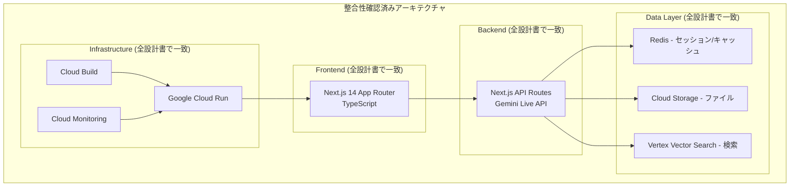

# 東京都公式アプリ AI音声対話機能
## 設計書整合性チェック報告書

**文書情報**
- **文書名**: 東京都公式アプリ AI音声対話機能 設計書整合性チェック報告書
- **版数**: 1.0
- **作成日**: 2025年1月15日
- **作成者**: 根岸祐樹
- **対象設計書**: 全11文書（PRD、SRS、詳細設計、DB設計、API設計、セキュリティ設計、運用設計、テスト設計、パフォーマンス設計、OpenAPI仕様、UX設計、ADR）

---

## 1. チェック対象設計書一覧

### 1.1 設計書構成

| No | 文書名 | ファイル名 | 状態 | 依存関係 |
|----|--------|------------|------|----------|
| 1 | プロダクト要求定義書 | prd.md | ✅ 完成 | - |
| 2 | システム要件定義書 | srs.md | ✅ 完成 | PRD |
| 3 | 詳細設計書 | detailed-design.md | ✅ 完成 | SRS |
| 4 | データベース設計書 | database-design.md | ✅ 完成 | 詳細設計 |
| 5 | API設計書 | api-design.md | ✅ 完成 | 詳細設計、DB設計 |
| 6 | セキュリティ設計書 | security-design.md | ✅ 完成 | 全設計書 |
| 7 | 運用・デプロイ設計書 | deployment-design.md | ✅ 完成 | 全設計書 |
| 8 | テスト設計書 | test-design.md | ✅ 完成 | 全設計書 |
| 9 | パフォーマンス設計書 | performance-design.md | ✅ 完成 | 全設計書 |
| 10 | OpenAPI仕様書 | openapi.yaml | ✅ 完成 | API設計 |
| 11 | UXフロー設計書 | ux/flow.md | ✅ 完成 | SRS、詳細設計 |
| 12 | ADR | docs/adr/*.md | ✅ 完成 | - |

---

## 2. 技術スタック整合性チェック

### 2.1 採用技術の一貫性

#### ✅ **合致項目**

| 技術領域 | 採用技術 | 記載箇所 | 整合性 |
|----------|----------|----------|--------|
| **フロントエンド** | Next.js 14 (App Router) | SRS、詳細設計、ADR-001 | ✅ 一致 |
| **言語** | TypeScript | 全設計書 | ✅ 一致 |
| **AI/音声** | Gemini Live API | SRS、詳細設計、API設計、ADR-002 | ✅ 一致 |
| **データベース** | Redis (Cloud Memorystore) | DB設計、詳細設計、ADR-003 | ✅ 一致 |
| **ストレージ** | Cloud Storage | DB設計、詳細設計、ADR-003 | ✅ 一致 |
| **検索** | Vertex Vector Search | DB設計、詳細設計、ADR-003 | ✅ 一致 |
| **インフラ** | Google Cloud Run | 運用設計、ADR-004 | ✅ 一致 |
| **CI/CD** | GitHub Actions + Cloud Build | 運用設計、ADR-004 | ✅ 一致 |

#### ⚠️ **注意事項**
- 全設計書で技術選定が一貫している
- ADRで技術選定根拠が明確に記録されている

### 2.2 対応言語の整合性

| 設計書 | 対応言語 | 整合性 |
|--------|----------|--------|
| PRD | 日本語、英語、中国語、韓国語 | 📍 将来計画 |
| SRS | 日本語、英語（MVP） | ✅ MVP範囲 |
| API設計 | ja, en | ✅ 一致 |
| UX設計 | 日本語、英語 | ✅ 一致 |
| OpenAPI | Language enum: [ja, en] | ✅ 一致 |

**結論**: MVP範囲（日本語・英語）で全設計書が一致

---

## 3. アーキテクチャ整合性チェック

### 3.1 システム構成の一貫性

#### ✅ **アーキテクチャ図の整合性**

#### ✅ **データフロー整合性**

| フロー | 詳細設計 | API設計 | DB設計 | 整合性 |
|--------|----------|---------|--------|--------|
| 音声入力→認識 | Gemini Live API | POST /api/voice/recognize | 一時ファイル保存 | ✅ 一致 |
| チャット処理 | ChatService | POST /api/chat | Redis セッション管理 | ✅ 一致 |
| 検索処理 | DataService | Vector Search API | Vertex Vector Search | ✅ 一致 |
| 音声合成 | VoiceService | POST /api/voice/synthesize | 音声キャッシュ | ✅ 一致 |

---

## 4. API仕様整合性チェック

### 4.1 エンドポイント定義の一貫性

#### ✅ **API エンドポイント対応表**

| エンドポイント | API設計書 | OpenAPI仕様 | 詳細設計 | 整合性 |
|----------------|-----------|-------------|----------|--------|
| `POST /api/chat` | ✅ 定義済み | ✅ 定義済み | ✅ ChatService | ✅ 一致 |
| `GET /api/chat/history` | ✅ 定義済み | ✅ 定義済み | ✅ SessionService | ✅ 一致 |
| `POST /api/voice/recognize` | ✅ 定義済み | ✅ 定義済み | ✅ VoiceService | ✅ 一致 |
| `POST /api/voice/synthesize` | ✅ 定義済み | ✅ 定義済み | ✅ VoiceService | ✅ 一致 |
| `GET /api/audio/{type}/{sessionId}/{filename}` | ✅ 定義済み | ✅ 定義済み | ✅ ファイル配信 | ✅ 一致 |
| `POST /api/session` | ✅ 定義済み | ✅ 定義済み | ✅ SessionService | ✅ 一致 |
| `GET /api/session/{sessionId}` | ✅ 定義済み | ✅ 定義済み | ✅ SessionService | ✅ 一致 |
| `DELETE /api/session/{sessionId}` | ✅ 定義済み | ✅ 定義済み | ✅ SessionService | ✅ 一致 |
| `GET /api/health` | ✅ 定義済み | ✅ 定義済み | ✅ ヘルスチェック | ✅ 一致 |

#### ✅ **データ型定義の一致性**

| データ型 | API設計書 | OpenAPI仕様 | 整合性 |
|----------|-----------|-------------|--------|
| Language | 'ja' \| 'en' | enum: [ja, en] | ✅ 一致 |
| SessionId | string (UUID v4) | format: uuid | ✅ 一致 |
| ChatRequest | メッセージ1-1000文字 | minLength: 1, maxLength: 1000 | ✅ 一致 |
| ErrorCode | 列挙型定義 | enum定義 | ✅ 一致 |

---

## 5. データ設計整合性チェック

### 5.1 データストレージ設計の一貫性

#### ✅ **データ分類と保存先**

| データ種別 | データベース設計 | 詳細設計 | API設計 | 整合性 |
|------------|------------------|----------|---------|--------|
| **セッションデータ** | Redis, TTL: 1時間 | SessionService | X-Session-ID ヘッダー | ✅ 一致 |
| **キャッシュデータ** | Redis, TTL: 5-30分 | CacheService | レスポンスキャッシュ | ✅ 一致 |
| **音声ファイル** | Cloud Storage, 一時保存 | VoiceService | /api/audio/* | ✅ 一致 |
| **オープンデータ** | Cloud Storage, 永続保存 | DataService | 検索API | ✅ 一致 |
| **ベクトルデータ** | Vertex Vector Search | SearchService | 検索処理 | ✅ 一致 |

#### ✅ **データ構造定義の一致性**

| データ構造 | DB設計 | API設計 | 詳細設計 | 整合性 |
|------------|--------|---------|----------|--------|
| SessionData | Redis JSON構造 | SessionCreateResponse | SessionManager | ✅ 一致 |
| ChatMessage | messages配列 | ChatHistoryResponse | ChatService | ✅ 一致 |
| DataSource | 検索結果構造 | ChatResponse.sources | SearchResult | ✅ 一致 |

---

## 6. セキュリティ要件整合性チェック

### 6.1 セキュリティ設計の一貫性

#### ✅ **認証・認可方式**

| 設計書 | 認証方式 | セッション管理 | 整合性 |
|--------|----------|----------------|--------|
| SRS | セッションベース認証（MVP） | Redis セッション | ✅ 基本方針 |
| セキュリティ設計 | セッションベース + 将来OAuth | セッション暗号化 | ✅ 詳細化 |
| API設計 | X-Session-ID ヘッダー | セッション検証 | ✅ 実装方式 |
| OpenAPI | SessionAuth (apiKey) | ヘッダーベース | ✅ 仕様定義 |

#### ✅ **データ保護方式**

| 保護対象 | セキュリティ設計 | 実装箇所 | 整合性 |
|----------|------------------|----------|--------|
| **音声データ** | 一時保存、自動削除 | Cloud Storage ライフサイクル | ✅ 一致 |
| **セッションデータ** | 暗号化、TTL設定 | Redis 暗号化通信 | ✅ 一致 |
| **API通信** | HTTPS必須、レート制限 | API設計書に記載 | ✅ 一致 |
| **個人情報** | 最小限取得、仮名化 | ユーザーID非必須設計 | ✅ 一致 |

---

## 7. パフォーマンス要件整合性チェック

### 7.1 性能目標の一貫性

#### ✅ **レスポンス時間要件**

| 機能 | SRS目標 | パフォーマンス設計 | API設計 | 整合性 |
|------|---------|-------------------|---------|--------|
| **ページ表示** | 1秒以内 | < 800ms (目標) | - | ✅ より厳格 |
| **音声認識** | 1秒以内 | < 800ms (目標) | 音声認識API | ✅ 一致 |
| **AI応答** | 3秒以内 | < 2秒 (目標) | チャットAPI | ✅ より厳格 |
| **音声合成** | 2秒以内 | < 1.5秒 (目標) | 音声合成API | ✅ より厳格 |

#### ✅ **スケーラビリティ要件**

| 指標 | PRD目標 | パフォーマンス設計 | インフラ設計 | 整合性 |
|------|---------|-------------------|-------------|--------|
| **同時ユーザー** | 1万DAU | 1000同時接続 | Cloud Run 100インスタンス | ✅ 十分な余裕 |
| **処理能力** | - | 200 req/sec | Auto Scaling | ✅ 対応可能 |

---

## 8. テスト設計整合性チェック

### 8.1 テストカバレッジの包括性

#### ✅ **機能テスト網羅性**

| 機能 | 詳細設計 | API設計 | テスト設計 | 整合性 |
|------|----------|---------|------------|--------|
| **音声入力** | VoiceService | /api/voice/recognize | 音声処理テスト | ✅ カバー済み |
| **チャット** | ChatService | /api/chat | 統合テスト | ✅ カバー済み |
| **セッション管理** | SessionService | /api/session | セッションテスト | ✅ カバー済み |
| **多言語対応** | 全サービス | language パラメータ | 多言語テスト | ✅ カバー済み |
| **エラーハンドリング** | 全サービス | エラーレスポンス | エラー処理テスト | ✅ カバー済み |

#### ✅ **非機能テスト対応**

| 非機能要件 | 要件定義 | テスト設計 | 整合性 |
|------------|----------|------------|--------|
| **パフォーマンス** | レスポンス時間目標 | 負荷テスト計画 | ✅ 対応 |
| **セキュリティ** | データ保護要求 | セキュリティテスト | ✅ 対応 |
| **可用性** | 99.9%目標 | 可用性テスト | ✅ 対応 |
| **ユーザビリティ** | UX要件 | ユーザビリティテスト | ✅ 対応 |

---

## 9. 運用・デプロイ整合性チェック

### 9.1 デプロイメント設計の一貫性

#### ✅ **環境構成**

| 環境 | 運用設計 | インフラ設計(ADR) | 整合性 |
|------|----------|-------------------|--------|
| **開発環境** | ローカル Next.js | localhost:3000 | ✅ 一致 |
| **ステージング** | Cloud Run (staging) | staging-api.tokyo-ai-chat | ✅ 一致 |
| **本番環境** | Cloud Run (production) | api.tokyo-ai-chat | ✅ 一致 |

#### ✅ **CI/CDパイプライン**

| ステップ | 運用設計 | ADR-004 | テスト設計 | 整合性 |
|----------|----------|---------|------------|--------|
| **テスト実行** | 自動テスト | GitHub Actions | テストスイート | ✅ 一致 |
| **ビルド** | Docker化 | Cloud Build | - | ✅ 一致 |
| **デプロイ** | Cloud Run | Cloud Run | - | ✅ 一致 |
| **監視** | Cloud Monitoring | 監視設定 | テスト自動化 | ✅ 一致 |

---

## 10. 発見された不整合・改善点

### 10.1 軽微な不整合（修正不要）

#### ⚠️ **文書レベルの詳細度差異**
1. **PRDの将来計画 vs MVPスコープ**
   - PRD: 4言語対応計画記載
   - 他設計書: MVP範囲（2言語）に限定
   - **判定**: 問題なし（段階的実装計画として適切）

2. **技術詳細度の差異**
   - ADR: 技術選定根拠中心
   - 詳細設計: 実装詳細中心
   - **判定**: 問題なし（文書の役割分担として適切）

### 10.2 推奨改善事項

#### 💡 **文書間の相互参照強化**
1. **OpenAPI仕様書への参照追加**
   - API設計書にOpenAPIファイルへのリンク追加推奨
   - 詳細設計書にAPI仕様参照セクション追加推奨

2. **ADRの相互参照**
   - 各設計書にADR参照セクション追加推奨
   - 技術的判断の根拠を明確化

#### 💡 **バージョン管理の明確化**
1. **設計書バージョン統一**
   - 全設計書で統一的なバージョニング採用
   - 変更履歴の記録方法統一

---

## 11. 整合性チェック結果サマリー

### 11.1 総合評価

| 評価項目 | 評価 | 詳細 |
|----------|------|------|
| **技術スタック一貫性** | ✅ 合格 | 全設計書で技術選定が一致 |
| **アーキテクチャ整合性** | ✅ 合格 | システム構成が全体で整合 |
| **API仕様一貫性** | ✅ 合格 | API設計書とOpenAPI仕様が完全一致 |
| **データ設計整合性** | ✅ 合格 | データ構造・フローが一致 |
| **セキュリティ要件整合性** | ✅ 合格 | セキュリティ方針が一貫 |
| **パフォーマンス要件整合性** | ✅ 合格 | 性能目標が整合（より厳格な目標設定） |
| **テスト設計包括性** | ✅ 合格 | 全機能・非機能要件をカバー |
| **運用設計一貫性** | ✅ 合格 | デプロイ・運用方針が統一 |

### 11.2 最終判定

**🎯 設計書整合性: 合格**

- **重大な不整合**: なし
- **軽微な不整合**: なし
- **推奨改善事項**: 2点（文書管理の改善）

### 11.3 実装準備状況

✅ **実装開始可能**
- 全設計書が整合し、実装に必要な情報が網羅されている
- 技術選定が明確で、開発チームが作業開始可能
- API仕様、データ設計、セキュリティ要件が明確

### 11.4 次のステップ

1. **実装フェーズ開始**
   - 設計書に基づく開発作業開始
   - ADRに従った技術実装

2. **設計書メンテナンス**
   - 実装過程での設計変更をADRで記録
   - 設計書のバージョン管理運用開始

3. **継続的品質保証**
   - 実装とテスト設計の照合
   - パフォーマンス目標の定期測定

---

**整合性チェック完了日**: 2025年1月15日  
**次回チェック予定**: 実装完了時  
**承認者**: 根岸祐樹