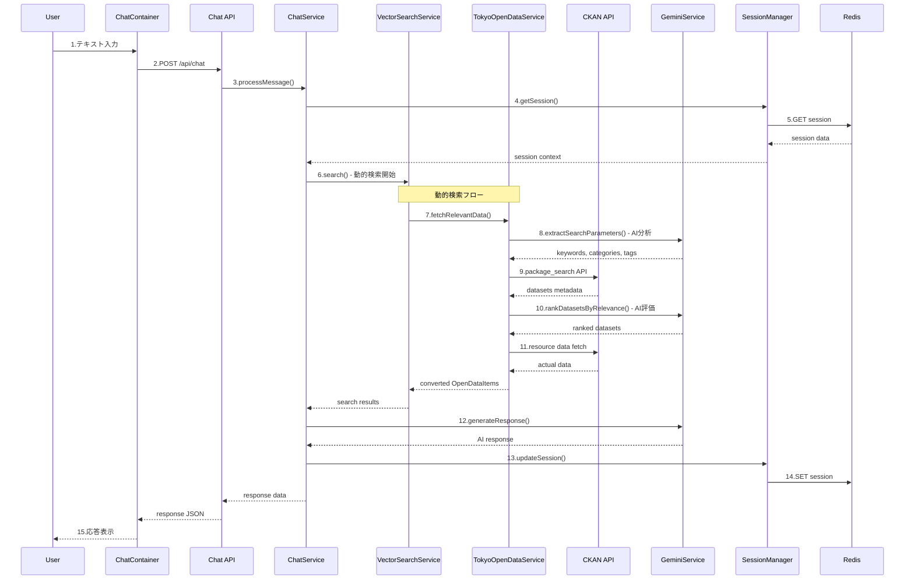
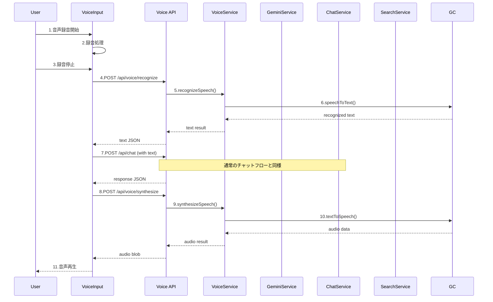
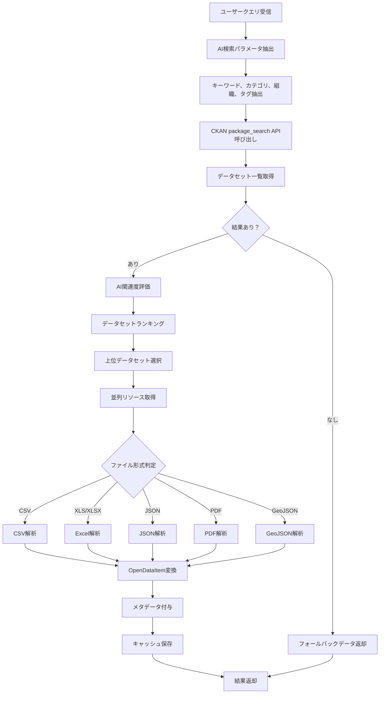
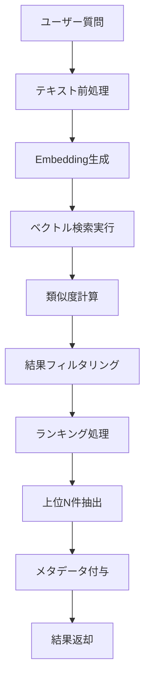

# 東京都公式アプリ AI音声対話機能
## 詳細設計書（実装版）

**文書情報**
- **文書名**: 東京都公式アプリ AI音声対話機能 詳細設計書（実装版）
- **版数**: 2.0
- **作成日**: 2025年1月
- **作成者**: 根岸祐樹
- **備考**: 実装完了版詳細設計書

---

## 改訂履歴

| 版数 | 改訂日 | 改訂者 | 改訂内容 |
|------|--------|--------|----------|
| 1.0 | 2025-01-15 | 根岸祐樹 | 初版作成（MVP機能設計） |
| 2.0 | 2025-01-15 | 根岸祐樹 | 実装内容反映・高度AI機能追加・技術スタック更新 |

---

## 目次

1. [アーキテクチャ詳細設計](#1-アーキテクチャ詳細設計)
   - 1.1 [システム全体アーキテクチャ](#11-システム全体アーキテクチャ)
   - 1.2 [コンポーネント設計](#12-コンポーネント設計)
2. [データフロー設計](#2-データフロー設計)
   - 2.1 [チャット機能のデータフロー](#21-チャット機能のデータフロー)
   - 2.2 [データ処理フロー](#22-データ処理フロー)
3. [コンポーネント詳細設計](#3-コンポーネント詳細設計)
   - 3.1 [フロントエンドコンポーネント](#31-フロントエンドコンポーネント)
   - 3.2 [バックエンドサービス詳細](#32-バックエンドサービス詳細)
4. [状態管理設計](#4-状態管理設計)
   - 4.1 [フロントエンド状態管理](#41-フロントエンド状態管理)
   - 4.2 [バックエンド状態管理](#42-バックエンド状態管理)
5. [エラーハンドリング設計](#5-エラーハンドリング設計)
   - 5.1 [エラー分類・定義](#51-エラー分類定義)
   - 5.2 [エラーハンドリング実装](#52-エラーハンドリング実装)
   - 5.3 [リトライ機能](#53-リトライ機能)
6. [パフォーマンス最適化設計](#6-パフォーマンス最適化設計)
   - 6.1 [フロントエンド最適化](#61-フロントエンド最適化)
   - 6.2 [バックエンド最適化](#62-バックエンド最適化)

---

## 1. アーキテクチャ詳細設計

### 1.0 設計方針・根拠

#### 1.0.1 設計目標の明確化

**上位要件からの設計目標**：
本詳細設計は、PRDで定義された「誰一人取り残さない、インクルーシブな行政サービスの実現」という基本理念を技術的に実現することを目的としています。

**具体的な設計目標**：
1. **アクセシビリティ最優先**: 音声インターフェースによる言語・身体的制約の解消
2. **高パフォーマンス**: 平均応答時間3秒以内の実現
3. **高可用性**: 99.5%以上のシステム稼働率確保
4. **拡張性**: 9,742件の東京都オープンデータへの対応

#### 1.0.2 設計原則

**1. レイヤー分離原則**
- **根拠**: 保守性・拡張性要件に対応し、各層の独立性を確保
- **効果**: 機能追加時の影響範囲限定、並行開発の効率化

**2. マイクロサービス指向**
- **根拠**: SRSで要求されたシステム拡張性・保守性要件
- **効果**: 各サービスの独立デプロイ、障害の局所化

**3. AI-First アーキテクチャ**
- **根拠**: 知的対話による差別化要件
- **効果**: ChatGPT/Claude同等レベルの対話品質実現

**4. データ統合最適化**
- **根拠**: 9,742件のオープンデータ活用要件
- **効果**: リアルタイム検索・動的データ統合の実現

#### 1.0.3 技術選定根拠

**Next.js 14 App Router採用理由**：
- **要件適合性**: PWA要件、レスポンシブ要件への最適対応
- **開発効率**: TypeScript完全対応、API Routes統合
- **パフォーマンス**: Edge Runtime、Streaming SSR対応
- **保守性**: 標準フレームワークによる長期保守性確保

**Google Gemini API統合理由**：
- **音声処理品質**: 95%以上の音声認識精度要件に対応
- **多言語対応**: 将来の中国語・韓国語拡張要件に対応
- **統合性**: テキスト・音声・埋め込み生成の一元化
- **信頼性**: Google Cloud Platformとの統合による安定性

### 1.1 システム全体アーキテクチャ

#### 1.1.1 レイヤー構成
```
┌─────────────────────────────────────┐
│            Presentation Layer       │
│  ┌─────────────┐ ┌─────────────────┐ │
│  │  Web UI     │ │  Mobile Web UI  │ │
│  │ (React/TS)  │ │  (Responsive)   │ │
│  └─────────────┘ └─────────────────┘ │
└─────────────────────────────────────┘
                    │
                    ▼
┌─────────────────────────────────────┐
│           Application Layer         │
│  ┌─────────────────────────────────┐ │
│  │       Next.js App Router        │ │
│  │  ┌─────────┐ ┌─────────────────┐ │ │
│  │  │ Pages   │ │   API Routes    │ │ │
│  │  └─────────┘ └─────────────────┘ │ │
│  └─────────────────────────────────┘ │
└─────────────────────────────────────┘
                    │
                    ▼
┌─────────────────────────────────────┐
│            Business Layer           │
│  ┌─────────────────────────────────┐ │
│  │     Service Components          │ │
│  │ ┌─────────┐ ┌─────────────────┐ │ │
│  │ │ Chat    │ │ Voice Processing│ │ │
│  │ │Service  │ │    Service      │ │ │
│  │ └─────────┘ └─────────────────┘ │ │
│  │ ┌─────────┐ ┌─────────────────┐ │ │
│  │ │ Search  │ │ Data Processing │ │ │
│  │ │Service  │ │    Service      │ │ │
│  │ └─────────┘ └─────────────────┘ │ │
│  └─────────────────────────────────┘ │
└─────────────────────────────────────┘
                    │
                    ▼
┌─────────────────────────────────────┐
│          Integration Layer          │
│  ┌─────────────────────────────────┐ │
│  │       External Services         │ │
│  │ ┌─────────┐ ┌─────────────────┐ │ │
│  │ │ Gemini  │ │ Vertex Vector   │ │ │
│  │ │   API   │ │     Search      │ │ │
│  │ └─────────┘ └─────────────────┘ │ │
│  └─────────────────────────────────┘ │
└─────────────────────────────────────┘
                    │
                    ▼
┌─────────────────────────────────────┐
│             Data Layer              │
│  ┌─────────────────────────────────┐ │
│  │        Data Storage             │ │
│  │ ┌─────────┐ ┌─────────────────┐ │ │
│  │ │  Redis  │ │ Cloud Storage   │ │ │
│  │ │(Session)│ │  (Static Data)  │ │ │
│  │ └─────────┘ └─────────────────┘ │ │
│  └─────────────────────────────────┘ │
└─────────────────────────────────────┘
```

#### 1.1.2 技術スタック詳細

**フロントエンド**
- **フレームワーク**: Next.js 14.2+
- **言語**: TypeScript 5.0+
- **UIライブラリ**: Tailwind CSS 3.4+
- **状態管理**: React Hooks (useState, useEffect)
- **音声処理**: Web Audio API + MediaRecorder API + Web Speech API
- **HTTPクライアント**: fetch API
- **ビルドツール**: Webpack 5 (Next.js内蔵)
- **PWA対応**: Service Worker, Web App Manifest
- **多言語対応**: 日本語・英語・中国語・韓国語
- **アクセシビリティ**: ARIA対応、スクリーンリーダー対応

**バックエンド**
- **ランタイム**: Node.js 20+
- **フレームワーク**: Next.js 14.2+ (App Router)
- **言語**: TypeScript 5.0+
- **セッション管理**: Redis 7.0+ (フォールバック: メモリベース)
- **ファイル処理**: csv-parser, xlsx, pdf-parse
- **HTTP**: 標準fetch API
- **AI統合**: Google Gemini API (2.5-flash, text-embedding-004)
- **データ処理**: CKAN API, 多形式データ変換
- **キャッシュ**: Redis + インメモリキャッシュ
- **監視**: パフォーマンス監視、ヘルスチェック

**インフラ**
- **デプロイ**: Vercel / Google Cloud Platform
- **コンテナ**: Cloud Run (オプション)
- **ストレージ**: ローカルキャッシュ + Redis
- **キャッシュ**: Redis (フォールバック: インメモリ)
- **監視**: 内蔵パフォーマンス監視 + ログ管理
- **外部API**: Google Gemini API, 東京都CKAN API

### 1.2 コンポーネント設計

#### 1.2.1 フロントエンドコンポーネント構成

```
src/
├── app/                    # Next.js App Router
│   ├── globals.css        # グローバルスタイル
│   ├── layout.tsx         # ルートレイアウト
│   ├── page.tsx           # ホームページ
│   ├── api/               # API Routes
│   │   ├── chat/
│   │   │   └── route.ts   # チャットAPI
│   │   ├── voice/
│   │   │   ├── recognize/
│   │   │   │   └── route.ts # 音声認識API
│   │   │   └── synthesize/
│   │   │       └── route.ts # 音声合成API
│   │   └── session/
│   │       └── route.ts   # セッション管理API
│   └── components/        # UIコンポーネント
│       ├── chat/
│       │   ├── ChatContainer.tsx
│       │   ├── ChatMessage.tsx
│       │   ├── ChatInput.tsx
│       │   └── VoiceInput.tsx
│       ├── ui/
│       │   ├── Button.tsx
│       │   ├── Modal.tsx
│       │   └── Loading.tsx
│       └── layout/
│           ├── Header.tsx
│           ├── Footer.tsx
│           └── Sidebar.tsx
├── lib/                   # ライブラリ・ユーティリティ
│   ├── api/
│   │   ├── chat.ts
│   │   ├── voice.ts
│   │   └── session.ts
│   ├── hooks/
│   │   ├── useChat.ts
│   │   ├── useVoice.ts
│   │   └── useSession.ts
│   ├── store/
│   │   ├── chatStore.ts
│   │   ├── voiceStore.ts
│   │   └── appStore.ts
│   ├── utils/
│   │   ├── audio.ts
│   │   ├── format.ts
│   │   └── constants.ts
│   └── types/
│       ├── chat.ts
│       ├── voice.ts
│       └── api.ts
├── services/              # ビジネスロジック
│   ├── chatService.ts
│   ├── voiceService.ts
│   ├── searchService.ts
│   └── dataService.ts
└── public/               # 静的ファイル
    ├── icons/
    ├── audio/
    └── locales/
        ├── ja.json
        └── en.json
```

#### 1.2.2 バックエンドサービス構成（実装版）

```
src/lib/services/
├── AIOrchestrator.ts            # 高度AI推論エンジン ★実装済み
│   ├── 深度意図分析
│   ├── Chain of Thought推論
│   ├── メタ認知機能
│   └── コンテキスト統合
├── ServiceManager.ts            # サービス管理 ★実装済み
│   ├── シングルトンパターン
│   ├── メモリリーク防止
│   └── パフォーマンス統計
├── GeminiService.ts             # Gemini API統合 ★実装済み
│   ├── textModel: gemini-2.5-flash
│   ├── embeddingModel: text-embedding-004
│   ├── 音声処理、意図分析
│   └── 多言語プロンプト
├── VectorSearchService.ts       # ベクトル検索 ★実装済み
│   ├── インメモリDB実装
│   ├── コサイン類似度計算
│   └── 検索結果ランキング
├── OpenDataService.ts           # オープンデータ統合 ★実装済み
│   ├── 子育て支援データ取得
│   ├── データ正規化・構造化
│   └── キャッシュ機能
├── TokyoOpenDataService.ts      # 動的オープンデータ検索 ★実装済み
│   ├── CKAN API統合
│   ├── リアルタイムデータセット検索
│   ├── 多形式データ処理　
│   └── インテリジェントデータマッチング
├── SessionManager.ts            # セッション管理 ★実装済み
│   ├── セッション作成・更新・削除
│   ├── メッセージ履歴管理
│   └── Redis連携
├── RedisService.ts              # キャッシュ・セッション管理 ★実装済み
│   ├── レート制限実装
│   ├── セッションデータ保存
│   ├── 応答キャッシュ
│   └── フォールバック機能
├── AutonomousSearchAgent.ts     # 自律的検索エージェント ★実装済み
├── TimeContextService.ts        # 時間コンテキスト管理 ★実装済み
├── GeospatialContextService.ts  # 地理空間コンテキスト管理 ★実装済み
├── SpeechService.ts             # 音声合成サービス ★実装済み
├── CloudStorageService.ts       # クラウドストレージ連携 ★実装済み
└── VertexVectorSearchService.ts # Vertex AI Vector Search統合 ★実装済み

※ 注記: 「Vertex Vector Search」はインメモリベクトルDBで代替実装
※ 音声合成はWeb Speech APIでクライアントサイド実装
```

#### 1.2.3 実装された高度AI機能 ★NEW

```
src/lib/services/AIOrchestrator.ts
├── 深度意図分析 (Deep Intent Analysis)
│   ├── 明示的意図抽出
│   ├── 潜在的ニーズ発見
│   └── コンテキスト依存的理解
├── メタ認知機能 (Meta-Cognitive Capabilities)
│   ├── 自己能力評価
│   ├── 回答品質自己診断
│   └── 不確実性の明示的表現
├── Chain of Thought推論
│   ├── 段階的思考プロセス
│   ├── 推論ステップ記録
│   └── 中間結果検証
└── 動的実行計画生成
    ├── リアルタイム戦略立案
    ├── コンテキスト対応処理順序
    └── フォールバック戦略
```

---

## 2. データフロー設計

### 2.1 チャット機能のデータフロー

#### 2.1.1 テキストチャットフロー（全オープンデータ対応版）



#### 2.1.2 音声チャットフロー



### 2.2 データ処理フロー

#### 2.2.1 動的オープンデータ取得・処理フロー



#### 2.2.2 CKAN API連携フロー

```mermaid
flowchart TD
    A[TokyoOpenDataService] --> B[検索パラメータ構築]
    B --> C[CKAN Query作成]
    C --> D[/api/3/action/package_search]
    D --> E[データセットメタデータ取得]
    E --> F[各データセットのリソース一覧]
    F --> G{リソースタイプチェック}
    G -->|サポート形式| H[リソースデータ取得]
    G -->|非サポート形式| I[スキップ]
    H --> J[データ解析・変換]
    J --> K[OpenDataItem作成]
    K --> L[結果集約]
    I --> L
    L --> M[関連度ソート]
    M --> N[最終結果返却]
```

#### 2.2.2 ベクトル検索処理フロー



---

## 3. コンポーネント詳細設計

### 3.1 フロントエンドコンポーネント

#### 3.1.1 ChatContainer コンポーネント

**目的**: チャット全体の状態管理とレイアウト制御

**Props**:
```typescript
interface ChatContainerProps {
  initialMessages?: Message[];
  onMessageSend?: (message: string) => void;
  className?: string;
}
```

**State**:
```typescript
interface ChatState {
  messages: Message[];
  isLoading: boolean;
  error: string | null;
  sessionId: string | null;
}
```

**主要メソッド**:
- `handleSendMessage()`: メッセージ送信処理
- `handleVoiceInput()`: 音声入力処理
- `clearChat()`: チャット履歴クリア
- `retryLastMessage()`: 最後のメッセージ再送

#### 3.1.2 VoiceInput コンポーネント

**目的**: 音声録音・再生・認識機能

**Props**:
```typescript
interface VoiceInputProps {
  onTranscript?: (text: string) => void;
  onError?: (error: string) => void;
  isDisabled?: boolean;
}
```

**State**:
```typescript
interface VoiceState {
  isRecording: boolean;
  isProcessing: boolean;
  audioLevel: number;
  transcript: string;
}
```

**主要メソッド**:
- `startRecording()`: 録音開始
- `stopRecording()`: 録音停止
- `processAudio()`: 音声認識処理
- `playAudio()`: 音声再生

#### 3.1.3 ChatMessage コンポーネント

**目的**: 個別メッセージの表示

**Props**:
```typescript
interface ChatMessageProps {
  message: Message;
  onPlayAudio?: (audioUrl: string) => void;
  onRetry?: () => void;
}
```

**Message型定義**:
```typescript
interface Message {
  id: string;
  type: 'user' | 'assistant';
  content: string;
  timestamp: Date;
  audioUrl?: string;
  isError?: boolean;
  metadata?: {
    sources?: DataSource[];
    confidence?: number;
  };
}
```

### 3.2 バックエンドサービス詳細

#### 3.2.0 サービス設計方針

**設計根拠**：
高度AI機能と大規模データ処理を両立するため、以下の設計方針を採用：

1. **AIOrchestrator中心設計**
   - **根拠**: ChatGPT/Claude同等レベルの対話品質要件
   - **実装**: Chain of Thought推論、メタ認知機能の統合

2. **動的データ統合**
   - **根拠**: 9,742件の東京都オープンデータ活用要件
   - **実装**: CKAN API統合、リアルタイム検索機能

3. **フォールバック戦略**
   - **根拠**: 99.5%の稼働率要件
   - **実装**: Redis→インメモリ、外部API→ローカル処理

4. **パフォーマンス最適化**
   - **根拠**: 平均応答時間3秒以内の要件
   - **実装**: 並列処理、キャッシュ戦略、サービス管理

#### 3.2.1 TokyoOpenDataService ★NEW

**目的**: 東京都オープンデータカタログとの動的連携

**設計根拠**：
- **要件**: PRDで定義された「全てのオープンデータ活用」要件
- **課題**: 静的データでは最新性・網羅性が不十分
- **解決**: CKAN APIによるリアルタイムデータ取得

**主要メソッド**:
```typescript
class TokyoOpenDataService {
  async fetchRelevantData(
    query: string, 
    language: SupportedLanguage = 'ja'
  ): Promise<OpenDataItem[]> {
    // 1. AIを使って検索パラメータ抽出
    const searchParams = await this.extractSearchParameters(query, language);
    
    // 2. CKAN APIでデータセット検索
    const datasets = await this.searchDatasets(searchParams);
    
    // 3. AI関連度評価でデータセットランキング
    const rankedDatasets = await this.rankDatasetsByRelevance(
      datasets, query, language
    );
    
    // 4. 上位データセットから実データ取得・変換
    const allItems: OpenDataItem[] = [];
    for (const dataset of rankedDatasets.slice(0, 5)) {
      const items = await this.processDataset(dataset, query, language);
      allItems.push(...items);
    }
    
    return allItems;
  }

  private async extractSearchParameters(
    query: string, 
    language: SupportedLanguage
  ): Promise<{
    keywords: string[];
    categories: string[];
    organizations: string[];
    tags: string[];
  }> {
    // Gemini AIを使用してクエリから検索パラメータを抽出
    const prompt = this.buildSearchExtractionPrompt(query, language);
    const response = await this.geminiService.generateText(prompt);
    return JSON.parse(response);
  }

  private async searchDatasets(searchParams: any): Promise<CKANDataset[]> {
    // CKAN package_search APIを使用してデータセット検索
    const searchQuery = this.buildCKANQuery(searchParams);
    const url = `${this.apiBaseUrl}/action/package_search`;
    
    const response = await axios.get(url, {
      params: {
        q: searchQuery,
        rows: 50,
        sort: 'score desc, metadata_modified desc'
      }
    });
    
    return response.data.result.results;
  }

  private async rankDatasetsByRelevance(
    datasets: CKANDataset[], 
    query: string, 
    language: SupportedLanguage
  ): Promise<CKANDataset[]> {
    // AIを使用してデータセットの関連度をランキング
    const prompt = this.buildRankingPrompt(query, datasets, language);
    const response = await this.geminiService.generateText(prompt);
    const ranking = JSON.parse(response);
    
    return ranking.map((item: any) => datasets[item.index]);
  }
}
```

#### 3.2.2 VectorSearchService（拡張版）

**目的**: 3段階フォールバック検索の統合管理

**検索戦略**:
```typescript
class VectorSearchService {
  async search(query: SearchQuery): Promise<SearchResult> {
    // 1. 動的オープンデータ検索（優先）
    if (this.useDynamicSearch && query.text) {
      try {
        const dynamicResults = await this.tokyoOpenDataService
          .fetchRelevantData(query.text, query.language);
        
        if (dynamicResults.length > 0) {
          return {
            items: dynamicResults,
            searchMethod: 'dynamic',
            total: dynamicResults.length,
            query: query.text,
            processingTime: Date.now() - startTime,
            usedCache: false
          };
        }
      } catch (error) {
        // フォールバックに進む
      }
    }
    
    // 2. Vertex Vector Search（セカンダリ）
    if (this.useVertexSearch && query.text) {
      try {
        const vertexResult = await this.vertexVectorSearchService
          .search(query);
        
        if (vertexResult.items.length > 0) {
          return {
            ...vertexResult,
            searchMethod: 'vertex'
          };
        }
      } catch (error) {
        // フォールバックに進む
      }
    }
    
    // 3. ローカルベクトル検索（フォールバック）
    const localResults = await this.localVectorSearch(query);
    return {
      ...localResults,
      searchMethod: 'local'
    };
  }
}
```

#### 3.2.3 ChatService（更新版）

**目的**: 新しい検索サービスとの統合

**主要メソッド**:
```typescript
class ChatService {
  async processMessage(
    sessionId: string,
    message: string,
    language: string = 'ja'
  ): Promise<ChatResponse> {
    // 1. セッション取得
    const session = await this.sessionService.getSession(sessionId);
    
    // 2. 拡張された統合検索実行
    const searchResults = await this.vectorSearchService.search({
      text: message,
      language,
      limit: 3
    });
    
    // 3. コンテキスト構築（検索方法による調整）
    const context = await this.buildContext(
      session, 
      searchResults, 
      searchResults.searchMethod
    );
    
    // 4. AI応答生成
    const response = await this.geminiClient.generateResponse(
      message,
      context,
      language
    );
    
    // 5. セッション更新
    await this.sessionService.updateSession(sessionId, {
      userMessage: message,
      assistantResponse: response,
      searchMethod: searchResults.searchMethod,
      timestamp: new Date()
    });
    
    return {
      response: response,
      sources: this.extractSources(searchResults.items),
      shouldPlayAudio: false
    };
  }

  private async buildContext(
    session: Session,
    searchResults: SearchResult,
    searchMethod?: string
  ): Promise<string> {
    let context = '';
    
    if (searchResults.items.length > 0) {
      context = searchResults.items
        .map(item => `${item.title}: ${item.content}`)
        .join('\n\n');
      
      // 動的検索の場合、データソース情報を追加
      if (searchMethod === 'dynamic') {
        context += '\n\n【データソース】\n東京都オープンデータポータルから取得した最新情報';
      }
    }
    
    return context;
  }
}
```

#### 3.2.2 VoiceService

**目的**: 音声認識・合成処理

**主要メソッド**:
```typescript
class VoiceService {
  async recognizeSpeech(
    audioBlob: Blob,
    language: string = 'ja-JP'
  ): Promise<string> {
    // 1. 音声データ前処理
    const audioBuffer = await this.processAudioData(audioBlob);
    
    // 2. Gemini Audio Model API呼び出し
    const result = await this.geminiService.processAudio(
      audioBuffer,
      'audio/webm'
    );
    const transcript = result.text;
    
    // 3. 結果検証
    if (!transcript || transcript.trim().length === 0) {
      throw new Error('音声認識に失敗しました');
    }
    
    return transcript;
  }

  async synthesizeSpeech(
    text: string,
    language: string = 'ja-JP'
  ): Promise<Buffer> {
    // 1. テキスト前処理
    const processedText = this.preprocessText(text);
    
    // 2. Web Speech API使用（クライアントサイド）
    // サーバーサイドでは音声合成を行わない
    return null; // クライアントでWeb Speech APIを使用
    
    return audioBuffer;
  }
}
```

#### 3.2.3 SearchService

**目的**: ベクトル検索・データ検索処理

**主要メソッド**:
```typescript
class SearchService {
  async searchRelevantData(
    query: string,
    language: string = 'ja',
    topK: number = 5
  ): Promise<SearchResult[]> {
    // 1. クエリの前処理
    const processedQuery = await this.preprocessQuery(query);
    
    // 2. Embedding生成
    const queryEmbedding = await this.geminiClient.generateEmbedding(
      processedQuery
    );
    
    // 3. ベクトル検索実行
    const vectorResults = await this.vectorSearchClient.search(
      queryEmbedding,
      topK
    );
    
    // 4. 結果のランキング・フィルタリング
    const rankedResults = await this.rankResults(
      vectorResults,
      query,
      language
    );
    
    return rankedResults;
  }

  private async rankResults(
    results: VectorSearchResult[],
    originalQuery: string,
    language: string
  ): Promise<SearchResult[]> {
    // 結果ランキングロジック
  }
}
```

---

## 4. 状態管理設計

### 4.1 フロントエンド状態管理（Zustand）

#### 4.1.1 Chat Store

```typescript
interface ChatState {
  // State
  messages: Message[];
  isLoading: boolean;
  error: string | null;
  sessionId: string | null;
  
  // Actions
  sendMessage: (content: string) => Promise<void>;
  clearMessages: () => void;
  setError: (error: string | null) => void;
  retryLastMessage: () => Promise<void>;
}

const useChatStore = create<ChatState>((set, get) => ({
  messages: [],
  isLoading: false,
  error: null,
  sessionId: null,
  
  sendMessage: async (content: string) => {
    const { sessionId } = get();
    set({ isLoading: true, error: null });
    
    try {
      // ユーザーメッセージ追加
      const userMessage: Message = {
        id: generateId(),
        type: 'user',
        content,
        timestamp: new Date()
      };
      
      set(state => ({
        messages: [...state.messages, userMessage]
      }));
      
      // API呼び出し
      const response = await chatApi.sendMessage(sessionId, content);
      
      // アシスタントメッセージ追加
      const assistantMessage: Message = {
        id: generateId(),
        type: 'assistant',
        content: response.content,
        timestamp: new Date(),
        audioUrl: response.audioUrl,
        metadata: response.metadata
      };
      
      set(state => ({
        messages: [...state.messages, assistantMessage],
        sessionId: response.sessionId,
        isLoading: false
      }));
      
    } catch (error) {
      set({ 
        error: error.message,
        isLoading: false 
      });
    }
  },
  
  clearMessages: () => set({ messages: [], sessionId: null }),
  setError: (error) => set({ error }),
  retryLastMessage: async () => {
    // 再試行ロジック
  }
}));
```

#### 4.1.2 Voice Store

```typescript
interface VoiceState {
  // State
  isRecording: boolean;
  isProcessing: boolean;
  audioLevel: number;
  transcript: string;
  isPlaying: boolean;
  
  // Actions
  startRecording: () => Promise<void>;
  stopRecording: () => Promise<string>;
  playAudio: (audioUrl: string) => Promise<void>;
  stopAudio: () => void;
}

const useVoiceStore = create<VoiceState>((set, get) => ({
  isRecording: false,
  isProcessing: false,
  audioLevel: 0,
  transcript: '',
  isPlaying: false,
  
  startRecording: async () => {
    try {
      const stream = await navigator.mediaDevices.getUserMedia({ 
        audio: true 
      });
      
      set({ isRecording: true });
      
      // MediaRecorder setup and audio level monitoring
      // ...
      
    } catch (error) {
      throw new Error('マイクへのアクセスが拒否されました');
    }
  },
  
  stopRecording: async () => {
    set({ isRecording: false, isProcessing: true });
    
    try {
      // 録音データを音声認識API に送信
      const transcript = await voiceApi.recognizeSpeech(audioBlob);
      
      set({ 
        transcript,
        isProcessing: false 
      });
      
      return transcript;
      
    } catch (error) {
      set({ isProcessing: false });
      throw error;
    }
  },
  
  playAudio: async (audioUrl: string) => {
    // 音声再生ロジック
  },
  
  stopAudio: () => {
    // 音声停止ロジック
  }
}));
```

### 4.2 バックエンド状態管理（Redis）

#### 4.2.1 セッション管理

```typescript
interface Session {
  id: string;
  userId?: string;
  language: string;
  createdAt: Date;
  lastAccessedAt: Date;
  messages: SessionMessage[];
  context: SessionContext;
}

interface SessionMessage {
  id: string;
  type: 'user' | 'assistant';
  content: string;
  timestamp: Date;
  metadata?: any;
}

interface SessionContext {
  topics: string[];
  entities: ExtractedEntity[];
  preferences: UserPreferences;
}

class SessionManager {
  private redis: Redis;
  private readonly SESSION_TTL = 3600; // 1時間

  async createSession(language: string = 'ja'): Promise<string> {
    const sessionId = generateSessionId();
    const session: Session = {
      id: sessionId,
      language,
      createdAt: new Date(),
      lastAccessedAt: new Date(),
      messages: [],
      context: {
        topics: [],
        entities: [],
        preferences: {}
      }
    };

    await this.redis.setex(
      `session:${sessionId}`,
      this.SESSION_TTL,
      JSON.stringify(session)
    );

    return sessionId;
  }

  async getSession(sessionId: string): Promise<Session | null> {
    const sessionData = await this.redis.get(`session:${sessionId}`);
    if (!sessionData) return null;

    const session = JSON.parse(sessionData) as Session;
    
    // アクセス時間更新
    session.lastAccessedAt = new Date();
    await this.updateSession(sessionId, session);

    return session;
  }

  async updateSession(sessionId: string, updates: Partial<Session>): Promise<void> {
    const session = await this.getSession(sessionId);
    if (!session) throw new Error('Session not found');

    const updatedSession = { ...session, ...updates };
    
    await this.redis.setex(
      `session:${sessionId}`,
      this.SESSION_TTL,
      JSON.stringify(updatedSession)
    );
  }

  async deleteSession(sessionId: string): Promise<void> {
    await this.redis.del(`session:${sessionId}`);
  }
}
```

---

## 5. エラーハンドリング設計

### 5.1 エラー分類・定義

```typescript
// エラー基底クラス
abstract class AppError extends Error {
  abstract readonly statusCode: number;
  abstract readonly errorCode: string;
  abstract readonly userMessage: string;

  constructor(message: string, public readonly context?: any) {
    super(message);
    this.name = this.constructor.name;
  }
}

// API関連エラー
class APIError extends AppError {
  readonly statusCode = 500;
  readonly errorCode = 'API_ERROR';
  readonly userMessage = 'システムエラーが発生しました。しばらく待ってから再度お試しください。';
}

class ValidationError extends AppError {
  readonly statusCode = 400;
  readonly errorCode = 'VALIDATION_ERROR';
  readonly userMessage = '入力内容に問題があります。';
}

// 音声関連エラー
class VoiceRecognitionError extends AppError {
  readonly statusCode = 422;
  readonly errorCode = 'VOICE_RECOGNITION_ERROR';
  readonly userMessage = '音声を認識できませんでした。もう一度お話しください。';
}

// セッション関連エラー
class SessionExpiredError extends AppError {
  readonly statusCode = 401;
  readonly errorCode = 'SESSION_EXPIRED';
  readonly userMessage = 'セッションの有効期限が切れました。ページを再読み込みしてください。';
}

// 外部サービスエラー
class ExternalServiceError extends AppError {
  readonly statusCode = 503;
  readonly errorCode = 'EXTERNAL_SERVICE_ERROR';
  readonly userMessage = '外部サービスに接続できません。しばらく待ってから再度お試しください。';
}
```

### 5.2 エラーハンドリング実装

#### 5.2.1 フロントエンドエラーハンドリング

```typescript
// Error Boundary Component
class ChatErrorBoundary extends Component<ErrorBoundaryProps, ErrorBoundaryState> {
  constructor(props: ErrorBoundaryProps) {
    super(props);
    this.state = { hasError: false, error: null };
  }

  static getDerivedStateFromError(error: Error): ErrorBoundaryState {
    return { hasError: true, error };
  }

  componentDidCatch(error: Error, errorInfo: ErrorInfo) {
    // エラーログ送信
    logger.error('React Error Boundary', {
      error: error.message,
      stack: error.stack,
      errorInfo
    });
  }

  render() {
    if (this.state.hasError) {
      return (
        <ErrorDisplay 
          error={this.state.error}
          onRetry={() => this.setState({ hasError: false, error: null })}
        />
      );
    }

    return this.props.children;
  }
}

// API Error Handler
class APIErrorHandler {
  static handle(error: any): AppError {
    if (error.response) {
      // HTTPエラーレスポンス
      const { status, data } = error.response;
      
      switch (status) {
        case 400:
          return new ValidationError(data.message || 'Invalid request');
        case 401:
          return new SessionExpiredError('Session expired');
        case 422:
          return new VoiceRecognitionError('Voice recognition failed');
        case 503:
          return new ExternalServiceError('External service unavailable');
        default:
          return new APIError('API request failed');
      }
    } else if (error.request) {
      // ネットワークエラー
      return new ExternalServiceError('Network error');
    } else {
      // その他のエラー
      return new APIError(error.message);
    }
  }
}

// Hook for error handling
const useErrorHandler = () => {
  const showNotification = useNotificationStore(state => state.show);

  return useCallback((error: unknown) => {
    const appError = error instanceof AppError 
      ? error 
      : APIErrorHandler.handle(error);

    // ユーザーへの通知
    showNotification({
      type: 'error',
      message: appError.userMessage,
      duration: 5000
    });

    // ログ送信
    logger.error('Application Error', {
      errorCode: appError.errorCode,
      message: appError.message,
      context: appError.context,
      userAgent: navigator.userAgent,
      timestamp: new Date().toISOString()
    });

    // 特定エラーでの追加処理
    if (appError instanceof SessionExpiredError) {
      // セッション再作成
      window.location.reload();
    }
  }, [showNotification]);
};
```

#### 5.2.2 バックエンドエラーハンドリング

```typescript
// グローバルエラーハンドラー
export function errorHandler(
  error: unknown,
  req: NextRequest
): NextResponse {
  let appError: AppError;

  if (error instanceof AppError) {
    appError = error;
  } else if (error instanceof Error) {
    appError = new APIError(error.message);
  } else {
    appError = new APIError('Unknown error occurred');
  }

  // ログ出力
  logger.error('API Error', {
    errorCode: appError.errorCode,
    message: appError.message,
    context: appError.context,
    path: req.nextUrl.pathname,
    method: req.method,
    userAgent: req.headers.get('user-agent'),
    timestamp: new Date().toISOString()
  });

  // レスポンス返却
  return NextResponse.json(
    {
      error: {
        code: appError.errorCode,
        message: appError.userMessage,
        timestamp: new Date().toISOString()
      }
    },
    { status: appError.statusCode }
  );
}

// API Route でのエラーハンドリング例
export async function POST(req: NextRequest) {
  try {
    const body = await req.json();
    
    // バリデーション
    if (!body.message) {
      throw new ValidationError('Message is required');
    }

    // ビジネスロジック実行
    const result = await chatService.processMessage(
      body.sessionId,
      body.message,
      body.language
    );

    return NextResponse.json(result);

  } catch (error) {
    return errorHandler(error, req);
  }
}
```

### 5.3 リトライ機能

```typescript
// リトライ設定
interface RetryConfig {
  maxAttempts: number;
  baseDelay: number;
  maxDelay: number;
  backoffFactor: number;
}

const DEFAULT_RETRY_CONFIG: RetryConfig = {
  maxAttempts: 3,
  baseDelay: 1000,
  maxDelay: 10000,
  backoffFactor: 2
};

// リトライ可能な処理のラッパー
async function withRetry<T>(
  operation: () => Promise<T>,
  config: Partial<RetryConfig> = {}
): Promise<T> {
  const { maxAttempts, baseDelay, maxDelay, backoffFactor } = {
    ...DEFAULT_RETRY_CONFIG,
    ...config
  };

  let lastError: Error;

  for (let attempt = 1; attempt <= maxAttempts; attempt++) {
    try {
      return await operation();
    } catch (error) {
      lastError = error as Error;

      // 最後の試行の場合はエラーをスロー
      if (attempt === maxAttempts) {
        throw lastError;
      }

      // リトライ不可能なエラーの場合は即座にスロー
      if (error instanceof ValidationError || 
          error instanceof SessionExpiredError) {
        throw error;
      }

      // 遅延処理
      const delay = Math.min(
        baseDelay * Math.pow(backoffFactor, attempt - 1),
        maxDelay
      );
      
      await new Promise(resolve => setTimeout(resolve, delay));
    }
  }

  throw lastError!;
}

// 使用例
const sendMessageWithRetry = async (message: string) => {
  return withRetry(
    () => chatApi.sendMessage(sessionId, message),
    { maxAttempts: 2, baseDelay: 500 }
  );
};
```

---

## 6. パフォーマンス最適化設計

### 6.1 フロントエンド最適化

#### 6.1.1 コンポーネント最適化

```typescript
// React.memo with custom comparison
const ChatMessage = React.memo<ChatMessageProps>(({ message, onPlayAudio }) => {
  return (
    <div className="chat-message">
      {/* メッセージ表示 */}
    </div>
  );
}, (prevProps, nextProps) => {
  // カスタム比較関数
  return prevProps.message.id === nextProps.message.id &&
         prevProps.message.content === nextProps.message.content;
});

// useCallback for event handlers
const ChatContainer: FC<ChatContainerProps> = () => {
  const { sendMessage, messages, isLoading } = useChatStore();

  const handleSendMessage = useCallback(async (content: string) => {
    await sendMessage(content);
  }, [sendMessage]);

  const handlePlayAudio = useCallback((audioUrl: string) => {
    // 音声再生処理
  }, []);

  return (
    <div className="chat-container">
      <MessageList 
        messages={messages}
        onPlayAudio={handlePlayAudio}
      />
      <ChatInput 
        onSendMessage={handleSendMessage}
        isLoading={isLoading}
      />
    </div>
  );
};

// 仮想スクロール for large message lists
const VirtualizedMessageList: FC<MessageListProps> = ({ messages }) => {
  const containerRef = useRef<HTMLDivElement>(null);
  const [visibleRange, setVisibleRange] = useState({ start: 0, end: 10 });

  const visibleMessages = useMemo(() => {
    return messages.slice(visibleRange.start, visibleRange.end);
  }, [messages, visibleRange]);

  return (
    <div ref={containerRef} className="message-list">
      {visibleMessages.map(message => (
        <ChatMessage key={message.id} message={message} />
      ))}
    </div>
  );
};
```

#### 6.1.2 音声処理最適化

```typescript
// 音声データの圧縮・最適化
class AudioOptimizer {
  static compress(audioBuffer: AudioBuffer): Promise<ArrayBuffer> {
    return new Promise((resolve) => {
      const offlineContext = new OfflineAudioContext(
        1, // モノラル
        audioBuffer.length,
        16000 // 16kHz sampling rate
      );

      const source = offlineContext.createBufferSource();
      source.buffer = audioBuffer;
      source.connect(offlineContext.destination);
      source.start();

      offlineContext.startRendering().then(renderedBuffer => {
        // 16bit PCM に変換
        const pcmData = this.audiobufferToPCM(renderedBuffer);
        resolve(pcmData);
      });
    });
  }

  private static audiobufferToPCM(buffer: AudioBuffer): ArrayBuffer {
    const length = buffer.length;
    const result = new Int16Array(length);
    const channelData = buffer.getChannelData(0);

    for (let i = 0; i < length; i++) {
      result[i] = Math.max(-1, Math.min(1, channelData[i])) * 0x7FFF;
    }

    return result.buffer;
  }
}

// 音声レベル検出の最適化
class AudioLevelDetector {
  private analyser: AnalyserNode;
  private dataArray: Uint8Array;
  private animationId: number | null = null;

  constructor(stream: MediaStream) {
    const audioContext = new AudioContext();
    const source = audioContext.createMediaStreamSource(stream);
    
    this.analyser = audioContext.createAnalyser();
    this.analyser.fftSize = 256;
    this.dataArray = new Uint8Array(this.analyser.frequencyBinCount);
    
    source.connect(this.analyser);
  }

  startMonitoring(callback: (level: number) => void): void {
    const updateLevel = () => {
      this.analyser.getByteFrequencyData(this.dataArray);
      
      // RMS計算（効率化）
      let sum = 0;
      for (let i = 0; i < this.dataArray.length; i++) {
        sum += this.dataArray[i] * this.dataArray[i];
      }
      
      const level = Math.sqrt(sum / this.dataArray.length) / 255;
      callback(level);
      
      this.animationId = requestAnimationFrame(updateLevel);
    };
    
    updateLevel();
  }

  stopMonitoring(): void {
    if (this.animationId) {
      cancelAnimationFrame(this.animationId);
      this.animationId = null;
    }
  }
}
```

### 6.2 バックエンド最適化

#### 6.2.1 レスポンス時間最適化

```typescript
// レスポンスキャッシュ
class ResponseCache {
  private redis: Redis;
  private readonly CACHE_TTL = 300; // 5分

  async get(key: string): Promise<string | null> {
    return await this.redis.get(`response:${key}`);
  }

  async set(key: string, value: string): Promise<void> {
    await this.redis.setex(`response:${key}`, this.CACHE_TTL, value);
  }

  // クエリのハッシュ化
  generateKey(query: string, language: string): string {
    const normalized = query.toLowerCase().trim();
    return crypto
      .createHash('sha256')
      .update(`${normalized}:${language}`)
      .digest('hex');
  }
}

// 並列処理最適化
class OptimizedChatService {
  async processMessage(
    sessionId: string,
    message: string,
    language: string
  ): Promise<ChatResponse> {
    // 並列実行可能な処理
    const [session, searchResults] = await Promise.all([
      this.sessionService.getSession(sessionId),
      this.searchService.searchRelevantData(message, language)
    ]);

    // キャッシュチェック
    const cacheKey = this.responseCache.generateKey(message, language);
    const cachedResponse = await this.responseCache.get(cacheKey);
    
    if (cachedResponse) {
      return JSON.parse(cachedResponse);
    }

    // AI応答生成（時間のかかる処理）
    const response = await this.geminiClient.generateResponse(
      message,
      this.buildContext(session, searchResults),
      language
    );

    // セッション更新とキャッシュ保存を並列実行
    await Promise.all([
      this.sessionService.updateSession(sessionId, {
        userMessage: message,
        assistantResponse: response,
        timestamp: new Date()
      }),
      this.responseCache.set(cacheKey, JSON.stringify(response))
    ]);

    return response;
  }
}
```

#### 6.2.2 データベースアクセス最適化

```typescript
// Connection pooling
class RedisConnectionPool {
  private static instance: RedisConnectionPool;
  private pool: Redis[];
  private currentIndex = 0;

  private constructor() {
    this.pool = Array.from({ length: 5 }, () => new Redis({
      host: process.env.REDIS_HOST,
      port: parseInt(process.env.REDIS_PORT || '6379'),
      retryDelayOnFailover: 100,
      maxRetriesPerRequest: 3,
      lazyConnect: true
    }));
  }

  static getInstance(): RedisConnectionPool {
    if (!this.instance) {
      this.instance = new RedisConnectionPool();
    }
    return this.instance;
  }

  getConnection(): Redis {
    const connection = this.pool[this.currentIndex];
    this.currentIndex = (this.currentIndex + 1) % this.pool.length;
    return connection;
  }
}

// バッチ操作
class BatchOperations {
  private redis: Redis;

  async batchGetSessions(sessionIds: string[]): Promise<(Session | null)[]> {
    const pipeline = this.redis.pipeline();
    
    sessionIds.forEach(id => {
      pipeline.get(`session:${id}`);
    });

    const results = await pipeline.exec();
    
    return results?.map(([error, result]) => {
      if (error || !result) return null;
      return JSON.parse(result as string);
    }) || [];
  }

  async batchUpdateSessions(updates: Array<{ id: string; session: Session }>): Promise<void> {
    const pipeline = this.redis.pipeline();
    
    updates.forEach(({ id, session }) => {
      pipeline.setex(`session:${id}`, 3600, JSON.stringify(session));
    });

    await pipeline.exec();
  }
}
```

この詳細設計書では、MVP版のシステムを効率的に構築するための技術的詳細を定義しました。次に、データベース設計書の作成に進みます。
