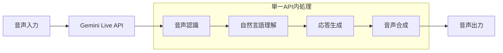

# ADR-002: AI音声対話サービスの選定

## 改訂履歴

| 版数 | 改訂日 | 改訂者 | 改訂内容 |
|------|--------|--------|----------|
| 1.0 | 2025-01-15 | 根岸祐樹 | 初版作成（Gemini Live API採用決定、入力タイプ別モデル使い分け追加） |

## 目次

1. [ステータス](#ステータス)
2. [決定日](#決定日)
3. [決定者](#決定者)
4. [背景・コンテキスト](#背景コンテキスト)
5. [決定内容](#決定内容)
6. [理由・根拠](#理由根拠)
7. [技術仕様](#技術仕様)
8. [結果・影響](#結果影響)
9. [追加決定事項（2025年1月更新）](#追加決定事項2025年1月更新)
10. [代替実装](#代替実装)
11. [関連決定](#関連決定)
12. [参考資料](#参考資料)

## ステータス
採用

## 決定日
2025年1月15日

## 決定者
根岸祐樹

## 背景・コンテキスト

東京都AI音声対話機能において、音声認識・自然言語処理・音声合成を提供するAIサービスの選定が必要。

### 要求事項
- **多言語対応**: 日本語・英語（MVP）、将来的に中国語・韓国語
- **リアルタイム処理**: 低レイテンシでの音声処理
- **高精度**: 自然言語理解と適切な応答生成
- **コスト効率**: MVP段階での予算制約
- **セキュリティ**: 公的機関としてのデータ保護要求
- **API統合容易性**: 開発効率性

### 検討候補
1. **Google Gemini Live API**
2. **OpenAI Whisper + GPT-4 + TTS**
3. **Azure Cognitive Services**
4. **Amazon Transcribe + Bedrock + Polly**

## 決定内容

**Google Gemini Live API** を採用する。

## 理由・根拠

### Gemini Live APIを選択した理由

#### 1. 統合性・一貫性
- **オールインワン**: 音声認識・理解・生成・合成を単一API提供
- **リアルタイム処理**: ストリーミング対応でレスポンス最適化
- **一貫した品質**: Google統一基準での音声・言語処理品質

#### 2. 技術的優位性
- **マルチモーダル**: 音声・テキスト・画像の統合処理
- **コンテキスト保持**: 長時間対話の文脈理解
- **日本語対応**: Googleの日本語処理技術の蓄積活用

#### 3. インフラ・運用面
- **Google Cloud統合**: GCPとのネイティブ統合
- **スケーラビリティ**: Googleインフラによる安定性
- **コスト効率**: 統合サービスによるコスト最適化

#### 4. セキュリティ・コンプライアンス
- **データプライバシー**: Google Cloud規準のセキュリティ
- **地域データ保存**: 日本リージョンでのデータ処理
- **監査ログ**: 詳細なAPI利用ログ

### 他候補との比較

| 項目 | Gemini Live | OpenAI | Azure | AWS |
|------|-------------|--------|-------|-----|
| 統合度 | ◎ | △ | ○ | △ |
| 日本語品質 | ◎ | ○ | ○ | ○ |
| レスポンス速度 | ◎ | ○ | ○ | ○ |
| コスト | ○ | △ | ○ | ○ |
| GCP統合 | ◎ | △ | △ | △ |
| 音声品質 | ◎ | ○ | ◎ | ○ |
| API安定性 | ○ | ○ | ◎ | ◎ |

## 技術仕様

### API構成
- **Gemini Live API**: 音声対話の統合エンドポイント
- **補完API**: Text-to-Speechサービス（必要に応じて）

### 実装パターン
```typescript
import { GeminiLiveClient } from '@google/gemini-live';

const client = new GeminiLiveClient({
  apiKey: process.env.GEMINI_API_KEY,
  region: 'asia-northeast1'
});

// リアルタイム音声対話
const conversation = await client.startConversation({
  language: 'ja-JP',
  responseFormat: 'audio',
  systemPrompt: '東京都の子育て支援情報に特化したアシスタント'
});
```

### 音声処理フロー


### 設定パラメータ
```yaml
gemini_config:
  model: "gemini-live-preview"
  language_code: "ja-JP"
  audio_encoding: "LINEAR16"
  sample_rate_hertz: 16000
  voice_selection:
    language_code: "ja-JP"
    name: "ja-JP-Standard-A"
    ssml_gender: "FEMALE"
```

## 結果・影響

### 期待される効果
1. **開発効率向上**: 統合APIによる実装簡素化
2. **応答品質向上**: Googleの高品質AI技術活用
3. **運用コスト削減**: 単一サービスによる管理効率化
4. **将来拡張性**: マルチモーダル機能の段階的追加

### 制約・リスク
1. **ベンダーロックイン**: Google依存度の高さ
2. **API制限**: 利用量・機能制限
3. **新サービスリスク**: プレビュー段階のAPI安定性

### リスク対応策
1. **フォールバック実装**: OpenAI APIによる代替処理
2. **利用量監視**: APIクォータ管理とアラート設定
3. **段階的導入**: プレビュー→GA移行計画

## 追加決定事項（2025年1月更新）

### 入力タイプ別モデル使い分けの理由

#### 1. パフォーマンス最適化
- **テキスト処理**: `gemini-2.5-flash`は高速なテキスト処理に最適化
- **音声処理**: ネイティブオーディオ対応モデルで音声品質向上

#### 2. コスト効率化
- テキスト入力時は軽量モデルを使用してコスト削減
- 音声入力時のみ高機能モデルを使用

#### 3. 出力制御の明確化
- テキスト入力: `shouldPlayAudio: false`
- 音声入力: `shouldPlayAudio: true`

### フォールバック構成
```typescript
export class GeminiService {
  async generateText(prompt: string, context?: string, language: SupportedLanguage = 'ja', useAudioModel: boolean = false): Promise<string> {
    const model = useAudioModel ? this.audioModel : this.textModel;
    
    try {
      const result = await model.generateContent(fullPrompt);
      return result.response.text();
    } catch (error) {
      // オーディオモデルエラー時はテキストモデルにフォールバック
      if (useAudioModel) {
        console.warn('Audio model error, falling back to text model');
        const fallbackResult = await this.textModel.generateContent(fullPrompt);
        return fallbackResult.response.text();
      }
      throw error;
    }
  }
}
```

## 代替実装

### 従来のフォールバック構成（参考）
```typescript
// 将来的な外部サービス連携時の構成例
class VoiceService {
  private primary = new GeminiService();
  private fallback = new OpenAIClient();
  
  async processVoice(audio: Buffer): Promise<Response> {
    try {
      return await this.primary.processAudio(audio);
    } catch (error) {
      console.warn('Gemini API error, falling back to OpenAI');
      return await this.fallback.process(audio);
    }
  }
}
```

### モニタリング指標
- **API応答時間**: 平均・95パーセンタイル
- **音声認識精度**: WER（Word Error Rate）
- **ユーザー満足度**: 対話評価スコア
- **コスト効率**: リクエスト単価・月次コスト

## 関連決定
- [ADR-003: データベース・ストレージ選定](./003-database-storage.md)
- [ADR-004: 音声処理ライブラリ選定](./004-audio-processing.md)
- [ADR-005: セキュリティフレームワーク選定](./005-security-framework.md)

## 参考資料
- [Gemini Live API Documentation](https://developers.google.com/gemini/docs/live)
- [Google Cloud Speech-to-Text](https://cloud.google.com/speech-to-text)
- [Google Cloud Text-to-Speech](https://cloud.google.com/text-to-speech)
- [Gemini API Pricing](https://ai.google.dev/pricing)