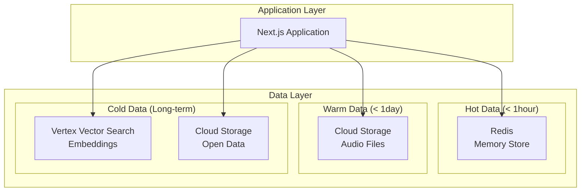

# ADR-003: データベース・ストレージ選定

## 改訂履歴

| 版数 | 改訂日 | 改訂者 | 改訂内容 |
|------|--------|--------|----------|
| 1.0 | 2025-01-15 | 根岸祐樹 | 初版作成（マルチストレージアーキテクチャ採用決定） |

## 目次

1. [ステータス](#ステータス)
2. [決定日](#決定日)
3. [決定者](#決定者)
4. [背景・コンテキスト](#背景コンテキスト)
5. [決定内容](#決定内容)
6. [理由・根拠](#理由根拠)
7. [技術仕様](#技術仕様)
8. [運用・監視](#運用監視)
9. [結果・影響](#結果影響)
10. [関連決定](#関連決定)
11. [参考資料](#参考資料)

## ステータス
採用

## 決定日
2025年1月15日

## 決定者
根岸祐樹

## 背景・コンテキスト

AI音声対話システムにおけるデータ管理基盤の選定が必要。セッション管理、キャッシュ、オープンデータ保存、音声ファイル保存等の要件を満たす必要がある。

### 要求事項
- **高速セッション管理**: リアルタイム対話でのセッション状態保持
- **キャッシュ機能**: AI応答・検索結果の効率的キャッシュ
- **大容量ファイル保存**: 音声ファイル・オープンデータの保存
- **ベクトル検索**: セマンティック検索によるオープンデータ検索
- **スケーラビリティ**: 利用者増加への対応
- **コスト効率**: MVP段階での予算制約
- **データ保護**: 公的機関としてのセキュリティ要求

### データ種別
1. **セッションデータ**: 対話履歴、ユーザー設定（短期間・頻繁アクセス）
2. **キャッシュデータ**: AI応答、検索結果（中期間・高速アクセス）
3. **オープンデータ**: 子育て支援情報（長期間・定期更新）
4. **音声ファイル**: 録音・合成音声（短期間・大容量）
5. **ベクトルデータ**: 埋め込みベクトル（長期間・検索用）

## 決定内容

**マルチストレージアーキテクチャ** を採用する：
- **Redis**: セッション・キャッシュデータ
- **Cloud Storage**: 音声ファイル・オープンデータ
- **Vertex Vector Search**: ベクトル検索

## 理由・根拠

### マルチストレージ構成の選択理由

#### 1. データ特性別最適化
各データ種別に最適化されたストレージを使用することで、パフォーマンスとコストを両立。

#### 2. Redis（セッション・キャッシュ）
**選択理由**:
- **超高速アクセス**: インメモリでのミリ秒レスポンス
- **セッション管理特化**: TTL、データ構造の豊富さ
- **開発効率**: Redisクライアントの豊富さ
- **運用実績**: 大規模サービスでの実証済み

**代替案との比較**:
| 項目 | Redis | MongoDB | PostgreSQL | DynamoDB |
|------|-------|---------|------------|----------|
| 速度 | ◎ | ○ | △ | ○ |
| セッション管理 | ◎ | ○ | △ | ○ |
| TTL機能 | ◎ | ○ | △ | ◎ |
| 運用容易性 | ◎ | ○ | ○ | ◎ |
| コスト | ○ | ○ | ◎ | △ |

#### 3. Cloud Storage（ファイル保存）
**選択理由**:
- **大容量対応**: ペタバイト級のスケーラビリティ
- **高可用性**: 99.999999999%の耐久性
- **CDN統合**: Cloud CDNとの連携による高速配信
- **ライフサイクル管理**: 自動削除・アーカイブ機能

#### 4. Vertex Vector Search（ベクトル検索）
**選択理由**:
- **高精度検索**: コサイン類似度による意味的検索
- **スケーラビリティ**: 数百万ベクトルの高速検索
- **フィルタリング**: カテゴリ・属性によるフィルタ検索
- **GCP統合**: 他のGCPサービスとのネイティブ連携

### 統合リレーショナルDBを選択しなかった理由
1. **パフォーマンス制約**: セッション管理でのレスポンス速度要求
2. **ベクトル検索制限**: PostgreSQLのpgvectorでは大規模検索に限界
3. **ファイル管理複雑性**: バイナリデータのDB保存は非効率
4. **スケーラビリティ**: 単一DBでの多様なワークロード制約

## 技術仕様

### アーキテクチャ構成



### Redis データ設計

#### セッション管理
```typescript
// セッションキー: session:{sessionId}
interface SessionData {
  id: string;
  userId?: string;
  language: 'ja' | 'en';
  messages: SessionMessage[];
  context: SessionContext;
  createdAt: string;
  lastAccessedAt: string;
}

// TTL: 1時間
await redis.setex(
  `session:${sessionId}`,
  3600,
  JSON.stringify(sessionData)
);
```

#### キャッシュ管理
```typescript
// 応答キャッシュキー: cache:response:{hash}
interface ResponseCache {
  query: string;
  response: string;
  sources: string[];
  confidence: number;
  createdAt: string;
}

// TTL: 5分
await redis.setex(
  `cache:response:${queryHash}`,
  300,
  JSON.stringify(responseCache)
);

// 検索キャッシュキー: cache:search:{hash}
// TTL: 30分
await redis.setex(
  `cache:search:${searchHash}`,
  1800,
  JSON.stringify(searchResults)
);
```

### Cloud Storage 設計

#### ディレクトリ構造
```
gs://tokyo-ai-chat-mvp/
├── opendata/
│   ├── raw/                    # 生データ
│   ├── processed/              # 処理済みデータ
│   └── archive/                # アーカイブ
├── audio/
│   ├── temp/                   # 一時音声ファイル
│   │   └── {sessionId}/        # セッション別
│   └── cache/                  # 音声キャッシュ
├── embeddings/                 # ベクトルデータ
└── logs/                       # ログファイル
```

#### ライフサイクル管理
```yaml
# Object Lifecycle Management
lifecycle:
  rule:
    - action:
        type: Delete
      condition:
        age: 1  # 1日後削除
        matchesPrefix: "audio/temp/"
    
    - action:
        type: Delete
      condition:
        age: 7  # 7日後削除
        matchesPrefix: "audio/cache/"
    
    - action:
        type: SetStorageClass
        storageClass: NEARLINE
      condition:
        age: 30  # 30日後にNearlineに移行
        matchesPrefix: "opendata/raw/"
```

### Vertex Vector Search 設計

#### インデックス設定
```yaml
index_config:
  display_name: "tokyo-childcare-mvp"
  metadata:
    config:
      dimensions: 768  # textembedding-gecko@003
      distance_measure_type: "COSINE_DISTANCE"
      algorithm_config:
        tree_ah_config:
          leaf_node_embedding_count: 1000
          leaf_nodes_to_search_percent: 10
```

#### データポイント構造
```typescript
interface VectorDataPoint {
  datapoint_id: string;
  feature_vector: number[];  // 768次元
  restricts: Array<{
    namespace: string;
    allow_list: string[];
  }>;
  crowding_tag: string;
}

// 例: 子育て情報
{
  datapoint_id: "childcare_001",
  feature_vector: [0.1, 0.2, ...],  // 768次元
  restricts: [
    {
      namespace: "category",
      allow_list: ["経済的支援", "保育サービス"]
    },
    {
      namespace: "language", 
      allow_list: ["ja"]
    }
  ],
  crowding_tag: "childcare"
}
```

## 運用・監視

### パフォーマンス監視
```typescript
// Redis監視指標
const redisMetrics = {
  responseTime: 'avg < 5ms',
  memoryUsage: 'target < 80%',
  connectionCount: 'monitor active connections',
  hitRate: 'cache hit rate > 90%'
};

// Cloud Storage監視指標
const storageMetrics = {
  requestLatency: 'avg < 100ms',
  availability: 'target > 99.9%',
  costOptimization: 'storage class distribution',
  dataTransfer: 'monthly bandwidth usage'
};

// Vector Search監視指標
const vectorMetrics = {
  searchLatency: 'avg < 200ms',
  accuracy: 'relevance score > 0.8',
  indexHealth: 'index status monitoring',
  queryCost: 'cost per query tracking'
};
```

### バックアップ戦略
```typescript
// Redis: スナップショット + AOF
const redisBackup = {
  snapshot: 'every 15 minutes',
  aof: 'every second',
  retention: '7 days'
};

// Cloud Storage: 自動バージョニング
const storageBackup = {
  versioning: 'enabled',
  retention: '30 days',
  crossRegion: 'asia-northeast2'
};

// Vector Search: データ再構築可能
const vectorBackup = {
  sourceData: 'Cloud Storage保存',
  reconstruction: '自動再インデックス機能',
  metadata: 'definition backup'
};
```

## 結果・影響

### 期待される効果
1. **高パフォーマンス**: データ特性に最適化された高速アクセス
2. **スケーラビリティ**: 各ストレージの独立スケーリング
3. **コスト効率**: データ利用パターンに応じた最適コスト
4. **運用効率**: 管理されたサービスによる運用負荷軽減

### 制約・リスク
1. **複雑性**: 複数ストレージの管理複雑性
2. **データ整合性**: 分散データの整合性管理
3. **ベンダーロックイン**: GCP依存度

### 対応策
1. **抽象化レイヤー**: データアクセス層の統一API
2. **整合性チェック**: 定期的な整合性検証
3. **移行計画**: 他クラウドへの移行可能性保持

## 関連決定
- [ADR-001: フロントエンドフレームワーク選定](./001-frontend-framework.md)
- [ADR-002: AI音声対話サービス選定](./002-ai-service.md)
- [ADR-004: 検索・レコメンデーション機能](./004-search-recommendation.md)

## 参考資料
- [Redis Documentation](https://redis.io/documentation)
- [Google Cloud Storage](https://cloud.google.com/storage/docs)
- [Vertex Vector Search](https://cloud.google.com/vertex-ai/docs/vector-search)
- [Cloud Memorystore for Redis](https://cloud.google.com/memorystore/docs/redis)