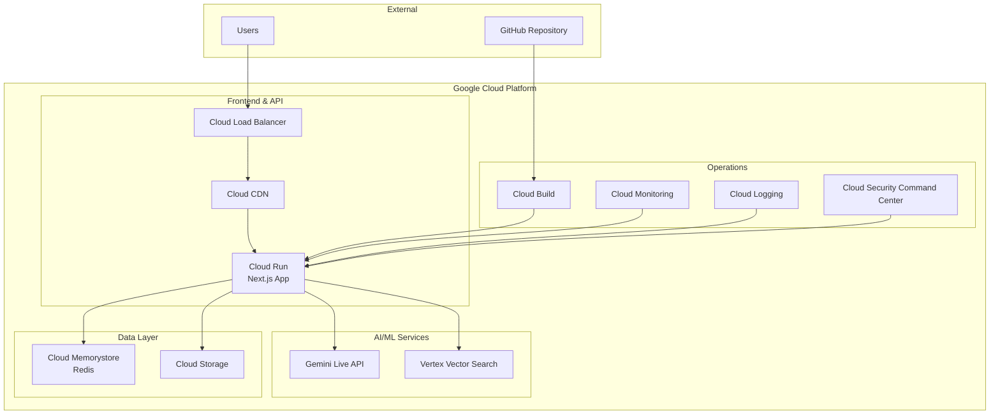

# ADR-004: デプロイ・インフラストラクチャ選定

## 改訂履歴

| 版数 | 改訂日 | 改訂者 | 改訂内容 |
|------|--------|--------|----------|
| 1.0 | 2025-01-15 | 根岸祐樹 | 初版作成（Google Cloud Platform & Cloud Run採用決定） |

## 目次

1. [ステータス](#ステータス)
2. [決定日](#決定日)
3. [決定者](#決定者)
4. [背景・コンテキスト](#背景コンテキスト)
5. [決定内容](#決定内容)
6. [理由・根拠](#理由根拠)
7. [アーキテクチャ構成](#アーキテクチャ構成)
8. [監視・ログ設定](#監視ログ設定)
9. [セキュリティ設定](#セキュリティ設定)
10. [災害復旧・バックアップ](#災害復旧バックアップ)
11. [コスト最適化](#コスト最適化)
12. [結果・影響](#結果影響)
13. [関連決定](#関連決定)
14. [参考資料](#参考資料)

## ステータス
採用

## 決定日
2025年1月15日

## 決定者
根岸祐樹

## 背景・コンテキスト

東京都AI音声対話システムの本番環境におけるデプロイ・インフラストラクチャの選定が必要。公的機関のシステムとして、セキュリティ、可用性、拡張性、運用効率性を考慮する必要がある。

### 要求事項
- **高可用性**: 99.9%以上のアップタイム
- **セキュリティ**: 公的機関基準のセキュリティ要求
- **スケーラビリティ**: 利用者増加への自動対応
- **コスト効率**: 段階的コスト増加
- **運用効率**: 管理負荷の最小化
- **CI/CD**: 自動デプロイメント
- **モニタリング**: 包括的な監視・アラート
- **災害復旧**: 迅速な復旧機能

### 検討候補
1. **Google Cloud Platform (Cloud Run)**
2. **Amazon Web Services (ECS/Fargate)**
3. **Microsoft Azure (Container Apps)**
4. **Vercel + Serverless**

## 決定内容

**Google Cloud Platform** を中心としたインフラストラクチャを採用する：
- **Core**: Cloud Run (コンテナベース)
- **Database**: Cloud Memorystore (Redis)
- **Storage**: Cloud Storage
- **Search**: Vertex Vector Search
- **CI/CD**: Cloud Build + GitHub Actions
- **Monitoring**: Cloud Monitoring + Cloud Logging

## 理由・根拠

### Google Cloud Platform選択の理由

#### 1. AI/ML統合優位性
- **Gemini API**: ネイティブ統合によるレイテンシ最小化
- **Vertex AI**: Vector SearchとGeminiの統合最適化
- **リージョン統一**: asia-northeast1での一貫したデータ処理

#### 2. Cloud Run アーキテクチャ
**技術的優位性**:
- **サーバーレス**: インフラ管理不要
- **コンテナベース**: Next.jsアプリケーションの直接デプロイ
- **自動スケーリング**: 0→1000インスタンスの自動調整
- **コールドスタート最適化**: 最小限の起動時間

**運用優位性**:
- **完全管理**: サーバー運用・保守不要
- **コスト効率**: 実使用時間のみ課金
- **セキュリティ**: Googleインフラ基準のセキュリティ

#### 3. 他候補との比較

| 項目 | GCP Cloud Run | AWS Fargate | Azure Container Apps | Vercel |
|------|---------------|-------------|---------------------|--------|
| AI統合 | ◎ | ○ | ○ | △ |
| 自動スケーリング | ◎ | ○ | ○ | ◎ |
| コールドスタート | ◎ | ○ | ○ | ◎ |
| 運用管理 | ◎ | ○ | ○ | ◎ |
| セキュリティ | ◎ | ◎ | ◎ | ○ |
| コスト | ◎ | ○ | ○ | △ |
| 日本リージョン | ◎ | ◎ | ○ | △ |

## アーキテクチャ構成

### 全体アーキテクチャ



### Cloud Run設定

#### Service Configuration
```yaml
apiVersion: serving.knative.dev/v1
kind: Service
metadata:
  name: tokyo-ai-chat
  namespace: production
  labels:
    app: tokyo-ai-chat
    env: production
spec:
  template:
    metadata:
      annotations:
        # スケーリング設定
        autoscaling.knative.dev/minScale: "1"
        autoscaling.knative.dev/maxScale: "100"
        autoscaling.knative.dev/target: "70"
        
        # リソース設定
        run.googleapis.com/memory: "2Gi"
        run.googleapis.com/cpu: "2"
        
        # ネットワーク設定
        run.googleapis.com/vpc-access-connector: "vpc-connector"
        run.googleapis.com/vpc-access-egress: "private-ranges-only"
    spec:
      containers:
      - image: gcr.io/tokyo-metro-ai/tokyo-ai-chat:latest
        env:
        - name: NODE_ENV
          value: "production"
        - name: REDIS_URL
          valueFrom:
            secretKeyRef:
              name: redis-connection
              key: url
        - name: GEMINI_API_KEY
          valueFrom:
            secretKeyRef:
              name: gemini-api
              key: api-key
        ports:
        - containerPort: 3000
        resources:
          limits:
            memory: "2Gi"
            cpu: "2000m"
        readinessProbe:
          httpGet:
            path: /api/health
            port: 3000
          initialDelaySeconds: 5
          periodSeconds: 5
        livenessProbe:
          httpGet:
            path: /api/health
            port: 3000
          initialDelaySeconds: 10
          periodSeconds: 10
```

### CI/CD パイプライン

#### GitHub Actions Workflow
```yaml
name: Deploy to Cloud Run

on:
  push:
    branches: [main]
  pull_request:
    branches: [main]

jobs:
  test:
    runs-on: ubuntu-latest
    steps:
      - uses: actions/checkout@v4
      - uses: actions/setup-node@v4
        with:
          node-version: '18'
          cache: 'npm'
      
      - run: npm ci
      - run: npm run lint
      - run: npm run type-check
      - run: npm run test
      - run: npm run build

  deploy:
    if: github.ref == 'refs/heads/main'
    needs: test
    runs-on: ubuntu-latest
    
    steps:
      - uses: actions/checkout@v4
      
      - id: auth
        uses: google-github-actions/auth@v1
        with:
          credentials_json: ${{ secrets.GCP_SA_KEY }}
      
      - uses: google-github-actions/setup-gcloud@v1
      
      - run: |
          # Docker イメージビルド
          gcloud builds submit --tag gcr.io/${{ secrets.GCP_PROJECT_ID }}/tokyo-ai-chat:${{ github.sha }}
          
          # Cloud Run デプロイ
          gcloud run deploy tokyo-ai-chat \
            --image gcr.io/${{ secrets.GCP_PROJECT_ID }}/tokyo-ai-chat:${{ github.sha }} \
            --platform managed \
            --region asia-northeast1 \
            --allow-unauthenticated \
            --memory 2Gi \
            --cpu 2 \
            --min-instances 1 \
            --max-instances 100
```

#### Cloud Build Configuration
```yaml
# cloudbuild.yaml
steps:
  # テスト実行
  - name: 'node:18'
    entrypoint: 'npm'
    args: ['ci']
  
  - name: 'node:18'
    entrypoint: 'npm'
    args: ['run', 'test']
  
  # Dockerイメージビルド
  - name: 'gcr.io/cloud-builders/docker'
    args: [
      'build',
      '-t', 'gcr.io/$PROJECT_ID/tokyo-ai-chat:$COMMIT_SHA',
      '-t', 'gcr.io/$PROJECT_ID/tokyo-ai-chat:latest',
      '.'
    ]
  
  # イメージプッシュ
  - name: 'gcr.io/cloud-builders/docker'
    args: ['push', '--all-tags', 'gcr.io/$PROJECT_ID/tokyo-ai-chat']
  
  # Cloud Run デプロイ
  - name: 'gcr.io/google.com/cloudsdktool/cloud-sdk'
    entrypoint: 'gcloud'
    args: [
      'run', 'deploy', 'tokyo-ai-chat',
      '--image', 'gcr.io/$PROJECT_ID/tokyo-ai-chat:$COMMIT_SHA',
      '--region', 'asia-northeast1',
      '--platform', 'managed'
    ]

options:
  machineType: 'E2_HIGHCPU_8'
```

### Dockerfile最適化

```dockerfile
# マルチステージビルド
FROM node:18-alpine AS builder

WORKDIR /app
COPY package*.json ./
RUN npm ci --only=production

COPY . .
RUN npm run build

# 本番用イメージ
FROM node:18-alpine AS runner

WORKDIR /app

# セキュリティ: non-rootユーザー
RUN addgroup --system --gid 1001 nodejs
RUN adduser --system --uid 1001 nextjs

# 必要なファイルのみコピー
COPY --from=builder /app/public ./public
COPY --from=builder /app/.next/standalone ./
COPY --from=builder /app/.next/static ./.next/static

USER nextjs

EXPOSE 3000

ENV PORT 3000
ENV HOSTNAME "0.0.0.0"

CMD ["node", "server.js"]
```

## 監視・ログ設定

### Cloud Monitoring設定

```typescript
// カスタムメトリクス
const customMetrics = {
  // API レスポンス時間
  'custom.googleapis.com/api/response_time': {
    labels: ['endpoint', 'method', 'status'],
    metricKind: 'GAUGE',
    valueType: 'DOUBLE'
  },
  
  // 音声処理時間
  'custom.googleapis.com/voice/processing_time': {
    labels: ['operation', 'language'],
    metricKind: 'GAUGE', 
    valueType: 'DOUBLE'
  },
  
  // セッション数
  'custom.googleapis.com/session/active_count': {
    metricKind: 'GAUGE',
    valueType: 'INT64'
  }
};

// アラートポリシー
const alertPolicies = [
  {
    displayName: 'High Error Rate',
    conditions: [{
      filter: 'resource.type="cloud_run_revision"',
      comparison: 'COMPARISON_GREATER_THAN',
      thresholdValue: 0.05  // 5%エラー率
    }]
  },
  
  {
    displayName: 'High Response Time',
    conditions: [{
      filter: 'custom.googleapis.com/api/response_time',
      comparison: 'COMPARISON_GREATER_THAN',
      thresholdValue: 3000  // 3秒
    }]
  }
];
```

### 構造化ログ設定

```typescript
// Winston設定
import winston from 'winston';
import { LoggingWinston } from '@google-cloud/logging-winston';

const loggingWinston = new LoggingWinston({
  projectId: process.env.GCP_PROJECT_ID,
  keyFilename: process.env.GCP_KEY_FILE,
  logName: 'tokyo-ai-chat',
  resource: {
    type: 'cloud_run_revision',
    labels: {
      service_name: 'tokyo-ai-chat',
      revision_name: process.env.K_REVISION
    }
  }
});

const logger = winston.createLogger({
  level: 'info',
  format: winston.format.combine(
    winston.format.timestamp(),
    winston.format.errors({ stack: true }),
    winston.format.json()
  ),
  defaultMeta: {
    service: 'tokyo-ai-chat',
    version: process.env.APP_VERSION
  },
  transports: [
    loggingWinston,
    new winston.transports.Console()
  ]
});

// 使用例
logger.info('Chat request processed', {
  sessionId: 'session-123',
  userId: 'user-456',
  responseTime: 1250,
  aiConfidence: 0.92
});
```

## セキュリティ設定

### IAM & Security
```yaml
# サービスアカウント権限
service_account_permissions:
  cloud-run-service:
    - roles/run.invoker
    - roles/cloudsql.client
    - roles/storage.objectViewer
    - roles/aiplatform.user
  
  github-actions:
    - roles/run.admin
    - roles/storage.admin
    - roles/cloudbuild.builds.builder

# VPC設定
vpc_configuration:
  vpc_connector:
    name: "vpc-connector"
    subnet: "private-subnet"
    ip_cidr_range: "10.0.0.0/28"
  
  egress_settings: "private-ranges-only"

# Secret Manager
secrets:
  - name: "gemini-api-key"
    data: "${GEMINI_API_KEY}"
  - name: "redis-connection"
    data: "${REDIS_CONNECTION_STRING}"
```

## 災害復旧・バックアップ

### Multi-Region設定
```typescript
// プライマリ: asia-northeast1 (東京)
// セカンダリ: asia-northeast2 (大阪)

const disasterRecoveryConfig = {
  primary: {
    region: 'asia-northeast1',
    cloudRun: 'tokyo-ai-chat-primary',
    redis: 'redis-primary',
    storage: 'gs://tokyo-ai-chat-primary'
  },
  
  secondary: {
    region: 'asia-northeast2', 
    cloudRun: 'tokyo-ai-chat-secondary',
    redis: 'redis-secondary',
    storage: 'gs://tokyo-ai-chat-secondary'
  },
  
  switchover: {
    rto: '15 minutes',  // Recovery Time Objective
    rpo: '5 minutes'    // Recovery Point Objective
  }
};
```

## コスト最適化

### 予想コスト構成
```typescript
const costEstimation = {
  // Cloud Run (月額)
  cloudRun: {
    cpu: '$0.0000024 per vCPU-second',
    memory: '$0.0000025 per GiB-second',
    requests: '$0.40 per million requests',
    estimated: '$50-200/month'
  },
  
  // Cloud Memorystore Redis
  redis: {
    basic: '$0.049 per GB-hour',
    estimated: '$35/month'  // 1GB instance
  },
  
  // Cloud Storage
  storage: {
    standard: '$0.020 per GB-month',
    estimated: '$20-50/month'
  },
  
  // 合計予想コスト
  total: '$100-300/month (MVP段階)'
};
```

## 結果・影響

### 期待される効果
1. **運用効率**: サーバーレスによる管理負荷削減
2. **スケーラビリティ**: 自動スケーリングによる柔軟性
3. **コスト効率**: 使用量ベース課金
4. **セキュリティ**: Googleインフラの高度なセキュリティ
5. **可用性**: 99.95%のSLA保証

### 制約・リスク
1. **ベンダーロックイン**: GCP依存
2. **コールドスタート**: 最小インスタンス1で対応
3. **ネットワーク制約**: VPC内通信要求

### 対応策
1. **移植性**: コンテナベースで他クラウドへの移行可能性保持
2. **モニタリング**: 詳細なパフォーマンス監視
3. **フォールバック**: マルチリージョン構成

## 関連決定
- [ADR-001: フロントエンドフレームワーク選定](./001-frontend-framework.md)
- [ADR-002: AI音声対話サービス選定](./002-ai-service.md)
- [ADR-003: データベース・ストレージ選定](./003-database-storage.md)

## 参考資料
- [Cloud Run Documentation](https://cloud.google.com/run/docs)
- [Cloud Build Documentation](https://cloud.google.com/build/docs)
- [Google Cloud Monitoring](https://cloud.google.com/monitoring/docs)
- [Cloud Run Security](https://cloud.google.com/run/docs/securing)