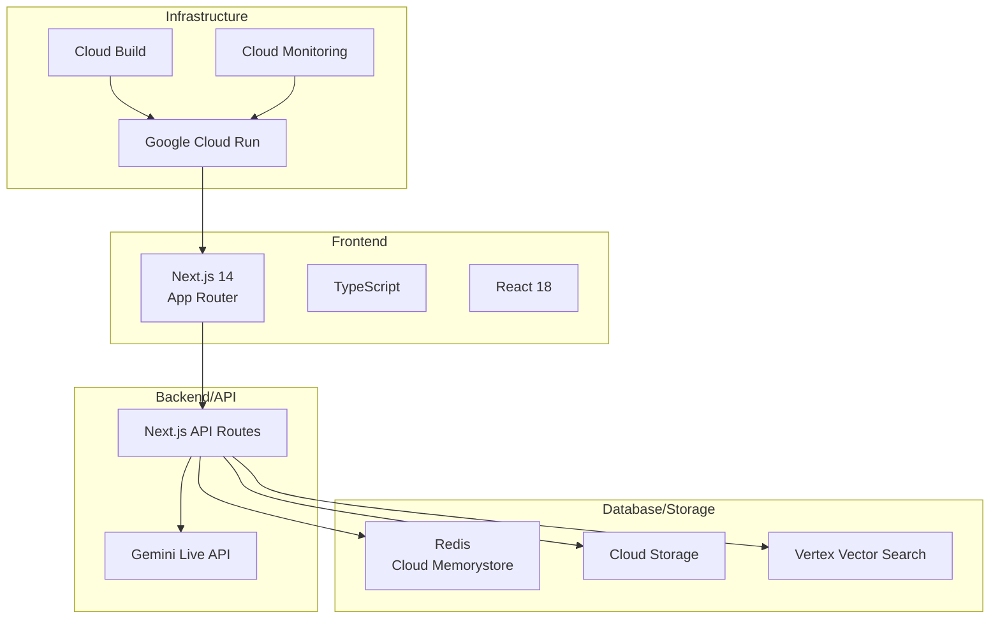

# Architecture Decision Records (ADR)

東京都公式アプリ AI音声対話機能の技術的判断記録

## 改訂履歴

| 版数 | 改訂日 | 改訂者 | 改訂内容 |
|------|--------|--------|----------|
| 1.0 | 2025-01-15 | 根岸祐樹 | 初版作成（ADR管理ガイドライン・技術スタック概要策定） |

## 目次

1. [ADR一覧](#adr一覧)
2. [ADRテンプレート](#adrテンプレート)
3. [ADRガイドライン](#adrガイドライン)
4. [ステータス定義](#ステータス定義)
5. [ADR管理](#adr管理)
6. [技術スタック概要](#技術スタック概要)
7. [主要な設計原則](#主要な設計原則)
8. [今後の検討事項](#今後の検討事項)

## ADR一覧

| ADR# | タイトル | ステータス | 決定日 |
|------|----------|-----------|---------|
| [001](./001-frontend-framework.md) | フロントエンドフレームワークの選定 | 採用 | 2025-01-15 |
| [002](./002-ai-service.md) | AI音声対話サービスの選定 | 採用 | 2025-01-15 |
| [003](./003-database-storage.md) | データベース・ストレージ選定 | 採用 | 2025-01-15 |
| [004](./004-deployment-infrastructure.md) | デプロイ・インフラストラクチャ選定 | 採用 | 2025-01-15 |

## ADRテンプレート

新しいADRを作成する際は、以下のテンプレートを使用してください：

```markdown
# ADR-XXX: [決定事項のタイトル]

## ステータス
[提案中/採用/廃止/置換]

## 決定日
YYYY-MM-DD

## 決定者
[決定者名]

## 背景・コンテキスト
[決定が必要となった背景や状況]

## 決定内容
[何を決定したか]

## 理由・根拠
[なぜその決定をしたかの理由]

## 結果・影響
[決定による影響や結果]

## 関連決定
[関連するADRへのリンク]

## 参考資料
[参考にした資料やドキュメント]
```

## ADRガイドライン

### 作成タイミング
- 重要な技術選択を行う時
- アーキテクチャに影響する決定をする時
- 複数の選択肢から一つを選ぶ時
- 将来振り返る可能性がある決定をする時

### 記録すべき決定
- フレームワーク・ライブラリの選択
- データベース・ストレージの選択
- インフラ・デプロイメント戦略
- セキュリティアプローチ
- API設計方針
- データ構造・形式

### 記録しない決定
- 一時的な実装詳細
- 明らかな技術選択
- 個人的な好み
- プロジェクト固有でない一般的な決定

## ステータス定義

- **提案中**: まだ決定されていない段階
- **採用**: 正式に採用された決定
- **廃止**: 後に撤回された決定
- **置換**: 他のADRによって置き換えられた決定

## ADR管理

### ファイル命名規則
- `XXX-short-title.md` (XXXは3桁の連番)
- 例: `001-frontend-framework.md`

### 更新ルール
- 既存のADRは基本的に変更しない
- 変更が必要な場合は新しいADRを作成
- 古いADRのステータスを「置換」に変更

### レビュープロセス
1. ADRドラフト作成
2. チーム内レビュー
3. ステークホルダー確認
4. 最終決定・記録

## 技術スタック概要

このプロジェクトで採用された主要技術：



## 主要な設計原則

1. **音声ファースト**: 音声対話を主要インターフェースとする
2. **レスポンシブ**: モバイル・デスクトップ両対応
3. **アクセシビリティ**: WCAG 2.1 AA準拠
4. **多言語対応**: 日本語・英語（MVP）
5. **セキュリティ**: 公的機関基準のセキュリティ
6. **スケーラビリティ**: 段階的な利用者増加への対応
7. **運用効率**: 管理されたサービスの活用

## 今後の検討事項

- PWA対応の詳細設計
- 追加言語（中国語・韓国語）サポート
- オフライン機能の拡張
- パフォーマンス最適化
- ユーザビリティ改善