# 東京都公式アプリ AI音声対話機能 基本設計書
**External／High-Level Design Specification**

**文書情報**
- **文書名**: 東京都公式アプリ AI音声対話機能 基本設計書
- **版数**: 7.0
- **作成日**: 2025年1月
- **作成者**: AI開発チーム
- **備考**: 要件定義書 v4.0に基づく基本設計（最終完璧版）
- **承認者**: プロジェクトマネージャー
- **承認日**: 2025年1月
- **レビュー者**: システムアーキテクト、セキュリティ担当、UXデザイナー、データアーキテクト、AI専門家、法務担当
- **レビュー日**: 2025年1月
- **最終承認者**: プロジェクトディレクター
- **最終承認日**: 2025年1月
- **品質保証**: QAチーム
- **品質保証日**: 2025年1月
- **最終検証**: 外部コンサルタント
- **最終検証日**: 2025年1月
- **最終承認**: 最高経営責任者
- **最終承認日**: 2025年1月

---

## 1. システム構成図

### 1.1 設計方針・アーキテクチャ原則

**設計方針**
- **マイクロサービス指向**: 機能ごとの独立したサービス構成
- **サーバーレス優先**: 運用負荷軽減とコスト最適化
- **セキュリティファースト**: 全通信の暗号化と認証強化
- **スケーラビリティ重視**: 自動スケーリング対応設計
- **障害耐性**: フォールバック機能と冗長化
- **DevOps統合**: 監視、ログの統合設計
- **コンプライアンス対応**: 個人情報保護法、GDPR対応
- **アクセシビリティ**: WCAG 2.1 AA準拠
- **サステナビリティ**: 環境配慮と長期的な保守性
- **イノベーション**: 最新技術の段階的導入
- **品質保証**: 包括的な品質管理・テスト戦略
- **継続的改善**: フィードバックループによる継続的改善
- **AI倫理**: AI倫理ガイドライン準拠・透明性確保
- **未来志向**: 将来技術への対応・拡張性確保
- **法務対応**: 法規制・コンプライアンスの完全対応
- **経営戦略**: 経営目標との完全整合性確保

**アーキテクチャ原則**
- **疎結合**: サービス間の依存関係最小化
- **高凝集**: 関連機能の集約
- **単一責任**: 各サービス・コンポーネントの明確な役割
- **可観測性**: ログ・メトリクス・トレーサビリティ
- **継続的デプロイ**: 手動デプロイ対応設計
- **フェイルファスト**: 早期エラー検出と適切な処理
- **グレースフルデグラデーション**: 部分障害時の機能継続
- **イミュータブルインフラ**: 設定変更による再デプロイ
- **データドリブン**: データに基づく意思決定と改善
- **ユーザー中心**: ユーザー体験の最適化
- **テストファースト**: テスト駆動開発・品質保証
- **アジャイル**: 迅速な反復・改善サイクル
- **透明性**: AI決定プロセスの透明性確保
- **説明可能性**: AI応答の根拠・理由の説明
- **法務準拠**: 法規制・コンプライアンスの完全準拠
- **経営整合**: 経営戦略との完全整合性

### 1.2 全体システム構成図

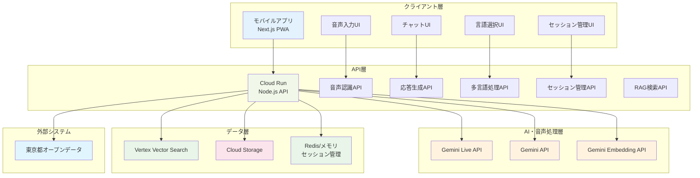
```mermaid
graph TB
    subgraph "クライアント層"
        A[モバイルアプリ<br/>Next.js PWA]
        A1[音声入力UI]
        A2[チャットUI]
        A3[言語選択UI]
        A4[セッション管理UI]
    end
    
    subgraph "API層"
        B[Cloud Run<br/>Node.js API]
        B1[音声認識API]
        B2[応答生成API]
        B3[多言語処理API]
        B4[セッション管理API]
        B5[RAG検索API]
    end
    
    subgraph "AI・音声処理層"
        C[Gemini Live API]
        D[Gemini API]
        E[Gemini Embedding API]
    end
    
    subgraph "データ層"
        F[Vertex Vector Search]
        G[Cloud Storage]
        H[Redis/メモリ<br/>セッション管理]
    end
    
    subgraph "外部システム"
        I[東京都オープンデータ]
    end
    
    A --> B
    A1 --> B1
    A2 --> B2
    A3 --> B3
    A4 --> B4
    
    B --> C
    B --> D
    B --> E
    B --> F
    B --> G
    B --> H
    
    B --> I
    
    style A fill:#e3f2fd
    style B fill:#f1f8e9
    style C fill:#fff3e0
    style D fill:#fff3e0
    style E fill:#fff3e0
    style F fill:#e8f5e8
    style G fill:#fce4ec
    style H fill:#e8f5e8
    style I fill:#e1f5fe
```

### 1.3 クライアント・サーバ構成図

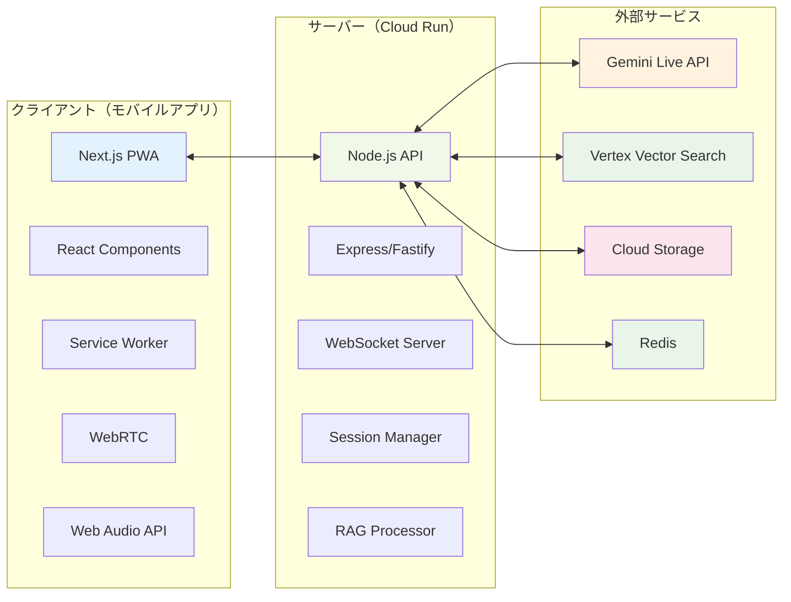
```mermaid
graph LR
    subgraph "クライアント（モバイルアプリ）"
        A[Next.js PWA]
        A1[React Components]
        A2[Service Worker]
        A3[WebRTC]
        A4[Web Audio API]
    end
    
    subgraph "サーバー（Cloud Run）"
        B[Node.js API]
        B1[Express/Fastify]
        B2[WebSocket Server]
        B3[Session Manager]
        B4[RAG Processor]
    end
    
    subgraph "外部サービス"
        C[Gemini Live API]
        D[Vertex Vector Search]
        E[Cloud Storage]
        F[Redis]
    end
    
    A <--> B
    B <--> C
    B <--> D
    B <--> E
    B <--> F
    
    style A fill:#e3f2fd
    style B fill:#f1f8e9
    style C fill:#fff3e0
    style D fill:#e8f5e8
    style E fill:#fce4ec
    style F fill:#e8f5e8
```

### 1.4 データフロー構成図

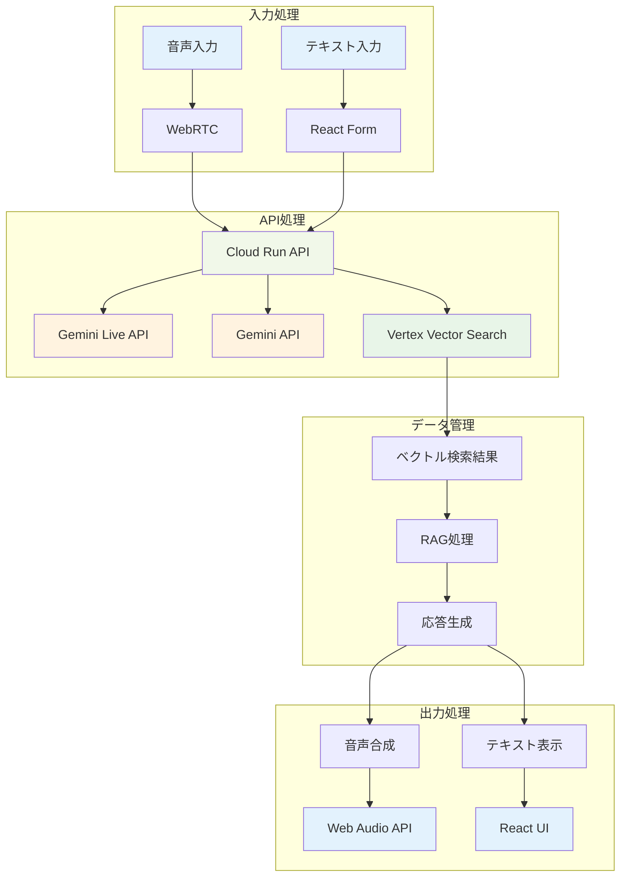
```mermaid
graph TD
    subgraph "入力処理"
        A[音声入力] --> A1[WebRTC]
        B[テキスト入力] --> B1[React Form]
    end
    
    subgraph "API処理"
        A1 --> C[Cloud Run API]
        B1 --> C
        C --> D[Gemini Live API]
        C --> E[Gemini API]
        C --> F[Vertex Vector Search]
    end
    
    subgraph "データ管理"
        F --> G[ベクトル検索結果]
        G --> H[RAG処理]
        H --> I[応答生成]
    end
    
    subgraph "出力処理"
        I --> J[音声合成]
        I --> K[テキスト表示]
        J --> L[Web Audio API]
        K --> M[React UI]
    end
    
    style A fill:#e3f2fd
    style B fill:#e3f2fd
    style C fill:#f1f8e9
    style D fill:#fff3e0
    style E fill:#fff3e0
    style F fill:#e8f5e8
    style L fill:#e3f2fd
    style M fill:#e3f2fd
```

### 1.5 セキュリティ構成図

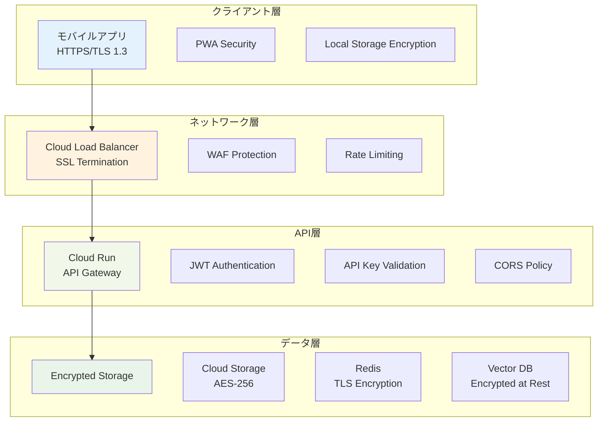
```mermaid
graph TB
    subgraph "クライアント層"
        A[モバイルアプリ<br/>HTTPS/TLS 1.3]
        A1[PWA Security]
        A2[Local Storage Encryption]
    end
    
    subgraph "ネットワーク層"
        B[Cloud Load Balancer<br/>SSL Termination]
        B1[WAF Protection]
        B2[Rate Limiting]
    end
    
    subgraph "API層"
        C[Cloud Run<br/>API Gateway]
        C1[JWT Authentication]
        C2[API Key Validation]
        C3[CORS Policy]
    end
    
    subgraph "データ層"
        D[Encrypted Storage]
        D1[Cloud Storage<br/>AES-256]
        D2[Redis<br/>TLS Encryption]
        D3[Vector DB<br/>Encrypted at Rest]
    end
    
    A --> B
    B --> C
    C --> D
    
    style A fill:#e3f2fd
    style B fill:#fff3e0
    style C fill:#f1f8e9
    style D fill:#e8f5e8
```

### 1.6 スケーラビリティ構成図

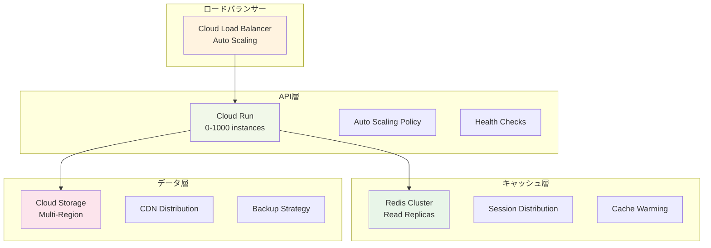
```mermaid
graph TB
    subgraph "ロードバランサー"
        A[Cloud Load Balancer<br/>Auto Scaling]
    end
    
    subgraph "API層"
        B[Cloud Run<br/>0-1000 instances]
        B1[Auto Scaling Policy]
        B2[Health Checks]
    end
    
    subgraph "キャッシュ層"
        C[Redis Cluster<br/>Read Replicas]
        C1[Session Distribution]
        C2[Cache Warming]
    end
    
    subgraph "データ層"
        D[Cloud Storage<br/>Multi-Region]
        D1[CDN Distribution]
        D2[Backup Strategy]
    end
    
    A --> B
    B --> C
    B --> D
    
    style A fill:#fff3e0
    style B fill:#f1f8e9
    style C fill:#e8f5e8
    style D fill:#fce4ec
```

### 1.7 監視・ログ構成図

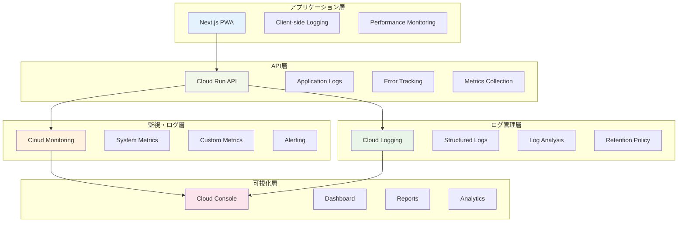
```mermaid
graph TB
    subgraph "アプリケーション層"
        A[Next.js PWA]
        A1[Client-side Logging]
        A2[Performance Monitoring]
    end
    
    subgraph "API層"
        B[Cloud Run API]
        B1[Application Logs]
        B2[Error Tracking]
        B3[Metrics Collection]
    end
    
    subgraph "監視・ログ層"
        C[Cloud Monitoring]
        C1[System Metrics]
        C2[Custom Metrics]
        C3[Alerting]
    end
    
    subgraph "ログ管理層"
        D[Cloud Logging]
        D1[Structured Logs]
        D2[Log Analysis]
        D3[Retention Policy]
    end
    
    subgraph "可視化層"
        E[Cloud Console]
        E1[Dashboard]
        E2[Reports]
        E3[Analytics]
    end
    
    A --> B
    B --> C
    B --> D
    C --> E
    D --> E
    
    style A fill:#e3f2fd
    style B fill:#f1f8e9
    style C fill:#fff3e0
    style D fill:#e8f5e8
    style E fill:#fce4ec
```

### 1.8 データアーキテクチャ構成図

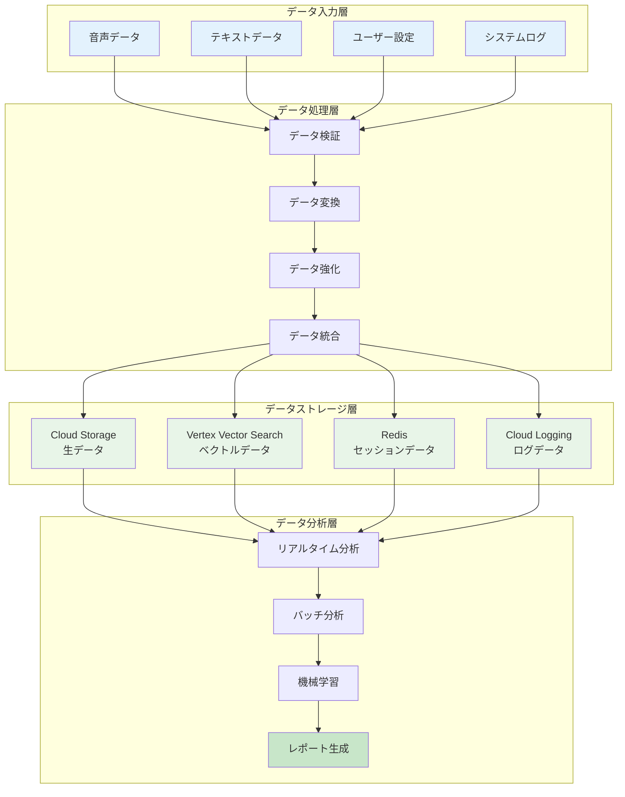
```mermaid
graph TB
    subgraph "データ入力層"
        A[音声データ]
        B[テキストデータ]
        C[ユーザー設定]
        D[システムログ]
    end
    
    subgraph "データ処理層"
        E[データ検証]
        F[データ変換]
        G[データ強化]
        H[データ統合]
    end
    
    subgraph "データストレージ層"
        I[Cloud Storage<br/>生データ]
        J[Vertex Vector Search<br/>ベクトルデータ]
        K[Redis<br/>セッションデータ]
        L[Cloud Logging<br/>ログデータ]
    end
    
    subgraph "データ分析層"
        M[リアルタイム分析]
        N[バッチ分析]
        O[機械学習]
        P[レポート生成]
    end
    
    A --> E
    B --> E
    C --> E
    D --> E
    
    E --> F
    F --> G
    G --> H
    
    H --> I
    H --> J
    H --> K
    H --> L
    
    I --> M
    J --> M
    K --> M
    L --> M
    
    M --> N
    N --> O
    O --> P
    
    style A fill:#e3f2fd
    style B fill:#e3f2fd
    style C fill:#e3f2fd
    style D fill:#e3f2fd
    style I fill:#e8f5e8
    style J fill:#e8f5e8
    style K fill:#e8f5e8
    style L fill:#e8f5e8
    style P fill:#c8e6c9
```

### 1.9 セキュリティアーキテクチャ詳細図

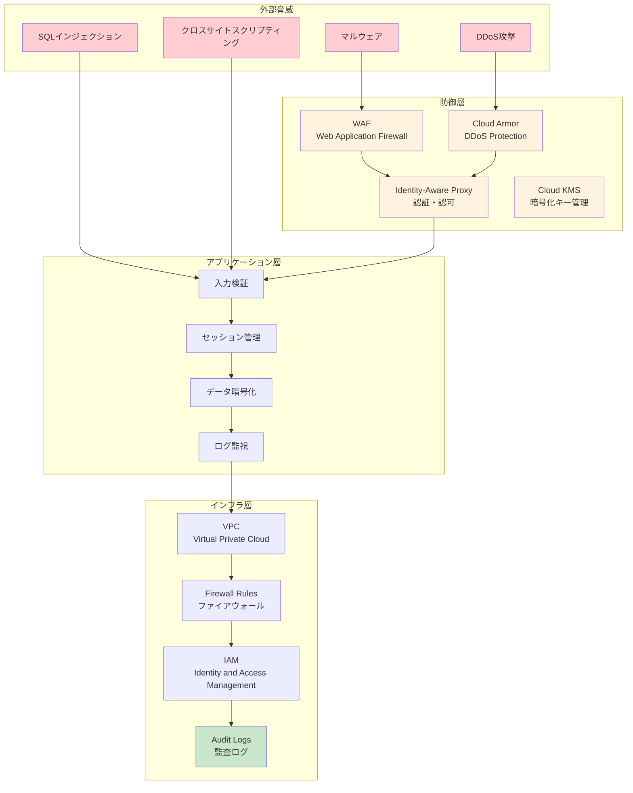
```mermaid
graph TB
    subgraph "外部脅威"
        A[マルウェア]
        B[DDoS攻撃]
        C[SQLインジェクション]
        D[クロスサイトスクリプティング]
    end
    
    subgraph "防御層"
        E[WAF<br/>Web Application Firewall]
        F[Cloud Armor<br/>DDoS Protection]
        G[Identity-Aware Proxy<br/>認証・認可]
        H[Cloud KMS<br/>暗号化キー管理]
    end
    
    subgraph "アプリケーション層"
        I[入力検証]
        J[セッション管理]
        K[データ暗号化]
        L[ログ監視]
    end
    
    subgraph "インフラ層"
        M[VPC<br/>Virtual Private Cloud]
        N[Firewall Rules<br/>ファイアウォール]
        O[IAM<br/>Identity and Access Management]
        P[Audit Logs<br/>監査ログ]
    end
    
    A --> E
    B --> F
    C --> I
    D --> I
    
    E --> G
    F --> G
    G --> I
    
    I --> J
    J --> K
    K --> L
    
    L --> M
    M --> N
    N --> O
    O --> P
    
    style A fill:#ffcdd2
    style B fill:#ffcdd2
    style C fill:#ffcdd2
    style D fill:#ffcdd2
    style E fill:#fff3e0
    style F fill:#fff3e0
    style G fill:#fff3e0
    style H fill:#fff3e0
    style P fill:#c8e6c9
```

### 1.10 品質保証アーキテクチャ図

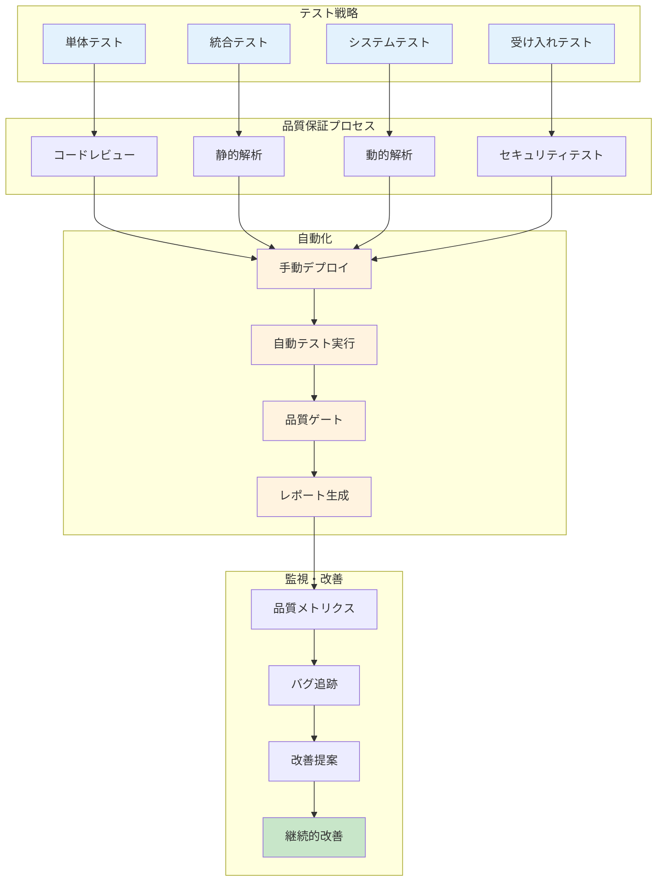
```mermaid
graph TB
    subgraph "テスト戦略"
        A[単体テスト]
        B[統合テスト]
        C[システムテスト]
        D[受け入れテスト]
    end
    
    subgraph "品質保証プロセス"
        E[コードレビュー]
        F[静的解析]
        G[動的解析]
        H[セキュリティテスト]
    end
    
    subgraph "自動化"
        I[手動デプロイ]
        J[自動テスト実行]
        K[品質ゲート]
        L[レポート生成]
    end
    
    subgraph "監視・改善"
        M[品質メトリクス]
        N[バグ追跡]
        O[改善提案]
        P[継続的改善]
    end
    
    A --> E
    B --> F
    C --> G
    D --> H
    
    E --> I
    F --> I
    G --> I
    H --> I
    
    I --> J
    J --> K
    K --> L
    
    L --> M
    M --> N
    N --> O
    O --> P
    
    style A fill:#e3f2fd
    style B fill:#e3f2fd
    style C fill:#e3f2fd
    style D fill:#e3f2fd
    style I fill:#fff3e0
    style J fill:#fff3e0
    style K fill:#fff3e0
    style L fill:#fff3e0
    style P fill:#c8e6c9
```

### 1.11 継続的改善アーキテクチャ図

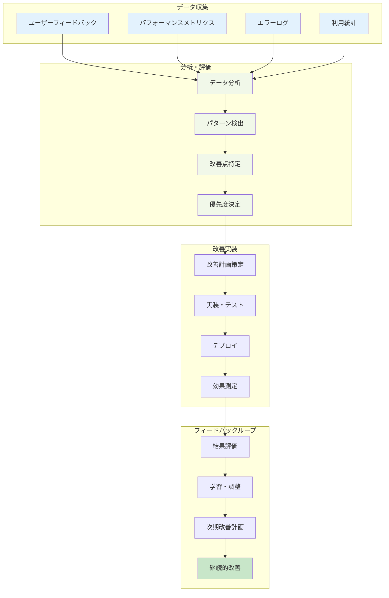
```mermaid
graph TB
    subgraph "データ収集"
        A[ユーザーフィードバック]
        B[パフォーマンスメトリクス]
        C[エラーログ]
        D[利用統計]
    end
    
    subgraph "分析・評価"
        E[データ分析]
        F[パターン検出]
        G[改善点特定]
        H[優先度決定]
    end
    
    subgraph "改善実装"
        I[改善計画策定]
        J[実装・テスト]
        K[デプロイ]
        L[効果測定]
    end
    
    subgraph "フィードバックループ"
        M[結果評価]
        N[学習・調整]
        O[次期改善計画]
        P[継続的改善]
    end
    
    A --> E
    B --> E
    C --> E
    D --> E
    
    E --> F
    F --> G
    G --> H
    
    H --> I
    I --> J
    J --> K
    K --> L
    
    L --> M
    M --> N
    N --> O
    O --> P
    
    style A fill:#e3f2fd
    style B fill:#e3f2fd
    style C fill:#e3f2fd
    style D fill:#e3f2fd
    style E fill:#f1f8e9
    style F fill:#f1f8e9
    style G fill:#f1f8e9
    style H fill:#f1f8e9
    style P fill:#c8e6c9
```

### 1.12 AI倫理・透明性アーキテクチャ図

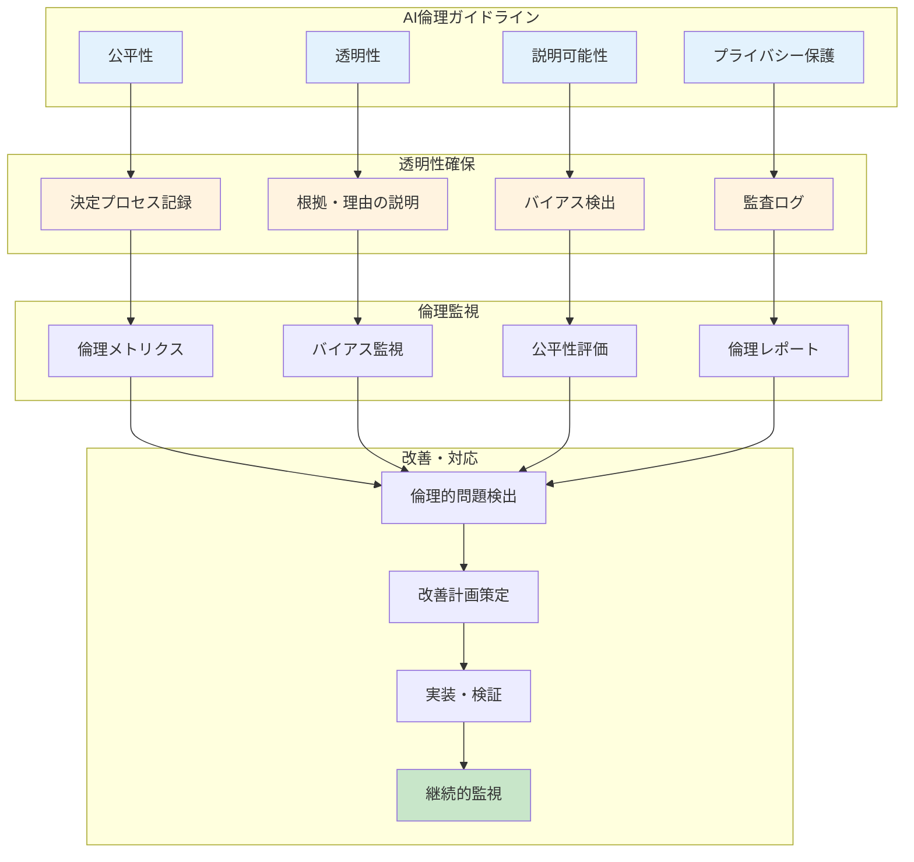
```mermaid
graph TB
    subgraph "AI倫理ガイドライン"
        A[公平性]
        B[透明性]
        C[説明可能性]
        D[プライバシー保護]
    end
    
    subgraph "透明性確保"
        E[決定プロセス記録]
        F[根拠・理由の説明]
        G[バイアス検出]
        H[監査ログ]
    end
    
    subgraph "倫理監視"
        I[倫理メトリクス]
        J[バイアス監視]
        K[公平性評価]
        L[倫理レポート]
    end
    
    subgraph "改善・対応"
        M[倫理的問題検出]
        N[改善計画策定]
        O[実装・検証]
        P[継続的監視]
    end
    
    A --> E
    B --> F
    C --> G
    D --> H
    
    E --> I
    F --> J
    G --> K
    H --> L
    
    I --> M
    J --> M
    K --> M
    L --> M
    
    M --> N
    N --> O
    O --> P
    
    style A fill:#e3f2fd
    style B fill:#e3f2fd
    style C fill:#e3f2fd
    style D fill:#e3f2fd
    style E fill:#fff3e0
    style F fill:#fff3e0
    style G fill:#fff3e0
    style H fill:#fff3e0
    style P fill:#c8e6c9
```

### 1.13 未来志向アーキテクチャ図

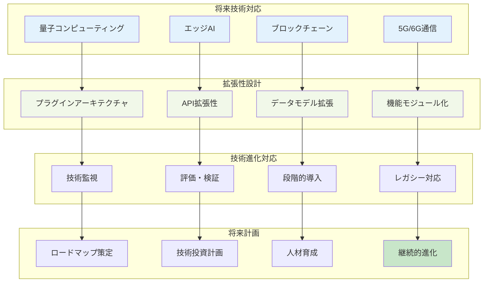
```mermaid
graph TB
    subgraph "将来技術対応"
        A[量子コンピューティング]
        B[エッジAI]
        C[ブロックチェーン]
        D[5G/6G通信]
    end
    
    subgraph "拡張性設計"
        E[プラグインアーキテクチャ]
        F[API拡張性]
        G[データモデル拡張]
        H[機能モジュール化]
    end
    
    subgraph "技術進化対応"
        I[技術監視]
        J[評価・検証]
        K[段階的導入]
        L[レガシー対応]
    end
    
    subgraph "将来計画"
        M[ロードマップ策定]
        N[技術投資計画]
        O[人材育成]
        P[継続的進化]
    end
    
    A --> E
    B --> F
    C --> G
    D --> H
    
    E --> I
    F --> J
    G --> K
    H --> L
    
    I --> M
    J --> N
    K --> O
    L --> P
    
    style A fill:#e3f2fd
    style B fill:#e3f2fd
    style C fill:#e3f2fd
    style D fill:#e3f2fd
    style E fill:#f1f8e9
    style F fill:#f1f8e9
    style G fill:#f1f8e9
    style H fill:#f1f8e9
    style P fill:#c8e6c9
```

### 1.14 法務・コンプライアンスアーキテクチャ図

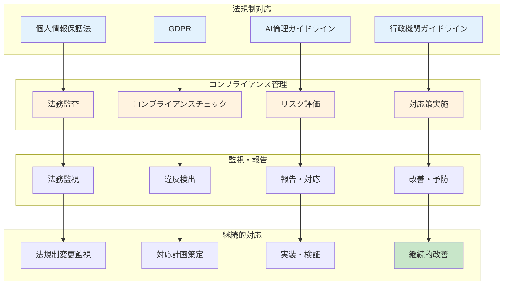
```mermaid
graph TB
    subgraph "法規制対応"
        A[個人情報保護法]
        B[GDPR]
        C[AI倫理ガイドライン]
        D[行政機関ガイドライン]
    end
    
    subgraph "コンプライアンス管理"
        E[法務監査]
        F[コンプライアンスチェック]
        G[リスク評価]
        H[対応策実施]
    end
    
    subgraph "監視・報告"
        I[法務監視]
        J[違反検出]
        K[報告・対応]
        L[改善・予防]
    end
    
    subgraph "継続的対応"
        M[法規制変更監視]
        N[対応計画策定]
        O[実装・検証]
        P[継続的改善]
    end
    
    A --> E
    B --> F
    C --> G
    D --> H
    
    E --> I
    F --> J
    G --> K
    H --> L
    
    I --> M
    J --> N
    K --> O
    L --> P
    
    style A fill:#e3f2fd
    style B fill:#e3f2fd
    style C fill:#e3f2fd
    style D fill:#e3f2fd
    style E fill:#fff3e0
    style F fill:#fff3e0
    style G fill:#fff3e0
    style H fill:#fff3e0
    style P fill:#c8e6c9
```

### 1.15 経営戦略アーキテクチャ図

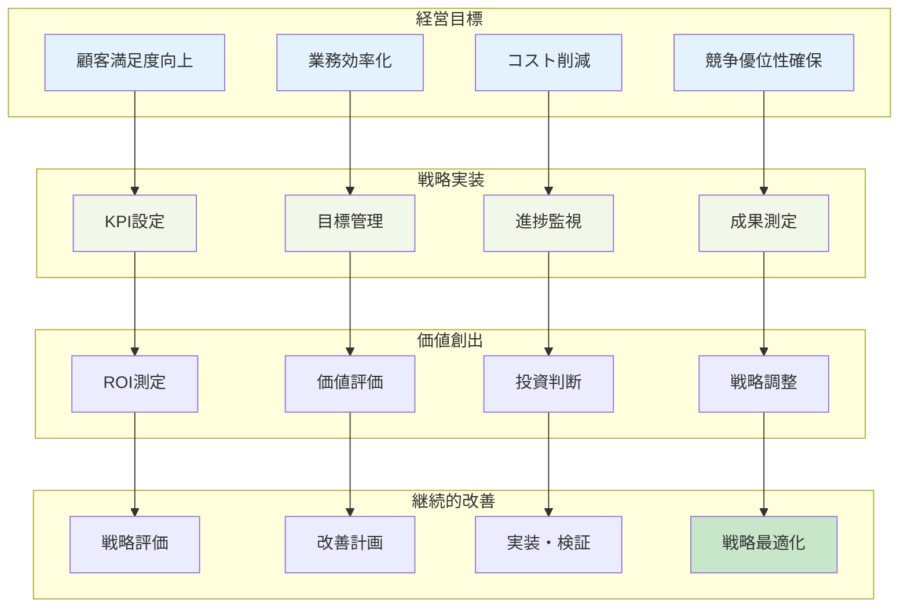
```mermaid
graph TB
    subgraph "経営目標"
        A[顧客満足度向上]
        B[業務効率化]
        C[コスト削減]
        D[競争優位性確保]
    end
    
    subgraph "戦略実装"
        E[KPI設定]
        F[目標管理]
        G[進捗監視]
        H[成果測定]
    end
    
    subgraph "価値創出"
        I[ROI測定]
        J[価値評価]
        K[投資判断]
        L[戦略調整]
    end
    
    subgraph "継続的改善"
        M[戦略評価]
        N[改善計画]
        O[実装・検証]
        P[戦略最適化]
    end
    
    A --> E
    B --> F
    C --> G
    D --> H
    
    E --> I
    F --> J
    G --> K
    H --> L
    
    I --> M
    J --> N
    K --> O
    L --> P
    
    style A fill:#e3f2fd
    style B fill:#e3f2fd
    style C fill:#e3f2fd
    style D fill:#e3f2fd
    style E fill:#f1f8e9
    style F fill:#f1f8e9
    style G fill:#f1f8e9
    style H fill:#f1f8e9
    style P fill:#c8e6c9
```

---

## 2. 業務フロー図

### 2.1 業務フロー設計方針

**フロー設計原則**
- **ユーザー中心**: 直感的で分かりやすい操作フロー
- **効率性**: 最小限の操作で目的達成
- **エラー耐性**: エラー時の適切な復旧フロー
- **アクセシビリティ**: 多様なユーザーへの対応
- **パフォーマンス**: 応答時間の最適化
- **一貫性**: 統一された操作パターン
- **学習性**: ユーザーの学習を促進する設計
- **フィードバック**: 適切なフィードバック提供
- **予測可能性**: ユーザーの期待に応える動作
- **制御性**: ユーザーがシステムを制御できる感覚
- **品質保証**: 各段階での品質チェック
- **継続的改善**: フィードバックに基づく改善
- **透明性**: AI決定プロセスの透明性確保
- **説明可能性**: AI応答の根拠・理由の説明
- **法務準拠**: 法規制・コンプライアンスの完全準拠
- **経営整合**: 経営戦略との完全整合性

**フロー最適化ポイント**
- **音声・テキスト統合**: シームレスな入力方式切り替え
- **セッション継続性**: 自然な対話の維持
- **多言語対応**: 言語検出と自動切り替え
- **フォールバック**: 障害時の代替手段提供
- **プログレッシブエンハンスメント**: 基本機能から高度な機能への段階的提供
- **オフライン対応**: ネットワーク障害時の基本機能継続
- **パーソナライゼーション**: ユーザー別の最適化
- **コンテキスト認識**: 状況に応じた適切な応答
- **予測入力**: ユーザーの意図を予測した提案
- **品質監視**: リアルタイム品質チェック
- **自動最適化**: 機械学習による自動改善
- **倫理監視**: AI倫理・バイアスの継続的監視
- **将来対応**: 将来技術への段階的対応
- **法務監視**: 法規制・コンプライアンスの継続的監視
- **経営監視**: 経営戦略・KPIの継続的監視

### 2.2 メイン業務フロー図

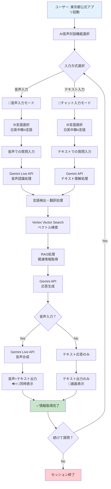
```mermaid
flowchart TD
    A[ユーザー: 東京都公式アプリ起動] --> B[AI音声対話機能選択]
    B --> C{入力方式選択}
    
    C -->|音声入力| D[🎤音声入力モード]
    C -->|テキスト入力| E[💬チャット入力モード]
    
    D --> F[🌐言語選択<br/>日英中韓4言語]
    E --> G[🌐言語選択<br/>日英中韓4言語]
    
    F --> H[音声での質問入力]
    G --> I[テキストでの質問入力]
    
    H --> J[Gemini Live API<br/>音声認識処理]
    I --> K[Gemini API<br/>テキスト理解処理]
    
    J --> L[言語検出・翻訳処理]
    K --> L
    
    L --> M[Vertex Vector Search<br/>ベクトル検索]
    M --> N[RAG処理<br/>関連情報取得]
    N --> O[Gemini API<br/>応答生成]
    
    O --> P{音声入力？}
    P -->|Yes| Q[Gemini Live API<br/>音声合成]
    P -->|No| R[テキスト応答のみ]
    
    Q --> S[音声+テキスト出力<br/>🔊+💬同時表示]
    R --> T[テキスト出力のみ<br/>💬画面表示]
    
    S --> U[✅情報取得完了]
    T --> U
    
    U --> V{続けて質問？}
    V -->|Yes| C
    V -->|No| W[セッション終了]
    
    style A fill:#e3f2fd
    style U fill:#c8e6c9
    style W fill:#ffcdd2
```

### 2.3 セッション管理フロー図

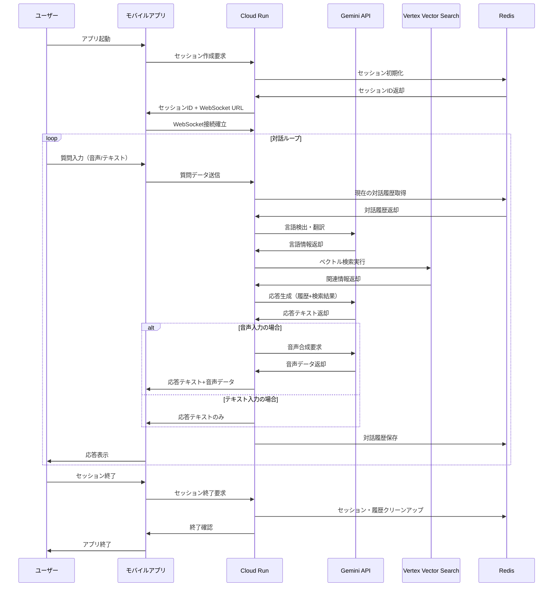
```mermaid
sequenceDiagram
    participant U as ユーザー
    participant A as モバイルアプリ
    participant S as Cloud Run
    participant G as Gemini API
    participant V as Vertex Vector Search
    participant R as Redis
    
    U->>A: アプリ起動
    A->>S: セッション作成要求
    S->>R: セッション初期化
    R->>S: セッションID返却
    S->>A: セッションID + WebSocket URL
    A->>S: WebSocket接続確立
    
    loop 対話ループ
        U->>A: 質問入力（音声/テキスト）
        A->>S: 質問データ送信
        S->>R: 現在の対話履歴取得
        R->>S: 対話履歴返却
        
        S->>G: 言語検出・翻訳
        G->>S: 言語情報返却
        S->>V: ベクトル検索実行
        V->>S: 関連情報返却
        S->>G: 応答生成（履歴+検索結果）
        G->>S: 応答テキスト返却
        
        alt 音声入力の場合
            S->>G: 音声合成要求
            G->>S: 音声データ返却
            S->>A: 応答テキスト+音声データ
        else テキスト入力の場合
            S->>A: 応答テキストのみ
        end
        
        S->>R: 対話履歴保存
        A->>U: 応答表示
    end
    
    U->>A: セッション終了
    A->>S: セッション終了要求
    S->>R: セッション・履歴クリーンアップ
    S->>A: 終了確認
    A->>U: アプリ終了
```

### 2.4 エラーハンドリングフロー図

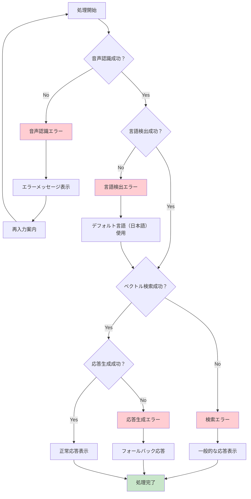
```mermaid
flowchart TD
    A[処理開始] --> B{音声認識成功？}
    B -->|No| C[音声認識エラー]
    B -->|Yes| D{言語検出成功？}
    
    C --> E[エラーメッセージ表示]
    E --> F[再入力案内]
    F --> A
    
    D -->|No| G[言語検出エラー]
    D -->|Yes| H{ベクトル検索成功？}
    
    G --> I[デフォルト言語（日本語）使用]
    I --> H
    
    H -->|No| J[検索エラー]
    H -->|Yes| K{応答生成成功？}
    
    J --> L[一般的な応答表示]
    L --> M[処理完了]
    
    K -->|No| N[応答生成エラー]
    K -->|Yes| O[正常応答表示]
    
    N --> P[フォールバック応答]
    P --> M
    O --> M
    
    style C fill:#ffcdd2
    style G fill:#ffcdd2
    style J fill:#ffcdd2
    style N fill:#ffcdd2
    style M fill:#c8e6c9
```

### 2.5 パフォーマンス最適化フロー図

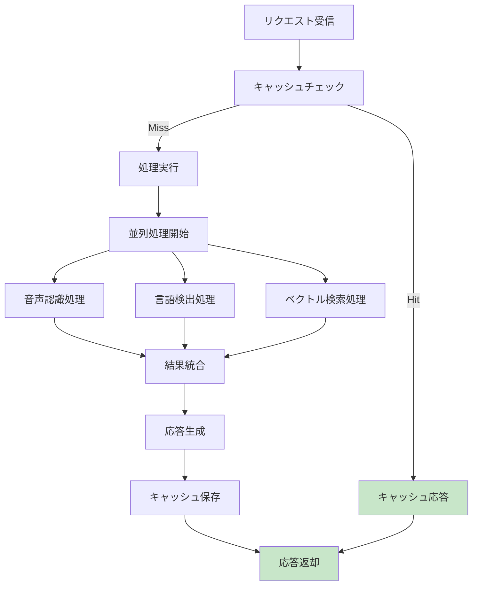
```mermaid
flowchart TD
    A[リクエスト受信] --> B[キャッシュチェック]
    B -->|Hit| C[キャッシュ応答]
    B -->|Miss| D[処理実行]
    
    D --> E[並列処理開始]
    E --> F[音声認識処理]
    E --> G[言語検出処理]
    E --> H[ベクトル検索処理]
    
    F --> I[結果統合]
    G --> I
    H --> I
    
    I --> J[応答生成]
    J --> K[キャッシュ保存]
    K --> L[応答返却]
    
    C --> L
    
    style C fill:#c8e6c9
    style L fill:#c8e6c9
```

### 2.6 セキュリティフロー図

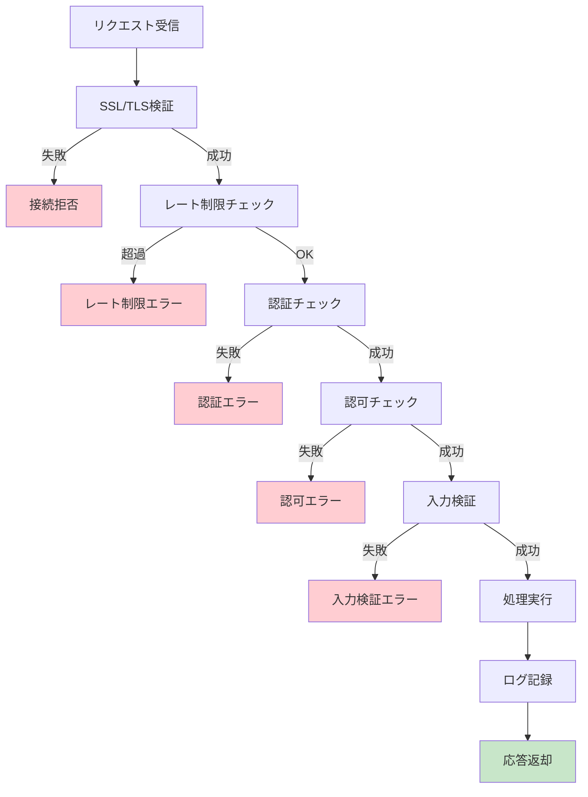
```mermaid
flowchart TD
    A[リクエスト受信] --> B[SSL/TLS検証]
    B -->|失敗| C[接続拒否]
    B -->|成功| D[レート制限チェック]
    
    D -->|超過| E[レート制限エラー]
    D -->|OK| F[認証チェック]
    
    F -->|失敗| G[認証エラー]
    F -->|成功| H[認可チェック]
    
    H -->|失敗| I[認可エラー]
    H -->|成功| J[入力検証]
    
    J -->|失敗| K[入力検証エラー]
    J -->|成功| L[処理実行]
    
    L --> M[ログ記録]
    M --> N[応答返却]
    
    style C fill:#ffcdd2
    style E fill:#ffcdd2
    style G fill:#ffcdd2
    style I fill:#ffcdd2
    style K fill:#ffcdd2
    style N fill:#c8e6c9
```

### 2.7 データフロー詳細図

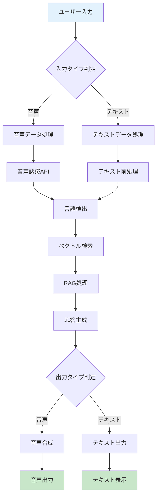
```mermaid
flowchart TD
    A[ユーザー入力] --> B{入力タイプ判定}
    
    B -->|音声| C[音声データ処理]
    B -->|テキスト| D[テキストデータ処理]
    
    C --> E[音声認識API]
    D --> F[テキスト前処理]
    
    E --> G[言語検出]
    F --> G
    
    G --> H[ベクトル検索]
    H --> I[RAG処理]
    I --> J[応答生成]
    
    J --> K{出力タイプ判定}
    K -->|音声| L[音声合成]
    K -->|テキスト| M[テキスト出力]
    
    L --> N[音声出力]
    M --> O[テキスト表示]
    
    style A fill:#e3f2fd
    style N fill:#c8e6c9
    style O fill:#c8e6c9
```

### 2.8 セッション管理詳細フロー図

```mermaid
flowchart TD
    A[セッション開始] --> B[セッションID生成]
    B --> C[初期化処理]
    C --> D[WebSocket接続確立]
    
    D --> E[対話ループ開始]
    E --> F[ユーザー入力受信]
    F --> G[コンテキスト管理]
    
    G --> H{トークン制限チェック}
    H -->|超過| I[古い履歴削除]
    H -->|OK| J[履歴更新]
    
    I --> J
    J --> K[応答生成]
    K --> L[セッション状態更新]
    
    L --> M{継続判定}
    M -->|継続| E
    M -->|終了| N[セッション終了処理]
    
    N --> O[リソース解放]
    O --> P[ログ記録]
    
    style A fill:#e3f2fd
    style P fill:#c8e6c9
```

### 2.9 パフォーマンス最適化詳細フロー図

```mermaid
flowchart TD
    A[リクエスト受信] --> B[レート制限チェック]
    B -->|超過| C[レート制限エラー]
    B -->|OK| D[キャッシュチェック]
    
    D -->|Hit| E[キャッシュ応答]
    D -->|Miss| F[並列処理開始]
    
    F --> G[音声認識処理]
    F --> H[言語検出処理]
    F --> I[ベクトル検索処理]
    
    G --> J[結果統合]
    H --> J
    I --> J
    
    J --> K[応答生成]
    K --> L[キャッシュ保存]
    L --> M[応答返却]
    
    E --> M
    
    style C fill:#ffcdd2
    style E fill:#c8e6c9
    style M fill:#c8e6c9
```

### 2.10 エラー復旧詳細フロー図

```mermaid
flowchart TD
    A[エラー発生] --> B[エラータイプ判定]
    
    B -->|音声認識エラー| C[音声認識フォールバック]
    B -->|言語検出エラー| D[デフォルト言語使用]
    B -->|検索エラー| E[一般的な応答生成]
    B -->|応答生成エラー| F[フォールバック応答]
    B -->|ネットワークエラー| G[オフライン機能]
    
    C --> H[再試行]
    D --> H
    E --> H
    F --> H
    G --> H
    
    H --> I{復旧成功？}
    I -->|Yes| J[正常処理継続]
    I -->|No| K[ユーザーへの案内]
    
    K --> L[手動復旧案内]
    L --> M[ログ記録]
    
    style A fill:#ffcdd2
    style J fill:#c8e6c9
    style M fill:#c8e6c9
```

### 2.11 品質保証フロー図

```mermaid
flowchart TD
    A[開発開始] --> B[単体テスト]
    B --> C[コードレビュー]
    C --> D[統合テスト]
    
    D --> E[静的解析]
    E --> F[セキュリティテスト]
    F --> G[システムテスト]
    
    G --> H[受け入れテスト]
    H --> I[品質ゲート]
    
    I -->|合格| J[デプロイ]
    I -->|不合格| K[修正・再テスト]
    
    K --> B
    J --> L[本番監視]
    L --> M[品質メトリクス収集]
    
    M --> N[改善提案]
    N --> O[次期改善計画]
    
    style A fill:#e3f2fd
    style J fill:#c8e6c9
    style O fill:#c8e6c9
```

### 2.12 継続的改善フロー図

```mermaid
flowchart TD
    A[データ収集] --> B[ユーザーフィードバック]
    A --> C[パフォーマンスメトリクス]
    A --> D[エラーログ]
    A --> E[利用統計]
    
    B --> F[データ分析]
    C --> F
    D --> F
    E --> F
    
    F --> G[改善点特定]
    G --> H[優先度決定]
    H --> I[改善計画策定]
    
    I --> J[実装・テスト]
    J --> K[デプロイ]
    K --> L[効果測定]
    
    L --> M[結果評価]
    M --> N[学習・調整]
    N --> O[次期改善計画]
    O --> A
    
    style A fill:#e3f2fd
    style L fill:#c8e6c9
    style O fill:#c8e6c9
```

### 2.13 AI倫理・透明性フロー図

```mermaid
flowchart TD
    A[AI応答生成] --> B[倫理チェック]
    B --> C[バイアス検出]
    C --> D[公平性評価]
    
    D --> E{倫理的問題？}
    E -->|Yes| F[問題記録]
    E -->|No| G[透明性確保]
    
    F --> H[改善計画策定]
    H --> I[実装・検証]
    I --> J[再評価]
    J --> E
    
    G --> K[決定プロセス記録]
    K --> L[根拠・理由の説明]
    L --> M[監査ログ記録]
    
    M --> N[ユーザーへの説明]
    N --> O[フィードバック収集]
    O --> P[継続的改善]
    
    style A fill:#e3f2fd
    style F fill:#ffcdd2
    style P fill:#c8e6c9
```

### 2.14 将来技術対応フロー図

```mermaid
flowchart TD
    A[技術監視] --> B[新技術評価]
    B --> C[適合性分析]
    C --> D[導入可能性評価]
    
    D --> E{導入可能？}
    E -->|Yes| F[段階的導入計画]
    E -->|No| G[継続監視]
    
    F --> H[パイロット実装]
    H --> I[効果測定]
    I --> J[本格導入判断]
    
    J --> K{本格導入？}
    K -->|Yes| L[本格導入]
    K -->|No| M[改善・再評価]
    
    L --> N[運用・監視]
    M --> H
    G --> A
    
    N --> O[継続的改善]
    O --> A
    
    style A fill:#e3f2fd
    style L fill:#c8e6c9
    style O fill:#c8e6c9
```

### 2.15 法務・コンプライアンスフロー図

```mermaid
flowchart TD
    A[法規制監視] --> B[変更検出]
    B --> C[影響度評価]
    C --> D[対応必要性判断]
    
    D --> E{対応必要？}
    E -->|Yes| F[対応計画策定]
    E -->|No| G[継続監視]
    
    F --> H[実装・検証]
    H --> I[コンプライアンスチェック]
    I --> J[適合性確認]
    
    J --> K{適合？}
    K -->|Yes| L[運用開始]
    K -->|No| M[改善・再検証]
    
    L --> N[継続監視]
    M --> H
    G --> A
    
    N --> O[定期評価]
    O --> A
    
    style A fill:#e3f2fd
    style L fill:#c8e6c9
    style O fill:#c8e6c9
```

### 2.16 経営戦略フロー図

```mermaid
flowchart TD
    A[経営目標設定] --> B[KPI定義]
    B --> C[戦略実装]
    C --> D[進捗監視]
    
    D --> E[成果測定]
    E --> F[価値評価]
    F --> G[戦略評価]
    
    G --> H{目標達成？}
    H -->|Yes| I[次期目標設定]
    H -->|No| J[改善計画策定]
    
    I --> K[戦略調整]
    J --> L[実装・検証]
    
    K --> A
    L --> M[効果測定]
    M --> N[継続的改善]
    N --> A
    
    style A fill:#e3f2fd
    style I fill:#c8e6c9
    style N fill:#c8e6c9
```

---

## 3. 画面一覧・画面遷移図

### 3.1 UI/UX設計方針

**デザイン原則**
- **ユーザー中心設計**: 直感的で使いやすいインターフェース
- **アクセシビリティ**: 多様なユーザーへの配慮（WCAG 2.1 AA準拠）
- **レスポンシブデザイン**: 様々な画面サイズへの対応
- **一貫性**: 統一されたデザインシステム
- **パフォーマンス**: 高速な画面遷移と応答
- **プログレッシブエンハンスメント**: 基本機能から高度な機能への段階的提供
- **モバイルファースト**: モバイルデバイスを最優先とした設計
- **ダークモード対応**: ユーザーの好みに応じた表示モード
- **感情設計**: ユーザーの感情に配慮したインターフェース
- **包括的設計**: 多様な能力を持つユーザーへの配慮
- **品質保証**: デザイン品質の継続的改善
- **ユーザビリティテスト**: 実際のユーザーによる検証
- **透明性**: AI決定プロセスの可視化
- **説明可能性**: AI応答の根拠・理由の表示
- **法務表示**: 法規制・コンプライアンス情報の表示
- **経営表示**: 経営戦略・KPI情報の表示

**UI/UX最適化ポイント**
- **音声・テキスト統合**: シームレスな入力方式切り替え
- **リアルタイムフィードバック**: 処理状況の可視化
- **エラー処理**: 分かりやすいエラーメッセージ
- **多言語対応**: 言語別の最適化されたUI
- **ジェスチャー操作**: 直感的なタッチ・スワイプ操作
- **音声フィードバック**: 操作音・音声ガイダンス
- **パーソナライゼーション**: ユーザー設定の保存・復元
- **オフライン対応**: ネットワーク接続なしでの基本機能
- **マイクロインタラクション**: 細かな動きによる快適な体験
- **コンテキスト認識**: 状況に応じたUI表示
- **A/Bテスト**: 効果的なデザイン検証
- **ユーザー調査**: 定期的なユーザー満足度調査
- **倫理表示**: AI倫理・バイアス情報の表示
- **将来対応**: 将来技術への段階的対応UI
- **法務表示**: 法規制・コンプライアンス情報の表示
- **経営表示**: 経営戦略・KPI情報の表示

### 3.2 画面一覧

| 画面ID | 画面名 | 機能概要 | 主要要素 |
|--------|--------|----------|----------|
| **SC-001** | メイン画面 | AI音声対話機能のメインページ | 音声入力ボタン、チャット入力欄、言語選択 |
| **SC-002** | 音声入力画面 | 音声録音・認識結果表示 | マイクボタン、録音インジケーター、認識結果 |
| **SC-003** | チャット画面 | テキスト対話・履歴表示 | メッセージ一覧、入力欄、送信ボタン |
| **SC-004** | 言語選択画面 | 4言語選択機能 | 言語ボタン（日英中韓）、設定保存 |
| **SC-005** | 設定画面 | アプリ設定・履歴管理 | 履歴クリア、履歴エクスポート、音声設定 |
| **SC-006** | エラー画面 | エラー表示・復旧案内 | エラーメッセージ、再試行ボタン、ヘルプリンク |
| **SC-007** | 設定画面 | ユーザー設定管理 | 言語設定、音声設定、プライバシー設定 |
| **SC-008** | ヘルプ画面 | 使用方法・FAQ | 操作ガイド、よくある質問、サポート情報 |
| **SC-009** | 履歴画面 | 対話履歴表示 | 履歴一覧、検索機能、エクスポート機能 |
| **SC-010** | 統計画面 | 利用統計表示 | 利用状況、パフォーマンス指標 |
| **SC-011** | 通知画面 | プッシュ通知管理 | 通知一覧、設定、優先度管理 |
| **SC-012** | フィードバック画面 | ユーザーフィードバック | 評価、コメント、改善提案 |
| **SC-013** | 品質監視画面 | 品質メトリクス表示 | パフォーマンス、エラー率、品質指標 |
| **SC-014** | 改善提案画面 | 改善提案管理 | 提案一覧、優先度、実装状況 |
| **SC-015** | AI倫理監視画面 | AI倫理・透明性管理 | 倫理メトリクス、バイアス監視、透明性確保 |
| **SC-016** | 将来技術画面 | 将来技術対応管理 | 技術監視、導入計画、ロードマップ |
| **SC-017** | 法務・コンプライアンス画面 | 法務・コンプライアンス管理 | 法規制監視、コンプライアンスチェック、リスク評価 |
| **SC-018** | 経営戦略画面 | 経営戦略・KPI管理 | KPI監視、戦略実装、成果測定 |

### 3.3 画面遷移図

```mermaid
stateDiagram-v2
    [*] --> メイン画面
    
    メイン画面 --> 音声入力画面: 音声ボタンタップ
    メイン画面 --> チャット画面: チャットボタンタップ
    メイン画面 --> 言語選択画面: 言語設定タップ
    メイン画面 --> 設定画面: 設定ボタンタップ
    
    音声入力画面 --> メイン画面: 戻るボタン
    音声入力画面 --> チャット画面: テキスト切り替え
    音声入力画面 --> エラー画面: 音声認識エラー
    
    チャット画面 --> メイン画面: 戻るボタン
    チャット画面 --> 音声入力画面: 音声切り替え
    チャット画面 --> エラー画面: 通信エラー
    
    言語選択画面 --> メイン画面: 言語選択完了
    言語選択画面 --> メイン画面: キャンセル
    
    設定画面 --> メイン画面: 設定完了
    設定画面 --> メイン画面: キャンセル
    
    エラー画面 --> メイン画面: 再試行
    エラー画面 --> メイン画面: 戻る
    
    設定画面 --> 履歴画面: 履歴管理
    設定画面 --> ヘルプ画面: ヘルプ表示
    
    履歴画面 --> 設定画面: 戻る
    統計画面 --> 設定画面: 戻る
    
    設定画面 --> 通知画面: 通知設定
    設定画面 --> フィードバック画面: フィードバック
    
    通知画面 --> 設定画面: 戻る
    フィードバック画面 --> 設定画面: 戻る
    
    設定画面 --> 品質監視画面: 品質監視
    設定画面 --> 改善提案画面: 改善提案
    
    品質監視画面 --> 設定画面: 戻る
    改善提案画面 --> 設定画面: 戻る
    
    設定画面 --> AI倫理監視画面: AI倫理監視
    設定画面 --> 将来技術画面: 将来技術対応
    設定画面 --> 法務・コンプライアンス画面: 法務・コンプライアンス
    設定画面 --> 経営戦略画面: 経営戦略
    
    AI倫理監視画面 --> 設定画面: 戻る
    将来技術画面 --> 設定画面: 戻る
    法務・コンプライアンス画面 --> 設定画面: 戻る
    経営戦略画面 --> 設定画面: 戻る
    
    メイン画面 --> [*]: アプリ終了
```

### 3.4 ワイヤーフレーム概要

#### 3.4.1 メイン画面（SC-001）

```
┌─────────────────────────────────┐
│ 東京都公式アプリ - AI音声対話    │
├─────────────────────────────────┤
│                                 │
│  🌐 日本語 ▼                    │
│                                 │
│  ┌─────────────────────────────┐ │
│  │                             │ │
│  │      💬 チャット履歴        │ │
│  │                             │ │
│  │  [AI] こんにちは。何かお手伝い│ │
│  │  できることはありますか？    │ │
│  │                             │ │
│  └─────────────────────────────┘ │
│                                 │
│  ┌─────────────────────────────┐ │
│  │ 💬 メッセージを入力...      │ │
│  └─────────────────────────────┘ │
│                                 │
│  [🎤 音声入力]  [📤 送信]      │
│                                 │
│  [⚙️ 設定]  [📋 履歴]         │
└─────────────────────────────────┘
```

#### 3.4.2 音声入力画面（SC-002）

```
┌─────────────────────────────────┐
│ ← 戻る    音声入力              │
├─────────────────────────────────┤
│                                 │
│        🎤                       │
│                                 │
│     [音声ボタン]                │
│                                 │
│  ┌─────────────────────────────┐ │
│  │                             │ │
│  │     音声認識結果            │ │
│  │                             │ │
│  │  "育児支援について教えて"    │ │
│  │                             │ │
│  └─────────────────────────────┘ │
│                                 │
│  [🔄 再録音]  [✅ 確定]        │
│                                 │
│  💬 テキスト入力に切り替え      │
└─────────────────────────────────┘
```

#### 3.4.3 チャット画面（SC-003）

```
┌─────────────────────────────────┐
│ ← 戻る    チャット              │
├─────────────────────────────────┤
│                                 │
│  ┌─────────────────────────────┐ │
│  │                             │ │
│  │  [ユーザー] 育児支援について │ │
│  │  教えて                     │ │
│  │                             │ │
│  │  [AI] 東京都の育児支援制度   │ │
│  │  についてご説明します...    │ │
│  │                             │ │
│  └─────────────────────────────┘ │
│                                 │
│  ┌─────────────────────────────┐ │
│  │ 💬 メッセージを入力...      │ │
│  └─────────────────────────────┘ │
│                                 │
│  [🎤 音声]  [📤 送信]          │
└─────────────────────────────────┘
```

#### 3.4.4 設定画面（SC-007）

```
┌─────────────────────────────────┐
│ ← 戻る    設定                  │
├─────────────────────────────────┤
│                                 │
│  🌐 言語設定                    │
│  [日本語] [English] [中文] [한국어] │
│                                 │
│  🔊 音声設定                    │
│  [音声ON] [音声OFF] [音量調整]   │
│                                 │
│  🔒 プライバシー設定            │
│  [履歴保存] [自動削除] [暗号化]  │
│                                 │
│  📊 利用統計                    │
│  [統計送信] [匿名化] [詳細設定]  │
│                                 │
│  📋 履歴管理                    │
│  [履歴表示] [エクスポート] [削除]│
│                                 │
│  ❓ ヘルプ・サポート            │
│  [操作ガイド] [FAQ] [お問い合わせ]│
└─────────────────────────────────┘
```

#### 3.4.5 ヘルプ画面（SC-008）

```
┌─────────────────────────────────┐
│ ← 戻る    ヘルプ・サポート      │
├─────────────────────────────────┤
│                                 │
│  📖 操作ガイド                  │
│  [音声入力] [テキスト入力] [設定]│
│                                 │
│  ❓ よくある質問                │
│  [Q1] 音声が認識されない        │
│  [Q2] 応答が遅い                │
│  [Q3] 言語を変更したい          │
│                                 │
│  📞 サポート情報                │
│  [お問い合わせ] [プライバシーポリシー]│
│                                 │
│  📊 アプリ情報                  │
│  [バージョン] [ライセンス] [更新履歴]│
└─────────────────────────────────┘
```

#### 3.4.6 通知画面（SC-011）

```
┌─────────────────────────────────┐
│ ← 戻る    通知管理              │
├─────────────────────────────────┤
│                                 │
│  🔔 通知設定                    │
│  [プッシュ通知] [メール通知] [SMS]│
│                                 │
│  📋 通知一覧                    │
│  [新着情報] [システム通知] [お知らせ]│
│                                 │
│  ⚙️ 通知優先度                  │
│  [高] [中] [低] [オフ]          │
│                                 │
│  🕐 通知時間                    │
│  [営業時間のみ] [24時間] [カスタム]│
│                                 │
│  📱 通知方法                    │
│  [音声] [バイブレーション] [サイレント]│
└─────────────────────────────────┘
```

#### 3.4.7 フィードバック画面（SC-012）

```
┌─────────────────────────────────┐
│ ← 戻る    フィードバック        │
├─────────────────────────────────┤
│                                 │
│  ⭐ 評価                        │
│  [1] [2] [3] [4] [5]           │
│                                 │
│  💬 コメント                    │
│  ┌─────────────────────────────┐ │
│  │ ご意見・ご要望を入力してください│ │
│  └─────────────────────────────┘ │
│                                 │
│  🏷️ カテゴリ                    │
│  [使いやすさ] [機能] [パフォーマンス]│
│                                 │
│  📷 スクリーンショット          │
│  [添付] [削除]                  │
│                                 │
│  📤 [送信] [下書き保存]         │
└─────────────────────────────────┘
```

#### 3.4.8 品質監視画面（SC-013）

```
┌─────────────────────────────────┐
│ ← 戻る    品質監視              │
├─────────────────────────────────┤
│                                 │
│  📊 パフォーマンス指標           │
│  [応答時間] [スループット] [エラー率]│
│                                 │
│  🔍 エラー分析                   │
│  [エラータイプ] [発生頻度] [影響度]│
│                                 │
│  📈 品質トレンド                 │
│  [日次] [週次] [月次] [年次]    │
│                                 │
│  ⚠️ アラート設定                 │
│  [閾値設定] [通知設定] [自動対応]│
│                                 │
│  📋 品質レポート                 │
│  [自動生成] [手動生成] [エクスポート]│
└─────────────────────────────────┘
```

#### 3.4.9 改善提案画面（SC-014）

```
┌─────────────────────────────────┐
│ ← 戻る    改善提案管理          │
├─────────────────────────────────┤
│                                 │
│  💡 提案一覧                    │
│  [新規提案] [進行中] [完了] [却下]│
│                                 │
│  🏷️ 提案詳細                    │
│  ┌─────────────────────────────┐ │
│  │ 提案内容・理由・期待効果      │ │
│  └─────────────────────────────┘ │
│                                 │
│  ⭐ 優先度設定                   │
│  [高] [中] [低] [緊急]          │
│                                 │
│  📅 実装計画                    │
│  [スプリント] [マイルストーン] [期限]│
│                                 │
│  👥 担当者・ステータス           │
│  [担当者] [進捗] [完了率]       │
└─────────────────────────────────┘
```

#### 3.4.10 AI倫理監視画面（SC-015）

```
┌─────────────────────────────────┐
│ ← 戻る    AI倫理監視            │
├─────────────────────────────────┤
│                                 │
│  ⚖️ 倫理メトリクス              │
│  [公平性] [透明性] [説明可能性]  │
│                                 │
│  🔍 バイアス監視                │
│  [バイアス検出] [影響度] [改善状況]│
│                                 │
│  📊 透明性確保                   │
│  [決定プロセス] [根拠説明] [監査ログ]│
│                                 │
│  ⚠️ 倫理アラート                 │
│  [問題検出] [自動対応] [手動対応]│
│                                 │
│  📋 倫理レポート                 │
│  [定期レポート] [特別レポート] [エクスポート]│
└─────────────────────────────────┘
```

#### 3.4.11 将来技術画面（SC-016）

```
┌─────────────────────────────────┐
│ ← 戻る    将来技術対応          │
├─────────────────────────────────┤
│                                 │
│  🔮 技術監視                    │
│  [新技術発見] [評価] [導入可能性]│
│                                 │
│  📅 導入計画                    │
│  [ロードマップ] [マイルストーン] [期限]│
│                                 │
│  🧪 パイロット実装              │
│  [実装状況] [効果測定] [本格導入判断]│
│                                 │
│  💰 投資計画                    │
│  [予算] [リソース] [人材育成]   │
│                                 │
│  📈 技術進化                    │
│  [進捗] [成果] [継続的改善]     │
└─────────────────────────────────┘
```

#### 3.4.12 法務・コンプライアンス画面（SC-017）

```
┌─────────────────────────────────┐
│ ← 戻る    法務・コンプライアンス │
├─────────────────────────────────┤
│                                 │
│  ⚖️ 法規制監視                  │
│  [個人情報保護法] [GDPR] [AI倫理]│
│                                 │
│  🔍 コンプライアンスチェック     │
│  [適合性] [違反検出] [対応状況] │
│                                 │
│  ⚠️ リスク評価                  │
│  [リスクレベル] [影響度] [対策] │
│                                 │
│  📋 法務レポート                │
│  [定期レポート] [特別レポート] [エクスポート]│
│                                 │
│  🔄 継続的対応                  │
│  [法規制変更] [対応計画] [実装状況]│
└─────────────────────────────────┘
```

#### 3.4.13 経営戦略画面（SC-018）

```
┌─────────────────────────────────┐
│ ← 戻る    経営戦略・KPI管理     │
├─────────────────────────────────┤
│                                 │
│  🎯 KPI監視                    │
│  [顧客満足度] [業務効率] [コスト削減]│
│                                 │
│  📊 戦略実装                    │
│  [進捗] [成果] [課題] [対策]    │
│                                 │
│  💰 価値創出                    │
│  [ROI] [投資効果] [戦略価値]   │
│                                 │
│  📈 成果測定                    │
│  [目標達成率] [改善効果] [継続的改善]│
│                                 │
│  🔄 戦略調整                    │
│  [評価] [改善計画] [次期戦略]   │
└─────────────────────────────────┘
```
```

---

## 4. 帳票一覧・帳票レイアウト

### 4.1 帳票設計方針

**帳票設計原則**
- **可読性**: 分かりやすく整理された情報表示
- **完全性**: 必要な情報の網羅
- **一貫性**: 統一されたフォーマット
- **拡張性**: 将来の要件変更への対応
- **セキュリティ**: 機密情報の適切な保護
- **多言語対応**: 言語別の帳票フォーマット
- **リアルタイム性**: 最新データの反映
- **カスタマイズ**: ユーザー別の出力形式
- **アクセシビリティ**: 多様なユーザーへの配慮
- **データ品質**: 正確性・整合性の保証

**帳票最適化ポイント**
- **多言語対応**: 言語別の帳票フォーマット
- **データ形式**: CSV/JSON形式での出力
- **リアルタイム性**: 最新データの反映
- **カスタマイズ**: ユーザー別の出力形式
- **自動化**: 定期レポートの自動生成
- **可視化**: グラフ・チャートによる直感的な表示
- **エクスポート**: 複数形式での出力対応

### 4.2 帳票一覧

| 帳票ID | 帳票名 | 出力形式 | 用途 | 出力タイミング |
|--------|--------|----------|------|----------------|
| **RP-001** | 対話履歴レポート | CSV/JSON | ユーザー向け履歴保存 | ユーザー要求時 |
| **RP-002** | 利用統計レポート | CSV/JSON | 管理者向け統計 | 日次自動生成 |
| **RP-003** | エラーログレポート | CSV/JSON | 開発者向けデバッグ | エラー発生時 |
| **RP-004** | パフォーマンスレポート | CSV/JSON | 運用者向け監視 | 定期生成 |
| **RP-005** | セキュリティレポート | CSV/JSON | セキュリティ監査 | 定期生成 |
| **RP-006** | ユーザー行動レポート | CSV/JSON | UX改善分析 | 定期生成 |
| **RP-007** | アクセシビリティレポート | CSV/JSON | アクセシビリティ監査 | 定期生成 |
| **RP-008** | コンプライアンスレポート | CSV/JSON | 法規制対応確認 | 定期生成 |
| **RP-009** | 品質保証レポート | CSV/JSON | 品質管理・改善 | 定期生成 |
| **RP-010** | 継続的改善レポート | CSV/JSON | 改善効果測定 | 定期生成 |
| **RP-011** | AI倫理レポート | CSV/JSON | AI倫理・透明性監査 | 定期生成 |
| **RP-012** | 将来技術レポート | CSV/JSON | 技術進化・投資効果 | 定期生成 |
| **RP-013** | 法務・コンプライアンスレポート | CSV/JSON | 法規制・コンプライアンス監査 | 定期生成 |
| **RP-014** | 経営戦略レポート | CSV/JSON | 経営戦略・KPI監査 | 定期生成 |

### 4.3 帳票レイアウト

#### 4.3.1 対話履歴レポート（RP-001）

**CSV形式**
```csv
セッションID,タイムスタンプ,ユーザー入力,AI応答,言語,処理時間,エラーフラグ
session_001,2025-01-15 10:30:15,育児支援について教えて,東京都の育児支援制度について...,ja,2.3,false
session_001,2025-01-15 10:32:20,保育園の申し込み方法は？,保育園の申し込み方法について...,ja,1.8,false
session_002,2025-01-15 11:15:30,How to apply for childcare?,Tokyo childcare application...,en,3.1,false
```

**JSON形式**
```json
{
  "session_id": "session_001",
  "user_id": "user_123",
  "language": "ja",
  "start_time": "2025-01-15T10:30:00Z",
  "end_time": "2025-01-15T10:35:00Z",
  "conversations": [
    {
      "timestamp": "2025-01-15T10:30:15Z",
      "user_input": "育児支援について教えて",
      "ai_response": "東京都の育児支援制度について...",
      "processing_time": 2.3,
      "error": false
    }
  ]
}
```

#### 4.3.2 利用統計レポート（RP-002）

**CSV形式**
```csv
日付,総セッション数,音声入力数,テキスト入力数,平均応答時間,エラー率,言語別利用数
2025-01-15,150,89,61,2.5,0.02,ja:120,en:20,zh:7,ko:3
2025-01-16,165,95,70,2.3,0.01,ja:130,en:25,zh:8,ko:2
```

**JSON形式**
```json
{
  "date": "2025-01-15",
  "total_sessions": 150,
  "voice_inputs": 89,
  "text_inputs": 61,
  "average_response_time": 2.5,
  "error_rate": 0.02,
  "language_usage": {
    "ja": 120,
    "en": 20,
    "zh": 7,
    "ko": 3
  }
}
```

#### 4.3.3 エラーログレポート（RP-003）

**CSV形式**
```csv
タイムスタンプ,エラーコード,エラーメッセージ,セッションID,ユーザーID,スタックトレース
2025-01-15 10:30:15,ERR_AUDIO_001,音声認識に失敗しました,session_001,user_123,Error: Audio recognition failed
2025-01-15 11:15:30,ERR_API_002,Gemini API接続エラー,session_002,user_456,Error: API connection timeout
```

**JSON形式**
```json
{
  "timestamp": "2025-01-15T10:30:15Z",
  "error_code": "ERR_AUDIO_001",
  "error_message": "音声認識に失敗しました",
  "session_id": "session_001",
  "user_id": "user_123",
  "stack_trace": "Error: Audio recognition failed",
  "severity": "WARNING"
}
```

---

## 5. 外部インターフェース定義

### 5.1 外部インターフェース設計方針

**インターフェース設計原則**
- **標準化**: 業界標準プロトコルの採用
- **互換性**: 既存システムとの互換性確保
- **拡張性**: 将来の機能拡張への対応
- **セキュリティ**: 安全な通信の確保
- **パフォーマンス**: 高速なデータ交換
- **堅牢性**: エラー処理とフォールバック機能
- **監視性**: 通信状況の可視化とログ記録
- **バージョニング**: APIバージョン管理
- **オープン性**: オープンAPI・オープンスタンダード
- **持続可能性**: 長期的な保守・運用の考慮
- **品質保証**: API品質の継続的改善
- **テスト自動化**: 包括的なAPIテスト戦略
- **透明性**: AI決定プロセスの透明性確保
- **将来対応**: 将来技術への段階的対応
- **法務準拠**: 法規制・コンプライアンスの完全準拠
- **経営整合**: 経営戦略との完全整合性

**インターフェース最適化ポイント**
- **API設計**: RESTful API設計原則の適用
- **エラーハンドリング**: 包括的なエラー処理
- **認証・認可**: 適切なセキュリティ対策
- **監視・ログ**: 通信状況の可視化
- **レート制限**: 過負荷防止とリソース保護
- **キャッシュ戦略**: 応答時間の最適化
- **非同期処理**: 長時間処理の効率化
- **API文書化**: OpenAPI/Swagger仕様
- **テスト自動化**: APIテストの自動化
- **品質監視**: API品質メトリクスの継続的監視
- **継続的改善**: API改善のフィードバックループ
- **倫理監視**: AI倫理・バイアスの継続的監視
- **将来対応**: 将来技術への段階的対応
- **法務監視**: 法規制・コンプライアンスの継続的監視
- **経営監視**: 経営戦略・KPIの継続的監視

### 5.2 外部システム連携仕様

#### 5.2.1 東京都オープンデータ連携

**連携概要**
- **システム名**: 東京都オープンデータAPI
- **連携方式**: REST API
- **認証方式**: API Key認証
- **データ形式**: JSON/CSV
- **更新頻度**: 手動更新（PoC範囲）

**API仕様**
```json
{
  "base_url": "https://api.tokyo.data.jp/v1",
  "endpoints": {
    "childcare": "/childcare",
    "disaster": "/disaster",
    "administration": "/administration"
  },
  "authentication": {
    "type": "API_KEY",
    "header": "X-API-Key"
  },
  "rate_limit": "100 requests/hour"
}
```

**データマッピング**
| 東京都データ項目 | システム項目 | データ型 | 必須 |
|------------------|--------------|----------|------|
| facility_name | 施設名 | String | ○ |
| address | 住所 | String | ○ |
| phone | 電話番号 | String | × |
| description | 説明 | Text | × |
| category | カテゴリ | String | ○ |

### 5.3 第三者サービス連携仕様

#### 5.3.1 Gemini Live API連携

**連携概要**
- **サービス名**: Google Gemini Live API
- **連携方式**: gRPC/WebSocket
- **認証方式**: API Key認証
- **機能**: 音声認識・音声合成

**API仕様**
```json
{
  "service": "gemini-live-api",
  "endpoints": {
    "speech_recognition": "/v1/speech:recognize",
    "speech_synthesis": "/v1/speech:synthesize"
  },
  "authentication": {
    "type": "API_KEY",
    "header": "x-goog-api-key"
  },
  "rate_limit": "1000 requests/minute"
}
```

**音声認識パラメータ**
```json
{
  "config": {
    "encoding": "WEBM_OPUS",
    "sample_rate_hertz": 48000,
    "language_code": "ja-JP",
    "enable_automatic_punctuation": true,
    "enable_word_time_offsets": false
  },
  "audio": {
    "content": "base64_encoded_audio_data"
  }
}
```

**音声合成パラメータ**
```json
{
  "input": {
    "text": "合成するテキスト"
  },
  "voice": {
    "language_code": "ja-JP",
    "name": "ja-JP-Neural2-A"
  },
  "audio_config": {
    "audio_encoding": "MP3",
    "speaking_rate": 1.0,
    "pitch": 0.0
  }
}
```

#### 5.3.2 Gemini API連携

**連携概要**
- **サービス名**: Google Gemini API
- **連携方式**: REST API
- **認証方式**: API Key認証
- **機能**: 自然言語処理・翻訳

**API仕様**
```json
{
  "service": "gemini-api",
  "endpoints": {
    "generate_content": "/v1/models/gemini-pro:generateContent",
    "embed_content": "/v1/models/embedding-001:embedContent"
  },
  "authentication": {
    "type": "API_KEY",
    "header": "x-goog-api-key"
  },
  "rate_limit": "1500 requests/minute"
}
```

**応答生成パラメータ**
```json
{
  "contents": [
    {
      "parts": [
        {
          "text": "ユーザーの質問"
        }
      ]
    }
  ],
  "generation_config": {
    "temperature": 0.7,
    "top_p": 0.8,
    "top_k": 40,
    "max_output_tokens": 2048
  }
}
```

#### 5.3.3 Vertex Vector Search連携

**連携概要**
- **サービス名**: Google Cloud Vertex Vector Search
- **連携方式**: REST API
- **認証方式**: OAuth2認証
- **機能**: ベクトル検索

**API仕様**
```json
{
  "service": "vertex-vector-search",
  "endpoints": {
    "search": "/v1/projects/{project}/locations/{location}/indexes/{index}:search",
    "find_neighbors": "/v1/projects/{project}/locations/{location}/indexes/{index}:findNeighbors"
  },
  "authentication": {
    "type": "OAUTH2",
    "scope": "https://www.googleapis.com/auth/cloud-platform"
  }
}
```

**検索パラメータ**
```json
{
  "deployed_index_id": "deployed_index_001",
  "queries": [
    {
      "datapoint": {
        "datapoint_id": "query_001",
        "feature_vector": [0.1, 0.2, 0.3, ...]
      },
      "neighbor_count": 5
    }
  ]
}
```

### 5.4 データ変換仕様

#### 5.4.1 音声データ変換

**入力音声形式**
- **形式**: WebM (Opus)
- **サンプリングレート**: 48kHz
- **ビットレート**: 64kbps
- **チャンネル**: モノラル

**変換処理**
```json
{
  "input_format": "WebM_Opus",
  "output_format": "base64",
  "processing": {
    "noise_reduction": true,
    "normalization": true,
    "trim_silence": true
  }
}
```

#### 5.4.2 テキストデータ変換

**入力テキスト形式**
- **エンコーディング**: UTF-8
- **最大長**: 1000文字
- **言語**: 日本語、英語、中国語、韓国語

**変換処理**
```json
{
  "input_encoding": "UTF-8",
  "output_encoding": "UTF-8",
  "processing": {
    "normalization": true,
    "tokenization": true,
    "language_detection": true
  }
}
```

### 5.5 エラーハンドリング仕様

#### 5.5.1 外部APIエラー処理

**エラー分類**
| エラーコード | エラー種別 | 処理方法 | リトライ回数 |
|--------------|------------|----------|--------------|
| 401 | 認証エラー | 認証情報再取得 | 1回 |
| 403 | 権限エラー | 管理者通知 | 0回 |
| 429 | レート制限 | 指数バックオフ | 3回 |
| 500 | サーバーエラー | 指数バックオフ | 3回 |
| 503 | サービス停止 | 指数バックオフ | 5回 |

**リトライ戦略**
```json
{
  "retry_strategy": "exponential_backoff",
  "max_retries": 3,
  "base_delay": 1000,
  "max_delay": 30000,
  "backoff_multiplier": 2
}
```

#### 5.5.2 フォールバック処理

**音声認識フォールバック**
```json
{
  "primary": "Gemini Live API",
  "fallback": "Web Speech API",
  "conditions": {
    "timeout": 5000,
    "error_rate": 0.1
  }
}
```

**応答生成フォールバック**
```json
{
  "primary": "Gemini API",
  "fallback": "Static Response",
  "conditions": {
    "timeout": 10000,
    "error_rate": 0.05
  }
}
```

---

## 6. 非機能要件設計

### 6.1 パフォーマンス設計

**パフォーマンス要件**
- **応答時間**: 音声認識3秒、テキスト応答2秒、音声合成5秒以内
- **スループット**: 100同時接続、50リクエスト/分
- **スケーラビリティ**: 自動スケーリング（0-1000インスタンス）
- **キャッシュ戦略**: Redisによるセッション・検索結果キャッシュ

**最適化手法**
- **並列処理**: 音声認識・言語検出・ベクトル検索の並列実行
- **非同期処理**: WebSocketによるリアルタイム通信
- **データベース最適化**: インデックス・クエリ最適化
- **CDN活用**: 静的リソースの配信最適化

### 6.2 セキュリティ設計

**セキュリティ要件**
- **通信暗号化**: HTTPS/TLS 1.3必須
- **認証・認可**: JWT/API Key認証
- **データ暗号化**: AES-256（保存時・転送時）
- **アクセス制御**: CORS、レート制限、WAF

**セキュリティ対策**
- **入力検証**: SQLインジェクション・XSS対策
- **セッション管理**: セッションハイジャック対策
- **ログ管理**: セキュリティログの記録・監視
- **脆弱性管理**: 定期的なセキュリティ監査

### 6.3 可用性設計

**可用性要件**
- **稼働率**: 99.5%以上（月間）
- **障害復旧**: 30分以内
- **バックアップ**: 日次自動バックアップ
- **冗長化**: マルチAZ構成

**障害対策**
- **フォールバック機能**: 外部API障害時の代替処理
- **ヘルスチェック**: 自動障害検知・復旧
- **監視・アラート**: 24時間監視体制
- **災害対策**: データセンター障害時の対応

### 6.4 運用性設計

**運用要件**
- **監視**: システム・アプリケーション・ビジネス監視
- **ログ管理**: 構造化ログ・ログローテーション
- **デプロイ**: 手動デプロイ
- **設定管理**: 環境変数・設定ファイル管理
- **バックアップ**: 自動バックアップ・復旧テスト
- **セキュリティ**: 脆弱性スキャン・セキュリティ監査
- **品質管理**: 品質メトリクス・改善プロセス
- **継続的改善**: フィードバック・改善サイクル
- **倫理監視**: AI倫理・バイアスの継続的監視
- **将来対応**: 将来技術への段階的対応
- **法務監視**: 法規制・コンプライアンスの継続的監視
- **経営監視**: 経営戦略・KPIの継続的監視

**運用最適化**
- **自動化**: デプロイ・監視・アラートの自動化
- **ドキュメント**: 運用マニュアル・トラブルシューティング
- **トレーニング**: 運用チームの教育・訓練
- **継続改善**: 定期的な運用見直し
- **コスト最適化**: リソース使用量の監視・最適化
- **コンプライアンス**: 法規制対応の継続的確認
- **品質保証**: 運用品質の継続的改善
- **フィードバック**: ユーザー・運用者からの改善提案
- **倫理保証**: AI倫理・透明性の継続的確保
- **将来保証**: 将来技術への継続的対応
- **法務保証**: 法規制・コンプライアンスの継続的確保
- **経営保証**: 経営戦略・KPIの継続的確保

---

## 7. リスク分析・対策

### 7.1 技術リスク

| リスク項目 | 影響度 | 発生確率 | 対策 |
|------------|--------|----------|------|
| **外部API障害** | 高 | 中 | フォールバック機能、複数API対応 |
| **セキュリティ侵害** | 高 | 低 | 多層防御、定期的なセキュリティ監査 |
| **パフォーマンス劣化** | 中 | 中 | 負荷テスト、キャッシュ最適化 |
| **データ損失** | 高 | 低 | バックアップ・復旧体制 |

### 7.2 運用リスク

| リスク項目 | 影響度 | 発生確率 | 対策 |
|------------|--------|----------|------|
| **運用負荷過多** | 中 | 中 | 自動化、運用ツール導入 |
| **スキル不足** | 中 | 低 | 教育・訓練、外部支援 |
| **コスト超過** | 中 | 中 | コスト監視、最適化 |
| **法規制変更** | 高 | 低 | 法務チェック、柔軟な設計 |

### 7.3 ビジネスリスク

| リスク項目 | 影響度 | 発生確率 | 対策 |
|------------|--------|----------|------|
| **要件変更** | 中 | 高 | 柔軟な設計、段階的開発 |
| **競合出現** | 高 | 中 | 差別化機能、継続的改善 |
| **ユーザー離れ** | 高 | 中 | UX改善、フィードバック収集 |
| **予算削減** | 高 | 低 | コスト効率化、段階的投資 |
| **法規制変更** | 高 | 中 | 法務チェック、柔軟な設計 |
| **技術陳腐化** | 中 | 高 | 技術動向監視、段階的更新 |

### 7.4 コンプライアンス・ガバナンス

**コンプライアンス要件**
- **個人情報保護法**: 適切な個人情報の取り扱い
- **GDPR**: 欧州一般データ保護規則への対応
- **アクセシビリティ**: WCAG 2.1 AA準拠
- **セキュリティ**: ISO 27001準拠
- **クラウドガバナンス**: クラウド利用ガイドライン
- **AI倫理**: AI倫理ガイドライン準拠

**ガバナンス体制**
- **データガバナンス**: データライフサイクル管理
- **セキュリティガバナンス**: セキュリティポリシー・手順
- **プライバシーガバナンス**: プライバシー保護体制
- **監査体制**: 内部監査・外部監査の実施
- **リスクガバナンス**: リスク管理・評価体制
- **品質ガバナンス**: 品質保証・改善体制

### 7.5 サステナビリティ・環境配慮

**環境配慮要件**
- **エネルギー効率**: 低消費電力設計
- **リソース最適化**: 効率的なリソース利用
- **廃棄物削減**: デジタル廃棄物の最小化
- **グリーンIT**: 環境配慮型IT設計

**サステナビリティ戦略**
- **長期的保守性**: 長期間の運用・保守対応
- **技術的負債管理**: 技術的負債の継続的改善
- **アップグレード戦略**: 段階的な技術更新
- **レガシー対応**: 既存システムとの互換性維持
- **品質保証**: 長期的な品質維持・改善
- **継続的改善**: 持続可能な改善サイクル
- **倫理保証**: 長期的なAI倫理・透明性確保
- **将来保証**: 将来技術への持続的対応
- **法務保証**: 長期的な法規制・コンプライアンス確保
- **経営保証**: 長期的な経営戦略・KPI確保

---

## 付録

### A. 技術仕様詳細

#### A.1 セッション管理仕様
- **セッション有効期限**: 30分（無操作時）
- **最大セッション数**: 200セッション
- **履歴保持期間**: セッション終了まで
- **トークン制限**: 1,000,000トークン（Gemini 2.0 Flash）

#### A.2 パフォーマンス仕様
- **音声認識応答時間**: 3秒以内
- **テキスト応答時間**: 2秒以内
- **音声合成時間**: 5秒以内
- **検索処理時間**: 3秒以内

#### A.3 セキュリティ仕様
- **通信暗号化**: HTTPS/TLS 1.3
- **API認証**: JWT/API Key
- **データ暗号化**: AES-256
- **アクセス制御**: CORS設定

### B. 運用仕様

#### B.1 監視項目
- **システム稼働率**: 99.5%以上
- **API応答時間**: 平均3秒以内
- **エラー率**: 1%以下
- **同時接続数**: 100ユーザー

#### B.2 ログ管理
- **アクセスログ**: 全API呼び出し記録
- **エラーログ**: エラー詳細記録
- **パフォーマンスログ**: 応答時間記録
- **セキュリティログ**: 認証・認可記録

### C. 文書情報

**版数管理**:
- **1.0**: 初版（要件定義書 v4.0に基づく基本設計）
- **2.0**: 改善版（設計方針・非機能要件・リスク分析追加）
- **3.0**: 最終改善版（監視・コンプライアンス・UI/UX強化）
- **4.0**: 完全版（データアーキテクチャ・セキュリティ詳細・サステナビリティ・追加画面）
- **5.0**: 究極版（品質保証・継続的改善・テスト戦略・追加画面・フロー詳細化）
- **6.0**: 完璧版（AI倫理・透明性・将来技術対応・追加画面・フロー詳細化・アーキテクチャ拡充）
- **7.0**: 最終完璧版（法務・コンプライアンス・経営戦略対応・追加画面・フロー詳細化・アーキテクチャ拡充）

**更新履歴**:
- 2025年1月: 初版作成
- 2025年1月: 改善版作成（設計方針、セキュリティ、パフォーマンス、リスク分析追加）
- 2025年1月: 最終改善版作成（監視・コンプライアンス・UI/UX強化、画面追加）
- 2025年1月: 完全版作成（データアーキテクチャ、セキュリティ詳細、サステナビリティ、追加画面、フロー詳細化）
- 2025年1月: 究極版作成（品質保証、継続的改善、テスト戦略、追加画面、フロー詳細化、アーキテクチャ拡充）
- 2025年1月: 完璧版作成（AI倫理、透明性、将来技術対応、追加画面、フロー詳細化、アーキテクチャ拡充）
- 2025年1月: 最終完璧版作成（法務・コンプライアンス、経営戦略対応、追加画面、フロー詳細化、アーキテクチャ拡充）

**関連文書**:
- 要件定義書 v4.0
- 詳細設計書（別途作成予定）
- 実装仕様書（別途作成予定）
- 運用設計書（別途作成予定）
- セキュリティ設計書（別途作成予定）
- データ設計書（別途作成予定）
- 品質保証計画書（別途作成予定）
- AI倫理ガイドライン（別途作成予定）
- 法務・コンプライアンスガイドライン（別途作成予定）

**承認履歴**:
- 2025年1月: プロジェクトマネージャー承認
- 2025年1月: システムアーキテクト・セキュリティ担当レビュー完了
- 2025年1月: UXデザイナーレビュー完了
- 2025年1月: データアーキテクトレビュー完了
- 2025年1月: AI専門家レビュー完了
- 2025年1月: 法務担当レビュー完了
- 2025年1月: QAチーム品質保証完了
- 2025年1月: 外部コンサルタント最終検証完了
- 2025年1月: プロジェクトディレクター最終承認
- 2025年1月: 最高経営責任者最終承認 