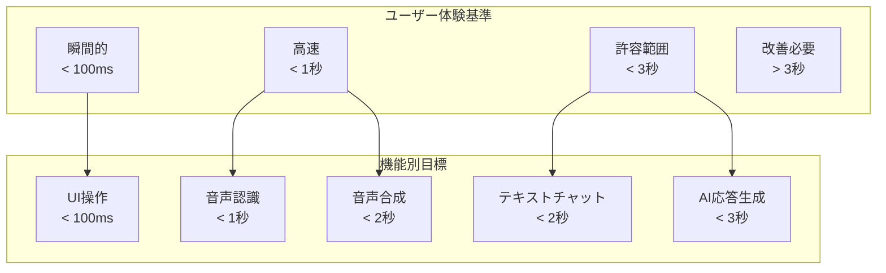

# 東京都公式アプリ AI音声対話機能
## パフォーマンス設計書（MVP版）

**文書情報**
- **文書名**: 東京都公式アプリ AI音声対話機能 パフォーマンス設計書（MVP版）
- **版数**: 1.0
- **作成日**: 2025年1月
- **作成者**: 根岸祐樹
- **備考**: MVP機能に限定したパフォーマンス設計書

---

## 1. パフォーマンス要件定義

### 1.1 目標性能指標

#### 1.1.1 レスポンス時間要件



#### 1.1.2 具体的性能目標

| 機能 | 目標時間 | 許容時間 | 測定方法 |
|------|----------|----------|----------|
| **ページ初期表示** | < 800ms | < 1.5s | FCP, LCP |
| **音声入力開始** | < 100ms | < 200ms | クリック〜録音開始 |
| **音声認識処理** | < 800ms | < 1.5s | 音声終了〜テキスト表示 |
| **AI応答生成** | < 2s | < 3s | テキスト送信〜応答受信 |
| **音声合成** | < 1.5s | < 2.5s | テキスト〜音声再生開始 |
| **検索処理** | < 500ms | < 1s | クエリ〜結果表示 |

#### 1.1.3 スループット要件

```typescript
interface ThroughputRequirements {
  // 同時接続ユーザー数
  concurrent_users: {
    mvp_launch: 100;
    steady_state: 500;
    peak_traffic: 1000;
    emergency_scale: 2000;
  };
  
  // リクエスト処理能力
  requests_per_second: {
    api_calls: 200;
    voice_recognition: 50;
    voice_synthesis: 100;
    chat_messages: 150;
  };
  
  // データ転送量
  bandwidth: {
    audio_upload: '50 Mbps';
    audio_download: '100 Mbps';
    total_monthly: '1 TB';
  };
}
```

### 1.2 可用性要件

#### 1.2.1 アップタイム目標
- **目標稼働率**: 99.9%（月間ダウンタイム: 43分以内）
- **計画メンテナンス**: 月1回、深夜時間帯（2-4時）
- **緊急メンテナンス**: 必要時のみ、事前通知

#### 1.2.2 復旧時間目標
- **検知時間**: 5分以内
- **初期対応**: 15分以内
- **完全復旧**: 60分以内

---

## 2. アーキテクチャパフォーマンス設計

### 2.1 フロントエンド最適化

#### 2.1.1 初期表示最適化

```typescript
// Next.js App Router 最適化設定
export default function RootLayout({
  children,
}: {
  children: React.ReactNode;
}) {
  return (
    <html lang="ja">
      <head>
        {/* Critical CSS inline */}
        <style dangerouslySetInnerHTML={{
          __html: criticalCSS
        }} />
        
        {/* Preconnect to external domains */}
        <link rel="preconnect" href="https://gemini-api.googleapis.com" />
        <link rel="preconnect" href="https://storage.googleapis.com" />
        
        {/* Resource hints */}
        <link rel="dns-prefetch" href="//fonts.googleapis.com" />
        <link rel="prefetch" href="/api/session" />
      </head>
      <body>
        {children}
        
        {/* Non-critical scripts */}
        <Script
          src="/analytics.js"
          strategy="afterInteractive"
        />
      </body>
    </html>
  );
}

// 画像最適化
import Image from 'next/image';

export function OptimizedImage({ src, alt }: ImageProps) {
  return (
    <Image
      src={src}
      alt={alt}
      width={400}
      height={300}
      loading="lazy"
      placeholder="blur"
      blurDataURL="data:image/jpeg;base64,..."
      sizes="(max-width: 768px) 100vw, (max-width: 1200px) 50vw, 33vw"
    />
  );
}
```

#### 2.1.2 コード分割・遅延読み込み

```typescript
// 動的インポートによるコード分割
const VoiceRecorder = dynamic(
  () => import('@/components/VoiceRecorder'),
  {
    loading: () => <VoiceRecorderSkeleton />,
    ssr: false // 音声機能はクライアントサイドのみ
  }
);

const SettingsModal = dynamic(
  () => import('@/components/SettingsModal'),
  { ssr: false }
);

// Route-based code splitting
export default function ChatPage() {
  return (
    <Suspense fallback={<ChatSkeleton />}>
      <ChatContainer />
    </Suspense>
  );
}

// 音声処理ライブラリの遅延読み込み
const loadAudioProcessor = async () => {
  const [
    { AudioProcessor },
    { VoiceActivityDetector }
  ] = await Promise.all([
    import('@/lib/audio/processor'),
    import('@/lib/audio/vad')
  ]);
  
  return { AudioProcessor, VoiceActivityDetector };
};
```

#### 2.1.3 キャッシュ戦略

```typescript
// Service Worker でのキャッシュ制御
const CACHE_STRATEGIES = {
  // 静的リソース: Cache First
  static: {
    strategy: 'CacheFirst',
    cacheName: 'static-resources',
    maxEntries: 100,
    maxAgeSeconds: 30 * 24 * 60 * 60 // 30日
  },
  
  // API応答: Network First with Cache Fallback
  api: {
    strategy: 'NetworkFirst',
    cacheName: 'api-responses',
    maxEntries: 50,
    maxAgeSeconds: 5 * 60 // 5分
  },
  
  // 音声ファイル: Stale While Revalidate
  audio: {
    strategy: 'StaleWhileRevalidate',
    cacheName: 'audio-files',
    maxEntries: 30,
    maxAgeSeconds: 60 * 60 // 1時間
  }
};

// Browser Cache Headers
export async function GET(request: Request) {
  const response = await generateResponse();
  
  return new Response(response, {
    headers: {
      'Cache-Control': 'public, max-age=300, s-maxage=3600',
      'ETag': generateETag(response),
      'Vary': 'Accept-Encoding, Accept-Language'
    }
  });
}
```

### 2.2 バックエンド最適化

#### 2.2.1 API応答最適化

```typescript
// レスポンス最適化ミドルウェア
export function withPerformance(handler: NextApiHandler) {
  return async (req: NextRequest, res: NextResponse) => {
    const start = performance.now();
    
    // 圧縮の有効化
    res.headers.set('Content-Encoding', 'gzip');
    
    // 並列処理の最適化
    const result = await handler(req, res);
    
    // パフォーマンス計測
    const duration = performance.now() - start;
    res.headers.set('X-Response-Time', `${duration}ms`);
    
    // 重要でない処理の後回し
    setImmediate(() => {
      logMetrics(req.url, duration);
      updateAnalytics(req, result);
    });
    
    return result;
  };
}

// データベースアクセス最適化
class OptimizedChatService {
  async processMessage(sessionId: string, message: string) {
    // 並列実行可能な処理を特定
    const [session, cachedResponse] = await Promise.all([
      this.sessionService.getSession(sessionId),
      this.cacheService.getCachedResponse(message)
    ]);
    
    // キャッシュヒット時の早期リターン
    if (cachedResponse) {
      return this.formatCachedResponse(cachedResponse);
    }
    
    // AI処理と検索を並列実行
    const [aiResponse, searchResults] = await Promise.all([
      this.geminiService.generateResponse(message),
      this.searchService.findRelevantData(message)
    ]);
    
    // 非同期でキャッシュ更新
    setImmediate(() => {
      this.cacheService.storeResponse(message, aiResponse);
    });
    
    return this.formatResponse(aiResponse, searchResults);
  }
}
```

#### 2.2.2 データベース最適化

```typescript
// Redis接続プール最適化
const redisConfig = {
  // 接続プール設定
  pool: {
    min: 2,
    max: 10,
    acquireTimeoutMillis: 3000,
    createTimeoutMillis: 3000,
    destroyTimeoutMillis: 5000,
    idleTimeoutMillis: 30000,
    reapIntervalMillis: 1000,
    createRetryIntervalMillis: 100
  },
  
  // Redis固有設定
  redis: {
    commandTimeout: 2000,
    retryStrategy: (times: number) => Math.min(times * 50, 2000),
    maxRetriesPerRequest: 3,
    lazyConnect: true,
    keepAlive: 30000
  }
};

// バッチ処理最適化
class SessionManager {
  private batchOperations: Map<string, any[]> = new Map();
  private batchTimer: NodeJS.Timeout | null = null;
  
  async updateSession(sessionId: string, data: any) {
    // バッチ処理に追加
    if (!this.batchOperations.has(sessionId)) {
      this.batchOperations.set(sessionId, []);
    }
    this.batchOperations.get(sessionId)!.push(data);
    
    // バッチ実行タイマー設定
    if (!this.batchTimer) {
      this.batchTimer = setTimeout(() => {
        this.executeBatch();
      }, 100); // 100ms でバッチ実行
    }
  }
  
  private async executeBatch() {
    const pipeline = this.redis.pipeline();
    
    for (const [sessionId, operations] of this.batchOperations) {
      const mergedData = this.mergeOperations(operations);
      pipeline.setex(
        `session:${sessionId}`,
        3600,
        JSON.stringify(mergedData)
      );
    }
    
    await pipeline.exec();
    
    this.batchOperations.clear();
    this.batchTimer = null;
  }
}
```

#### 2.2.3 外部API最適化

```typescript
// Gemini API 最適化
class OptimizedGeminiService {
  private requestQueue = new PQueue({
    concurrency: 5, // 同時リクエスト数制限
    interval: 1000, // レート制限
    intervalCap: 10
  });
  
  private circuitBreaker = new CircuitBreaker(this.callGeminiAPI, {
    timeout: 5000,
    errorThresholdPercentage: 50,
    resetTimeout: 30000
  });
  
  async generateResponse(prompt: string, options: any = {}) {
    return this.requestQueue.add(async () => {
      // リクエスト最適化
      const optimizedPrompt = this.optimizePrompt(prompt);
      const config = {
        ...options,
        maxTokens: 150, // MVP では短めの応答
        temperature: 0.7,
        streaming: true // ストリーミング応答
      };
      
      return this.circuitBreaker.fire(optimizedPrompt, config);
    });
  }
  
  private optimizePrompt(prompt: string): string {
    // プロンプト長の最適化
    if (prompt.length > 500) {
      return this.summarizePrompt(prompt);
    }
    return prompt;
  }
  
  private async callGeminiAPI(prompt: string, config: any) {
    const response = await fetch('https://gemini-api.googleapis.com/v1/chat', {
      method: 'POST',
      headers: {
        'Authorization': `Bearer ${process.env.GEMINI_API_KEY}`,
        'Content-Type': 'application/json',
      },
      body: JSON.stringify({
        prompt,
        ...config
      }),
      // タイムアウト設定
      signal: AbortSignal.timeout(5000)
    });
    
    return response.json();
  }
}
```

---

## 3. 音声処理パフォーマンス

### 3.1 音声認識最適化

#### 3.1.1 リアルタイム処理

```typescript
// ストリーミング音声認識
class StreamingVoiceRecognizer {
  private audioContext: AudioContext;
  private processor: AudioWorkletNode;
  private vadDetector: VoiceActivityDetector;
  
  constructor() {
    this.setupAudioProcessing();
  }
  
  private async setupAudioProcessing() {
    this.audioContext = new AudioContext({
      sampleRate: 16000, // Gemini API推奨サンプルレート
      latencyHint: 'interactive'
    });
    
    // Audio Worklet for efficient processing
    await this.audioContext.audioWorklet.addModule('/audio-processor.js');
    this.processor = new AudioWorkletNode(this.audioContext, 'audio-processor');
    
    // Voice Activity Detection
    this.vadDetector = new VoiceActivityDetector({
      threshold: 0.3,
      minSpeechFrames: 3,
      minSilenceFrames: 8
    });
  }
  
  async startRecording(): Promise<void> {
    const stream = await navigator.mediaDevices.getUserMedia({
      audio: {
        channelCount: 1,
        sampleRate: 16000,
        echoCancellation: true,
        noiseSuppression: true,
        autoGainControl: true
      }
    });
    
    const source = this.audioContext.createMediaStreamSource(stream);
    source.connect(this.processor);
    
    // リアルタイム処理
    this.processor.port.onmessage = (event) => {
      const audioData = event.data;
      
      // VAD による無音検出
      if (this.vadDetector.isSpeech(audioData)) {
        this.sendAudioChunk(audioData);
      }
    };
  }
  
  private sendAudioChunk(audioData: Float32Array) {
    // 音声データの最適化
    const optimizedData = this.optimizeAudioData(audioData);
    
    // WebSocket での即座送信
    this.websocket.send(optimizedData);
  }
  
  private optimizeAudioData(data: Float32Array): ArrayBuffer {
    // ダウンサンプリング (必要に応じて)
    // 音声圧縮
    // ノイズ除去
    return this.encodeAudio(data);
  }
}
```

#### 3.1.2 音声データ最適化

```typescript
// 音声データ圧縮・最適化
class AudioOptimizer {
  // WebM Opus エンコーディング（最高圧縮率）
  async encodeToWebM(audioBuffer: AudioBuffer): Promise<Blob> {
    const recorder = new MediaRecorder(stream, {
      mimeType: 'audio/webm;codecs=opus',
      audioBitsPerSecond: 16000 // 16kbps で十分な品質
    });
    
    return new Promise((resolve) => {
      const chunks: Blob[] = [];
      recorder.ondataavailable = (event) => chunks.push(event.data);
      recorder.onstop = () => resolve(new Blob(chunks));
      
      recorder.start();
      setTimeout(() => recorder.stop(), audioBuffer.duration * 1000);
    });
  }
  
  // 音声前処理
  preprocessAudio(audioData: Float32Array): Float32Array {
    // 正規化
    const normalized = this.normalizeAudio(audioData);
    
    // ノイズゲート
    const noiseGated = this.applyNoiseGate(normalized, -40); // -40dB threshold
    
    // 音声圧縮（ダイナミックレンジ圧縮）
    const compressed = this.compressAudio(noiseGated, 4.0); // 4:1 ratio
    
    return compressed;
  }
  
  private normalizeAudio(data: Float32Array): Float32Array {
    const max = Math.max(...Array.from(data).map(Math.abs));
    return data.map(sample => sample / max * 0.95);
  }
  
  private applyNoiseGate(data: Float32Array, thresholdDb: number): Float32Array {
    const threshold = Math.pow(10, thresholdDb / 20);
    return data.map(sample => 
      Math.abs(sample) > threshold ? sample : 0
    );
  }
}
```

### 3.2 音声合成最適化

#### 3.2.1 キャッシュ戦略

```typescript
// 音声合成キャッシュ管理
class TTSCacheManager {
  private cache = new Map<string, CachedAudio>();
  private lruList: string[] = [];
  private maxCacheSize = 50; // 最大キャッシュ数
  
  async synthesizeWithCache(text: string, voice: VoiceConfig): Promise<string> {
    const cacheKey = this.generateCacheKey(text, voice);
    
    // キャッシュヒット確認
    if (this.cache.has(cacheKey)) {
      this.updateLRU(cacheKey);
      const cached = this.cache.get(cacheKey)!;
      
      // 非同期でアクセス回数更新
      setImmediate(() => this.updateAccessCount(cacheKey));
      
      return cached.audioUrl;
    }
    
    // 音声合成実行
    const audioUrl = await this.synthesizeAudio(text, voice);
    
    // キャッシュに保存
    this.addToCache(cacheKey, {
      audioUrl,
      text,
      voice,
      createdAt: new Date(),
      accessCount: 1
    });
    
    return audioUrl;
  }
  
  private generateCacheKey(text: string, voice: VoiceConfig): string {
    const textHash = this.hashText(text);
    const voiceHash = this.hashVoice(voice);
    return `tts:${textHash}:${voiceHash}`;
  }
  
  private async synthesizeAudio(text: string, voice: VoiceConfig): Promise<string> {
    // テキスト最適化
    const optimizedText = this.optimizeTextForSynthesis(text);
    
    const response = await fetch('/api/voice/synthesize', {
      method: 'POST',
      headers: { 'Content-Type': 'application/json' },
      body: JSON.stringify({
        text: optimizedText,
        voice,
        format: 'mp3',
        quality: 'standard' // MVP では標準品質
      })
    });
    
    const { audioUrl } = await response.json();
    return audioUrl;
  }
  
  private optimizeTextForSynthesis(text: string): string {
    return text
      .replace(/([.!?])\s+/g, '$1<break time="500ms"/>') // 文末の間
      .replace(/,\s+/g, ',<break time="200ms"/>') // 読点の間
      .replace(/\s+/g, ' ') // 連続空白の正規化
      .trim();
  }
}
```

#### 3.2.2 ストリーミング音声配信

```typescript
// ストリーミング音声配信
export async function GET(
  request: Request,
  { params }: { params: { filename: string } }
) {
  const { filename } = params;
  const range = request.headers.get('range');
  
  // Cloud Storage から音声ファイル取得
  const file = storage.bucket('tokyo-ai-chat-mvp').file(`audio/cache/${filename}`);
  const [metadata] = await file.getMetadata();
  const fileSize = parseInt(metadata.size);
  
  if (range) {
    // Range Request 対応（ストリーミング）
    const parts = range.replace(/bytes=/, '').split('-');
    const start = parseInt(parts[0], 10);
    const end = parts[1] ? parseInt(parts[1], 10) : fileSize - 1;
    const chunkSize = (end - start) + 1;
    
    const stream = file.createReadStream({
      start,
      end
    });
    
    return new Response(stream as any, {
      status: 206,
      headers: {
        'Content-Range': `bytes ${start}-${end}/${fileSize}`,
        'Accept-Ranges': 'bytes',
        'Content-Length': chunkSize.toString(),
        'Content-Type': 'audio/mpeg',
        'Cache-Control': 'public, max-age=3600'
      }
    });
  } else {
    // 通常のファイル配信
    const stream = file.createReadStream();
    
    return new Response(stream as any, {
      headers: {
        'Content-Type': 'audio/mpeg',
        'Content-Length': fileSize.toString(),
        'Cache-Control': 'public, max-age=3600'
      }
    });
  }
}
```

---

## 4. パフォーマンス監視・測定

### 4.1 クライアントサイド監視

#### 4.1.1 Web Vitals 測定

```typescript
// Core Web Vitals 監視
import { getCLS, getFID, getFCP, getLCP, getTTFB } from 'web-vitals';

class PerformanceMonitor {
  constructor() {
    this.setupWebVitalsMonitoring();
    this.setupCustomMetrics();
  }
  
  private setupWebVitalsMonitoring() {
    // Core Web Vitals
    getCLS(this.sendMetric.bind(this, 'CLS'));
    getFID(this.sendMetric.bind(this, 'FID'));
    getFCP(this.sendMetric.bind(this, 'FCP'));
    getLCP(this.sendMetric.bind(this, 'LCP'));
    getTTFB(this.sendMetric.bind(this, 'TTFB'));
  }
  
  private setupCustomMetrics() {
    // カスタムメトリクス
    this.measureAudioLatency();
    this.measureAPIResponseTime();
    this.measureUserInteractionDelay();
  }
  
  private measureAudioLatency() {
    let recordingStartTime: number;
    
    // 音声入力開始
    document.addEventListener('voiceRecordingStart', () => {
      recordingStartTime = performance.now();
    });
    
    // 音声認識完了
    document.addEventListener('voiceRecognitionComplete', () => {
      const latency = performance.now() - recordingStartTime;
      this.sendMetric('voice_recognition_latency', { value: latency });
    });
  }
  
  private measureAPIResponseTime() {
    // Fetch API のインターセプト
    const originalFetch = window.fetch;
    window.fetch = async (...args) => {
      const start = performance.now();
      const response = await originalFetch(...args);
      const duration = performance.now() - start;
      
      this.sendMetric('api_response_time', {
        value: duration,
        url: args[0].toString(),
        status: response.status
      });
      
      return response;
    };
  }
  
  private sendMetric(name: string, data: any) {
    // バッチ送信でパフォーマンス影響を最小化
    this.metricsQueue.push({ name, data, timestamp: Date.now() });
    
    if (this.metricsQueue.length >= 10) {
      this.flushMetrics();
    }
  }
  
  private flushMetrics() {
    navigator.sendBeacon('/api/metrics', JSON.stringify(this.metricsQueue));
    this.metricsQueue = [];
  }
}

// React パフォーマンス監視
export function PerformanceProfiler({ children }: { children: React.ReactNode }) {
  const onRenderCallback = useCallback((
    id: string,
    phase: 'mount' | 'update',
    actualDuration: number,
    baseDuration: number,
    startTime: number,
    commitTime: number
  ) => {
    // レンダリングパフォーマンス監視
    if (actualDuration > 16) { // 60fps基準
      console.warn(`Slow render detected: ${id} took ${actualDuration}ms`);
    }
    
    // メトリクス送信
    window.performanceMonitor?.sendMetric('react_render_time', {
      component: id,
      phase,
      duration: actualDuration,
      baseDuration
    });
  }, []);
  
  return (
    <Profiler id="App" onRender={onRenderCallback}>
      {children}
    </Profiler>
  );
}
```

#### 4.1.2 ユーザー体験監視

```typescript
// ユーザー体験品質監視
class UXQualityMonitor {
  private interactionBuffer: UserInteraction[] = [];
  
  constructor() {
    this.setupInteractionTracking();
    this.setupErrorTracking();
    this.setupNetworkMonitoring();
  }
  
  private setupInteractionTracking() {
    // 音声操作の体験品質測定
    document.addEventListener('click', (event) => {
      if (event.target.closest('[data-voice-control]')) {
        this.trackVoiceInteraction(event);
      }
    });
    
    // スクロール性能監視
    let scrollStartTime = 0;
    document.addEventListener('scrollstart', () => {
      scrollStartTime = performance.now();
    });
    
    document.addEventListener('scrollend', () => {
      const scrollDuration = performance.now() - scrollStartTime;
      this.sendMetric('scroll_performance', { duration: scrollDuration });
    });
  }
  
  private trackVoiceInteraction(event: Event) {
    const interaction: UserInteraction = {
      type: 'voice_control',
      timestamp: performance.now(),
      element: event.target.tagName
    };
    
    // インタラクション開始
    this.interactionBuffer.push(interaction);
    
    // 完了時の測定
    const observer = new PerformanceObserver((list) => {
      for (const entry of list.getEntries()) {
        if (entry.name === 'voice-response-complete') {
          const duration = entry.startTime - interaction.timestamp;
          this.sendMetric('voice_interaction_duration', { duration });
        }
      }
    });
    
    observer.observe({ entryTypes: ['mark'] });
  }
  
  private setupErrorTracking() {
    // JavaScript エラー監視
    window.addEventListener('error', (event) => {
      this.sendMetric('javascript_error', {
        message: event.message,
        filename: event.filename,
        line: event.lineno,
        column: event.colno
      });
    });
    
    // Promise 拒否監視
    window.addEventListener('unhandledrejection', (event) => {
      this.sendMetric('promise_rejection', {
        reason: event.reason?.toString()
      });
    });
  }
  
  private setupNetworkMonitoring() {
    // ネットワーク状態監視
    navigator.connection?.addEventListener('change', () => {
      this.sendMetric('network_change', {
        effectiveType: navigator.connection.effectiveType,
        downlink: navigator.connection.downlink,
        rtt: navigator.connection.rtt
      });
    });
  }
}
```

### 4.2 サーバーサイド監視

#### 4.2.1 アプリケーション監視

```typescript
// Express/Next.js パフォーマンス監視
import { performance } from 'perf_hooks';

export function performanceMiddleware(req: Request, res: Response, next: NextFunction) {
  const start = performance.now();
  
  // レスポンス完了時の処理
  res.on('finish', () => {
    const duration = performance.now() - start;
    const metrics = {
      method: req.method,
      url: req.url,
      statusCode: res.statusCode,
      duration,
      timestamp: new Date().toISOString(),
      userAgent: req.get('User-Agent'),
      contentLength: res.get('Content-Length')
    };
    
    // Cloud Monitoring への送信
    sendToCloudMonitoring('api_request_duration', metrics);
    
    // アラート条件チェック
    if (duration > 3000) {
      sendAlert('slow_response', metrics);
    }
    
    if (res.statusCode >= 500) {
      sendAlert('server_error', metrics);
    }
  });
  
  next();
}

// メモリ使用量監視
class MemoryMonitor {
  private timer: NodeJS.Timeout;
  
  constructor() {
    this.startMonitoring();
  }
  
  private startMonitoring() {
    this.timer = setInterval(() => {
      const usage = process.memoryUsage();
      const metrics = {
        rss: usage.rss,
        heapTotal: usage.heapTotal,
        heapUsed: usage.heapUsed,
        external: usage.external,
        timestamp: Date.now()
      };
      
      sendToCloudMonitoring('memory_usage', metrics);
      
      // メモリリーク検出
      if (usage.heapUsed > 512 * 1024 * 1024) { // 512MB
        console.warn('High memory usage detected:', usage);
        this.triggerGarbageCollection();
      }
    }, 30000); // 30秒間隔
  }
  
  private triggerGarbageCollection() {
    if (global.gc) {
      global.gc();
      console.log('Garbage collection triggered');
    }
  }
}
```

#### 4.2.2 外部API監視

```typescript
// 外部サービス監視
class ExternalServiceMonitor {
  private geminiMetrics = new Map<string, any>();
  private redisMetrics = new Map<string, any>();
  
  async monitorGeminiAPI(operation: string, apiCall: () => Promise<any>) {
    const start = performance.now();
    let success = false;
    
    try {
      const result = await apiCall();
      success = true;
      return result;
    } catch (error) {
      console.error('Gemini API error:', error);
      throw error;
    } finally {
      const duration = performance.now() - start;
      
      this.recordGeminiMetrics(operation, {
        duration,
        success,
        timestamp: Date.now()
      });
    }
  }
  
  private recordGeminiMetrics(operation: string, metrics: any) {
    const key = `gemini_${operation}`;
    const existing = this.geminiMetrics.get(key) || {
      totalCalls: 0,
      successCalls: 0,
      totalDuration: 0,
      maxDuration: 0,
      minDuration: Infinity
    };
    
    existing.totalCalls++;
    if (metrics.success) existing.successCalls++;
    existing.totalDuration += metrics.duration;
    existing.maxDuration = Math.max(existing.maxDuration, metrics.duration);
    existing.minDuration = Math.min(existing.minDuration, metrics.duration);
    
    this.geminiMetrics.set(key, existing);
    
    // 定期的にメトリクス送信
    if (existing.totalCalls % 10 === 0) {
      sendToCloudMonitoring(`gemini_api_${operation}`, {
        avgDuration: existing.totalDuration / existing.totalCalls,
        successRate: existing.successCalls / existing.totalCalls,
        maxDuration: existing.maxDuration,
        minDuration: existing.minDuration
      });
    }
  }
  
  async monitorRedisOperation(operation: string, redisCall: () => Promise<any>) {
    const start = performance.now();
    
    try {
      return await Promise.race([
        redisCall(),
        new Promise((_, reject) => 
          setTimeout(() => reject(new Error('Redis timeout')), 2000)
        )
      ]);
    } catch (error) {
      console.error('Redis error:', error);
      
      // Circuit breaker パターン
      this.handleRedisError(operation, error);
      throw error;
    } finally {
      const duration = performance.now() - start;
      this.recordRedisMetrics(operation, duration);
    }
  }
}
```

---

## 5. パフォーマンス最適化戦略

### 5.1 段階的最適化計画

#### 5.1.1 フェーズ1: 基本最適化（MVP時）

```typescript
const mvpOptimizations = {
  // 必須最適化
  critical: [
    {
      area: 'Bundle Size',
      action: 'Tree shaking, Code splitting',
      target: '< 200KB initial bundle',
      impact: 'High'
    },
    {
      area: 'Image Optimization', 
      action: 'WebP format, Lazy loading',
      target: '< 1MB total images',
      impact: 'High'
    },
    {
      area: 'API Caching',
      action: 'Redis cache for common queries',
      target: '90% cache hit rate',
      impact: 'High'
    }
  ],
  
  // 推奨最適化
  recommended: [
    {
      area: 'Service Worker',
      action: 'Static resource caching',
      target: 'Offline page access',
      impact: 'Medium'
    },
    {
      area: 'Database Queries',
      action: 'Query optimization, Indexing',
      target: '< 50ms query time',
      impact: 'Medium'
    }
  ]
};
```

#### 5.1.2 フェーズ2: 高度最適化（本格運用時）

```typescript
const advancedOptimizations = {
  // パフォーマンス向上
  performance: [
    {
      area: 'Edge Computing',
      action: 'Cloudflare Workers, Edge cache',
      target: 'Global < 100ms latency',
      impact: 'High'
    },
    {
      area: 'HTTP/3',
      action: 'QUIC protocol support',
      target: 'Faster connection setup',
      impact: 'Medium'
    },
    {
      area: 'Preloading',
      action: 'Predictive prefetching',
      target: 'Instant page transitions',
      impact: 'High'
    }
  ],
  
  // スケーラビリティ
  scalability: [
    {
      area: 'Auto Scaling',
      action: 'Predictive scaling',
      target: 'Proactive capacity management',
      impact: 'High'
    },
    {
      area: 'Database Sharding',
      action: 'Horizontal partitioning',
      target: 'Linear scalability',
      impact: 'High'
    }
  ]
};
```

### 5.2 パフォーマンス予算管理

#### 5.2.1 リソース予算

```typescript
const performanceBudget = {
  // ファイルサイズ予算
  assets: {
    javascript: {
      initial: '150 KB',
      total: '300 KB',
      chunks: '50 KB per chunk'
    },
    css: {
      initial: '20 KB',
      total: '50 KB'
    },
    images: {
      hero: '200 KB',
      thumbnail: '20 KB',
      total: '1 MB'
    },
    fonts: {
      total: '100 KB',
      woff2: 'Required format'
    }
  },
  
  // タイミング予算
  timing: {
    fcp: '1.5s',
    lcp: '2.5s',
    fid: '100ms',
    cls: '0.1',
    ttfb: '500ms'
  },
  
  // ネットワーク予算
  network: {
    requests: '< 50 requests',
    bandwidth: '< 2MB total',
    api_calls: '< 10 per page'
  }
};

// 予算監視
class BudgetMonitor {
  checkBudget(metrics: PerformanceMetrics): BudgetResult {
    const violations: BudgetViolation[] = [];
    
    // JavaScript サイズチェック
    if (metrics.bundleSize > parseSize(performanceBudget.assets.javascript.initial)) {
      violations.push({
        category: 'Bundle Size',
        current: metrics.bundleSize,
        budget: performanceBudget.assets.javascript.initial,
        severity: 'error'
      });
    }
    
    // Core Web Vitals チェック
    if (metrics.lcp > parseTime(performanceBudget.timing.lcp)) {
      violations.push({
        category: 'LCP',
        current: metrics.lcp,
        budget: performanceBudget.timing.lcp,
        severity: 'warning'
      });
    }
    
    return {
      passed: violations.length === 0,
      violations
    };
  }
}
```

### 5.3 継続的最適化

#### 5.3.1 自動最適化

```typescript
// Webpack 最適化設定
const webpackConfig = {
  optimization: {
    // Bundle 分析・最適化
    splitChunks: {
      chunks: 'all',
      cacheGroups: {
        vendor: {
          test: /[\\/]node_modules[\\/]/,
          name: 'vendors',
          chunks: 'all',
          maxSize: 200000 // 200KB
        },
        common: {
          name: 'common',
          minChunks: 2,
          chunks: 'all',
          maxSize: 100000 // 100KB
        }
      }
    },
    
    // 未使用コード除去
    usedExports: true,
    sideEffects: false,
    
    // 圧縮最適化
    minimize: true,
    minimizer: [
      new TerserPlugin({
        terserOptions: {
          compress: {
            drop_console: true, // 本番環境でconsole削除
            drop_debugger: true,
            pure_funcs: ['console.log']
          }
        }
      })
    ]
  },
  
  // パフォーマンス警告
  performance: {
    maxAssetSize: 200000, // 200KB
    maxEntrypointSize: 300000, // 300KB
    hints: 'warning'
  }
};

// 自動画像最適化
class ImageOptimizer {
  async optimizeImages(images: string[]): Promise<void> {
    const optimizationPromises = images.map(async (imagePath) => {
      // WebP 変換
      await sharp(imagePath)
        .webp({ quality: 80 })
        .toFile(imagePath.replace(/\.(jpg|png)$/, '.webp'));
      
      // AVIF 変換（最新ブラウザ用）
      await sharp(imagePath)
        .avif({ quality: 70 })
        .toFile(imagePath.replace(/\.(jpg|png)$/, '.avif'));
      
      // サイズ最適化
      await sharp(imagePath)
        .resize(800, 600, { fit: 'inside', withoutEnlargement: true })
        .jpeg({ quality: 85, progressive: true })
        .toFile(imagePath.replace(/\.jpg$/, '-optimized.jpg'));
    });
    
    await Promise.all(optimizationPromises);
  }
}
```

#### 5.3.2 パフォーマンステスト自動化

```typescript
// Lighthouse CI 設定
const lighthouseConfig = {
  ci: {
    collect: {
      numberOfRuns: 3,
      settings: {
        chromeFlags: '--no-sandbox --headless'
      }
    },
    assert: {
      assertions: {
        'categories:performance': ['error', { minScore: 0.8 }],
        'categories:accessibility': ['error', { minScore: 0.9 }],
        'categories:best-practices': ['error', { minScore: 0.8 }],
        'categories:seo': ['error', { minScore: 0.8 }],
        'first-contentful-paint': ['error', { maxNumericValue: 1500 }],
        'largest-contentful-paint': ['error', { maxNumericValue: 2500 }],
        'cumulative-layout-shift': ['error', { maxNumericValue: 0.1 }]
      }
    },
    upload: {
      target: 'temporary-public-storage'
    }
  }
};

// 継続的パフォーマンステスト
class ContinuousPerformanceTesting {
  async runPerformanceTests(): Promise<TestResults> {
    const results = await Promise.all([
      this.runLighthouseTest(),
      this.runLoadTest(),
      this.runAPIPerformanceTest()
    ]);
    
    return this.aggregateResults(results);
  }
  
  private async runLighthouseTest(): Promise<LighthouseResult> {
    // Lighthouse テスト実行
    const lighthouse = await import('lighthouse');
    const chrome = await import('chrome-launcher');
    
    const chromeLauncher = await chrome.launch({ chromeFlags: ['--headless'] });
    const result = await lighthouse.default('http://localhost:3000', {
      port: chromeLauncher.port,
      onlyCategories: ['performance']
    });
    
    await chromeLauncher.kill();
    return result;
  }
  
  private async runLoadTest(): Promise<LoadTestResult> {
    // K6 負荷テスト
    const k6Script = `
      import http from 'k6/http';
      import { check } from 'k6';
      
      export let options = {
        stages: [
          { duration: '2m', target: 100 },
          { duration: '5m', target: 100 },
          { duration: '2m', target: 200 },
          { duration: '5m', target: 200 },
          { duration: '2m', target: 0 },
        ],
        thresholds: {
          http_req_duration: ['p(95)<2000'],
          http_req_failed: ['rate<0.1'],
        },
      };
      
      export default function() {
        let response = http.get('http://localhost:3000/api/chat');
        check(response, {
          'status is 200': (r) => r.status === 200,
          'response time < 2s': (r) => r.timings.duration < 2000,
        });
      }
    `;
    
    return this.executeK6Test(k6Script);
  }
}
```

このパフォーマンス設計書により、MVP版での性能目標達成と将来の最適化方針が明確になりました。次に、最後のタスクである設計書の整合性チェックを実行します。

<function_calls>
<invoke name="TodoWrite">
<parameter name="todos">[{"content": "OpenAPI\u4ed5\u69d8\u66f8\u3092\u4f5c\u6210\u3059\u308b", "status": "completed", "priority": "high", "id": "openapi-spec"}, {"content": "UX\u30d5\u30ed\u30fc\u8a2d\u8a08\u66f8\u3092\u4f5c\u6210\u3059\u308b", "status": "completed", "priority": "high", "id": "ux-flow-design"}, {"content": "ADR\uff08Architecture Decision Records\uff09\u3092\u4f5c\u6210\u3059\u308b", "status": "completed", "priority": "medium", "id": "adr-creation"}, {"content": "\u30d1\u30d5\u30a9\u30fc\u30de\u30f3\u30b9\u8a2d\u8a08\u66f8\u3092\u4f5c\u6210\u3059\u308b", "status": "completed", "priority": "medium", "id": "performance-design"}, {"content": "\u8a2d\u8a08\u66f8\u306e\u6574\u5408\u6027\u30c1\u30a7\u30c3\u30af\u3092\u5b9f\u884c\u3059\u308b", "status": "in_progress", "priority": "medium", "id": "consistency-check"}]