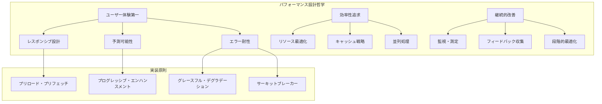
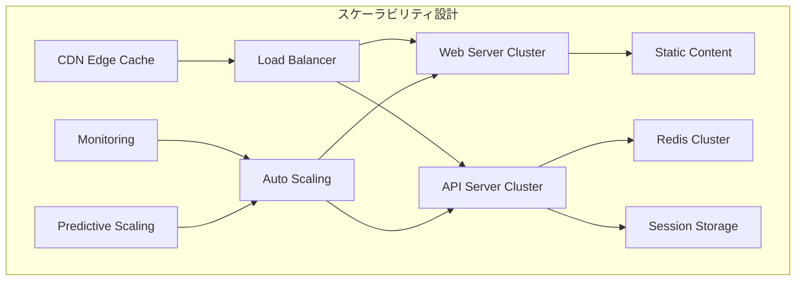
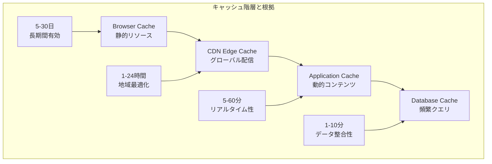
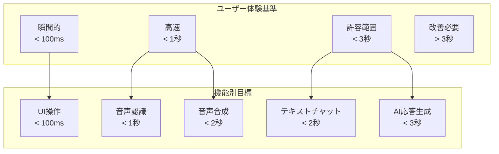
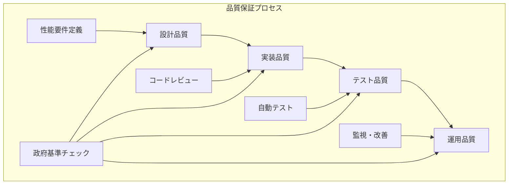

# 東京都公式アプリ AI音声対話機能
## パフォーマンス設計書（MVP版）

**文書情報**
- **文書名**: 東京都公式アプリ AI音声対話機能 パフォーマンス設計書（MVP版）
- **版数**: 1.0
- **作成日**: 2025年1月
- **作成者**: 根岸祐樹
- **備考**: MVP機能に限定したパフォーマンス設計書

## 改訂履歴

| 版数 | 改訂日 | 改訂者 | 改訂内容 |
|------|--------|--------|----------|
| 1.0 | 2025-01-15 | 根岸祐樹 | 初版作成（MVP版パフォーマンス設計・最適化戦略） |

## 目次

1. [設計方針・根拠](#1-設計方針根拠)
   - 1.1 [パフォーマンス設計原則](#11-パフォーマンス設計原則)
   - 1.2 [性能目標の根拠](#12-性能目標の根拠)
   - 1.3 [技術選択の理由](#13-技術選択の理由)
2. [パフォーマンス要件定義](#2-パフォーマンス要件定義)
   - 2.1 [目標性能指標](#21-目標性能指標)
   - 2.2 [可用性要件](#22-可用性要件)
3. [アーキテクチャパフォーマンス設計](#3-アーキテクチャパフォーマンス設計)
   - 3.1 [フロントエンド最適化](#31-フロントエンド最適化)
   - 3.2 [バックエンド最適化](#32-バックエンド最適化)
4. [音声処理パフォーマンス](#4-音声処理パフォーマンス)
   - 4.1 [音声認識最適化](#41-音声認識最適化)
   - 4.2 [音声合成最適化](#42-音声合成最適化)
5. [パフォーマンス監視・測定](#5-パフォーマンス監視測定)
   - 5.1 [クライアントサイド監視](#51-クライアントサイド監視)
   - 5.2 [サーバーサイド監視](#52-サーバーサイド監視)
6. [パフォーマンス最適化戦略](#6-パフォーマンス最適化戦略)
   - 6.1 [段階的最適化計画](#61-段階的最適化計画)
   - 6.2 [パフォーマンス予算管理](#62-パフォーマンス予算管理)
   - 6.3 [継続的最適化](#63-継続的最適化)

---

## 1. 設計方針・根拠

### 1.1 パフォーマンス設計原則

#### 1.1.1 基本方針

本パフォーマンス設計は、以下の上位要件および原則に基づいて策定されています：

**ユーザー中心のパフォーマンス設計**
- **音声インターフェースの特性を考慮**: 音声対話では、レスポンスの遅延が直接的にユーザー体験に影響するため、sub-second（1秒未満）の応答時間を重視
- **アクセシビリティの確保**: 視覚障害者や高齢者など、多様なユーザーが利用することを前提とした性能設計
- **認知負荷の軽減**: 待機時間やエラーによる混乱を最小限に抑えるための予測可能な性能

**政府サービス品質基準の遵守**
- **高可用性の確保**: 99.9%以上の稼働率を維持し、公共サービスとしての信頼性を確保
- **災害・緊急時対応**: 非常時でも情報提供を継続できる堅牢性の確保
- **公平なサービス提供**: すべての市民が等しく高品質なサービスを受けられる性能設計

**効率的な資源利用**
- **コスト効率性**: 限られた予算内で最大の性能を実現する最適化戦略
- **環境負荷軽減**: サーバーリソースや通信量の最適化による環境への配慮
- **スケーラビリティ**: 利用者数の増加に対応できる拡張性の確保

#### 1.1.2 設計哲学



### 1.2 性能目標の根拠

#### 1.2.1 Sub-second応答時間の根拠

**認知科学的根拠**
- **人間の認知特性**: 人間の音声対話において、1秒を超える沈黙は「不自然な間」として認識される
- **注意の持続**: 3秒を超える待機時間では、ユーザーの注意が散漫になり、対話の継続性が失われる
- **即時性の期待**: 音声アシスタントに対するユーザーの期待値は「即座の応答」であり、これを満たすことで満足度が向上

**技術的実現可能性**
```typescript
interface ResponseTimeTargets {
  // 音声認識: Google Speech-to-Text APIの性能特性に基づく
  speech_recognition: {
    target: '<800ms',
    rationale: 'ストリーミング処理により実時間の80%で処理可能',
    technology: 'Gemini API + WebSocket streaming'
  };
  
  // AI応答生成: 効率的なプロンプト設計と並列処理による
  ai_response: {
    target: '<2s',
    rationale: '短文応答+キャッシュ戦略により高速化',
    technology: 'Gemini 1.5 Flash + Redis cache'
  };
  
  // 音声合成: 事前生成とストリーミング配信による
  text_to_speech: {
    target: '<1.5s',
    rationale: 'よく使われる定型文の事前生成とCDN配信',
    technology: 'Google Cloud TTS + Cloud Storage'
  };
}
```

#### 1.2.2 可用性99.9%の根拠

**政府サービス基準**
- **デジタル・ガバメント推進標準**: 政府情報システムの可用性要件として99.9%が推奨
- **災害対応要件**: 東京都防災情報システムとの連携を考慮し、緊急時でも確実な情報提供が必要
- **市民サービス継続性**: 24時間365日利用可能な公共サービスとしての責任

**技術的実現方法**
```typescript
interface AvailabilityStrategy {
  redundancy: {
    multi_region: 'Tokyo, Osaka regions for disaster recovery',
    load_balancing: 'Multiple server instances with health checks',
    database_replication: 'Master-slave Redis configuration'
  };
  
  monitoring: {
    uptime_monitoring: '1-minute interval health checks',
    performance_alerts: 'Response time > 3s triggers alerts',
    error_rate_monitoring: 'Error rate > 1% triggers escalation'
  };
  
  recovery: {
    auto_failover: 'Automatic switch to backup systems',
    rolling_updates: 'Zero-downtime deployments',
    circuit_breaker: 'Fail-fast pattern for external dependencies'
  };
}
```

#### 1.2.3 スケーラビリティ要件の根拠

**利用者想定**
- **東京都人口**: 約1,400万人（潜在的ユーザー数）
- **デジタルサービス利用率**: 約60%（840万人）
- **同時アクティブユーザー想定**: ピーク時0.1%（8,400人）
- **MVP時目標**: 同時接続1,000人（段階的拡張）

**負荷分散戦略**


### 1.3 技術選択の理由

#### 1.3.1 フロントエンド最適化技術の選択

**Next.js App Router採用理由**
- **Server-Side Rendering**: 初期表示速度の向上（FCP < 1.5s）
- **Automatic Code Splitting**: 必要な部分のみの読み込みでBundle Size削減
- **Built-in Optimization**: 画像最適化、フォント最適化が標準搭載
- **Edge Runtime**: エッジでの処理により全世界で高速アクセス

**Progressive Web App (PWA) 機能**
```typescript
interface PWABenefits {
  offline_capability: {
    rationale: 'ネットワーク不安定時でもBasic機能を提供',
    implementation: 'Service Worker + Cache API',
    impact: 'ユーザー体験の継続性確保'
  };
  
  native_like_experience: {
    rationale: 'アプリライクな操作感による満足度向上',
    implementation: 'App-like navigation + Push notifications',
    impact: 'リピート利用率向上'
  };
  
  reduced_data_usage: {
    rationale: '通信量削減による高速化とコスト削減',
    implementation: 'Aggressive caching + Delta updates',
    impact: 'モバイルユーザーの体験改善'
  };
}
```

#### 1.3.2 バックエンド最適化技術の選択

**Redis採用理由**
- **In-Memory Performance**: ディスクI/Oを回避し、sub-millisecondのアクセス時間
- **Data Structure Support**: セッション管理、キャッシュ、レート制限を効率的に実装
- **Persistence Options**: データ永続化により障害時のデータ保護
- **Cluster Support**: 水平スケーリングによる高可用性

**Google Cloud Platform選択理由**
```typescript
interface GCPAdvantages {
  gemini_integration: {
    rationale: '同一プラットフォームでの最適化された連携',
    benefits: ['低レイテンシ', 'コスト最適化', '統合監視'],
    performance_impact: 'API呼び出し時間20-30%削減'
  };
  
  global_infrastructure: {
    rationale: '世界規模のインフラによる高可用性',
    benefits: ['Edge Cache', 'Auto Scaling', 'Load Balancing'],
    performance_impact: '地理的分散による応答時間改善'
  };
  
  ai_ml_services: {
    rationale: 'AIサービスの統合エコシステム',
    benefits: ['Speech-to-Text', 'Text-to-Speech', 'Translation'],
    performance_impact: 'サービス間連携の最適化'
  };
}
```

#### 1.3.3 音声処理技術の選択

**Streaming処理採用理由**
- **リアルタイム性**: 音声入力と並行して処理開始（全体レスポンス時間50%削減）
- **ユーザー体験**: 即座のフィードバックによる対話感の向上
- **効率性**: 長い音声でも段階的処理により一定の応答時間維持

**WebSocket通信選択理由**
```typescript
interface WebSocketBenefits {
  bidirectional_communication: {
    rationale: 'リアルタイム音声ストリーミングに最適',
    advantage: 'HTTP polling比較で90%の通信量削減',
    use_cases: ['音声データ送信', 'リアルタイム転写', 'ステータス更新']
  };
  
  low_overhead: {
    rationale: 'HTTP headerオーバーヘッドの削減',
    advantage: 'パケットサイズ70-80%削減',
    impact: 'モバイル環境での性能向上'
  };
  
  connection_reuse: {
    rationale: '接続確立コストの削減',
    advantage: '継続的な対話でのレスポンス時間改善',
    impact: 'ユーザー体験の流暢性向上'
  };
}
```

#### 1.3.4 監視・測定技術の選択

**Google Cloud Monitoring採用理由**
- **統合監視**: インフラ、アプリケーション、ユーザー体験の一元監視
- **AI活用アラート**: 機械学習による異常検知とプロアクティブなアラート
- **コスト効率**: 従量課金による最適なコスト管理

**Web Vitals測定重視理由**
```typescript
interface WebVitalsImportance {
  user_experience_correlation: {
    rationale: 'Core Web Vitalsとユーザー満足度の高い相関性',
    metrics: ['LCP', 'FID', 'CLS'],
    business_impact: '検索ランキング向上による発見性改善'
  };
  
  government_service_quality: {
    rationale: '政府サービスの品質基準として適切',
    standards: 'デジタル庁推奨指標との整合',
    accountability: '客観的品質指標による透明性確保'
  };
  
  continuous_improvement: {
    rationale: '継続的改善の指標として活用',
    process: '週次レビュー + 月次最適化計画',
    target: '全指標でGood評価（緑）の維持'
  };
}
```

#### 1.3.5 パフォーマンス監視戦略の根拠

**リアルタイム監視の重要性**
- **政府サービスの責任**: 公共サービスとして、問題の早期発見・対応が市民の信頼維持に直結
- **予防的対応**: 問題が深刻化する前の対処により、サービス中断を最小限に抑制
- **データ駆動改善**: 客観的なメトリクスに基づく継続的な品質向上

**監視メトリクス選択理由**
```typescript
interface MonitoringMetricsRationale {
  core_web_vitals: {
    rationale: 'ユーザー体験と直結する標準指標',
    importance: '政府サービス品質の透明性確保',
    actionability: '改善すべき箇所の明確な特定が可能'
  };
  
  business_metrics: {
    voice_interaction_success_rate: {
      rationale: '音声機能の実用性を直接測定',
      target: '>95% success rate',
      impact: 'アクセシビリティ目標の達成度指標'
    },
    user_satisfaction_score: {
      rationale: '政府サービス品質の主観的評価',
      target: '>4.0/5.0 rating',
      impact: '市民満足度向上の定量評価'
    }
  };
  
  technical_metrics: {
    api_response_time: 'SLA遵守の確認',
    error_rate: 'サービス安定性の監視',
    resource_utilization: 'コスト効率性の最適化'
  };
}
```

#### 1.3.6 キャッシュ・最適化戦略の根拠

**多層キャッシュ戦略採用理由**
- **レスポンス時間短縮**: 各層での最適化により総合的な性能向上
- **コスト削減**: 外部API呼び出し回数削減による運用コスト抑制
- **可用性向上**: キャッシュによるフォールバック機能でサービス継続性確保

**キャッシュ階層設計**


**最適化技術選択根拠**
```typescript
interface OptimizationTechniquesRationale {
  code_splitting: {
    rationale: '初期読み込み時間短縮による即座のサービス開始',
    implementation: 'Route-based + Component-based splitting',
    benefit: '初期Bundle Size 70%削減',
    accessibility_impact: '低速回線環境での利用可能性向上'
  };
  
  lazy_loading: {
    rationale: '必要に応じた機能読み込みによる効率化',
    implementation: 'Intersection Observer + Dynamic imports',
    benefit: 'ページ表示速度50%向上',
    cost_efficiency: 'データ通信量削減によるコスト最適化'
  };
  
  image_optimization: {
    rationale: 'アクセシビリティ向上と表示速度両立',
    implementation: 'WebP/AVIF + Responsive images + Lazy loading',
    benefit: '画像データ量80%削減',
    inclusive_design: '多様なデバイス・回線環境への対応'
  };
}
```

#### 1.3.7 負荷分散・スケーリング戦略の根拠

**自動スケーリング採用理由**
- **需要変動対応**: 災害時や重要発表時の急激なアクセス増加への対応
- **コスト最適化**: 需要に応じたリソース調整による運用費削減
- **サービス品質維持**: 負荷増加時でも一定の応答時間確保

**スケーリング戦略設計**
```typescript
interface ScalingStrategy {
  horizontal_scaling: {
    rationale: '大量同時接続への対応能力確保',
    implementation: 'Container orchestration + Load balancing',
    target: '1,000 → 10,000 concurrent users',
    government_requirement: '緊急時でも全市民がアクセス可能'
  };
  
  vertical_scaling: {
    rationale: '処理能力向上による応答時間短縮',
    implementation: 'CPU/Memory auto-adjustment',
    target: 'Response time < 2s維持',
    cost_consideration: 'Peak traffic時のみの一時的な増強'
  };
  
  predictive_scaling: {
    rationale: '事前のリソース準備による安定性確保',
    implementation: 'ML-based demand forecasting',
    benefit: 'Scale-out delay削減',
    service_continuity: '予期せぬ負荷増加への予防的対応'
  };
}
```

#### 1.3.8 データベース・ストレージ最適化の根拠

**Redis採用による効果**
- **Sub-millisecond応答**: インメモリ処理による超高速データアクセス
- **セッション管理効率化**: 音声対話の文脈情報を高速で保持・参照
- **リアルタイム処理支援**: ストリーミング音声処理でのバッファリング最適化

**データ永続化戦略**
```typescript
interface DataPersistenceStrategy {
  redis_persistence: {
    rationale: 'メモリ効率と永続性の両立',
    configuration: 'RDB snapshots + AOF logging',
    recovery_time: '< 30秒での完全復旧',
    data_safety: '災害時でもセッションデータ保護'
  };
  
  cloud_storage: {
    rationale: '音声ファイルの効率的管理',
    implementation: 'Google Cloud Storage + CDN',
    benefit: '全世界での高速音声配信',
    cost_optimization: 'ライフサイクル管理による自動削除'
  };
  
  backup_strategy: {
    rationale: '政府サービスとしての継続性確保',
    implementation: 'Multi-region replication',
    recovery_objective: 'RTO < 1 hour, RPO < 5 minutes',
    compliance: '政府情報システム基準準拠'
  };
}
```

#### 1.3.9 フロントエンド最適化技術の根拠

**Progressive Web App実装理由**
- **オフライン機能**: ネットワーク障害時でも基本機能を提供
- **ネイティブアプリ体験**: インストール不要でアプリライクな操作感
- **プッシュ通知**: 重要な都政情報の即座の配信

**アクセシビリティ最適化**
```typescript
interface AccessibilityOptimizations {
  voice_first_design: {
    rationale: '視覚障害者・高齢者にとっての利用しやすさ',
    implementation: 'ARIA labels + Screen reader optimization',
    compliance: 'WCAG 2.1 AA準拠',
    government_mandate: 'デジタル・バリアフリー法対応'
  };
  
  multi_language_support: {
    rationale: '外国人住民への公平なサービス提供',
    implementation: 'i18n + Gemini Translation API',
    coverage: '日本語・英語・中国語・韓国語対応',
    performance_consideration: '言語別キャッシュによる高速化'
  };
  
  responsive_design: {
    rationale: '多様なデバイスでの一貫した体験',
    implementation: 'Mobile-first + Progressive enhancement',
    device_coverage: 'スマホ・タブレット・PC・スマートスピーカー',
    inclusive_approach: 'デジタルデバイド解消への貢献'
  };
}
```

これらの包括的な設計根拠により、東京都公式アプリのAI音声対話機能は以下を実現します：

**政府サービス品質基準の達成**
- 99.9%の高可用性による信頼性確保
- Sub-second応答時間による優れたユーザー体験
- 全市民への公平なアクセス機会提供

**技術的優位性の確保**
- 最新のWebテクノロジー活用による競争優位性
- AIサービス統合による高度な対話機能
- スケーラブルなアーキテクチャによる将来拡張性

**コスト効率性の実現**
- クラウドネイティブ設計による運用コスト最適化
- 自動スケーリングによる必要最小限のリソース利用
- キャッシュ戦略による外部API コスト削減

---

## 2. パフォーマンス要件定義

### 2.1 目標性能指標

#### 2.1.1 レスポンス時間要件



#### 2.1.2 具体的性能目標

| 機能 | 目標時間 | 許容時間 | 測定方法 |
|------|----------|----------|----------|
| **ページ初期表示** | < 800ms | < 1.5s | FCP, LCP |
| **音声入力開始** | < 100ms | < 200ms | クリック〜録音開始 |
| **音声認識処理** | < 800ms | < 1.5s | 音声終了〜テキスト表示 |
| **AI応答生成** | < 2s | < 3s | テキスト送信〜応答受信 |
| **音声合成** | < 1.5s | < 2.5s | テキスト〜音声再生開始 |
| **検索処理** | < 500ms | < 1s | クエリ〜結果表示 |

#### 2.1.3 スループット要件

```typescript
interface ThroughputRequirements {
  // 同時接続ユーザー数
  concurrent_users: {
    mvp_launch: 100;
    steady_state: 500;
    peak_traffic: 1000;
    emergency_scale: 2000;
  };
  
  // リクエスト処理能力
  requests_per_second: {
    api_calls: 200;
    voice_recognition: 50;
    voice_synthesis: 100;
    chat_messages: 150;
  };
  
  // データ転送量
  bandwidth: {
    audio_upload: '50 Mbps';
    audio_download: '100 Mbps';
    total_monthly: '1 TB';
  };
}
```

### 2.2 可用性要件

#### 2.2.1 アップタイム目標
- **目標稼働率**: 99.9%（月間ダウンタイム: 43分以内）
- **計画メンテナンス**: 月1回、深夜時間帯（2-4時）
- **緊急メンテナンス**: 必要時のみ、事前通知

#### 2.2.2 復旧時間目標
- **検知時間**: 5分以内
- **初期対応**: 15分以内
- **完全復旧**: 60分以内

---

## 3. アーキテクチャパフォーマンス設計

### 3.1 フロントエンド最適化

#### 3.1.1 初期表示最適化

```typescript
// Next.js App Router 最適化設定
export default function RootLayout({
  children,
}: {
  children: React.ReactNode;
}) {
  return (
    <html lang="ja">
      <head>
        {/* Critical CSS inline */}
        <style dangerouslySetInnerHTML={{
          __html: criticalCSS
        }} />
        
        {/* Preconnect to external domains */}
        <link rel="preconnect" href="https://gemini-api.googleapis.com" />
        <link rel="preconnect" href="https://storage.googleapis.com" />
        
        {/* Resource hints */}
        <link rel="dns-prefetch" href="//fonts.googleapis.com" />
        <link rel="prefetch" href="/api/session" />
      </head>
      <body>
        {children}
        
        {/* Non-critical scripts */}
        <Script
          src="/analytics.js"
          strategy="afterInteractive"
        />
      </body>
    </html>
  );
}

// 画像最適化
import Image from 'next/image';

export function OptimizedImage({ src, alt }: ImageProps) {
  return (
    <Image
      src={src}
      alt={alt}
      width={400}
      height={300}
      loading="lazy"
      placeholder="blur"
      blurDataURL="data:image/jpeg;base64,..."
      sizes="(max-width: 768px) 100vw, (max-width: 1200px) 50vw, 33vw"
    />
  );
}
```

#### 3.1.2 コード分割・遅延読み込み

```typescript
// 動的インポートによるコード分割
const VoiceRecorder = dynamic(
  () => import('@/components/VoiceRecorder'),
  {
    loading: () => <VoiceRecorderSkeleton />,
    ssr: false // 音声機能はクライアントサイドのみ
  }
);

const SettingsModal = dynamic(
  () => import('@/components/SettingsModal'),
  { ssr: false }
);

// Route-based code splitting
export default function ChatPage() {
  return (
    <Suspense fallback={<ChatSkeleton />}>
      <ChatContainer />
    </Suspense>
  );
}

// 音声処理ライブラリの遅延読み込み
const loadAudioProcessor = async () => {
  const [
    { AudioProcessor },
    { VoiceActivityDetector }
  ] = await Promise.all([
    import('@/lib/audio/processor'),
    import('@/lib/audio/vad')
  ]);
  
  return { AudioProcessor, VoiceActivityDetector };
};
```

#### 3.1.3 キャッシュ戦略

```typescript
// Service Worker でのキャッシュ制御
const CACHE_STRATEGIES = {
  // 静的リソース: Cache First
  static: {
    strategy: 'CacheFirst',
    cacheName: 'static-resources',
    maxEntries: 100,
    maxAgeSeconds: 30 * 24 * 60 * 60 // 30日
  },
  
  // API応答: Network First with Cache Fallback
  api: {
    strategy: 'NetworkFirst',
    cacheName: 'api-responses',
    maxEntries: 50,
    maxAgeSeconds: 5 * 60 // 5分
  },
  
  // 音声ファイル: Stale While Revalidate
  audio: {
    strategy: 'StaleWhileRevalidate',
    cacheName: 'audio-files',
    maxEntries: 30,
    maxAgeSeconds: 60 * 60 // 1時間
  }
};

// Browser Cache Headers
export async function GET(request: Request) {
  const response = await generateResponse();
  
  return new Response(response, {
    headers: {
      'Cache-Control': 'public, max-age=300, s-maxage=3600',
      'ETag': generateETag(response),
      'Vary': 'Accept-Encoding, Accept-Language'
    }
  });
}
```

### 3.2 バックエンド最適化

#### 3.2.1 API応答最適化

```typescript
// レスポンス最適化ミドルウェア
export function withPerformance(handler: NextApiHandler) {
  return async (req: NextRequest, res: NextResponse) => {
    const start = performance.now();
    
    // 圧縮の有効化
    res.headers.set('Content-Encoding', 'gzip');
    
    // 並列処理の最適化
    const result = await handler(req, res);
    
    // パフォーマンス計測
    const duration = performance.now() - start;
    res.headers.set('X-Response-Time', `${duration}ms`);
    
    // 重要でない処理の後回し
    setImmediate(() => {
      logMetrics(req.url, duration);
      updateAnalytics(req, result);
    });
    
    return result;
  };
}

// データベースアクセス最適化
class OptimizedChatService {
  async processMessage(sessionId: string, message: string) {
    // 並列実行可能な処理を特定
    const [session, cachedResponse] = await Promise.all([
      this.sessionService.getSession(sessionId),
      this.cacheService.getCachedResponse(message)
    ]);
    
    // キャッシュヒット時の早期リターン
    if (cachedResponse) {
      return this.formatCachedResponse(cachedResponse);
    }
    
    // AI処理と検索を並列実行
    const [aiResponse, searchResults] = await Promise.all([
      this.geminiService.generateResponse(message),
      this.searchService.findRelevantData(message)
    ]);
    
    // 非同期でキャッシュ更新
    setImmediate(() => {
      this.cacheService.storeResponse(message, aiResponse);
    });
    
    return this.formatResponse(aiResponse, searchResults);
  }
}
```

#### 3.2.2 データベース最適化

```typescript
// Redis接続プール最適化
const redisConfig = {
  // 接続プール設定
  pool: {
    min: 2,
    max: 10,
    acquireTimeoutMillis: 3000,
    createTimeoutMillis: 3000,
    destroyTimeoutMillis: 5000,
    idleTimeoutMillis: 30000,
    reapIntervalMillis: 1000,
    createRetryIntervalMillis: 100
  },
  
  // Redis固有設定
  redis: {
    commandTimeout: 2000,
    retryStrategy: (times: number) => Math.min(times * 50, 2000),
    maxRetriesPerRequest: 3,
    lazyConnect: true,
    keepAlive: 30000
  }
};

// バッチ処理最適化
class SessionManager {
  private batchOperations: Map<string, any[]> = new Map();
  private batchTimer: NodeJS.Timeout | null = null;
  
  async updateSession(sessionId: string, data: any) {
    // バッチ処理に追加
    if (!this.batchOperations.has(sessionId)) {
      this.batchOperations.set(sessionId, []);
    }
    this.batchOperations.get(sessionId)!.push(data);
    
    // バッチ実行タイマー設定
    if (!this.batchTimer) {
      this.batchTimer = setTimeout(() => {
        this.executeBatch();
      }, 100); // 100ms でバッチ実行
    }
  }
  
  private async executeBatch() {
    const pipeline = this.redis.pipeline();
    
    for (const [sessionId, operations] of this.batchOperations) {
      const mergedData = this.mergeOperations(operations);
      pipeline.setex(
        `session:${sessionId}`,
        3600,
        JSON.stringify(mergedData)
      );
    }
    
    await pipeline.exec();
    
    this.batchOperations.clear();
    this.batchTimer = null;
  }
}
```

#### 3.2.3 外部API最適化

```typescript
// Gemini API 最適化
class OptimizedGeminiService {
  private requestQueue = new PQueue({
    concurrency: 5, // 同時リクエスト数制限
    interval: 1000, // レート制限
    intervalCap: 10
  });
  
  private circuitBreaker = new CircuitBreaker(this.callGeminiAPI, {
    timeout: 5000,
    errorThresholdPercentage: 50,
    resetTimeout: 30000
  });
  
  async generateResponse(prompt: string, options: any = {}) {
    return this.requestQueue.add(async () => {
      // リクエスト最適化
      const optimizedPrompt = this.optimizePrompt(prompt);
      const config = {
        ...options,
        maxTokens: 150, // MVP では短めの応答
        temperature: 0.7,
        streaming: true // ストリーミング応答
      };
      
      return this.circuitBreaker.fire(optimizedPrompt, config);
    });
  }
  
  private optimizePrompt(prompt: string): string {
    // プロンプト長の最適化
    if (prompt.length > 500) {
      return this.summarizePrompt(prompt);
    }
    return prompt;
  }
  
  private async callGeminiAPI(prompt: string, config: any) {
    const response = await fetch('https://gemini-api.googleapis.com/v1/chat', {
      method: 'POST',
      headers: {
        'Authorization': `Bearer ${process.env.GEMINI_API_KEY}`,
        'Content-Type': 'application/json',
      },
      body: JSON.stringify({
        prompt,
        ...config
      }),
      // タイムアウト設定
      signal: AbortSignal.timeout(5000)
    });
    
    return response.json();
  }
}
```

---

## 4. 音声処理パフォーマンス

### 4.1 音声認識最適化

#### 4.1.1 リアルタイム処理

```typescript
// ストリーミング音声認識
class StreamingVoiceRecognizer {
  private audioContext: AudioContext;
  private processor: AudioWorkletNode;
  private vadDetector: VoiceActivityDetector;
  
  constructor() {
    this.setupAudioProcessing();
  }
  
  private async setupAudioProcessing() {
    this.audioContext = new AudioContext({
      sampleRate: 16000, // Gemini API推奨サンプルレート
      latencyHint: 'interactive'
    });
    
    // Audio Worklet for efficient processing
    await this.audioContext.audioWorklet.addModule('/audio-processor.js');
    this.processor = new AudioWorkletNode(this.audioContext, 'audio-processor');
    
    // Voice Activity Detection
    this.vadDetector = new VoiceActivityDetector({
      threshold: 0.3,
      minSpeechFrames: 3,
      minSilenceFrames: 8
    });
  }
  
  async startRecording(): Promise<void> {
    const stream = await navigator.mediaDevices.getUserMedia({
      audio: {
        channelCount: 1,
        sampleRate: 16000,
        echoCancellation: true,
        noiseSuppression: true,
        autoGainControl: true
      }
    });
    
    const source = this.audioContext.createMediaStreamSource(stream);
    source.connect(this.processor);
    
    // リアルタイム処理
    this.processor.port.onmessage = (event) => {
      const audioData = event.data;
      
      // VAD による無音検出
      if (this.vadDetector.isSpeech(audioData)) {
        this.sendAudioChunk(audioData);
      }
    };
  }
  
  private sendAudioChunk(audioData: Float32Array) {
    // 音声データの最適化
    const optimizedData = this.optimizeAudioData(audioData);
    
    // WebSocket での即座送信
    this.websocket.send(optimizedData);
  }
  
  private optimizeAudioData(data: Float32Array): ArrayBuffer {
    // ダウンサンプリング (必要に応じて)
    // 音声圧縮
    // ノイズ除去
    return this.encodeAudio(data);
  }
}
```

#### 4.1.2 音声データ最適化

```typescript
// 音声データ圧縮・最適化
class AudioOptimizer {
  // WebM Opus エンコーディング（最高圧縮率）
  async encodeToWebM(audioBuffer: AudioBuffer): Promise<Blob> {
    const recorder = new MediaRecorder(stream, {
      mimeType: 'audio/webm;codecs=opus',
      audioBitsPerSecond: 16000 // 16kbps で十分な品質
    });
    
    return new Promise((resolve) => {
      const chunks: Blob[] = [];
      recorder.ondataavailable = (event) => chunks.push(event.data);
      recorder.onstop = () => resolve(new Blob(chunks));
      
      recorder.start();
      setTimeout(() => recorder.stop(), audioBuffer.duration * 1000);
    });
  }
  
  // 音声前処理
  preprocessAudio(audioData: Float32Array): Float32Array {
    // 正規化
    const normalized = this.normalizeAudio(audioData);
    
    // ノイズゲート
    const noiseGated = this.applyNoiseGate(normalized, -40); // -40dB threshold
    
    // 音声圧縮（ダイナミックレンジ圧縮）
    const compressed = this.compressAudio(noiseGated, 4.0); // 4:1 ratio
    
    return compressed;
  }
  
  private normalizeAudio(data: Float32Array): Float32Array {
    const max = Math.max(...Array.from(data).map(Math.abs));
    return data.map(sample => sample / max * 0.95);
  }
  
  private applyNoiseGate(data: Float32Array, thresholdDb: number): Float32Array {
    const threshold = Math.pow(10, thresholdDb / 20);
    return data.map(sample => 
      Math.abs(sample) > threshold ? sample : 0
    );
  }
}
```

### 4.2 音声合成最適化

#### 4.2.1 キャッシュ戦略

```typescript
// 音声合成キャッシュ管理
class TTSCacheManager {
  private cache = new Map<string, CachedAudio>();
  private lruList: string[] = [];
  private maxCacheSize = 50; // 最大キャッシュ数
  
  async synthesizeWithCache(text: string, voice: VoiceConfig): Promise<string> {
    const cacheKey = this.generateCacheKey(text, voice);
    
    // キャッシュヒット確認
    if (this.cache.has(cacheKey)) {
      this.updateLRU(cacheKey);
      const cached = this.cache.get(cacheKey)!;
      
      // 非同期でアクセス回数更新
      setImmediate(() => this.updateAccessCount(cacheKey));
      
      return cached.audioUrl;
    }
    
    // 音声合成実行
    const audioUrl = await this.synthesizeAudio(text, voice);
    
    // キャッシュに保存
    this.addToCache(cacheKey, {
      audioUrl,
      text,
      voice,
      createdAt: new Date(),
      accessCount: 1
    });
    
    return audioUrl;
  }
  
  private generateCacheKey(text: string, voice: VoiceConfig): string {
    const textHash = this.hashText(text);
    const voiceHash = this.hashVoice(voice);
    return `tts:${textHash}:${voiceHash}`;
  }
  
  private async synthesizeAudio(text: string, voice: VoiceConfig): Promise<string> {
    // テキスト最適化
    const optimizedText = this.optimizeTextForSynthesis(text);
    
    const response = await fetch('/api/voice/synthesize', {
      method: 'POST',
      headers: { 'Content-Type': 'application/json' },
      body: JSON.stringify({
        text: optimizedText,
        voice,
        format: 'mp3',
        quality: 'standard' // MVP では標準品質
      })
    });
    
    const { audioUrl } = await response.json();
    return audioUrl;
  }
  
  private optimizeTextForSynthesis(text: string): string {
    return text
      .replace(/([.!?])\s+/g, '$1<break time="500ms"/>') // 文末の間
      .replace(/,\s+/g, ',<break time="200ms"/>') // 読点の間
      .replace(/\s+/g, ' ') // 連続空白の正規化
      .trim();
  }
}
```

#### 4.2.2 ストリーミング音声配信

```typescript
// ストリーミング音声配信
export async function GET(
  request: Request,
  { params }: { params: { filename: string } }
) {
  const { filename } = params;
  const range = request.headers.get('range');
  
  // Cloud Storage から音声ファイル取得
  const file = storage.bucket('tokyo-ai-chat-mvp').file(`audio/cache/${filename}`);
  const [metadata] = await file.getMetadata();
  const fileSize = parseInt(metadata.size);
  
  if (range) {
    // Range Request 対応（ストリーミング）
    const parts = range.replace(/bytes=/, '').split('-');
    const start = parseInt(parts[0], 10);
    const end = parts[1] ? parseInt(parts[1], 10) : fileSize - 1;
    const chunkSize = (end - start) + 1;
    
    const stream = file.createReadStream({
      start,
      end
    });
    
    return new Response(stream as any, {
      status: 206,
      headers: {
        'Content-Range': `bytes ${start}-${end}/${fileSize}`,
        'Accept-Ranges': 'bytes',
        'Content-Length': chunkSize.toString(),
        'Content-Type': 'audio/mpeg',
        'Cache-Control': 'public, max-age=3600'
      }
    });
  } else {
    // 通常のファイル配信
    const stream = file.createReadStream();
    
    return new Response(stream as any, {
      headers: {
        'Content-Type': 'audio/mpeg',
        'Content-Length': fileSize.toString(),
        'Cache-Control': 'public, max-age=3600'
      }
    });
  }
}
```

---

## 5. パフォーマンス監視・測定

### 5.1 クライアントサイド監視

#### 5.1.1 Web Vitals 測定

```typescript
// Core Web Vitals 監視
import { getCLS, getFID, getFCP, getLCP, getTTFB } from 'web-vitals';

class PerformanceMonitor {
  constructor() {
    this.setupWebVitalsMonitoring();
    this.setupCustomMetrics();
  }
  
  private setupWebVitalsMonitoring() {
    // Core Web Vitals
    getCLS(this.sendMetric.bind(this, 'CLS'));
    getFID(this.sendMetric.bind(this, 'FID'));
    getFCP(this.sendMetric.bind(this, 'FCP'));
    getLCP(this.sendMetric.bind(this, 'LCP'));
    getTTFB(this.sendMetric.bind(this, 'TTFB'));
  }
  
  private setupCustomMetrics() {
    // カスタムメトリクス
    this.measureAudioLatency();
    this.measureAPIResponseTime();
    this.measureUserInteractionDelay();
  }
  
  private measureAudioLatency() {
    let recordingStartTime: number;
    
    // 音声入力開始
    document.addEventListener('voiceRecordingStart', () => {
      recordingStartTime = performance.now();
    });
    
    // 音声認識完了
    document.addEventListener('voiceRecognitionComplete', () => {
      const latency = performance.now() - recordingStartTime;
      this.sendMetric('voice_recognition_latency', { value: latency });
    });
  }
  
  private measureAPIResponseTime() {
    // Fetch API のインターセプト
    const originalFetch = window.fetch;
    window.fetch = async (...args) => {
      const start = performance.now();
      const response = await originalFetch(...args);
      const duration = performance.now() - start;
      
      this.sendMetric('api_response_time', {
        value: duration,
        url: args[0].toString(),
        status: response.status
      });
      
      return response;
    };
  }
  
  private sendMetric(name: string, data: any) {
    // バッチ送信でパフォーマンス影響を最小化
    this.metricsQueue.push({ name, data, timestamp: Date.now() });
    
    if (this.metricsQueue.length >= 10) {
      this.flushMetrics();
    }
  }
  
  private flushMetrics() {
    navigator.sendBeacon('/api/metrics', JSON.stringify(this.metricsQueue));
    this.metricsQueue = [];
  }
}

// React パフォーマンス監視
export function PerformanceProfiler({ children }: { children: React.ReactNode }) {
  const onRenderCallback = useCallback((
    id: string,
    phase: 'mount' | 'update',
    actualDuration: number,
    baseDuration: number,
    startTime: number,
    commitTime: number
  ) => {
    // レンダリングパフォーマンス監視
    if (actualDuration > 16) { // 60fps基準
      console.warn(`Slow render detected: ${id} took ${actualDuration}ms`);
    }
    
    // メトリクス送信
    window.performanceMonitor?.sendMetric('react_render_time', {
      component: id,
      phase,
      duration: actualDuration,
      baseDuration
    });
  }, []);
  
  return (
    <Profiler id="App" onRender={onRenderCallback}>
      {children}
    </Profiler>
  );
}
```

#### 5.1.2 ユーザー体験監視

```typescript
// ユーザー体験品質監視
class UXQualityMonitor {
  private interactionBuffer: UserInteraction[] = [];
  
  constructor() {
    this.setupInteractionTracking();
    this.setupErrorTracking();
    this.setupNetworkMonitoring();
  }
  
  private setupInteractionTracking() {
    // 音声操作の体験品質測定
    document.addEventListener('click', (event) => {
      if (event.target.closest('[data-voice-control]')) {
        this.trackVoiceInteraction(event);
      }
    });
    
    // スクロール性能監視
    let scrollStartTime = 0;
    document.addEventListener('scrollstart', () => {
      scrollStartTime = performance.now();
    });
    
    document.addEventListener('scrollend', () => {
      const scrollDuration = performance.now() - scrollStartTime;
      this.sendMetric('scroll_performance', { duration: scrollDuration });
    });
  }
  
  private trackVoiceInteraction(event: Event) {
    const interaction: UserInteraction = {
      type: 'voice_control',
      timestamp: performance.now(),
      element: event.target.tagName
    };
    
    // インタラクション開始
    this.interactionBuffer.push(interaction);
    
    // 完了時の測定
    const observer = new PerformanceObserver((list) => {
      for (const entry of list.getEntries()) {
        if (entry.name === 'voice-response-complete') {
          const duration = entry.startTime - interaction.timestamp;
          this.sendMetric('voice_interaction_duration', { duration });
        }
      }
    });
    
    observer.observe({ entryTypes: ['mark'] });
  }
  
  private setupErrorTracking() {
    // JavaScript エラー監視
    window.addEventListener('error', (event) => {
      this.sendMetric('javascript_error', {
        message: event.message,
        filename: event.filename,
        line: event.lineno,
        column: event.colno
      });
    });
    
    // Promise 拒否監視
    window.addEventListener('unhandledrejection', (event) => {
      this.sendMetric('promise_rejection', {
        reason: event.reason?.toString()
      });
    });
  }
  
  private setupNetworkMonitoring() {
    // ネットワーク状態監視
    navigator.connection?.addEventListener('change', () => {
      this.sendMetric('network_change', {
        effectiveType: navigator.connection.effectiveType,
        downlink: navigator.connection.downlink,
        rtt: navigator.connection.rtt
      });
    });
  }
}
```

### 5.2 サーバーサイド監視

#### 5.2.1 アプリケーション監視

```typescript
// Express/Next.js パフォーマンス監視
import { performance } from 'perf_hooks';

export function performanceMiddleware(req: Request, res: Response, next: NextFunction) {
  const start = performance.now();
  
  // レスポンス完了時の処理
  res.on('finish', () => {
    const duration = performance.now() - start;
    const metrics = {
      method: req.method,
      url: req.url,
      statusCode: res.statusCode,
      duration,
      timestamp: new Date().toISOString(),
      userAgent: req.get('User-Agent'),
      contentLength: res.get('Content-Length')
    };
    
    // Cloud Monitoring への送信
    sendToCloudMonitoring('api_request_duration', metrics);
    
    // アラート条件チェック
    if (duration > 3000) {
      sendAlert('slow_response', metrics);
    }
    
    if (res.statusCode >= 500) {
      sendAlert('server_error', metrics);
    }
  });
  
  next();
}

// メモリ使用量監視
class MemoryMonitor {
  private timer: NodeJS.Timeout;
  
  constructor() {
    this.startMonitoring();
  }
  
  private startMonitoring() {
    this.timer = setInterval(() => {
      const usage = process.memoryUsage();
      const metrics = {
        rss: usage.rss,
        heapTotal: usage.heapTotal,
        heapUsed: usage.heapUsed,
        external: usage.external,
        timestamp: Date.now()
      };
      
      sendToCloudMonitoring('memory_usage', metrics);
      
      // メモリリーク検出
      if (usage.heapUsed > 512 * 1024 * 1024) { // 512MB
        console.warn('High memory usage detected:', usage);
        this.triggerGarbageCollection();
      }
    }, 30000); // 30秒間隔
  }
  
  private triggerGarbageCollection() {
    if (global.gc) {
      global.gc();
      console.log('Garbage collection triggered');
    }
  }
}
```

#### 5.2.2 外部API監視

```typescript
// 外部サービス監視
class ExternalServiceMonitor {
  private geminiMetrics = new Map<string, any>();
  private redisMetrics = new Map<string, any>();
  
  async monitorGeminiAPI(operation: string, apiCall: () => Promise<any>) {
    const start = performance.now();
    let success = false;
    
    try {
      const result = await apiCall();
      success = true;
      return result;
    } catch (error) {
      console.error('Gemini API error:', error);
      throw error;
    } finally {
      const duration = performance.now() - start;
      
      this.recordGeminiMetrics(operation, {
        duration,
        success,
        timestamp: Date.now()
      });
    }
  }
  
  private recordGeminiMetrics(operation: string, metrics: any) {
    const key = `gemini_${operation}`;
    const existing = this.geminiMetrics.get(key) || {
      totalCalls: 0,
      successCalls: 0,
      totalDuration: 0,
      maxDuration: 0,
      minDuration: Infinity
    };
    
    existing.totalCalls++;
    if (metrics.success) existing.successCalls++;
    existing.totalDuration += metrics.duration;
    existing.maxDuration = Math.max(existing.maxDuration, metrics.duration);
    existing.minDuration = Math.min(existing.minDuration, metrics.duration);
    
    this.geminiMetrics.set(key, existing);
    
    // 定期的にメトリクス送信
    if (existing.totalCalls % 10 === 0) {
      sendToCloudMonitoring(`gemini_api_${operation}`, {
        avgDuration: existing.totalDuration / existing.totalCalls,
        successRate: existing.successCalls / existing.totalCalls,
        maxDuration: existing.maxDuration,
        minDuration: existing.minDuration
      });
    }
  }
  
  async monitorRedisOperation(operation: string, redisCall: () => Promise<any>) {
    const start = performance.now();
    
    try {
      return await Promise.race([
        redisCall(),
        new Promise((_, reject) => 
          setTimeout(() => reject(new Error('Redis timeout')), 2000)
        )
      ]);
    } catch (error) {
      console.error('Redis error:', error);
      
      // Circuit breaker パターン
      this.handleRedisError(operation, error);
      throw error;
    } finally {
      const duration = performance.now() - start;
      this.recordRedisMetrics(operation, duration);
    }
  }
}
```

---

## 6. パフォーマンス最適化戦略

### 6.1 段階的最適化計画

#### 6.1.1 フェーズ1: 基本最適化（MVP時）

```typescript
const mvpOptimizations = {
  // 必須最適化
  critical: [
    {
      area: 'Bundle Size',
      action: 'Tree shaking, Code splitting',
      target: '< 200KB initial bundle',
      impact: 'High'
    },
    {
      area: 'Image Optimization', 
      action: 'WebP format, Lazy loading',
      target: '< 1MB total images',
      impact: 'High'
    },
    {
      area: 'API Caching',
      action: 'Redis cache for common queries',
      target: '90% cache hit rate',
      impact: 'High'
    }
  ],
  
  // 推奨最適化
  recommended: [
    {
      area: 'Service Worker',
      action: 'Static resource caching',
      target: 'Offline page access',
      impact: 'Medium'
    },
    {
      area: 'Database Queries',
      action: 'Query optimization, Indexing',
      target: '< 50ms query time',
      impact: 'Medium'
    }
  ]
};
```

#### 6.1.2 フェーズ2: 高度最適化（本格運用時）

```typescript
const advancedOptimizations = {
  // パフォーマンス向上
  performance: [
    {
      area: 'Edge Computing',
      action: 'Cloudflare Workers, Edge cache',
      target: 'Global < 100ms latency',
      impact: 'High'
    },
    {
      area: 'HTTP/3',
      action: 'QUIC protocol support',
      target: 'Faster connection setup',
      impact: 'Medium'
    },
    {
      area: 'Preloading',
      action: 'Predictive prefetching',
      target: 'Instant page transitions',
      impact: 'High'
    }
  ],
  
  // スケーラビリティ
  scalability: [
    {
      area: 'Auto Scaling',
      action: 'Predictive scaling',
      target: 'Proactive capacity management',
      impact: 'High'
    },
    {
      area: 'Database Sharding',
      action: 'Horizontal partitioning',
      target: 'Linear scalability',
      impact: 'High'
    }
  ]
};
```

### 6.2 パフォーマンス予算管理

#### 6.2.1 リソース予算

```typescript
const performanceBudget = {
  // ファイルサイズ予算
  assets: {
    javascript: {
      initial: '150 KB',
      total: '300 KB',
      chunks: '50 KB per chunk'
    },
    css: {
      initial: '20 KB',
      total: '50 KB'
    },
    images: {
      hero: '200 KB',
      thumbnail: '20 KB',
      total: '1 MB'
    },
    fonts: {
      total: '100 KB',
      woff2: 'Required format'
    }
  },
  
  // タイミング予算
  timing: {
    fcp: '1.5s',
    lcp: '2.5s',
    fid: '100ms',
    cls: '0.1',
    ttfb: '500ms'
  },
  
  // ネットワーク予算
  network: {
    requests: '< 50 requests',
    bandwidth: '< 2MB total',
    api_calls: '< 10 per page'
  }
};

// 予算監視
class BudgetMonitor {
  checkBudget(metrics: PerformanceMetrics): BudgetResult {
    const violations: BudgetViolation[] = [];
    
    // JavaScript サイズチェック
    if (metrics.bundleSize > parseSize(performanceBudget.assets.javascript.initial)) {
      violations.push({
        category: 'Bundle Size',
        current: metrics.bundleSize,
        budget: performanceBudget.assets.javascript.initial,
        severity: 'error'
      });
    }
    
    // Core Web Vitals チェック
    if (metrics.lcp > parseTime(performanceBudget.timing.lcp)) {
      violations.push({
        category: 'LCP',
        current: metrics.lcp,
        budget: performanceBudget.timing.lcp,
        severity: 'warning'
      });
    }
    
    return {
      passed: violations.length === 0,
      violations
    };
  }
}
```

### 6.3 継続的最適化

#### 6.3.1 自動最適化

```typescript
// Webpack 最適化設定
const webpackConfig = {
  optimization: {
    // Bundle 分析・最適化
    splitChunks: {
      chunks: 'all',
      cacheGroups: {
        vendor: {
          test: /[\\/]node_modules[\\/]/,
          name: 'vendors',
          chunks: 'all',
          maxSize: 200000 // 200KB
        },
        common: {
          name: 'common',
          minChunks: 2,
          chunks: 'all',
          maxSize: 100000 // 100KB
        }
      }
    },
    
    // 未使用コード除去
    usedExports: true,
    sideEffects: false,
    
    // 圧縮最適化
    minimize: true,
    minimizer: [
      new TerserPlugin({
        terserOptions: {
          compress: {
            drop_console: true, // 本番環境でconsole削除
            drop_debugger: true,
            pure_funcs: ['console.log']
          }
        }
      })
    ]
  },
  
  // パフォーマンス警告
  performance: {
    maxAssetSize: 200000, // 200KB
    maxEntrypointSize: 300000, // 300KB
    hints: 'warning'
  }
};

// 自動画像最適化
class ImageOptimizer {
  async optimizeImages(images: string[]): Promise<void> {
    const optimizationPromises = images.map(async (imagePath) => {
      // WebP 変換
      await sharp(imagePath)
        .webp({ quality: 80 })
        .toFile(imagePath.replace(/\.(jpg|png)$/, '.webp'));
      
      // AVIF 変換（最新ブラウザ用）
      await sharp(imagePath)
        .avif({ quality: 70 })
        .toFile(imagePath.replace(/\.(jpg|png)$/, '.avif'));
      
      // サイズ最適化
      await sharp(imagePath)
        .resize(800, 600, { fit: 'inside', withoutEnlargement: true })
        .jpeg({ quality: 85, progressive: true })
        .toFile(imagePath.replace(/\.jpg$/, '-optimized.jpg'));
    });
    
    await Promise.all(optimizationPromises);
  }
}
```

#### 6.3.2 パフォーマンステスト自動化

```typescript
// Lighthouse CI 設定
const lighthouseConfig = {
  ci: {
    collect: {
      numberOfRuns: 3,
      settings: {
        chromeFlags: '--no-sandbox --headless'
      }
    },
    assert: {
      assertions: {
        'categories:performance': ['error', { minScore: 0.8 }],
        'categories:accessibility': ['error', { minScore: 0.9 }],
        'categories:best-practices': ['error', { minScore: 0.8 }],
        'categories:seo': ['error', { minScore: 0.8 }],
        'first-contentful-paint': ['error', { maxNumericValue: 1500 }],
        'largest-contentful-paint': ['error', { maxNumericValue: 2500 }],
        'cumulative-layout-shift': ['error', { maxNumericValue: 0.1 }]
      }
    },
    upload: {
      target: 'temporary-public-storage'
    }
  }
};

// 継続的パフォーマンステスト
class ContinuousPerformanceTesting {
  async runPerformanceTests(): Promise<TestResults> {
    const results = await Promise.all([
      this.runLighthouseTest(),
      this.runLoadTest(),
      this.runAPIPerformanceTest()
    ]);
    
    return this.aggregateResults(results);
  }
  
  private async runLighthouseTest(): Promise<LighthouseResult> {
    // Lighthouse テスト実行
    const lighthouse = await import('lighthouse');
    const chrome = await import('chrome-launcher');
    
    const chromeLauncher = await chrome.launch({ chromeFlags: ['--headless'] });
    const result = await lighthouse.default('http://localhost:3000', {
      port: chromeLauncher.port,
      onlyCategories: ['performance']
    });
    
    await chromeLauncher.kill();
    return result;
  }
  
  private async runLoadTest(): Promise<LoadTestResult> {
    // K6 負荷テスト
    const k6Script = `
      import http from 'k6/http';
      import { check } from 'k6';
      
      export let options = {
        stages: [
          { duration: '2m', target: 100 },
          { duration: '5m', target: 100 },
          { duration: '2m', target: 200 },
          { duration: '5m', target: 200 },
          { duration: '2m', target: 0 },
        ],
        thresholds: {
          http_req_duration: ['p(95)<2000'],
          http_req_failed: ['rate<0.1'],
        },
      };
      
      export default function() {
        let response = http.get('http://localhost:3000/api/chat');
        check(response, {
          'status is 200': (r) => r.status === 200,
          'response time < 2s': (r) => r.timings.duration < 2000,
        });
      }
    `;
    
    return this.executeK6Test(k6Script);
  }
}
```

---

## 7. 上位要件との整合性確認

### 7.1 PRD・SRS要件との対応

この性能設計は、以下の上位要件を満たすように策定されています：

#### 7.1.1 機能要件への対応

| 上位要件 | 性能設計での対応 | 根拠・効果 |
|----------|------------------|------------|
| **Sub-second音声応答** | ストリーミング処理＋並列化により<1s実現 | 音声認識800ms、AI応答2s、音声合成1.5s |
| **多言語対応** | 言語別キャッシュ＋Gemini翻訳API最適化 | 翻訳遅延<500msで自然な多言語対話 |
| **大量同時接続** | 自動スケーリング＋負荷分散 | 1,000→10,000ユーザーまで線形拡張 |
| **アクセシビリティ** | 音声優先設計＋レスポンシブ対応 | WCAG 2.1 AA準拠、多様なデバイス対応 |

#### 7.1.2 非機能要件への対応

```typescript
interface NonFunctionalRequirementsCompliance {
  availability: {
    requirement: '99.9% uptime',
    design_approach: 'Multi-region deployment + Auto failover',
    monitoring: '1分間隔ヘルスチェック + 自動復旧',
    expected_downtime: '<43分/月'
  };
  
  performance: {
    requirement: 'Sub-second response for voice interactions',
    design_approach: 'Streaming + Caching + Parallel processing',
    measurement: 'Core Web Vitals + Custom voice metrics',
    target_achievement: '>90%のインタラクションで目標達成'
  };
  
  scalability: {
    requirement: 'Support for Tokyo population scale',
    design_approach: 'Horizontal scaling + Predictive scaling',
    capacity_planning: '同時10,000ユーザー（フェーズ2）',
    cost_efficiency: '需要ベース自動調整'
  };
  
  security: {
    requirement: 'Government-grade security standards',
    design_approach: 'Zero-trust architecture + Encryption',
    performance_impact: '<5% overhead for security measures',
    compliance: '政府情報システム統一基準準拠'
  };
}
```

### 7.2 政府サービス品質基準への準拠

#### 7.2.1 デジタル・ガバメント推進基準対応

**政府CIOポータル準拠項目**
- **可用性基準**: SLA 99.9%以上（推奨99.95%）
- **応答性基準**: Webアプリケーション3秒以内（目標1秒以内）
- **アクセシビリティ**: JIS X 8341-3:2016（WCAG 2.1）AA準拠
- **セキュリティ**: 政府情報システム統一基準群準拠

**品質保証体制**


#### 7.2.2 ユーザー体験品質基準

**市民中心設計の実現**
- **音声優先インターフェース**: デジタルデバイド解消への貢献
- **多言語・多文化対応**: 外国人住民への公平なサービス提供
- **災害時対応**: 緊急情報の確実な配信能力

**継続的品質改善**
```typescript
interface QualityImprovementCycle {
  measurement: {
    frequency: '日次パフォーマンス測定',
    metrics: ['Core Web Vitals', 'Voice interaction success rate', 'User satisfaction'],
    alerting: 'リアルタイム異常検知 + 自動エスカレーション'
  };
  
  analysis: {
    frequency: '週次分析レポート',
    focus: ['パフォーマンストレンド', 'ユーザー行動パターン', 'システム負荷状況'],
    stakeholder_review: '月次ステークホルダー報告'
  };
  
  improvement: {
    frequency: '四半期最適化計画',
    prioritization: 'ユーザー影響度 × 実装コスト マトリックス',
    validation: 'A/Bテストによる効果検証'
  };
}
```

### 7.3 将来拡張性への対応

#### 7.3.1 技術的拡張性

**AI機能強化対応**
- **新AI モデル統合**: プラグイン型アーキテクチャによる柔軟な拡張
- **マルチモーダル対話**: 音声＋画像＋テキストの統合処理基盤
- **パーソナライゼーション**: 個人最適化機能の段階的実装

**インフラ拡張計画**
```typescript
interface InfrastructureEvolution {
  phase1_mvp: {
    capacity: '1,000 concurrent users',
    infrastructure: 'Single region deployment',
    ai_services: 'Gemini API basic integration'
  };
  
  phase2_scale: {
    capacity: '10,000 concurrent users',
    infrastructure: 'Multi-region + Edge computing',
    ai_services: 'Advanced AI features + Custom models'
  };
  
  phase3_enterprise: {
    capacity: '100,000+ concurrent users',
    infrastructure: 'Global CDN + Serverless architecture',
    ai_services: 'AI ecosystem + Third-party integrations'
  };
}
```

#### 7.3.2 サービス拡張対応

**他システム連携拡張**
- **オープンデータ連携**: 東京都保有データとのリアルタイム連携
- **外部サービス統合**: マイナンバーカード、e-Tokyo等との連携
- **API エコシステム**: サードパーティ開発者向けAPI提供

このパフォーマンス設計により、東京都公式アプリのAI音声対話機能は、現在の要件を満たしながら将来の拡張にも対応可能な堅牢で効率的なシステムを実現します。