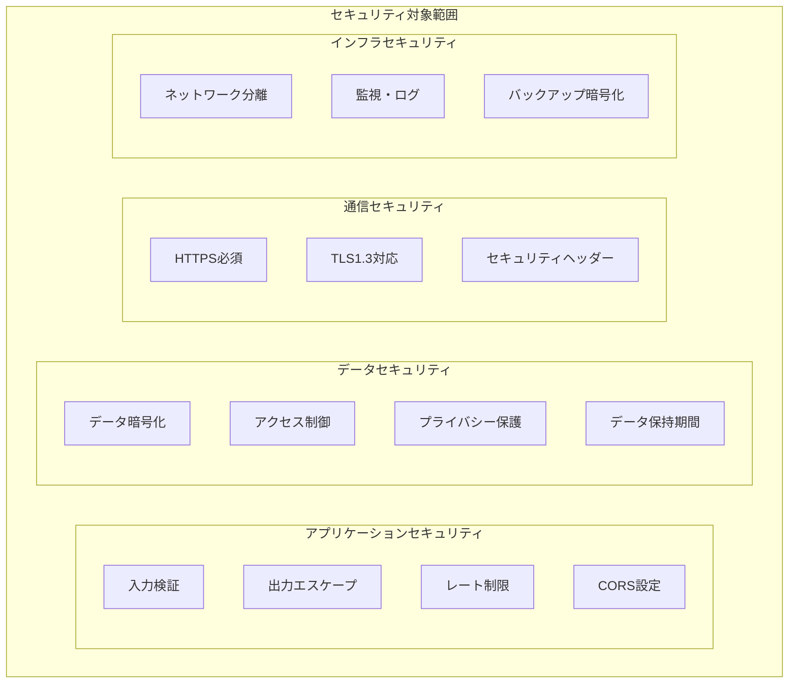
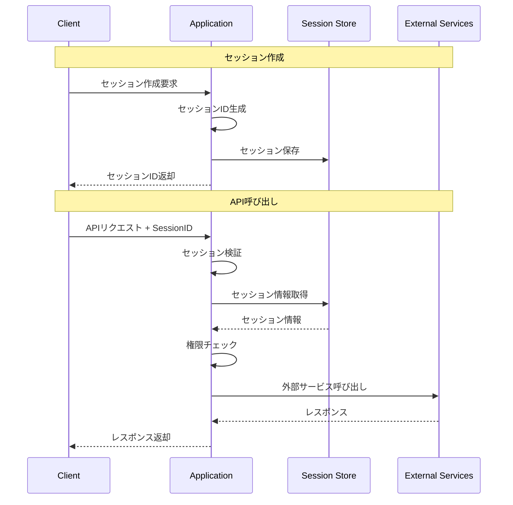

# 東京都公式アプリ AI音声対話機能
## セキュリティ設計書（MVP版）

**文書情報**
- **文書名**: 東京都公式アプリ AI音声対話機能 セキュリティ設計書（MVP版）
- **版数**: 1.0
- **作成日**: 2025年1月
- **作成者**: 根岸祐樹
- **備考**: MVP機能に限定したセキュリティ設計書

---

## 1. セキュリティ概要

### 1.1 セキュリティ方針

#### 1.1.1 基本方針
- **防御多層化**: 複数のセキュリティ層での保護
- **最小権限の原則**: 必要最小限のアクセス権限付与
- **データ保護**: 個人情報の適切な取り扱い
- **透明性**: セキュリティ対策の明確化
- **継続的改善**: 定期的なセキュリティ評価と改善

#### 1.1.2 MVP版セキュリティスコープ


### 1.2 脅威モデル分析

#### 1.2.1 STRIDE分析

| 脅威カテゴリ | 具体的脅威 | 影響度 | 対策 |
|-------------|------------|-------|------|
| **Spoofing (なりすまし)** | 偽装されたAPIリクエスト | 中 | CORS設定、セッション検証 |
| **Tampering (改ざん)** | リクエストデータ改ざん | 中 | 入力検証、HTTPS通信 |
| **Repudiation (否認)** | 操作ログの否認 | 低 | アクセスログ記録 |
| **Information Disclosure (情報漏洩)** | 音声データ・対話内容漏洩 | 高 | データ暗号化、アクセス制御 |
| **Denial of Service (サービス拒否)** | 大量リクエストによる停止 | 中 | レート制限、監視 |
| **Elevation of Privilege (権限昇格)** | 不正な管理者権限取得 | 低 | 最小権限の原則 |

#### 1.2.2 攻撃シナリオ

**シナリオ1: 大量リクエスト攻撃**
```
攻撃者 → 大量のAPIリクエスト → サービス停止
対策: レート制限、CloudFlare DDoS Protection
```

**シナリオ2: 音声データ傍受**
```
攻撃者 → ネットワーク傍受 → 音声データ取得
対策: HTTPS通信、音声データ即座削除
```

**シナリオ3: インジェクション攻撃**
```
攻撃者 → 悪意のあるペイロード → システム侵害
対策: 入力検証、出力エスケープ、WAF
```

---

## 2. 認証・認可設計

### 2.1 MVP版認証アーキテクチャ



### 2.2 セッション管理

#### 2.2.1 セッションID設計

```typescript
// セッションID生成
function generateSessionId(): string {
  // UUID v4 + タイムスタンプベースの高エントロピーID
  const uuid = crypto.randomUUID();
  const timestamp = Date.now().toString(36);
  const random = crypto.getRandomValues(new Uint8Array(8))
    .reduce((acc, byte) => acc + byte.toString(36), '');
  
  return `${uuid}-${timestamp}-${random}`;
}

// セッション検証
async function validateSession(sessionId: string): Promise<ValidationResult> {
  // 1. 形式チェック
  if (!isValidSessionIdFormat(sessionId)) {
    return { valid: false, reason: 'INVALID_FORMAT' };
  }
  
  // 2. 存在チェック
  const session = await sessionStore.get(sessionId);
  if (!session) {
    return { valid: false, reason: 'SESSION_NOT_FOUND' };
  }
  
  // 3. 有効期限チェック
  if (Date.now() > session.expiresAt) {
    await sessionStore.delete(sessionId);
    return { valid: false, reason: 'SESSION_EXPIRED' };
  }
  
  // 4. セキュリティチェック
  const securityCheck = await performSecurityCheck(session);
  if (!securityCheck.passed) {
    return { valid: false, reason: 'SECURITY_VIOLATION' };
  }
  
  return { valid: true, session };
}
```

#### 2.2.2 セッションセキュリティ

```typescript
interface SessionSecurity {
  // セッション設定
  maxAge: number;              // 3600秒（1時間）
  renewalThreshold: number;    // 300秒（5分前に更新）
  maxConcurrentSessions: number; // 5セッション/IP
  
  // セキュリティ制限
  maxRequestsPerMinute: number;  // 60回/分
  maxMessageLength: number;      // 1000文字
  maxAudioSizeBytes: number;     // 10MB
  
  // 検証設定
  validateUserAgent: boolean;    // User-Agent検証
  validateReferer: boolean;      // Referer検証
  ipWhitelist?: string[];        // IP許可リスト（将来拡張用）
}

// セッション異常検知
class SessionAnomalyDetector {
  async detectAnomaly(sessionId: string, request: any): Promise<AnomalyResult> {
    const session = await sessionStore.get(sessionId);
    const anomalies: string[] = [];
    
    // 1. リクエスト頻度チェック
    const requestCount = await this.getRecentRequestCount(sessionId, 60);
    if (requestCount > 60) {
      anomalies.push('HIGH_REQUEST_FREQUENCY');
    }
    
    // 2. 地理的位置チェック（将来拡張）
    // const location = await this.getLocationFromIP(request.ip);
    
    // 3. User-Agent変更チェック
    if (session.userAgent && session.userAgent !== request.userAgent) {
      anomalies.push('USER_AGENT_CHANGED');
    }
    
    // 4. 異常な大きさのリクエスト
    if (request.bodySize > 1024 * 1024) { // 1MB
      anomalies.push('LARGE_REQUEST_BODY');
    }
    
    return {
      anomalies,
      riskLevel: this.calculateRiskLevel(anomalies),
      action: this.determineAction(anomalies)
    };
  }
}
```

---

## 3. 入力検証・出力保護

### 3.1 入力検証

#### 3.1.1 テキスト入力検証

```typescript
// 入力検証スキーマ
const INPUT_VALIDATION_RULES = {
  chatMessage: {
    minLength: 1,
    maxLength: 1000,
    allowedCharacters: /^[\u3040-\u309F\u30A0-\u30FF\u4E00-\u9FAF\w\s.,!?()「」\-]+$/u,
    forbiddenPatterns: [
      /<script.*?>.*?<\/script>/gi,     // Script tags
      /javascript:/gi,                   // JavaScript URLs
      /on\w+\s*=/gi,                    // Event handlers
      /expression\s*\(/gi,              // CSS expressions
      /url\s*\(/gi,                     // CSS URLs
    ]
  },
  sessionId: {
    pattern: /^[0-9a-f]{8}-[0-9a-f]{4}-4[0-9a-f]{3}-[89ab][0-9a-f]{3}-[0-9a-f]{12}-[0-9a-f]+-[0-9a-f]+$/i,
    maxLength: 100
  },
  language: {
    enum: ['ja', 'en'],
    required: false
  }
};

// 検証実装
class InputValidator {
  validateChatMessage(message: string): ValidationResult {
    const rules = INPUT_VALIDATION_RULES.chatMessage;
    const errors: string[] = [];
    
    // 長さチェック
    if (message.length < rules.minLength) {
      errors.push('Message too short');
    }
    if (message.length > rules.maxLength) {
      errors.push('Message too long');
    }
    
    // 空白のみチェック
    if (message.trim().length === 0) {
      errors.push('Message cannot be empty');
    }
    
    // 文字種チェック
    if (!rules.allowedCharacters.test(message)) {
      errors.push('Invalid characters detected');
    }
    
    // 禁止パターンチェック
    for (const pattern of rules.forbiddenPatterns) {
      if (pattern.test(message)) {
        errors.push('Potentially malicious content detected');
        // セキュリティアラートログ出力
        securityLogger.alert('Malicious content detected', {
          message: message.substring(0, 100),
          pattern: pattern.toString(),
          timestamp: new Date().toISOString()
        });
        break;
      }
    }
    
    return {
      valid: errors.length === 0,
      errors,
      sanitized: this.sanitizeMessage(message)
    };
  }
  
  private sanitizeMessage(message: string): string {
    return message
      .replace(/</g, '&lt;')
      .replace(/>/g, '&gt;')
      .replace(/"/g, '&quot;')
      .replace(/'/g, '&#x27;')
      .replace(/\//g, '&#x2F;')
      .trim();
  }
}
```

#### 3.1.2 音声ファイル検証

```typescript
// 音声ファイル検証
class AudioFileValidator {
  private readonly ALLOWED_FORMATS = ['webm', 'mp3', 'wav', 'm4a'];
  private readonly MAX_FILE_SIZE = 10 * 1024 * 1024; // 10MB
  private readonly MAX_DURATION = 60; // 60秒
  
  async validateAudioFile(file: File): Promise<AudioValidationResult> {
    const errors: string[] = [];
    
    // 1. ファイルサイズチェック
    if (file.size > this.MAX_FILE_SIZE) {
      errors.push('File too large');
    }
    
    // 2. MIMEタイプチェック
    const allowedMimeTypes = [
      'audio/webm',
      'audio/mpeg',
      'audio/wav',
      'audio/x-m4a'
    ];
    
    if (!allowedMimeTypes.includes(file.type)) {
      errors.push('Unsupported file format');
    }
    
    // 3. ファイル拡張子チェック
    const extension = file.name.split('.').pop()?.toLowerCase();
    if (!extension || !this.ALLOWED_FORMATS.includes(extension)) {
      errors.push('Invalid file extension');
    }
    
    // 4. ファイルヘッダー検証（バイナリ）
    const headerCheck = await this.validateFileHeader(file);
    if (!headerCheck.valid) {
      errors.push('Invalid file header');
    }
    
    // 5. 音声長さチェック（可能な場合）
    if (headerCheck.duration && headerCheck.duration > this.MAX_DURATION) {
      errors.push('Audio too long');
    }
    
    return {
      valid: errors.length === 0,
      errors,
      metadata: headerCheck.metadata
    };
  }
  
  private async validateFileHeader(file: File): Promise<HeaderValidationResult> {
    const buffer = await file.arrayBuffer();
    const view = new DataView(buffer, 0, 12);
    
    // WAVファイルヘッダーチェック
    if (view.getUint32(0) === 0x52494646 && view.getUint32(8) === 0x57415645) {
      return { valid: true, format: 'wav', metadata: this.parseWavHeader(buffer) };
    }
    
    // WebMファイルヘッダーチェック
    if (view.getUint32(0) === 0x1A45DFA3) {
      return { valid: true, format: 'webm' };
    }
    
    // MP3ファイルヘッダーチェック
    const mp3Header = view.getUint16(0) & 0xFFFE;
    if (mp3Header === 0xFFFA || mp3Header === 0xFFFB) {
      return { valid: true, format: 'mp3' };
    }
    
    return { valid: false };
  }
}
```

### 3.2 出力保護

#### 3.2.1 XSS防止

```typescript
// HTMLエスケープ
function escapeHtml(unsafe: string): string {
  return unsafe
    .replace(/&/g, "&amp;")
    .replace(/</g, "&lt;")
    .replace(/>/g, "&gt;")
    .replace(/"/g, "&quot;")
    .replace(/'/g, "&#039;");
}

// コンテンツセキュリティポリシー
const CSP_HEADER = [
  "default-src 'self'",
  "script-src 'self' 'unsafe-inline'",
  "style-src 'self' 'unsafe-inline'",
  "img-src 'self' data: blob:",
  "media-src 'self' blob:",
  "connect-src 'self' https://generativelanguage.googleapis.com",
  "font-src 'self'",
  "object-src 'none'",
  "base-uri 'self'",
  "form-action 'self'"
].join('; ');

// セキュリティヘッダー設定
export function setSecurityHeaders(response: NextResponse): NextResponse {
  // CSP
  response.headers.set('Content-Security-Policy', CSP_HEADER);
  
  // XSS Protection
  response.headers.set('X-XSS-Protection', '1; mode=block');
  response.headers.set('X-Content-Type-Options', 'nosniff');
  response.headers.set('X-Frame-Options', 'DENY');
  
  // HSTS
  response.headers.set(
    'Strict-Transport-Security',
    'max-age=31536000; includeSubDomains; preload'
  );
  
  // Referrer Policy
  response.headers.set('Referrer-Policy', 'strict-origin-when-cross-origin');
  
  // Permissions Policy
  response.headers.set(
    'Permissions-Policy',
    'microphone=(), camera=(), geolocation=(), payment=()'
  );
  
  return response;
}
```

---

## 4. データ保護

### 4.1 暗号化

#### 4.1.1 転送時暗号化

```typescript
// TLS設定
const TLS_CONFIG = {
  minVersion: 'TLSv1.3',
  maxVersion: 'TLSv1.3',
  ciphers: [
    'TLS_AES_256_GCM_SHA384',
    'TLS_AES_128_GCM_SHA256',
    'TLS_CHACHA20_POLY1305_SHA256'
  ],
  honorCipherOrder: true,
  secureProtocol: 'TLSv1_3_method'
};

// HTTPS設定検証
class HTTPSValidator {
  validateTLSConnection(req: Request): TLSValidationResult {
    const protocol = req.headers.get('x-forwarded-proto');
    const tlsVersion = req.headers.get('ssl-protocol');
    
    if (protocol !== 'https') {
      return { valid: false, reason: 'HTTP_NOT_ALLOWED' };
    }
    
    if (tlsVersion && !tlsVersion.startsWith('TLSv1.3')) {
      return { valid: false, reason: 'WEAK_TLS_VERSION' };
    }
    
    return { valid: true };
  }
}
```

#### 4.1.2 保存時暗号化

```typescript
// 機密データ暗号化
class DataEncryption {
  private readonly ALGORITHM = 'aes-256-gcm';
  private readonly KEY_LENGTH = 32;
  private readonly IV_LENGTH = 16;
  private readonly TAG_LENGTH = 16;
  
  async encryptSensitiveData(data: string): Promise<EncryptedData> {
    const key = await this.getEncryptionKey();
    const iv = crypto.getRandomValues(new Uint8Array(this.IV_LENGTH));
    
    const cipher = crypto.createCipher(this.ALGORITHM, key);
    cipher.setAAD(Buffer.from('additional-data'));
    
    let encrypted = cipher.update(data, 'utf8', 'base64');
    encrypted += cipher.final('base64');
    
    const tag = cipher.getAuthTag();
    
    return {
      data: encrypted,
      iv: Buffer.from(iv).toString('base64'),
      tag: tag.toString('base64'),
      algorithm: this.ALGORITHM
    };
  }
  
  async decryptSensitiveData(encryptedData: EncryptedData): Promise<string> {
    const key = await this.getEncryptionKey();
    
    const decipher = crypto.createDecipher(
      encryptedData.algorithm,
      key
    );
    
    decipher.setAAD(Buffer.from('additional-data'));
    decipher.setAuthTag(Buffer.from(encryptedData.tag, 'base64'));
    
    let decrypted = decipher.update(encryptedData.data, 'base64', 'utf8');
    decrypted += decipher.final('utf8');
    
    return decrypted;
  }
  
  private async getEncryptionKey(): Promise<Buffer> {
    // Cloud KMSまたは環境変数からキー取得
    const keyString = process.env.ENCRYPTION_KEY;
    if (!keyString) {
      throw new Error('Encryption key not found');
    }
    
    return Buffer.from(keyString, 'base64');
  }
}
```

### 4.2 プライバシー保護

#### 4.2.1 個人情報保護方針

```typescript
// 個人情報分類
enum PersonalDataType {
  VOICE_DATA = 'voice_data',           // 音声データ
  CONVERSATION = 'conversation',       // 対話内容
  SESSION_DATA = 'session_data',       // セッション情報
  ACCESS_LOG = 'access_log',          // アクセスログ
  ERROR_LOG = 'error_log'             // エラーログ
}

// データ保持期間
const DATA_RETENTION_POLICY = {
  [PersonalDataType.VOICE_DATA]: {
    retention: 0,                     // 即座削除
    description: '音声ファイルは処理完了後即座に削除'
  },
  [PersonalDataType.CONVERSATION]: {
    retention: 3600,                  // 1時間（セッション期間）
    description: '対話履歴はセッション終了時に削除'
  },
  [PersonalDataType.SESSION_DATA]: {
    retention: 3600,                  // 1時間
    description: 'セッション情報は1時間で自動削除'
  },
  [PersonalDataType.ACCESS_LOG]: {
    retention: 86400 * 30,           // 30日
    description: 'アクセスログは30日間保持'
  },
  [PersonalDataType.ERROR_LOG]: {
    retention: 86400 * 30,           // 30日
    description: 'エラーログは30日間保持'
  }
};

// プライバシー保護実装
class PrivacyProtector {
  async processVoiceData(audioFile: File, sessionId: string): Promise<string> {
    try {
      // 1. 音声認識処理
      const transcript = await this.recognizeSpeech(audioFile);
      
      // 2. 音声ファイル即座削除
      await this.secureDeleteAudioFile(audioFile);
      
      // 3. ログ記録（音声内容は記録しない）
      logger.info('Voice processing completed', {
        sessionId,
        duration: audioFile.size,
        timestamp: new Date().toISOString()
      });
      
      return transcript;
      
    } catch (error) {
      // エラー時も音声ファイル削除
      await this.secureDeleteAudioFile(audioFile);
      throw error;
    }
  }
  
  private async secureDeleteAudioFile(file: File): Promise<void> {
    // メモリからのデータクリア
    if (file instanceof File) {
      // File objectのクリア（ブラウザ側）
      file = null as any;
    }
    
    // 一時ファイルがある場合は削除
    // Cloud Storageの一時ファイル削除
    // await cloudStorage.delete(tempFilePath);
  }
  
  async anonymizeConversationData(conversation: string): Promise<string> {
    // 個人情報のマスキング
    return conversation
      .replace(/\d{3}-\d{4}-\d{4}/g, '***-****-****')  // 電話番号
      .replace(/\d{7}/g, '〒*******')                    // 郵便番号
      .replace(/\d{2,4}年\d{1,2}月\d{1,2}日/g, '****年**月**日'); // 日付
  }
}
```

#### 4.2.2 データ最小化

```typescript
// データ最小化原則
class DataMinimizer {
  // セッションデータの最小化
  minimizeSessionData(session: FullSession): MinimalSession {
    return {
      id: session.id,
      language: session.language,
      createdAt: session.createdAt,
      expiresAt: session.expiresAt,
      messageCount: session.messages.length,
      // 個人識別可能情報は除外
      // messages: session.messages (除外)
      // userAgent: session.userAgent (除外)
      // ipAddress: session.ipAddress (除外)
    };
  }
  
  // ログデータの最小化
  minimizeLogData(logEntry: FullLogEntry): MinimalLogEntry {
    return {
      timestamp: logEntry.timestamp,
      level: logEntry.level,
      endpoint: logEntry.endpoint,
      statusCode: logEntry.statusCode,
      responseTime: logEntry.responseTime,
      sessionId: this.hashSessionId(logEntry.sessionId),
      // 個人識別可能情報は除外
      // ipAddress: logEntry.ipAddress (除外)
      // userAgent: logEntry.userAgent (除外)
      // requestBody: logEntry.requestBody (除外)
    };
  }
  
  private hashSessionId(sessionId: string): string {
    return crypto
      .createHash('sha256')
      .update(sessionId)
      .digest('hex')
      .substring(0, 8);
  }
}
```

---

## 5. 通信セキュリティ

### 5.1 CORS設定

```typescript
// CORS設定
const CORS_CONFIG = {
  origin: process.env.NODE_ENV === 'production' 
    ? ['https://www.metro.tokyo.lg.jp', 'https://app.metro.tokyo.lg.jp']
    : ['http://localhost:3000', 'http://localhost:3001'],
  methods: ['GET', 'POST', 'DELETE'],
  allowedHeaders: [
    'Content-Type',
    'Authorization',
    'X-Session-ID',
    'Accept-Language'
  ],
  credentials: false,
  maxAge: 86400 // 24時間
};

// CORS検証ミドルウェア
export function validateCORS(req: NextRequest): boolean {
  const origin = req.headers.get('origin');
  const referer = req.headers.get('referer');
  
  // Origin検証
  if (origin && !CORS_CONFIG.origin.includes(origin)) {
    securityLogger.warn('Invalid origin', { origin, referer });
    return false;
  }
  
  // Referer検証（追加保護）
  if (referer) {
    const refererOrigin = new URL(referer).origin;
    if (!CORS_CONFIG.origin.includes(refererOrigin)) {
      securityLogger.warn('Invalid referer', { origin, referer });
      return false;
    }
  }
  
  return true;
}
```

### 5.2 レート制限

```typescript
// レート制限設定
interface RateLimitConfig {
  windowMs: number;           // 時間窓（ミリ秒）
  maxRequests: number;        // 最大リクエスト数
  skipSuccessfulRequests: boolean;
  skipFailedRequests: boolean;
  keyGenerator: (req: Request) => string;
}

const RATE_LIMIT_CONFIGS: Record<string, RateLimitConfig> = {
  chat: {
    windowMs: 60 * 1000,      // 1分
    maxRequests: 60,          // 60回/分
    skipSuccessfulRequests: false,
    skipFailedRequests: false,
    keyGenerator: (req) => req.headers.get('X-Session-ID') || req.ip
  },
  voice: {
    windowMs: 60 * 1000,      // 1分
    maxRequests: 30,          // 30回/分
    skipSuccessfulRequests: false,
    skipFailedRequests: false,
    keyGenerator: (req) => req.headers.get('X-Session-ID') || req.ip
  },
  session: {
    windowMs: 60 * 1000,      // 1分
    maxRequests: 10,          // 10回/分
    skipSuccessfulRequests: true,
    skipFailedRequests: false,
    keyGenerator: (req) => req.ip
  }
};

// レート制限実装
class RateLimiter {
  private store = new Map<string, RequestCount>();
  
  async checkLimit(
    key: string, 
    config: RateLimitConfig
  ): Promise<RateLimitResult> {
    const now = Date.now();
    const windowStart = now - config.windowMs;
    
    // 既存の記録を取得
    let record = this.store.get(key);
    
    if (!record) {
      record = { requests: [], createdAt: now };
      this.store.set(key, record);
    }
    
    // 古いリクエストを削除
    record.requests = record.requests.filter(
      timestamp => timestamp > windowStart
    );
    
    // リクエスト数チェック
    if (record.requests.length >= config.maxRequests) {
      const oldestRequest = Math.min(...record.requests);
      const retryAfter = Math.ceil((oldestRequest + config.windowMs - now) / 1000);
      
      return {
        allowed: false,
        remainingRequests: 0,
        resetTime: oldestRequest + config.windowMs,
        retryAfter
      };
    }
    
    // 新しいリクエストを記録
    record.requests.push(now);
    
    return {
      allowed: true,
      remainingRequests: config.maxRequests - record.requests.length,
      resetTime: windowStart + config.windowMs,
      retryAfter: 0
    };
  }
  
  // 定期的なクリーンアップ
  cleanup(): void {
    const now = Date.now();
    const maxAge = 24 * 60 * 60 * 1000; // 24時間
    
    for (const [key, record] of this.store.entries()) {
      if (now - record.createdAt > maxAge) {
        this.store.delete(key);
      }
    }
  }
}
```

---

## 6. 監視・ログ

### 6.1 セキュリティ監視

#### 6.1.1 セキュリティイベント検知

```typescript
// セキュリティイベント分類
enum SecurityEventType {
  AUTHENTICATION_FAILURE = 'auth_failure',
  AUTHORIZATION_FAILURE = 'authz_failure',
  RATE_LIMIT_EXCEEDED = 'rate_limit_exceeded',
  MALICIOUS_INPUT = 'malicious_input',
  SUSPICIOUS_ACTIVITY = 'suspicious_activity',
  DATA_ACCESS_VIOLATION = 'data_access_violation',
  SYSTEM_INTRUSION = 'system_intrusion'
}

// セキュリティアラート
class SecurityAlertManager {
  private alertThresholds = {
    [SecurityEventType.RATE_LIMIT_EXCEEDED]: 10,      // 10回/時間
    [SecurityEventType.MALICIOUS_INPUT]: 1,           // 1回で即座
    [SecurityEventType.SUSPICIOUS_ACTIVITY]: 5,       // 5回/時間
    [SecurityEventType.AUTHENTICATION_FAILURE]: 20    // 20回/時間
  };
  
  async recordSecurityEvent(
    type: SecurityEventType,
    details: any,
    severity: 'low' | 'medium' | 'high' | 'critical' = 'medium'
  ): Promise<void> {
    const event: SecurityEvent = {
      id: crypto.randomUUID(),
      type,
      severity,
      timestamp: new Date().toISOString(),
      details: this.sanitizeDetails(details),
      source: {
        ip: details.ip,
        userAgent: details.userAgent,
        sessionId: details.sessionId
      }
    };
    
    // セキュリティログ記録
    securityLogger.warn('Security event detected', event);
    
    // アラート閾値チェック
    const recentEvents = await this.getRecentEvents(type, 3600000); // 1時間
    if (recentEvents.length >= this.alertThresholds[type]) {
      await this.triggerAlert(type, recentEvents);
    }
    
    // 重大な事象は即座にアラート
    if (severity === 'critical') {
      await this.triggerImmediateAlert(event);
    }
  }
  
  private async triggerAlert(
    type: SecurityEventType,
    events: SecurityEvent[]
  ): Promise<void> {
    const alert: SecurityAlert = {
      id: crypto.randomUUID(),
      type: 'THRESHOLD_EXCEEDED',
      eventType: type,
      eventCount: events.length,
      timeWindow: '1 hour',
      firstEvent: events[0].timestamp,
      lastEvent: events[events.length - 1].timestamp,
      affectedSources: this.extractUniqueSources(events)
    };
    
    // Cloud Monitoring Alert
    await this.sendCloudMonitoringAlert(alert);
    
    // 必要に応じて自動対応実行
    if (type === SecurityEventType.MALICIOUS_INPUT) {
      await this.blockSuspiciousSources(alert.affectedSources);
    }
  }
}
```

#### 6.1.2 異常検知

```typescript
// 異常検知エンジン
class AnomalyDetector {
  private baselineMetrics: BaselineMetrics;
  
  async detectAnomaly(metrics: CurrentMetrics): Promise<AnomalyResult> {
    const anomalies: DetectedAnomaly[] = [];
    
    // 1. リクエスト量異常
    if (metrics.requestsPerMinute > this.baselineMetrics.requestsPerMinute * 3) {
      anomalies.push({
        type: 'HIGH_REQUEST_VOLUME',
        severity: 'high',
        currentValue: metrics.requestsPerMinute,
        expectedValue: this.baselineMetrics.requestsPerMinute,
        confidence: 0.95
      });
    }
    
    // 2. エラー率異常
    if (metrics.errorRate > this.baselineMetrics.errorRate * 2) {
      anomalies.push({
        type: 'HIGH_ERROR_RATE',
        severity: 'medium',
        currentValue: metrics.errorRate,
        expectedValue: this.baselineMetrics.errorRate,
        confidence: 0.85
      });
    }
    
    // 3. レスポンス時間異常
    if (metrics.avgResponseTime > this.baselineMetrics.avgResponseTime * 2) {
      anomalies.push({
        type: 'HIGH_RESPONSE_TIME',
        severity: 'medium',
        currentValue: metrics.avgResponseTime,
        expectedValue: this.baselineMetrics.avgResponseTime,
        confidence: 0.90
      });
    }
    
    // 4. 地理的異常（将来拡張）
    // const geoAnomaly = await this.detectGeographicAnomaly(metrics.requestsByCountry);
    
    return {
      hasAnomalies: anomalies.length > 0,
      anomalies,
      timestamp: new Date().toISOString()
    };
  }
  
  async updateBaseline(historicalData: HistoricalMetrics[]): Promise<void> {
    // 過去30日のデータから基準値を計算
    this.baselineMetrics = {
      requestsPerMinute: this.calculateP95(
        historicalData.map(d => d.requestsPerMinute)
      ),
      errorRate: this.calculateP95(
        historicalData.map(d => d.errorRate)
      ),
      avgResponseTime: this.calculateP95(
        historicalData.map(d => d.avgResponseTime)
      )
    };
  }
}
```

### 6.2 監査ログ

#### 6.2.1 監査ログ設計

```typescript
// 監査ログエントリ
interface AuditLogEntry {
  id: string;                     // ログID
  timestamp: string;              // タイムスタンプ
  eventType: AuditEventType;      // イベント種別
  sessionId?: string;             // セッションID（ハッシュ化）
  source: {
    ip: string;                   // IPアドレス（匿名化）
    userAgent: string;            // User Agent（匿名化）
  };
  action: {
    endpoint: string;             // エンドポイント
    method: string;               // HTTPメソッド
    parameters?: any;             // パラメータ（機密情報除外）
  };
  result: {
    statusCode: number;           // ステータスコード
    responseTime: number;         // レスポンス時間
    dataAccessed?: string[];      // アクセスしたデータ種別
  };
  security: {
    threat: boolean;              // 脅威フラグ
    blocked: boolean;             // ブロックフラグ
    riskLevel: 'low' | 'medium' | 'high';
  };
}

enum AuditEventType {
  SESSION_CREATED = 'session_created',
  SESSION_DELETED = 'session_deleted',
  CHAT_MESSAGE_SENT = 'chat_message_sent',
  VOICE_RECOGNITION = 'voice_recognition',
  VOICE_SYNTHESIS = 'voice_synthesis',
  DATA_ACCESS = 'data_access',
  RATE_LIMIT_HIT = 'rate_limit_hit',
  SECURITY_VIOLATION = 'security_violation'
}
```

#### 6.2.2 監査ログ実装

```typescript
class AuditLogger {
  async logEvent(
    eventType: AuditEventType,
    req: NextRequest,
    response: NextResponse,
    additionalData?: any
  ): Promise<void> {
    const sessionId = req.headers.get('X-Session-ID');
    
    const auditEntry: AuditLogEntry = {
      id: crypto.randomUUID(),
      timestamp: new Date().toISOString(),
      eventType,
      sessionId: sessionId ? this.hashSessionId(sessionId) : undefined,
      source: {
        ip: this.anonymizeIP(this.getClientIP(req)),
        userAgent: this.anonymizeUserAgent(req.headers.get('user-agent') || '')
      },
      action: {
        endpoint: req.nextUrl.pathname,
        method: req.method,
        parameters: this.sanitizeParameters(additionalData)
      },
      result: {
        statusCode: response.status,
        responseTime: Date.now() - (req as any).startTime,
        dataAccessed: this.extractDataAccessed(eventType, additionalData)
      },
      security: {
        threat: this.assessThreat(req, additionalData),
        blocked: response.status === 429 || response.status === 403,
        riskLevel: this.calculateRiskLevel(req, additionalData)
      }
    };
    
    // Cloud Loggingに送信
    await this.sendToCloudLogging(auditEntry);
    
    // 重要なイベントは別途保存
    if (this.isCriticalEvent(eventType)) {
      await this.saveToSecureStorage(auditEntry);
    }
  }
  
  private anonymizeIP(ip: string): string {
    // IPv4の場合：最後のオクテットを0に
    if (ip.includes('.')) {
      const parts = ip.split('.');
      return `${parts[0]}.${parts[1]}.${parts[2]}.0`;
    }
    
    // IPv6の場合：下位64ビットを0に
    if (ip.includes(':')) {
      const parts = ip.split(':');
      return parts.slice(0, 4).join(':') + '::';
    }
    
    return ip;
  }
  
  private anonymizeUserAgent(userAgent: string): string {
    // バージョン番号を除去
    return userAgent
      .replace(/\d+\.\d+\.\d+/g, 'X.X.X')
      .replace(/\/\d+\.\d+/g, '/X.X')
      .substring(0, 200); // 長さ制限
  }
}
```

---

## 7. インシデント対応

### 7.1 インシデント分類

```typescript
enum IncidentSeverity {
  P1_CRITICAL = 'P1',      // システム停止、データ漏洩
  P2_HIGH = 'P2',          // 機能障害、セキュリティ侵害
  P3_MEDIUM = 'P3',        // パフォーマンス低下
  P4_LOW = 'P4'            // 軽微な問題
}

enum IncidentType {
  SECURITY_BREACH = 'security_breach',
  DATA_BREACH = 'data_breach',
  SERVICE_OUTAGE = 'service_outage',
  PERFORMANCE_DEGRADATION = 'performance_degradation',
  MALICIOUS_ACTIVITY = 'malicious_activity',
  SYSTEM_ERROR = 'system_error'
}
```

### 7.2 自動対応

```typescript
// 自動インシデント対応
class AutomatedIncidentResponse {
  async handleSecurityIncident(
    incident: SecurityIncident
  ): Promise<ResponseAction[]> {
    const actions: ResponseAction[] = [];
    
    switch (incident.type) {
      case IncidentType.MALICIOUS_ACTIVITY:
        // 悪意のある活動への対応
        actions.push(await this.blockSuspiciousIP(incident.sourceIP));
        actions.push(await this.revokeSession(incident.sessionId));
        actions.push(await this.notifySecurityTeam(incident));
        break;
        
      case IncidentType.DATA_BREACH:
        // データ漏洩への対応
        actions.push(await this.isolateAffectedSystems());
        actions.push(await this.notifyManagement(incident));
        actions.push(await this.preserveEvidence(incident));
        break;
        
      case IncidentType.SERVICE_OUTAGE:
        // サービス停止への対応
        actions.push(await this.activateFailover());
        actions.push(await this.notifyOperationsTeam(incident));
        break;
    }
    
    return actions;
  }
  
  private async blockSuspiciousIP(ip: string): Promise<ResponseAction> {
    // Cloud Armorのブロックリストに追加
    try {
      await cloudArmor.addToBlockList(ip, {
        duration: 3600, // 1時間
        reason: 'Automatic block due to suspicious activity'
      });
      
      return {
        type: 'IP_BLOCKED',
        success: true,
        target: ip,
        timestamp: new Date().toISOString()
      };
    } catch (error) {
      return {
        type: 'IP_BLOCK_FAILED',
        success: false,
        target: ip,
        error: error.message,
        timestamp: new Date().toISOString()
      };
    }
  }
}
```

### 7.3 復旧手順

```typescript
// 災害復旧手順
class DisasterRecovery {
  async executeRecoveryPlan(scenario: RecoveryScenario): Promise<void> {
    switch (scenario) {
      case RecoveryScenario.COMPLETE_SYSTEM_FAILURE:
        await this.completeSystemRecovery();
        break;
      case RecoveryScenario.DATABASE_CORRUPTION:
        await this.databaseRecovery();
        break;
      case RecoveryScenario.SECURITY_BREACH:
        await this.securityBreachRecovery();
        break;
    }
  }
  
  private async securityBreachRecovery(): Promise<void> {
    // 1. システム隔離
    await this.isolateCompromisedSystems();
    
    // 2. 全セッション無効化
    await this.invalidateAllSessions();
    
    // 3. 証跡保全
    await this.preserveForensicEvidence();
    
    // 4. システム復旧
    await this.restoreFromCleanBackup();
    
    // 5. セキュリティ強化
    await this.applySecurityPatches();
    
    // 6. 監視強化
    await this.enhanceMonitoring();
    
    // 7. サービス再開
    await this.resumeService();
  }
}
```

このセキュリティ設計書では、MVP版で必要なセキュリティ対策を包括的に定義しました。次に、運用・デプロイ設計書の作成に進みます。