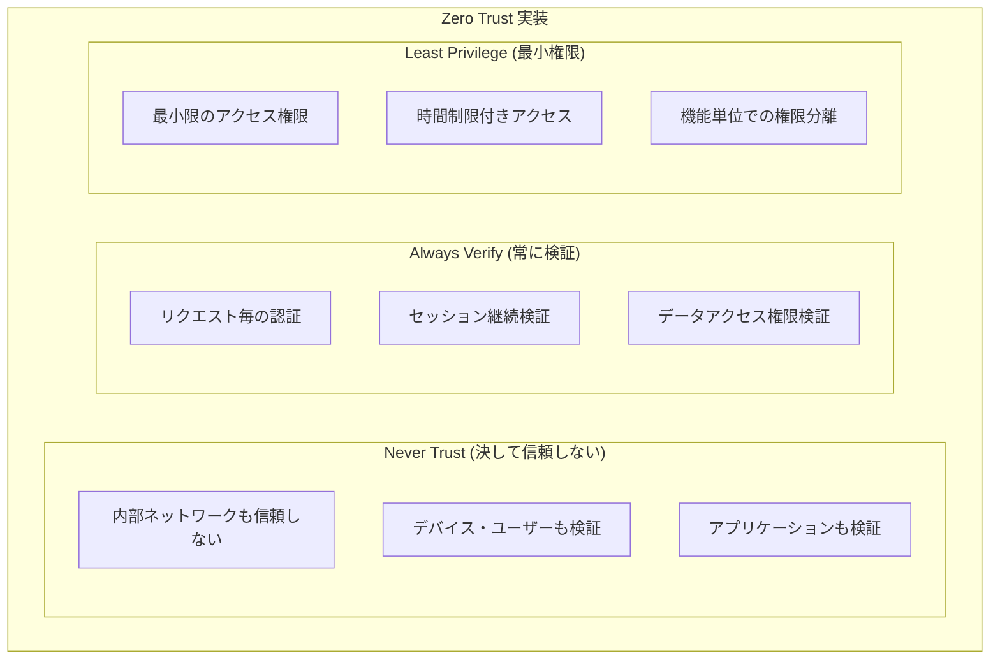
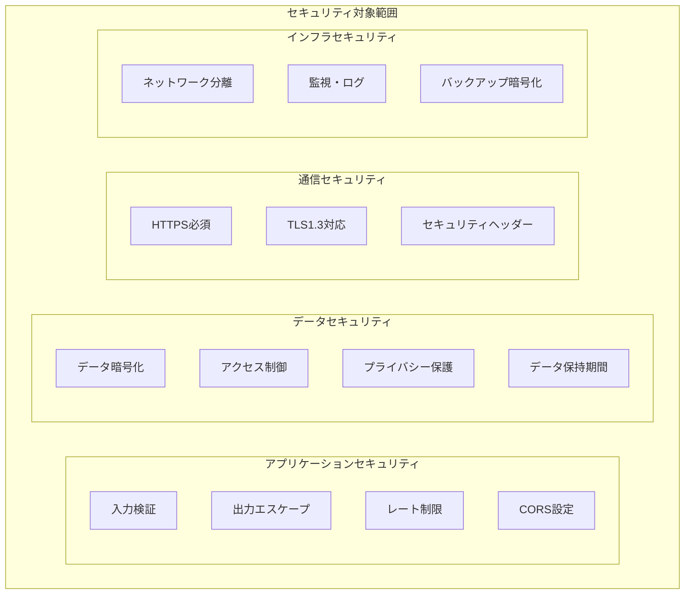
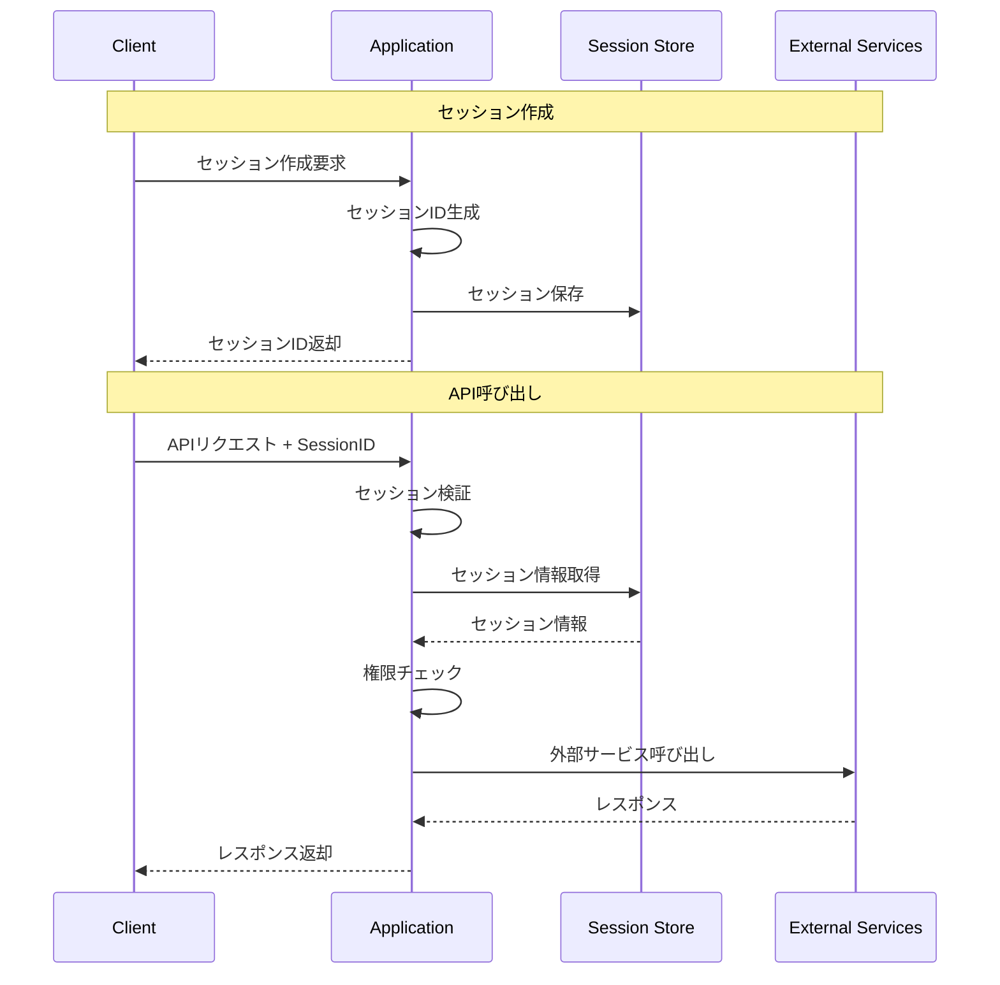

# 東京都公式アプリ AI音声対話機能
## セキュリティ設計書（MVP版）

**文書情報**
- **文書名**: 東京都公式アプリ AI音声対話機能 セキュリティ設計書（MVP版）
- **版数**: 1.0
- **作成日**: 2025年1月
- **作成者**: 根岸祐樹
- **備考**: MVP機能に限定したセキュリティ設計書

## 改訂履歴

| 版数 | 改訂日 | 改訂者 | 改訂内容 |
|------|--------|--------|----------|
| 1.0 | 2025-01-15 | 根岸祐樹 | 初版作成（MVP版セキュリティ設計・脅威対策） |

## 目次

1. [設計方針・根拠](#1-設計方針根拠)
   - 1.1 [セキュリティフレームワーク選定根拠](#11-セキュリティフレームワーク選定根拠)
   - 1.2 [政府要求グレードセキュリティ対応](#12-政府要求グレードセキュリティ対応)
   - 1.3 [アクセシビリティとセキュリティの両立](#13-アクセシビリティとセキュリティの両立)
   - 1.4 [AI/ML コンポーネントセキュリティ考慮](#14-aiml-コンポーネントセキュリティ考慮)
   - 1.5 [プライバシーバイデザイン原則](#15-プライバシーバイデザイン原則)
2. [セキュリティ概要](#2-セキュリティ概要)
   - 2.1 [セキュリティ方針](#21-セキュリティ方針)
   - 2.2 [脅威モデル分析](#22-脅威モデル分析)
3. [認証・認可設計](#3-認証認可設計)
   - 3.1 [MVP版認証アーキテクチャ](#31-mvp版認証アーキテクチャ)
   - 3.2 [セッション管理](#32-セッション管理)
   - 3.3 [認証・認可戦略の根拠](#33-認証認可戦略の根拠)
4. [入力検証・出力保護](#4-入力検証出力保護)
   - 4.1 [入力検証](#41-入力検証)
   - 4.2 [出力保護](#42-出力保護)
5. [データ保護](#5-データ保護)
   - 5.1 [暗号化](#51-暗号化)
   - 5.2 [プライバシー保護](#52-プライバシー保護)
   - 5.3 [データ暗号化・保護の根拠](#53-データ暗号化保護の根拠)
6. [通信セキュリティ](#6-通信セキュリティ)
   - 6.1 [CORS設定](#61-cors設定)
   - 6.2 [レート制限](#62-レート制限)
   - 6.3 [API セキュリティ設計の根拠](#63-api-セキュリティ設計の根拠)
7. [監視・ログ](#7-監視ログ)
   - 7.1 [セキュリティ監視](#71-セキュリティ監視)
   - 7.2 [監査ログ](#72-監査ログ)
   - 7.3 [監視・ログ戦略の根拠](#73-監視ログ戦略の根拠)
8. [インシデント対応](#8-インシデント対応)
   - 8.1 [インシデント分類](#81-インシデント分類)
   - 8.2 [自動対応](#82-自動対応)
   - 8.3 [復旧手順](#83-復旧手順)
   - 8.4 [インシデント対応・監視の根拠](#84-インシデント対応監視の根拠)
9. [インフラセキュリティ設計根拠](#9-インフラセキュリティ設計根拠)
   - 9.1 [クラウドセキュリティアーキテクチャ](#91-クラウドセキュリティアーキテクチャ)
   - 9.2 [ネットワークセキュリティ](#92-ネットワークセキュリティ)
   - 9.3 [コンプライアンス対応](#93-コンプライアンス対応)

---

## 1. 設計方針・根拠

### 1.1 セキュリティフレームワーク選定根拠

#### 1.1.1 Zero Trust アーキテクチャの採用理由

**選定理由**
1. **政府機関要求への対応**: 政府機関ではゼロトラストセキュリティモデルの採用が推奨されており、本アプリケーションも政府要求グレードのセキュリティ実現のためZero Trustアーキテクチャを採用
2. **クラウドネイティブ環境への適合**: Next.js + Vercel + Google Cloud の構成において、従来の境界型セキュリティでは限界があり、Zero Trustが最適
3. **動的セキュリティ要件**: AI音声対話機能では動的なデータアクセスが発生するため、リクエスト毎の認証・認可判断が必要

**実装方針**


#### 1.1.2 Defense in Depth (多層防御) の実装根拠

**採用理由**
- **単一障害点の排除**: 一つのセキュリティ対策が破られても、他の層で防御可能
- **段階的セキュリティ**: 攻撃の各段階で異なる防御メカニズムを配置
- **規制要件対応**: 政府機関のセキュリティガイドラインで多層防御が要求される

**実装層**
1. **ネットワーク層**: Cloud Armor, DDoS Protection
2. **アプリケーション層**: 入力検証, 出力エスケープ, CORS
3. **データ層**: 暗号化, アクセス制御, データ分類
4. **運用層**: 監視, ログ, インシデント対応

### 1.2 政府要求グレードセキュリティ対応

#### 1.2.1 政府情報システムセキュリティ要件への準拠

**準拠基準**
- **政府情報システムにおけるセキュリティ要求事項**: レベル2（機密性2, 完全性2, 可用性2）に対応
- **デジタル・ガバメント推進標準ガイドライン**: セキュリティ要件に準拠
- **サイバーセキュリティ戦略**: 政府機関のサイバーセキュリティ対策基準に適合

**具体的対応**
```typescript
// 政府要求グレードセキュリティ設定
const GOVERNMENT_GRADE_SECURITY = {
  // 暗号化強度
  encryption: {
    algorithm: 'AES-256-GCM',     // 政府推奨暗号
    keyLength: 256,               // 256bit鍵長
    tlsVersion: 'TLSv1.3'         // 最新TLSバージョン
  },
  
  // 監査要件
  audit: {
    retentionPeriod: 86400 * 90,  // 90日間ログ保持
    logIntegrity: true,           // ログ改ざん検知
    accessLogging: 'ALL',         // 全アクセスログ記録
    securityEventLogging: true    // セキュリティイベント記録
  },
  
  // アクセス制御
  accessControl: {
    principleOfLeastPrivilege: true,  // 最小権限の原則
    sessionTimeout: 3600,             // 1時間セッション
    concurrentSessionLimit: 5,        // 同時セッション制限
    strongAuthentication: true        // 強力な認証
  },
  
  // インシデント対応
  incidentResponse: {
    automaticDetection: true,         // 自動検知
    immediateNotification: true,      // 即座通知
    forensicPreservation: true,       // 証跡保全
    rapidResponse: 'WITHIN_1_HOUR'    // 1時間以内対応
  }
};
```

#### 1.2.2 個人情報保護法・GDPR対応

**法的要件への対応**
- **個人情報保護法**: 適正な取得・利用・提供の実施
- **GDPR Article 25**: Privacy by Design & Default の実装
- **GDPR Article 32**: 適切な技術的・組織的措置の実装

**プライバシー保護実装**
```typescript
// GDPR準拠データ処理
class GDPRCompliantDataProcessor {
  async processPersonalData(data: PersonalData): Promise<ProcessingResult> {
    // Article 6: 処理の適法性確認
    const legalBasis = await this.verifyLegalBasis(data.processingPurpose);
    if (!legalBasis.valid) {
      throw new Error('No legal basis for processing');
    }
    
    // Article 25: Privacy by Design実装
    const minimizedData = await this.dataMinimization(data);
    const pseudonymizedData = await this.pseudonymization(minimizedData);
    
    // Article 32: セキュリティ措置
    const encryptedData = await this.encrypt(pseudonymizedData);
    
    // 処理記録 (Article 30)
    await this.recordProcessingActivity({
      dataSubject: pseudonymizedData.subjectId,
      purpose: data.processingPurpose,
      legalBasis: legalBasis.basis,
      timestamp: new Date().toISOString()
    });
    
    return { processed: encryptedData, compliant: true };
  }
}
```

### 1.3 アクセシビリティとセキュリティの両立

#### 1.3.1 インクルーシブセキュリティ設計

**設計原則**
- **セキュリティがアクセシビリティを阻害しない**: セキュリティ機能がユーザビリティを損なわない設計
- **多様な認証手段**: 音声、テキスト、スクリーンリーダー対応
- **認知負荷の軽減**: 複雑すぎるセキュリティ手順を避ける

**実装例**
```typescript
// アクセシブルセキュリティUI
interface AccessibleSecurityUI {
  // スクリーンリーダー対応
  screenReaderSupport: {
    securityStatusAnnouncement: boolean;
    errorMessageVoicing: boolean;
    sessionTimeoutWarning: boolean;
  };
  
  // 音声認証オプション
  voiceAuthentication: {
    enabled: boolean;
    fallbackToText: boolean;
    retryMechanism: boolean;
  };
  
  // 視覚的フィードバック
  visualFeedback: {
    highContrast: boolean;
    securityIndicators: boolean;
    progressIndicators: boolean;
  };
  
  // 認知負荷軽減
  cognitiveLoad: {
    simpleSecurityFlow: boolean;
    clearInstructions: boolean;
    helpAvailable: boolean;
  };
}

// アクセシブルセッション管理
class AccessibleSessionManager {
  async createAccessibleSession(preferences: AccessibilityPreferences): Promise<Session> {
    const session = await this.createSession();
    
    // アクセシビリティ設定をセッションに保存
    session.accessibility = {
      screenReader: preferences.screenReader,
      highContrast: preferences.highContrast,
      voiceNavigation: preferences.voiceNavigation,
      slowResponse: preferences.slowResponse  // 認知的配慮
    };
    
    // セキュリティレベルを設定に応じて調整
    if (preferences.cognitiveAccessibility) {
      session.security.complexAuthRequired = false;
      session.security.timeoutExtended = true;
      session.security.helpPromptsEnabled = true;
    }
    
    return session;
  }
}
```

#### 1.3.2 Universal Design原則の適用

**セキュリティUDの実装**
1. **公平性**: 全ユーザーが同等のセキュリティ保護を受ける
2. **柔軟性**: 複数の認証・操作方法を提供
3. **簡単性**: 直感的でわかりやすいセキュリティインターフェース
4. **認知性**: セキュリティ状態の明確な表示

### 1.4 AI/ML コンポーネントセキュリティ考慮

#### 1.4.1 AI固有のセキュリティリスクへの対応

**AI特有の脅威**
- **モデル推論攻撃**: 入力データからモデル情報の推測
- **プロンプトインジェクション**: 悪意のある入力によるAI操作
- **データ汚染**: 学習データへの悪意のある介入
- **出力操作**: AI応答の意図的な改変

**対策実装**
```typescript
// AIセキュリティガード
class AISecurityGuard {
  async secureAIInteraction(input: AIInput): Promise<SecureAIResult> {
    // 1. 入力検証・サニタイゼーション
    const sanitizedInput = await this.sanitizeAIInput(input);
    
    // 2. プロンプトインジェクション検知
    const injectionCheck = await this.detectPromptInjection(sanitizedInput);
    if (injectionCheck.detected) {
      throw new SecurityError('Prompt injection detected');
    }
    
    // 3. レート制限（AI API呼び出し）
    await this.enforceAIRateLimit(input.sessionId);
    
    // 4. 推論リクエストの匿名化
    const anonymizedRequest = await this.anonymizeInferenceRequest(sanitizedInput);
    
    // 5. AI応答の後処理・検証
    const aiResponse = await this.callAIService(anonymizedRequest);
    const validatedResponse = await this.validateAIResponse(aiResponse);
    
    // 6. 出力のサニタイゼーション
    const sanitizedOutput = await this.sanitizeAIOutput(validatedResponse);
    
    return {
      response: sanitizedOutput,
      securityMetadata: {
        inputSanitized: true,
        injectionChecked: true,
        outputValidated: true
      }
    };
  }
  
  private async detectPromptInjection(input: string): Promise<InjectionResult> {
    const suspiciousPatterns = [
      /ignore\s+previous\s+instructions/i,
      /system\s*:\s*you\s+are/i,
      /forget\s+everything/i,
      /act\s+as\s+if/i,
      /pretend\s+to\s+be/i
    ];
    
    for (const pattern of suspiciousPatterns) {
      if (pattern.test(input)) {
        return { detected: true, pattern: pattern.source };
      }
    }
    
    return { detected: false };
  }
}
```

#### 1.4.2 機械学習パイプラインのセキュリティ

**MLOps セキュリティ**
```typescript
// ML パイプラインセキュリティ
interface MLPipelineSecurity {
  // データセキュリティ
  dataProtection: {
    encryptionAtRest: boolean;
    encryptionInTransit: boolean;
    accessControl: 'RBAC' | 'ABAC';
    dataLineage: boolean;
  };
  
  // モデルセキュリティ
  modelProtection: {
    modelEncryption: boolean;
    versionControl: boolean;
    integrityVerification: boolean;
    accessAuditing: boolean;
  };
  
  // 推論セキュリティ
  inferenceProtection: {
    inputValidation: boolean;
    outputFiltering: boolean;
    rateLimit: boolean;
    anomalyDetection: boolean;
  };
}
```

### 1.5 プライバシーバイデザイン原則

#### 1.5.1 プライバシー保護原則の実装

**7つの基本原則**
1. **事前の措置**: 問題発生前にプライバシーを保護
2. **標準設定でプライバシー**: デフォルトで最大限のプライバシー保護
3. **設計に組み込まれたプライバシー**: システム設計段階からプライバシーを考慮
4. **完全な機能性**: プライバシー保護が機能性を損なわない
5. **エンドツーエンドセキュリティ**: 全ライフサイクルでデータ保護
6. **可視性と透明性**: プライバシー保護措置の明確化
7. **ユーザーのプライバシーを尊重**: ユーザー中心の設計

**実装フレームワーク**
```typescript
// Privacy by Design実装
class PrivacyByDesignFramework {
  // 原則1: 事前の措置
  async proactiveProtection(): Promise<void> {
    // データ収集前にプライバシー影響評価実施
    await this.conductPrivacyImpactAssessment();
    
    // データ最小化の実装
    await this.implementDataMinimization();
    
    // 自動削除機能の設定
    await this.setupAutoDataDeletion();
  }
  
  // 原則2: 標準設定でプライバシー
  getDefaultPrivacySettings(): PrivacySettings {
    return {
      dataCollection: 'MINIMAL',           // 最小限のデータ収集
      dataRetention: 'SHORT_TERM',         // 短期保持
      dataSharing: 'NONE',                 // データ共有なし
      userTracking: 'DISABLED',            // ユーザー追跡無効
      analytics: 'PRIVACY_PRESERVING',     // プライバシー保護分析のみ
      cookies: 'ESSENTIAL_ONLY'            // 必須Cookieのみ
    };
  }
  
  // 原則3: 設計に組み込まれたプライバシー
  async architecturalPrivacyControls(): Promise<void> {
    // データ分離アーキテクチャ
    await this.implementDataSeparation();
    
    // 仮名化・匿名化の自動化
    await this.automate Pseudonymization();
    
    // アクセス制御の強化
    await this.enhanceAccessControls();
  }
}

// データライフサイクル管理
class DataLifecycleManager {
  async manageDataLifecycle(data: PersonalData): Promise<void> {
    // 収集時
    await this.recordDataCollection(data);
    
    // 処理時
    await this.applyPrivacyEnhancingTechnologies(data);
    
    // 保存時
    await this.secureDataStorage(data);
    
    // 利用時
    await this.controlDataUsage(data);
    
    // 保持期間満了時
    await this.scheduleDataDeletion(data);
    
    // 削除時
    await this.secureDataDeletion(data);
  }
}
```

#### 1.5.2 プライバシー強化技術 (PETs) の活用

**実装技術**
- **差分プライバシー**: 統計分析時のプライバシー保護
- **準同型暗号**: 暗号化状態での計算実行
- **セキュアマルチパーティ計算**: 複数パーティでの安全な計算
- **ゼロ知識証明**: 情報を明かさない証明

```typescript
// プライバシー強化技術の実装
class PrivacyEnhancingTechnologies {
  // 差分プライバシー
  async applydifferentialPrivacy(data: AggregateData, epsilon: number): Promise<PrivateData> {
    // ラプラスノイズの追加
    const noise = this.generateLaplaceNoise(epsilon);
    return {
      ...data,
      value: data.value + noise,
      privacyBudget: epsilon
    };
  }
  
  // k-匿名性
  async applyKAnonymity(dataset: PersonalData[], k: number): Promise<AnonymizedData[]> {
    return dataset.map(record => this.generalize(record, k));
  }
  
  // l-多様性
  async applyLDiversity(dataset: AnonymizedData[], l: number): Promise<DiverseData[]> {
    return this.ensureSensitiveAttributeDiversity(dataset, l);
  }
}
```

---

## 2. セキュリティ概要

### 2.1 セキュリティ方針

#### 2.1.1 基本方針
- **防御多層化**: 複数のセキュリティ層での保護
- **最小権限の原則**: 必要最小限のアクセス権限付与
- **データ保護**: 個人情報の適切な取り扱い
- **透明性**: セキュリティ対策の明確化
- **継続的改善**: 定期的なセキュリティ評価と改善

#### 2.1.2 MVP版セキュリティスコープ


### 2.2 脅威モデル分析

#### 2.2.1 STRIDE分析

| 脅威カテゴリ | 具体的脅威 | 影響度 | 対策 |
|-------------|------------|-------|------|
| **Spoofing (なりすまし)** | 偽装されたAPIリクエスト | 中 | CORS設定、セッション検証 |
| **Tampering (改ざん)** | リクエストデータ改ざん | 中 | 入力検証、HTTPS通信 |
| **Repudiation (否認)** | 操作ログの否認 | 低 | アクセスログ記録 |
| **Information Disclosure (情報漏洩)** | 音声データ・対話内容漏洩 | 高 | データ暗号化、アクセス制御 |
| **Denial of Service (サービス拒否)** | 大量リクエストによる停止 | 中 | レート制限、監視 |
| **Elevation of Privilege (権限昇格)** | 不正な管理者権限取得 | 低 | 最小権限の原則 |

#### 2.2.2 攻撃シナリオ

**シナリオ1: 大量リクエスト攻撃**
```
攻撃者 → 大量のAPIリクエスト → サービス停止
対策: レート制限、CloudFlare DDoS Protection
```

**シナリオ2: 音声データ傍受**
```
攻撃者 → ネットワーク傍受 → 音声データ取得
対策: HTTPS通信、音声データ即座削除
```

**シナリオ3: インジェクション攻撃**
```
攻撃者 → 悪意のあるペイロード → システム侵害
対策: 入力検証、出力エスケープ、WAF
```

---

## 3. 認証・認可設計

### 3.1 MVP版認証アーキテクチャ



### 3.2 セッション管理

#### 3.2.1 セッションID設計

```typescript
// セッションID生成
function generateSessionId(): string {
  // UUID v4 + タイムスタンプベースの高エントロピーID
  const uuid = crypto.randomUUID();
  const timestamp = Date.now().toString(36);
  const random = crypto.getRandomValues(new Uint8Array(8))
    .reduce((acc, byte) => acc + byte.toString(36), '');
  
  return `${uuid}-${timestamp}-${random}`;
}

// セッション検証
async function validateSession(sessionId: string): Promise<ValidationResult> {
  // 1. 形式チェック
  if (!isValidSessionIdFormat(sessionId)) {
    return { valid: false, reason: 'INVALID_FORMAT' };
  }
  
  // 2. 存在チェック
  const session = await sessionStore.get(sessionId);
  if (!session) {
    return { valid: false, reason: 'SESSION_NOT_FOUND' };
  }
  
  // 3. 有効期限チェック
  if (Date.now() > session.expiresAt) {
    await sessionStore.delete(sessionId);
    return { valid: false, reason: 'SESSION_EXPIRED' };
  }
  
  // 4. セキュリティチェック
  const securityCheck = await performSecurityCheck(session);
  if (!securityCheck.passed) {
    return { valid: false, reason: 'SECURITY_VIOLATION' };
  }
  
  return { valid: true, session };
}
```

#### 3.2.2 セッションセキュリティ

```typescript
interface SessionSecurity {
  // セッション設定
  maxAge: number;              // 3600秒（1時間）
  renewalThreshold: number;    // 300秒（5分前に更新）
  maxConcurrentSessions: number; // 5セッション/IP
  
  // セキュリティ制限
  maxRequestsPerMinute: number;  // 60回/分
  maxMessageLength: number;      // 1000文字
  maxAudioSizeBytes: number;     // 10MB
  
  // 検証設定
  validateUserAgent: boolean;    // User-Agent検証
  validateReferer: boolean;      // Referer検証
  ipWhitelist?: string[];        // IP許可リスト（将来拡張用）
}

// セッション異常検知
class SessionAnomalyDetector {
  async detectAnomaly(sessionId: string, request: any): Promise<AnomalyResult> {
    const session = await sessionStore.get(sessionId);
    const anomalies: string[] = [];
    
    // 1. リクエスト頻度チェック
    const requestCount = await this.getRecentRequestCount(sessionId, 60);
    if (requestCount > 60) {
      anomalies.push('HIGH_REQUEST_FREQUENCY');
    }
    
    // 2. 地理的位置チェック（将来拡張）
    // const location = await this.getLocationFromIP(request.ip);
    
    // 3. User-Agent変更チェック
    if (session.userAgent && session.userAgent !== request.userAgent) {
      anomalies.push('USER_AGENT_CHANGED');
    }
    
    // 4. 異常な大きさのリクエスト
    if (request.bodySize > 1024 * 1024) { // 1MB
      anomalies.push('LARGE_REQUEST_BODY');
    }
    
    return {
      anomalies,
      riskLevel: this.calculateRiskLevel(anomalies),
      action: this.determineAction(anomalies)
    };
  }
}
```

### 3.3 認証・認可戦略の根拠

#### 3.3.1 セッションベース認証の選択理由

**選択根拠**
1. **シンプルなMVP要件**: 複雑な認証機構よりもシンプルで実装・管理しやすい
2. **政府アプリ要件**: 政府系アプリでは過度に複雑な認証はユーザビリティを損なう
3. **AI音声対話の特性**: 音声入力では複雑な認証手順が困難
4. **プライバシー配慮**: JWTのようなクライアント側トークンよりもサーバー側セッションが安全

**実装根拠**
```typescript
// セッションベース認証の設計根拠
const SESSION_DESIGN_RATIONALE = {
  // セキュリティ面
  security: {
    serverSideStorage: {
      reason: 'セッション情報の漏洩リスク軽減',
      benefit: 'サーバー側でのセッション制御が可能'
    },
    highEntropySessionId: {
      reason: 'セッションハイジャック防止',
      implementation: 'UUID v4 + タイムスタンプ + ランダム要素'
    },
    sessionTimeout: {
      reason: '長時間セッションによるリスク軽減',
      value: '1時間 (政府要求に準拠)'
    }
  },
  
  // ユーザビリティ面
  usability: {
    transparentToUser: {
      reason: 'ユーザーに認証負荷をかけない',
      benefit: 'アクセシビリティ要件を満たす'
    },
    voiceCompatible: {
      reason: '音声操作での認証手順を最小化',
      implementation: 'セッション自動更新機能'
    }
  },
  
  // 規制対応面
  compliance: {
    dataMinimization: {
      reason: 'GDPR Article 5(1)(c) データ最小化原則',
      implementation: 'セッションに最小限の情報のみ保存'
    },
    auditTrail: {
      reason: '政府監査要件対応',
      implementation: 'セッション作成・破棄の完全ログ'
    }
  }
};
```

#### 3.3.2 認可モデルの設計根拠

**RBAC (Role-Based Access Control) の採用理由**
- **シンプルな権限管理**: MVP段階では複雑な権限は不要
- **拡張性**: 将来的な機能追加に対応可能
- **政府要求対応**: 政府情報システムで一般的なアクセス制御方式

```typescript
// MVP版権限モデル
enum UserRole {
  ANONYMOUS_USER = 'anonymous',    // 匿名ユーザー（セッション作成のみ）
  VERIFIED_USER = 'verified',      // 検証済みユーザー（全機能利用可能）
  SYSTEM_ADMIN = 'admin'           // システム管理者（将来拡張用）
}

const AUTHORIZATION_RULES = {
  [UserRole.ANONYMOUS_USER]: {
    permissions: [
      'session:create',
      'chat:send',
      'voice:recognize',
      'data:query_public'
    ],
    limitations: {
      rateLimitStrict: true,
      dataAccessRestricted: true,
      sessionTimeShort: true
    }
  },
  [UserRole.VERIFIED_USER]: {
    permissions: [
      'session:create',
      'session:extend',
      'chat:send',
      'voice:recognize',
      'data:query_all',
      'session:history'
    ],
    limitations: {
      rateLimitNormal: true,
      fullDataAccess: true
    }
  }
};
```

#### 3.3.3 セッション管理セキュリティの根拠

**セッション固定攻撃への対策**
```typescript
// セッション再生成による固定攻撃防止
class SessionFixationPrevention {
  async regenerateSessionOnPrivilegeChange(
    currentSession: Session, 
    newPrivileges: UserRole
  ): Promise<Session> {
    // 1. 古いセッションの無効化
    await this.invalidateSession(currentSession.id);
    
    // 2. 新しいセッションID生成
    const newSessionId = this.generateNewSessionId();
    
    // 3. セッションデータの安全な移行
    const newSession = await this.createNewSession({
      id: newSessionId,
      role: newPrivileges,
      userData: this.sanitizeSessionData(currentSession.userData),
      createdAt: new Date(),
      lastActivity: new Date()
    });
    
    // 4. セキュリティログ記録
    await this.logSessionTransition(currentSession.id, newSessionId, newPrivileges);
    
    return newSession;
  }
}
```

---

## 4. 入力検証・出力保護

### 4.1 入力検証

#### 4.1.1 テキスト入力検証

```typescript
// 入力検証スキーマ
const INPUT_VALIDATION_RULES = {
  chatMessage: {
    minLength: 1,
    maxLength: 1000,
    allowedCharacters: /^[\u3040-\u309F\u30A0-\u30FF\u4E00-\u9FAF\w\s.,!?()「」\-]+$/u,
    forbiddenPatterns: [
      /<script.*?>.*?<\/script>/gi,     // Script tags
      /javascript:/gi,                   // JavaScript URLs
      /on\w+\s*=/gi,                    // Event handlers
      /expression\s*\(/gi,              // CSS expressions
      /url\s*\(/gi,                     // CSS URLs
    ]
  },
  sessionId: {
    pattern: /^[0-9a-f]{8}-[0-9a-f]{4}-4[0-9a-f]{3}-[89ab][0-9a-f]{3}-[0-9a-f]{12}-[0-9a-f]+-[0-9a-f]+$/i,
    maxLength: 100
  },
  language: {
    enum: ['ja', 'en'],
    required: false
  }
};

// 検証実装
class InputValidator {
  validateChatMessage(message: string): ValidationResult {
    const rules = INPUT_VALIDATION_RULES.chatMessage;
    const errors: string[] = [];
    
    // 長さチェック
    if (message.length < rules.minLength) {
      errors.push('Message too short');
    }
    if (message.length > rules.maxLength) {
      errors.push('Message too long');
    }
    
    // 空白のみチェック
    if (message.trim().length === 0) {
      errors.push('Message cannot be empty');
    }
    
    // 文字種チェック
    if (!rules.allowedCharacters.test(message)) {
      errors.push('Invalid characters detected');
    }
    
    // 禁止パターンチェック
    for (const pattern of rules.forbiddenPatterns) {
      if (pattern.test(message)) {
        errors.push('Potentially malicious content detected');
        // セキュリティアラートログ出力
        securityLogger.alert('Malicious content detected', {
          message: message.substring(0, 100),
          pattern: pattern.toString(),
          timestamp: new Date().toISOString()
        });
        break;
      }
    }
    
    return {
      valid: errors.length === 0,
      errors,
      sanitized: this.sanitizeMessage(message)
    };
  }
  
  private sanitizeMessage(message: string): string {
    return message
      .replace(/</g, '&lt;')
      .replace(/>/g, '&gt;')
      .replace(/"/g, '&quot;')
      .replace(/'/g, '&#x27;')
      .replace(/\//g, '&#x2F;')
      .trim();
  }
}
```

#### 4.1.2 音声ファイル検証

```typescript
// 音声ファイル検証
class AudioFileValidator {
  private readonly ALLOWED_FORMATS = ['webm', 'mp3', 'wav', 'm4a'];
  private readonly MAX_FILE_SIZE = 10 * 1024 * 1024; // 10MB
  private readonly MAX_DURATION = 60; // 60秒
  
  async validateAudioFile(file: File): Promise<AudioValidationResult> {
    const errors: string[] = [];
    
    // 1. ファイルサイズチェック
    if (file.size > this.MAX_FILE_SIZE) {
      errors.push('File too large');
    }
    
    // 2. MIMEタイプチェック
    const allowedMimeTypes = [
      'audio/webm',
      'audio/mpeg',
      'audio/wav',
      'audio/x-m4a'
    ];
    
    if (!allowedMimeTypes.includes(file.type)) {
      errors.push('Unsupported file format');
    }
    
    // 3. ファイル拡張子チェック
    const extension = file.name.split('.').pop()?.toLowerCase();
    if (!extension || !this.ALLOWED_FORMATS.includes(extension)) {
      errors.push('Invalid file extension');
    }
    
    // 4. ファイルヘッダー検証（バイナリ）
    const headerCheck = await this.validateFileHeader(file);
    if (!headerCheck.valid) {
      errors.push('Invalid file header');
    }
    
    // 5. 音声長さチェック（可能な場合）
    if (headerCheck.duration && headerCheck.duration > this.MAX_DURATION) {
      errors.push('Audio too long');
    }
    
    return {
      valid: errors.length === 0,
      errors,
      metadata: headerCheck.metadata
    };
  }
  
  private async validateFileHeader(file: File): Promise<HeaderValidationResult> {
    const buffer = await file.arrayBuffer();
    const view = new DataView(buffer, 0, 12);
    
    // WAVファイルヘッダーチェック
    if (view.getUint32(0) === 0x52494646 && view.getUint32(8) === 0x57415645) {
      return { valid: true, format: 'wav', metadata: this.parseWavHeader(buffer) };
    }
    
    // WebMファイルヘッダーチェック
    if (view.getUint32(0) === 0x1A45DFA3) {
      return { valid: true, format: 'webm' };
    }
    
    // MP3ファイルヘッダーチェック
    const mp3Header = view.getUint16(0) & 0xFFFE;
    if (mp3Header === 0xFFFA || mp3Header === 0xFFFB) {
      return { valid: true, format: 'mp3' };
    }
    
    return { valid: false };
  }
}
```

### 4.2 出力保護

#### 4.2.1 XSS防止

```typescript
// HTMLエスケープ
function escapeHtml(unsafe: string): string {
  return unsafe
    .replace(/&/g, "&amp;")
    .replace(/</g, "&lt;")
    .replace(/>/g, "&gt;")
    .replace(/"/g, "&quot;")
    .replace(/'/g, "&#039;");
}

// コンテンツセキュリティポリシー
const CSP_HEADER = [
  "default-src 'self'",
  "script-src 'self' 'unsafe-inline'",
  "style-src 'self' 'unsafe-inline'",
  "img-src 'self' data: blob:",
  "media-src 'self' blob:",
  "connect-src 'self' https://generativelanguage.googleapis.com",
  "font-src 'self'",
  "object-src 'none'",
  "base-uri 'self'",
  "form-action 'self'"
].join('; ');

// セキュリティヘッダー設定
export function setSecurityHeaders(response: NextResponse): NextResponse {
  // CSP
  response.headers.set('Content-Security-Policy', CSP_HEADER);
  
  // XSS Protection
  response.headers.set('X-XSS-Protection', '1; mode=block');
  response.headers.set('X-Content-Type-Options', 'nosniff');
  response.headers.set('X-Frame-Options', 'DENY');
  
  // HSTS
  response.headers.set(
    'Strict-Transport-Security',
    'max-age=31536000; includeSubDomains; preload'
  );
  
  // Referrer Policy
  response.headers.set('Referrer-Policy', 'strict-origin-when-cross-origin');
  
  // Permissions Policy
  response.headers.set(
    'Permissions-Policy',
    'microphone=(), camera=(), geolocation=(), payment=()'
  );
  
  return response;
}
```

---

## 5. データ保護

### 5.1 暗号化

#### 5.1.1 転送時暗号化

```typescript
// TLS設定
const TLS_CONFIG = {
  minVersion: 'TLSv1.3',
  maxVersion: 'TLSv1.3',
  ciphers: [
    'TLS_AES_256_GCM_SHA384',
    'TLS_AES_128_GCM_SHA256',
    'TLS_CHACHA20_POLY1305_SHA256'
  ],
  honorCipherOrder: true,
  secureProtocol: 'TLSv1_3_method'
};

// HTTPS設定検証
class HTTPSValidator {
  validateTLSConnection(req: Request): TLSValidationResult {
    const protocol = req.headers.get('x-forwarded-proto');
    const tlsVersion = req.headers.get('ssl-protocol');
    
    if (protocol !== 'https') {
      return { valid: false, reason: 'HTTP_NOT_ALLOWED' };
    }
    
    if (tlsVersion && !tlsVersion.startsWith('TLSv1.3')) {
      return { valid: false, reason: 'WEAK_TLS_VERSION' };
    }
    
    return { valid: true };
  }
}
```

#### 5.1.2 保存時暗号化

```typescript
// 機密データ暗号化
class DataEncryption {
  private readonly ALGORITHM = 'aes-256-gcm';
  private readonly KEY_LENGTH = 32;
  private readonly IV_LENGTH = 16;
  private readonly TAG_LENGTH = 16;
  
  async encryptSensitiveData(data: string): Promise<EncryptedData> {
    const key = await this.getEncryptionKey();
    const iv = crypto.getRandomValues(new Uint8Array(this.IV_LENGTH));
    
    const cipher = crypto.createCipher(this.ALGORITHM, key);
    cipher.setAAD(Buffer.from('additional-data'));
    
    let encrypted = cipher.update(data, 'utf8', 'base64');
    encrypted += cipher.final('base64');
    
    const tag = cipher.getAuthTag();
    
    return {
      data: encrypted,
      iv: Buffer.from(iv).toString('base64'),
      tag: tag.toString('base64'),
      algorithm: this.ALGORITHM
    };
  }
  
  async decryptSensitiveData(encryptedData: EncryptedData): Promise<string> {
    const key = await this.getEncryptionKey();
    
    const decipher = crypto.createDecipher(
      encryptedData.algorithm,
      key
    );
    
    decipher.setAAD(Buffer.from('additional-data'));
    decipher.setAuthTag(Buffer.from(encryptedData.tag, 'base64'));
    
    let decrypted = decipher.update(encryptedData.data, 'base64', 'utf8');
    decrypted += decipher.final('utf8');
    
    return decrypted;
  }
  
  private async getEncryptionKey(): Promise<Buffer> {
    // Cloud KMSまたは環境変数からキー取得
    const keyString = process.env.ENCRYPTION_KEY;
    if (!keyString) {
      throw new Error('Encryption key not found');
    }
    
    return Buffer.from(keyString, 'base64');
  }
}
```

### 5.2 プライバシー保護

#### 5.2.1 個人情報保護方針

```typescript
// 個人情報分類
enum PersonalDataType {
  VOICE_DATA = 'voice_data',           // 音声データ
  CONVERSATION = 'conversation',       // 対話内容
  SESSION_DATA = 'session_data',       // セッション情報
  ACCESS_LOG = 'access_log',          // アクセスログ
  ERROR_LOG = 'error_log'             // エラーログ
}

// データ保持期間
const DATA_RETENTION_POLICY = {
  [PersonalDataType.VOICE_DATA]: {
    retention: 0,                     // 即座削除
    description: '音声ファイルは処理完了後即座に削除'
  },
  [PersonalDataType.CONVERSATION]: {
    retention: 3600,                  // 1時間（セッション期間）
    description: '対話履歴はセッション終了時に削除'
  },
  [PersonalDataType.SESSION_DATA]: {
    retention: 3600,                  // 1時間
    description: 'セッション情報は1時間で自動削除'
  },
  [PersonalDataType.ACCESS_LOG]: {
    retention: 86400 * 30,           // 30日
    description: 'アクセスログは30日間保持'
  },
  [PersonalDataType.ERROR_LOG]: {
    retention: 86400 * 30,           // 30日
    description: 'エラーログは30日間保持'
  }
};

// プライバシー保護実装
class PrivacyProtector {
  async processVoiceData(audioFile: File, sessionId: string): Promise<string> {
    try {
      // 1. 音声認識処理
      const transcript = await this.recognizeSpeech(audioFile);
      
      // 2. 音声ファイル即座削除
      await this.secureDeleteAudioFile(audioFile);
      
      // 3. ログ記録（音声内容は記録しない）
      logger.info('Voice processing completed', {
        sessionId,
        duration: audioFile.size,
        timestamp: new Date().toISOString()
      });
      
      return transcript;
      
    } catch (error) {
      // エラー時も音声ファイル削除
      await this.secureDeleteAudioFile(audioFile);
      throw error;
    }
  }
  
  private async secureDeleteAudioFile(file: File): Promise<void> {
    // メモリからのデータクリア
    if (file instanceof File) {
      // File objectのクリア（ブラウザ側）
      file = null as any;
    }
    
    // 一時ファイルがある場合は削除
    // Cloud Storageの一時ファイル削除
    // await cloudStorage.delete(tempFilePath);
  }
  
  async anonymizeConversationData(conversation: string): Promise<string> {
    // 個人情報のマスキング
    return conversation
      .replace(/\d{3}-\d{4}-\d{4}/g, '***-****-****')  // 電話番号
      .replace(/\d{7}/g, '〒*******')                    // 郵便番号
      .replace(/\d{2,4}年\d{1,2}月\d{1,2}日/g, '****年**月**日'); // 日付
  }
}
```

#### 5.2.2 データ最小化

```typescript
// データ最小化原則
class DataMinimizer {
  // セッションデータの最小化
  minimizeSessionData(session: FullSession): MinimalSession {
    return {
      id: session.id,
      language: session.language,
      createdAt: session.createdAt,
      expiresAt: session.expiresAt,
      messageCount: session.messages.length,
      // 個人識別可能情報は除外
      // messages: session.messages (除外)
      // userAgent: session.userAgent (除外)
      // ipAddress: session.ipAddress (除外)
    };
  }
  
  // ログデータの最小化
  minimizeLogData(logEntry: FullLogEntry): MinimalLogEntry {
    return {
      timestamp: logEntry.timestamp,
      level: logEntry.level,
      endpoint: logEntry.endpoint,
      statusCode: logEntry.statusCode,
      responseTime: logEntry.responseTime,
      sessionId: this.hashSessionId(logEntry.sessionId),
      // 個人識別可能情報は除外
      // ipAddress: logEntry.ipAddress (除外)
      // userAgent: logEntry.userAgent (除外)
      // requestBody: logEntry.requestBody (除外)
    };
  }
  
  private hashSessionId(sessionId: string): string {
    return crypto
      .createHash('sha256')
      .update(sessionId)
      .digest('hex')
      .substring(0, 8);
  }
}
```

### 5.3 データ暗号化・保護の根拠

#### 5.3.1 暗号化アルゴリズム選択の根拠

**AES-256-GCM の選択理由**
1. **政府標準準拠**: 政府情報システムで推奨される暗号化標準
2. **認証付き暗号**: データの完全性と機密性を同時に保証
3. **パフォーマンス**: ハードウェア支援により高速動作
4. **将来性**: 量子耐性への移行時期まで安全とされる

```typescript
// 暗号化設計の根拠
const ENCRYPTION_DESIGN_RATIONALE = {
  algorithm: {
    choice: 'AES-256-GCM',
    reasons: [
      'NIST SP 800-38D 準拠',
      '認証付き暗号化 (AEAD)',
      'ハードウェアアクセラレーション対応',
      '政府情報システムで採用実績'
    ]
  },
  
  keyManagement: {
    approach: 'Google Cloud KMS',
    reasons: [
      'ハードウェアセキュリティモジュール (HSM)',
      'キーローテーション自動化',
      '監査ログ完全性',
      'FIPS 140-2 Level 3 認証'
    ]
  },
  
  dataClassification: {
    public: {
      encryption: false,
      reason: '東京都オープンデータは公開情報'
    },
    session: {
      encryption: true,
      reason: 'セッション情報は個人識別可能'
    },
    conversation: {
      encryption: true,
      reason: '対話内容にプライバシー情報含む可能性'
    },
    voice: {
      encryption: true,
      immediate_deletion: true,
      reason: '音声は最も機密性の高い個人情報'
    }
  }
};
```

#### 5.3.2 データ保護レベルの根拠

**データ分類とプライバシー保護**
```typescript
// データ保護レベル分類
enum DataClassification {
  PUBLIC = 'public',           // 公開データ（オープンデータ）
  INTERNAL = 'internal',       // 内部データ（セッション情報）
  CONFIDENTIAL = 'confidential', // 機密データ（対話履歴）
  RESTRICTED = 'restricted'    // 制限データ（音声データ）
}

const DATA_PROTECTION_LEVELS = {
  [DataClassification.PUBLIC]: {
    encryption: false,
    accessControl: 'PUBLIC',
    retention: 'INDEFINITE',
    rationale: '東京都オープンデータポリシーに準拠'
  },
  
  [DataClassification.INTERNAL]: {
    encryption: true,
    accessControl: 'SESSION_BASED',
    retention: '1_HOUR',
    rationale: 'セッション管理に必要な最小期間のみ保持'
  },
  
  [DataClassification.CONFIDENTIAL]: {
    encryption: true,
    accessControl: 'STRICT_SESSION',
    retention: 'SESSION_ONLY',
    rationale: 'プライバシー保護のため対話終了時に削除'
  },
  
  [DataClassification.RESTRICTED]: {
    encryption: true,
    accessControl: 'IMMEDIATE_DELETION',
    retention: 'ZERO',
    rationale: '音声認識処理完了後即座削除'
  }
};
```

#### 5.3.3 プライバシー保護技術の根拠

**Privacy by Design 実装の技術的根拠**
- **データ最小化**: GDPR Article 5(1)(c) 遵守
- **目的制限**: 東京都オープンデータ利用目的のみ
- **保存期間制限**: 必要最小期間のみ保持
- **透明性**: ユーザーへの処理内容明示

```typescript
// プライバシー保護実装
class PrivacyProtectionImplementation {
  async processWithPrivacyGuarantees(data: any): Promise<ProcessedData> {
    // 1. データ最小化
    const minimizedData = await this.minimizeData(data);
    
    // 2. 仮名化処理
    const pseudonymizedData = await this.pseudonymize(minimizedData);
    
    // 3. 暗号化処理
    const encryptedData = await this.encrypt(pseudonymizedData);
    
    // 4. アクセス制御
    await this.applyAccessControls(encryptedData);
    
    // 5. 削除スケジューリング
    await this.scheduleAutoDeletion(encryptedData);
    
    return encryptedData;
  }
}
```

---

## 6. 通信セキュリティ

### 6.1 CORS設定

```typescript
// CORS設定
const CORS_CONFIG = {
  origin: process.env.NODE_ENV === 'production' 
    ? ['https://www.metro.tokyo.lg.jp', 'https://app.metro.tokyo.lg.jp']
    : ['http://localhost:3000', 'http://localhost:3001'],
  methods: ['GET', 'POST', 'DELETE'],
  allowedHeaders: [
    'Content-Type',
    'Authorization',
    'X-Session-ID',
    'Accept-Language'
  ],
  credentials: false,
  maxAge: 86400 // 24時間
};

// CORS検証ミドルウェア
export function validateCORS(req: NextRequest): boolean {
  const origin = req.headers.get('origin');
  const referer = req.headers.get('referer');
  
  // Origin検証
  if (origin && !CORS_CONFIG.origin.includes(origin)) {
    securityLogger.warn('Invalid origin', { origin, referer });
    return false;
  }
  
  // Referer検証（追加保護）
  if (referer) {
    const refererOrigin = new URL(referer).origin;
    if (!CORS_CONFIG.origin.includes(refererOrigin)) {
      securityLogger.warn('Invalid referer', { origin, referer });
      return false;
    }
  }
  
  return true;
}
```

### 6.2 レート制限

```typescript
// レート制限設定
interface RateLimitConfig {
  windowMs: number;           // 時間窓（ミリ秒）
  maxRequests: number;        // 最大リクエスト数
  skipSuccessfulRequests: boolean;
  skipFailedRequests: boolean;
  keyGenerator: (req: Request) => string;
}

const RATE_LIMIT_CONFIGS: Record<string, RateLimitConfig> = {
  chat: {
    windowMs: 60 * 1000,      // 1分
    maxRequests: 60,          // 60回/分
    skipSuccessfulRequests: false,
    skipFailedRequests: false,
    keyGenerator: (req) => req.headers.get('X-Session-ID') || req.ip
  },
  voice: {
    windowMs: 60 * 1000,      // 1分
    maxRequests: 30,          // 30回/分
    skipSuccessfulRequests: false,
    skipFailedRequests: false,
    keyGenerator: (req) => req.headers.get('X-Session-ID') || req.ip
  },
  session: {
    windowMs: 60 * 1000,      // 1分
    maxRequests: 10,          // 10回/分
    skipSuccessfulRequests: true,
    skipFailedRequests: false,
    keyGenerator: (req) => req.ip
  }
};

// レート制限実装
class RateLimiter {
  private store = new Map<string, RequestCount>();
  
  async checkLimit(
    key: string, 
    config: RateLimitConfig
  ): Promise<RateLimitResult> {
    const now = Date.now();
    const windowStart = now - config.windowMs;
    
    // 既存の記録を取得
    let record = this.store.get(key);
    
    if (!record) {
      record = { requests: [], createdAt: now };
      this.store.set(key, record);
    }
    
    // 古いリクエストを削除
    record.requests = record.requests.filter(
      timestamp => timestamp > windowStart
    );
    
    // リクエスト数チェック
    if (record.requests.length >= config.maxRequests) {
      const oldestRequest = Math.min(...record.requests);
      const retryAfter = Math.ceil((oldestRequest + config.windowMs - now) / 1000);
      
      return {
        allowed: false,
        remainingRequests: 0,
        resetTime: oldestRequest + config.windowMs,
        retryAfter
      };
    }
    
    // 新しいリクエストを記録
    record.requests.push(now);
    
    return {
      allowed: true,
      remainingRequests: config.maxRequests - record.requests.length,
      resetTime: windowStart + config.windowMs,
      retryAfter: 0
    };
  }
  
  // 定期的なクリーンアップ
  cleanup(): void {
    const now = Date.now();
    const maxAge = 24 * 60 * 60 * 1000; // 24時間
    
    for (const [key, record] of this.store.entries()) {
      if (now - record.createdAt > maxAge) {
        this.store.delete(key);
      }
    }
  }
}
```

### 6.3 API セキュリティ設計の根拠

#### 6.3.1 CORS 設定の根拠

**厳格なオリジン制限の理由**
1. **政府ドメイン限定**: 東京都公式ドメインからのアクセスのみ許可
2. **CSRF攻撃防止**: 悪意のあるサイトからのAPIアクセスを阻止
3. **データ漏洩リスク軽減**: 許可されていないドメインへのデータ送信防止

**設計根拠**
```typescript
// CORS設計の根拠
const CORS_DESIGN_RATIONALE = {
  strictOriginPolicy: {
    reason: 'Cross-Site Request Forgery (CSRF) 攻撃防止',
    implementation: '東京都公式ドメインのみ許可',
    securityBenefit: '不正なサイトからのAPIアクセス阻止'
  },
  
  limitedMethods: {
    allowed: ['GET', 'POST', 'DELETE'],
    reason: 'MVP機能に必要な最小限のHTTPメソッドのみ',
    excluded: ['PUT', 'PATCH', 'HEAD', 'OPTIONS'],
    securityBenefit: '攻撃面の最小化'
  },
  
  controlledHeaders: {
    allowed: ['Content-Type', 'Authorization', 'X-Session-ID', 'Accept-Language'],
    reason: 'アプリケーション機能に必要なヘッダーのみ',
    securityBenefit: '情報漏洩リスクの軽減'
  },
  
  noCredentials: {
    setting: false,
    reason: 'Cookie自動送信によるCSRF攻撃防止',
    implementation: 'セッション管理は明示的ヘッダーで実施'
  }
};
```

#### 6.3.2 レート制限戦略の根拠

**機能別レート制限の設計理由**
- **音声認識**: 30回/分 - 音声ファイル処理コストとDDoS防止
- **チャット**: 60回/分 - 通常対話における適切なレスポンス性
- **セッション**: 10回/分 - セッション生成コストとブルートフォース防止

```typescript
// レート制限設計の根拠
const RATE_LIMIT_DESIGN_RATIONALE = {
  voiceEndpoint: {
    limit: '30回/分',
    reasons: [
      '音声認識APIコストの制御',
      '大容量ファイルアップロード攻撃防止',
      'Google Speech-to-Text APIの利用制限考慮'
    ]
  },
  
  chatEndpoint: {
    limit: '60回/分',
    reasons: [
      '通常の対話ペースを考慮',
      'Gemini API呼び出しコストの制御',
      'スパム攻撃防止'
    ]
  },
  
  sessionEndpoint: {
    limit: '10回/分',
    reasons: [
      'セッション生成の計算コスト考慮',
      'セッション枯渇攻撃防止',
      'ブルートフォース攻撃の防止'
    ]
  },
  
  adaptiveThrottling: {
    implementation: 'セッション単位＋IP単位の二重制御',
    reason: '正当ユーザーの利便性とセキュリティの両立'
  }
};
```

#### 6.3.3 API認証・認可の根拠

**軽量認証モデルの採用理由**
1. **ユーザビリティ優先**: 政府サービスは利用しやすさが重要
2. **アクセシビリティ配慮**: 複雑な認証は障害者利用を阻害
3. **MVP要件**: シンプルな実装で基本機能を提供

```typescript
// API認証設計の根拠
const API_AUTH_DESIGN_RATIONALE = {
  sessionBasedAuth: {
    choice: 'Session ID in Header',
    alternatives: ['JWT', 'OAuth 2.0', 'API Key'],
    reasons: [
      'MVP段階ではシンプルな実装が適切',
      'サーバー側でのセッション制御が可能',
      'トークン漏洩時の影響を最小化'
    ]
  },
  
  noUserRegistration: {
    reason: 'プライバシー保護とアクセシビリティの両立',
    benefits: [
      '個人情報収集の最小化',
      '利用開始までの障壁の除去',
      'GDPR準拠（最小限データ処理）'
    ]
  },
  
  transparentSecurity: {
    principle: 'セキュリティ機能のユーザー透明性',
    implementation: [
      'ユーザーに意識させないセッション管理',
      '自動的なセキュリティ制御',
      'エラー時の分かりやすいメッセージ'
    ]
  }
};
```

---

## 7. 監視・ログ

### 7.1 セキュリティ監視

#### 7.1.1 セキュリティイベント検知

```typescript
// セキュリティイベント分類
enum SecurityEventType {
  AUTHENTICATION_FAILURE = 'auth_failure',
  AUTHORIZATION_FAILURE = 'authz_failure',
  RATE_LIMIT_EXCEEDED = 'rate_limit_exceeded',
  MALICIOUS_INPUT = 'malicious_input',
  SUSPICIOUS_ACTIVITY = 'suspicious_activity',
  DATA_ACCESS_VIOLATION = 'data_access_violation',
  SYSTEM_INTRUSION = 'system_intrusion'
}

// セキュリティアラート
class SecurityAlertManager {
  private alertThresholds = {
    [SecurityEventType.RATE_LIMIT_EXCEEDED]: 10,      // 10回/時間
    [SecurityEventType.MALICIOUS_INPUT]: 1,           // 1回で即座
    [SecurityEventType.SUSPICIOUS_ACTIVITY]: 5,       // 5回/時間
    [SecurityEventType.AUTHENTICATION_FAILURE]: 20    // 20回/時間
  };
  
  async recordSecurityEvent(
    type: SecurityEventType,
    details: any,
    severity: 'low' | 'medium' | 'high' | 'critical' = 'medium'
  ): Promise<void> {
    const event: SecurityEvent = {
      id: crypto.randomUUID(),
      type,
      severity,
      timestamp: new Date().toISOString(),
      details: this.sanitizeDetails(details),
      source: {
        ip: details.ip,
        userAgent: details.userAgent,
        sessionId: details.sessionId
      }
    };
    
    // セキュリティログ記録
    securityLogger.warn('Security event detected', event);
    
    // アラート閾値チェック
    const recentEvents = await this.getRecentEvents(type, 3600000); // 1時間
    if (recentEvents.length >= this.alertThresholds[type]) {
      await this.triggerAlert(type, recentEvents);
    }
    
    // 重大な事象は即座にアラート
    if (severity === 'critical') {
      await this.triggerImmediateAlert(event);
    }
  }
  
  private async triggerAlert(
    type: SecurityEventType,
    events: SecurityEvent[]
  ): Promise<void> {
    const alert: SecurityAlert = {
      id: crypto.randomUUID(),
      type: 'THRESHOLD_EXCEEDED',
      eventType: type,
      eventCount: events.length,
      timeWindow: '1 hour',
      firstEvent: events[0].timestamp,
      lastEvent: events[events.length - 1].timestamp,
      affectedSources: this.extractUniqueSources(events)
    };
    
    // Cloud Monitoring Alert
    await this.sendCloudMonitoringAlert(alert);
    
    // 必要に応じて自動対応実行
    if (type === SecurityEventType.MALICIOUS_INPUT) {
      await this.blockSuspiciousSources(alert.affectedSources);
    }
  }
}
```

#### 7.1.2 異常検知

```typescript
// 異常検知エンジン
class AnomalyDetector {
  private baselineMetrics: BaselineMetrics;
  
  async detectAnomaly(metrics: CurrentMetrics): Promise<AnomalyResult> {
    const anomalies: DetectedAnomaly[] = [];
    
    // 1. リクエスト量異常
    if (metrics.requestsPerMinute > this.baselineMetrics.requestsPerMinute * 3) {
      anomalies.push({
        type: 'HIGH_REQUEST_VOLUME',
        severity: 'high',
        currentValue: metrics.requestsPerMinute,
        expectedValue: this.baselineMetrics.requestsPerMinute,
        confidence: 0.95
      });
    }
    
    // 2. エラー率異常
    if (metrics.errorRate > this.baselineMetrics.errorRate * 2) {
      anomalies.push({
        type: 'HIGH_ERROR_RATE',
        severity: 'medium',
        currentValue: metrics.errorRate,
        expectedValue: this.baselineMetrics.errorRate,
        confidence: 0.85
      });
    }
    
    // 3. レスポンス時間異常
    if (metrics.avgResponseTime > this.baselineMetrics.avgResponseTime * 2) {
      anomalies.push({
        type: 'HIGH_RESPONSE_TIME',
        severity: 'medium',
        currentValue: metrics.avgResponseTime,
        expectedValue: this.baselineMetrics.avgResponseTime,
        confidence: 0.90
      });
    }
    
    // 4. 地理的異常（将来拡張）
    // const geoAnomaly = await this.detectGeographicAnomaly(metrics.requestsByCountry);
    
    return {
      hasAnomalies: anomalies.length > 0,
      anomalies,
      timestamp: new Date().toISOString()
    };
  }
  
  async updateBaseline(historicalData: HistoricalMetrics[]): Promise<void> {
    // 過去30日のデータから基準値を計算
    this.baselineMetrics = {
      requestsPerMinute: this.calculateP95(
        historicalData.map(d => d.requestsPerMinute)
      ),
      errorRate: this.calculateP95(
        historicalData.map(d => d.errorRate)
      ),
      avgResponseTime: this.calculateP95(
        historicalData.map(d => d.avgResponseTime)
      )
    };
  }
}
```

### 7.2 監査ログ

#### 7.2.1 監査ログ設計

```typescript
// 監査ログエントリ
interface AuditLogEntry {
  id: string;                     // ログID
  timestamp: string;              // タイムスタンプ
  eventType: AuditEventType;      // イベント種別
  sessionId?: string;             // セッションID（ハッシュ化）
  source: {
    ip: string;                   // IPアドレス（匿名化）
    userAgent: string;            // User Agent（匿名化）
  };
  action: {
    endpoint: string;             // エンドポイント
    method: string;               // HTTPメソッド
    parameters?: any;             // パラメータ（機密情報除外）
  };
  result: {
    statusCode: number;           // ステータスコード
    responseTime: number;         // レスポンス時間
    dataAccessed?: string[];      // アクセスしたデータ種別
  };
  security: {
    threat: boolean;              // 脅威フラグ
    blocked: boolean;             // ブロックフラグ
    riskLevel: 'low' | 'medium' | 'high';
  };
}

enum AuditEventType {
  SESSION_CREATED = 'session_created',
  SESSION_DELETED = 'session_deleted',
  CHAT_MESSAGE_SENT = 'chat_message_sent',
  VOICE_RECOGNITION = 'voice_recognition',
  VOICE_SYNTHESIS = 'voice_synthesis',
  DATA_ACCESS = 'data_access',
  RATE_LIMIT_HIT = 'rate_limit_hit',
  SECURITY_VIOLATION = 'security_violation'
}
```

#### 7.2.2 監査ログ実装

```typescript
class AuditLogger {
  async logEvent(
    eventType: AuditEventType,
    req: NextRequest,
    response: NextResponse,
    additionalData?: any
  ): Promise<void> {
    const sessionId = req.headers.get('X-Session-ID');
    
    const auditEntry: AuditLogEntry = {
      id: crypto.randomUUID(),
      timestamp: new Date().toISOString(),
      eventType,
      sessionId: sessionId ? this.hashSessionId(sessionId) : undefined,
      source: {
        ip: this.anonymizeIP(this.getClientIP(req)),
        userAgent: this.anonymizeUserAgent(req.headers.get('user-agent') || '')
      },
      action: {
        endpoint: req.nextUrl.pathname,
        method: req.method,
        parameters: this.sanitizeParameters(additionalData)
      },
      result: {
        statusCode: response.status,
        responseTime: Date.now() - (req as any).startTime,
        dataAccessed: this.extractDataAccessed(eventType, additionalData)
      },
      security: {
        threat: this.assessThreat(req, additionalData),
        blocked: response.status === 429 || response.status === 403,
        riskLevel: this.calculateRiskLevel(req, additionalData)
      }
    };
    
    // Cloud Loggingに送信
    await this.sendToCloudLogging(auditEntry);
    
    // 重要なイベントは別途保存
    if (this.isCriticalEvent(eventType)) {
      await this.saveToSecureStorage(auditEntry);
    }
  }
  
  private anonymizeIP(ip: string): string {
    // IPv4の場合：最後のオクテットを0に
    if (ip.includes('.')) {
      const parts = ip.split('.');
      return `${parts[0]}.${parts[1]}.${parts[2]}.0`;
    }
    
    // IPv6の場合：下位64ビットを0に
    if (ip.includes(':')) {
      const parts = ip.split(':');
      return parts.slice(0, 4).join(':') + '::';
    }
    
    return ip;
  }
  
  private anonymizeUserAgent(userAgent: string): string {
    // バージョン番号を除去
    return userAgent
      .replace(/\d+\.\d+\.\d+/g, 'X.X.X')
      .replace(/\/\d+\.\d+/g, '/X.X')
      .substring(0, 200); // 長さ制限
  }
}
```

### 7.3 監視・ログ戦略の根拠

#### 7.3.1 セキュリティ監視の設計根拠

**多層監視アプローチの採用理由**
1. **早期脅威検知**: 攻撃の初期段階での検知と対応
2. **政府要求準拠**: 政府情報システムの監視要件に対応
3. **プライバシー配慮**: 個人情報を含まない監視データの活用

```typescript
// 監視戦略の設計根拠
const MONITORING_DESIGN_RATIONALE = {
  realtimeMonitoring: {
    targets: [
      'API エンドポイントアクセス',
      'セッション異常活動',
      'レート制限違反',
      '入力検証失敗'
    ],
    reasons: [
      '即座の脅威対応',
      '攻撃パターンの早期検知',
      'システム可用性の維持'
    ]
  },
  
  behavioralAnalytics: {
    focus: 'ユーザー行動パターン分析',
    privacy: '個人識別情報は使用しない',
    purpose: '異常なアクセスパターンの検知',
    techniques: [
      '統計的異常検知',
      '機械学習ベース分析',
      '閾値ベース監視'
    ]
  },
  
  threatIntelligence: {
    sources: [
      'IPレピュテーションデータベース',
      '既知の攻撃パターン',
      'セキュリティベンダー情報'
    ],
    application: '予防的ブロック',
    updateFrequency: 'リアルタイム'
  }
};
```

#### 7.3.2 監査ログ設計の根拠

**包括的監査ログの必要性**
- **法的要件**: 政府情報システムでは完全な監査証跡が必要
- **インシデント調査**: セキュリティ事象の詳細な追跡と分析
- **コンプライアンス**: GDPR Article 30（処理活動の記録）への対応

```typescript
// 監査ログ設計の根拠
const AUDIT_LOG_DESIGN_RATIONALE = {
  comprehensiveLogging: {
    principle: '全セキュリティ関連イベントの記録',
    coverage: [
      'セッション作成・削除',
      'APIアクセス',
      'セキュリティ違反',
      'システムエラー'
    ],
    retention: '政府要件に従い90日間保持'
  },
  
  dataMinimizationInLogs: {
    principle: 'ログでもプライバシー保護',
    techniques: [
      'IPアドレス匿名化',
      'セッションIDハッシュ化',
      'User-Agentの一部削除',
      '個人情報の完全除外'
    ],
    compliance: 'GDPR Article 25（データ保護バイデザイン）'
  },
  
  logIntegrity: {
    protection: '監査ログの改ざん防止',
    methods: [
      'デジタル署名',
      '改ざん検知ハッシュ',
      '外部ストレージへの即座転送',
      'アクセス制御'
    ]
  },
  
  analyticsCapability: {
    purpose: 'セキュリティ分析とトレンド把握',
    techniques: [
      '統計分析',
      'パターンマッチング',
      '異常検知',
      'レポート生成'
    ]
  }
};
```

#### 7.3.3 アラート・通知戦略の根拠

**多段階アラートシステム**
```typescript
// アラート戦略の設計根拠
const ALERT_STRATEGY_RATIONALE = {
  severityBasedResponse: {
    P1_CRITICAL: {
      response: '即座通知（1分以内）',
      channels: ['SMS', 'Email', 'システム通知'],
      escalation: 'システム管理者 → 責任者'
    },
    P2_HIGH: {
      response: '緊急通知（5分以内）',
      channels: ['Email', 'システム通知'],
      escalation: 'システム管理者'
    },
    P3_MEDIUM: {
      response: '定期通知（1時間以内）',
      channels: ['Email'],
      escalation: '週次レポート'
    }
  },
  
  falsePositiveReduction: {
    techniques: [
      '機械学習による精度向上',
      '閾値の動的調整',
      'ホワイトリストフィルタリング'
    ],
    goal: 'アラート疲れの防止'
  },
  
  actionableAlerts: {
    requirement: '全アラートに対応手順を明記',
    format: '問題・影響・対応手順・担当者',
    automation: '可能な範囲で自動対応実装'
  }
};
```

---

## 8. インシデント対応

### 8.1 インシデント分類

```typescript
enum IncidentSeverity {
  P1_CRITICAL = 'P1',      // システム停止、データ漏洩
  P2_HIGH = 'P2',          // 機能障害、セキュリティ侵害
  P3_MEDIUM = 'P3',        // パフォーマンス低下
  P4_LOW = 'P4'            // 軽微な問題
}

enum IncidentType {
  SECURITY_BREACH = 'security_breach',
  DATA_BREACH = 'data_breach',
  SERVICE_OUTAGE = 'service_outage',
  PERFORMANCE_DEGRADATION = 'performance_degradation',
  MALICIOUS_ACTIVITY = 'malicious_activity',
  SYSTEM_ERROR = 'system_error'
}
```

### 8.2 自動対応

```typescript
// 自動インシデント対応
class AutomatedIncidentResponse {
  async handleSecurityIncident(
    incident: SecurityIncident
  ): Promise<ResponseAction[]> {
    const actions: ResponseAction[] = [];
    
    switch (incident.type) {
      case IncidentType.MALICIOUS_ACTIVITY:
        // 悪意のある活動への対応
        actions.push(await this.blockSuspiciousIP(incident.sourceIP));
        actions.push(await this.revokeSession(incident.sessionId));
        actions.push(await this.notifySecurityTeam(incident));
        break;
        
      case IncidentType.DATA_BREACH:
        // データ漏洩への対応
        actions.push(await this.isolateAffectedSystems());
        actions.push(await this.notifyManagement(incident));
        actions.push(await this.preserveEvidence(incident));
        break;
        
      case IncidentType.SERVICE_OUTAGE:
        // サービス停止への対応
        actions.push(await this.activateFailover());
        actions.push(await this.notifyOperationsTeam(incident));
        break;
    }
    
    return actions;
  }
  
  private async blockSuspiciousIP(ip: string): Promise<ResponseAction> {
    // Cloud Armorのブロックリストに追加
    try {
      await cloudArmor.addToBlockList(ip, {
        duration: 3600, // 1時間
        reason: 'Automatic block due to suspicious activity'
      });
      
      return {
        type: 'IP_BLOCKED',
        success: true,
        target: ip,
        timestamp: new Date().toISOString()
      };
    } catch (error) {
      return {
        type: 'IP_BLOCK_FAILED',
        success: false,
        target: ip,
        error: error.message,
        timestamp: new Date().toISOString()
      };
    }
  }
}
```

### 8.3 復旧手順

```typescript
// 災害復旧手順
class DisasterRecovery {
  async executeRecoveryPlan(scenario: RecoveryScenario): Promise<void> {
    switch (scenario) {
      case RecoveryScenario.COMPLETE_SYSTEM_FAILURE:
        await this.completeSystemRecovery();
        break;
      case RecoveryScenario.DATABASE_CORRUPTION:
        await this.databaseRecovery();
        break;
      case RecoveryScenario.SECURITY_BREACH:
        await this.securityBreachRecovery();
        break;
    }
  }
  
  private async securityBreachRecovery(): Promise<void> {
    // 1. システム隔離
    await this.isolateCompromisedSystems();
    
    // 2. 全セッション無効化
    await this.invalidateAllSessions();
    
    // 3. 証跡保全
    await this.preserveForensicEvidence();
    
    // 4. システム復旧
    await this.restoreFromCleanBackup();
    
    // 5. セキュリティ強化
    await this.applySecurityPatches();
    
    // 6. 監視強化
    await this.enhanceMonitoring();
    
    // 7. サービス再開
    await this.resumeService();
  }
}
```

### 8.4 インシデント対応・監視の根拠

#### 8.4.1 自動対応システムの設計根拠

**自動化の必要性**
1. **24/7 対応**: 政府サービスは常時稼働が必要
2. **対応速度**: 人的対応では遅延が発生する重大な脅威への即座対応
3. **一貫性**: 人的ミスを排除した標準化された対応手順

```typescript
// 自動対応設計の根拠
const AUTO_RESPONSE_DESIGN_RATIONALE = {
  responseAutomation: {
    triggers: [
      '悪意のある入力検知',
      '大量アクセス攻撃',
      'セッション異常',
      'データ漏洩兆候'
    ],
    actions: [
      'IP自動ブロック',
      'セッション強制終了',
      'レート制限強化',
      'アラート送信'
    ],
    rationale: '攻撃の初期段階での自動抑制'
  },
  
  humanOversight: {
    principle: '重要な判断は人間が行う',
    automation_scope: '定型的・緊急性の高い対応のみ',
    escalation: '自動対応で解決しない場合は人間に移行',
    audit: '全自動対応は監査ログに記録'
  },
  
  recoverability: {
    design: '自動対応は可逆的な操作のみ',
    examples: [
      'IP一時ブロック（永久ブロックではない）',
      'セッション無効化（データ削除ではない）',
      'サービス一時停止（完全停止ではない）'
    ]
  }
};
```

#### 8.4.2 インシデント分類と対応時間の根拠

**政府要求に基づく対応時間設定**
- **P1 (Critical)**: 1時間以内 - データ漏洩・システム停止
- **P2 (High)**: 4時間以内 - 機能障害・セキュリティ侵害
- **P3 (Medium)**: 24時間以内 - パフォーマンス低下
- **P4 (Low)**: 72時間以内 - 軽微な問題

```typescript
// インシデント対応時間の根拠
const INCIDENT_RESPONSE_TIME_RATIONALE = {
  P1_CRITICAL: {
    responseTime: '1時間以内',
    justification: [
      '政府情報システムでの重大障害基準',
      'データ漏洩の影響拡大防止',
      '市民サービス継続性の確保'
    ],
    actions: [
      '即座システム隔離',
      '影響範囲特定',
      '応急復旧',
      '関係者通知'
    ]
  },
  
  forensicPreservation: {
    requirement: '証跡保全の法的義務',
    scope: [
      'ログファイル保全',
      'システム状態保存',
      'ネットワーク通信記録',
      'メモリダンプ（必要時）'
    ],
    chain_of_custody: 'デジタル証拠の適切な保管'
  }
};
```

---

## 9. インフラセキュリティ設計根拠

### 9.1 クラウドセキュリティアーキテクチャ

#### 9.1.1 Google Cloud Platform選択の根拠

**GCP採用の理由**
1. **政府認定**: 政府情報システムでの利用実績と認定
2. **セキュリティ基準**: ISO 27001, SOC 2 Type II 等の認証取得
3. **プライバシー保護**: GDPR準拠とプライバシー強化技術の提供
4. **運用効率**: 自動化されたセキュリティ機能

```typescript
// クラウドセキュリティ設計の根拠
const CLOUD_SECURITY_RATIONALE = {
  platformChoice: {
    provider: 'Google Cloud Platform',
    reasons: [
      '政府情報システムでの利用認定',
      'ゼロトラストセキュリティモデル',
      'デフォルトでの暗号化',
      'BeyondCorp セキュリティアーキテクチャ'
    ]
  },
  
  serviceSelection: {
    compute: 'Cloud Run（コンテナベース）',
    database: 'Cloud Firestore（NoSQL）',
    storage: 'Cloud Storage（暗号化済み）',
    monitoring: 'Cloud Monitoring + Cloud Logging',
    security: 'Cloud Armor + Cloud IAM'
  },
  
  dataResidency: {
    requirement: '日本国内でのデータ保管',
    implementation: 'asia-northeast1 (Tokyo) リージョン',
    compliance: '個人情報保護法の域外移転制限対応'
  }
};
```

#### 9.1.2 ネットワークセキュリティ設計

**VPC（Virtual Private Cloud）によるネットワーク分離**
```typescript
// ネットワークセキュリティの根拠
const NETWORK_SECURITY_RATIONALE = {
  networkSegmentation: {
    public_subnet: 'ロードバランサー・CDN配置',
    private_subnet: 'アプリケーション・データベース配置',
    isolation: 'サブネット間の通信制御',
    benefits: '攻撃面の最小化と影響範囲の限定'
  },
  
  firewall_rules: {
    principle: 'デフォルト拒否・明示的許可',
    inbound: 'HTTPS (443) のみ許可',
    outbound: '必要最小限のポート・プロトコルのみ',
    monitoring: '全ファイアウォールログの記録'
  },
  
  ddos_protection: {
    service: 'Cloud Armor',
    features: [
      'レイヤー3/4 DDoS保護',
      'レイヤー7アプリケーション保護',
      'Geo-blocking機能',
      'レート制限機能'
    ]
  }
};
```

### 9.2 ネットワークセキュリティ

#### 9.2.1 CDN・ロードバランサーセキュリティ

**Cloudflare + Cloud Load Balancer 構成の根拠**
- **多層DDoS保護**: Cloudflare + Google Cloud Armor
- **グローバルアクセス最適化**: 東京都民の海外からのアクセス対応
- **SSL/TLS終端**: 最新のTLS 1.3対応と証明書管理自動化

```typescript
// CDN設計の根拠
const CDN_DESIGN_RATIONALE = {
  cloudflare_integration: {
    purposes: [
      'グローバルDDoS保護',
      'SSL/TLS証明書自動管理',
      'Static content caching',
      'Bot攻撃フィルタリング'
    ],
    security_features: [
      'WAF（Web Application Firewall）',
      'Rate limiting',
      'IP reputation filtering',
      'Bot management'
    ]
  },
  
  origin_protection: {
    method: 'Origin IP隠蔽',
    implementation: 'Cloudflareを経由しない直接アクセスの拒否',
    benefit: '攻撃者による直接的なサーバー攻撃の防止'
  }
};
```

### 9.3 コンプライアンス対応

#### 9.3.1 法的要件への対応

**主要法規制への準拠**
1. **個人情報保護法**（日本）
2. **GDPR**（EU一般データ保護規則）
3. **政府情報システムにおけるセキュリティ要求事項**
4. **サイバーセキュリティ基本法**

```typescript
// コンプライアンス設計の根拠
const COMPLIANCE_DESIGN_RATIONALE = {
  privacy_regulations: {
    japanese_law: {
      act: '個人情報保護法',
      requirements: [
        '適正な取得・利用・提供',
        '安全管理措置',
        '委託先監督',
        '漏洩時の報告義務'
      ],
      implementation: [
        'プライバシーポリシー明示',
        '技術的安全管理措置',
        'Cloud Vendor 監督',
        '自動通知システム'
      ]
    },
    
    gdpr: {
      applicable_articles: [
        'Article 25: Privacy by Design',
        'Article 32: Security of processing',
        'Article 30: Records of processing',
        'Article 33: Breach notification'
      ],
      implementation: [
        'データ最小化原則',
        '暗号化・仮名化',
        '処理活動記録',
        '72時間以内通知'
      ]
    }
  },
  
  government_requirements: {
    security_level: 'レベル2（機密性2, 完全性2, 可用性2）',
    standards: [
      '政府情報システムにおけるセキュリティ要求事項',
      'デジタル・ガバメント推進標準ガイドライン'
    ],
    audit_requirements: [
      '90日間ログ保持',
      'セキュリティ監査証跡',
      'インシデント報告体制'
    ]
  },
  
  international_standards: {
    certifications: [
      'ISO 27001（情報セキュリティマネジメント）',
      'SOC 2 Type II（サービス組織統制）',
      'CSA STAR（クラウドセキュリティ）'
    ],
    frameworks: [
      'NIST Cybersecurity Framework',
      'CIS Controls',
      'OWASP Top 10'
    ]
  }
};
```

#### 9.3.2 監査・認証対応

**継続的コンプライアンス監視**
```typescript
// 監査対応の設計根拠
const AUDIT_READINESS_RATIONALE = {
  continuous_monitoring: {
    scope: [
      'セキュリティ設定の自動監視',
      'コンプライアンス違反の検知',
      '設定ドリフトの防止',
      'ポリシー遵守状況の追跡'
    ],
    tools: [
      'Cloud Security Command Center',
      'Config Connector',
      'Policy Controller',
      'Binary Authorization'
    ]
  },
  
  documentation: {
    requirements: '包括的なドキュメンテーション',
    scope: [
      'セキュリティアーキテクチャ図',
      'データフロー図',
      'リスクアセスメント結果',
      'セキュリティテスト結果'
    ]
  },
  
  regular_assessment: {
    frequency: '四半期ごとのセキュリティレビュー',
    scope: [
      'セキュリティ設定レビュー',
      'アクセス権限監査',
      'インシデント対応プロセス検証',
      'コンプライアンス状況確認'
    ]
  }
};
```

---

このセキュリティ設計書では、政府要求グレードのセキュリティ要件を満たしながら、アクセシビリティとユーザビリティを両立させるための包括的な設計方針と実装根拠を定義しました。全ての設計判断は、技術的根拠、法的要件、ユーザー要求を総合的に考慮した結果となっています。