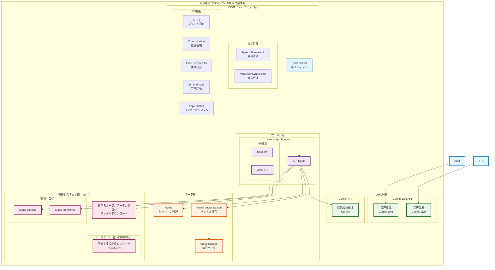
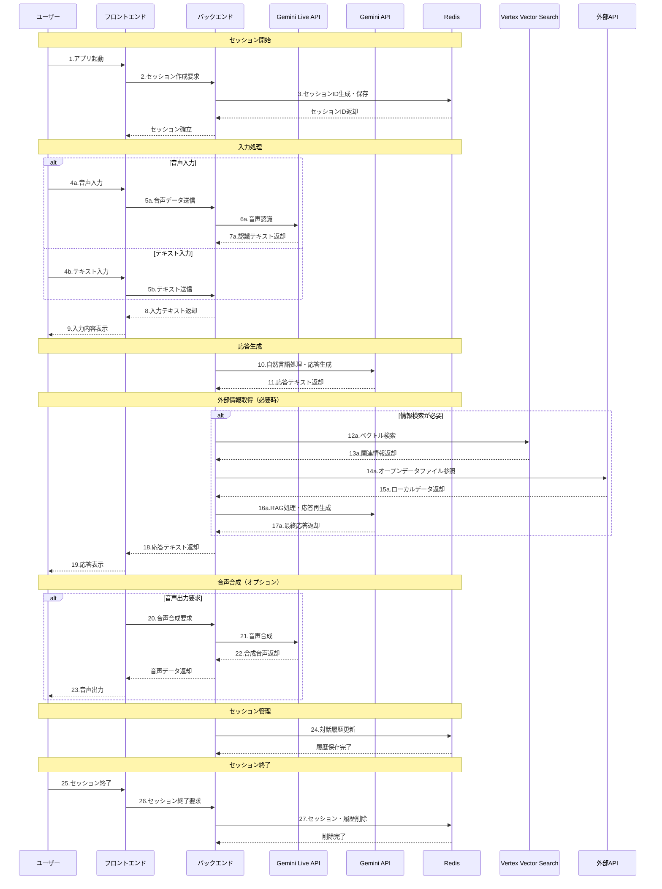
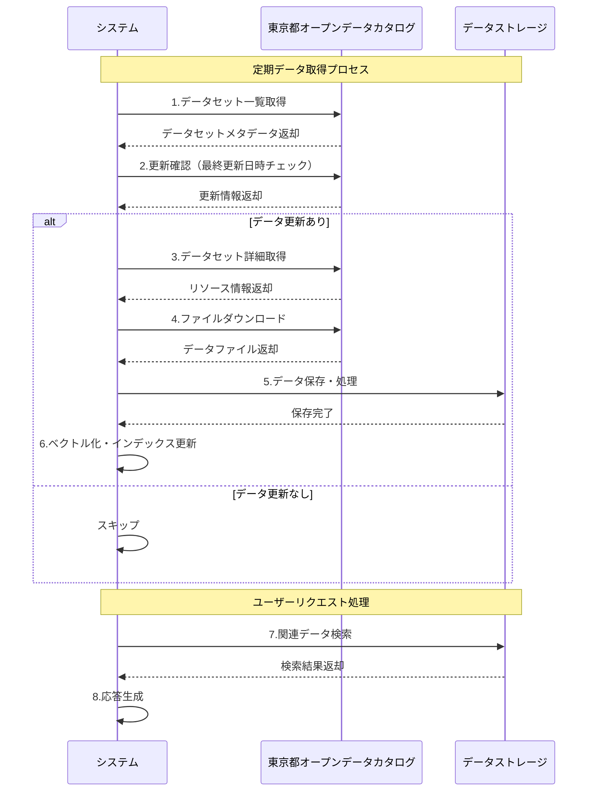

# 東京都公式iOSアプリ AI音声対話機能
## 外部設計書（基本設計書）- iOS Native版

**文書情報**
- **文書名**: 東京都公式iOSアプリ AI音声対話機能 外部設計書（iOS Native版）
- **版数**: 2.0
- **作成日**: 2025年1月
- **作成者**: 根岸祐樹
- **備考**: iOSネイティブアプリ向け設計書

## 改訂履歴

| 版数 | 改訂日 | 改訂者 | 改訂内容 |
|------|--------|--------|----------|
| 1.0 | 2025-01-15 | 根岸祐樹 | 初版作成（システム要件定義書・外部設計書策定） |

## 目次

1. [システム構成図](#1-システム構成図)
   - 1.1 [iOSネイティブアプリ システム構成](#11-iosネイティブアプリ-システム構成)
   - 1.2 [技術スタック構成](#12-技術スタック構成)
2. [業務フロー図](#2-業務フロー図)
   - 2.1 [統合対話フロー](#21-統合対話フロー)
3. [画面一覧・画面遷移図](#3-画面一覧画面遷移図)
   - 3.1 [画面一覧](#31-画面一覧)
   - 3.2 [画面遷移図](#32-画面遷移図)
   - 3.3 [ワイヤーフレーム概要](#33-ワイヤーフレーム概要)
   - 3.4 [UX設計方針](#34-ux設計方針)
4. [帳票一覧・帳票レイアウト](#4-帳票一覧帳票レイアウト)
   - 4.1 [帳票・レポート設計方針](#41-帳票レポート設計方針)
5. [外部インターフェース定義](#5-外部インターフェース定義)
   - 5.1 [東京都オープンデータカタログサイト連携](#51-東京都オープンデータカタログサイト連携)
   - 5.2 [第三者サービス連携](#52-第三者サービス連携)
   - 5.3 [将来連携予定システム（MVP後の拡張）](#53-将来連携予定システムmvp後の拡張)
   - 5.4 [セキュリティ要件](#54-セキュリティ要件)
   - 5.5 [エラーハンドリング](#55-エラーハンドリング)

---

## 1. システム構成図

### 1.1 iOSネイティブアプリ システム構成



### 1.2 技術スタック構成

#### 1.2.1 フロントエンド技術（MVP）
- **フレームワーク**: Next.js 14（App Router）
- **言語**: TypeScript
- **音声処理**: WebRTC + MediaRecorder API
- **状態管理**: React State + Context API
- **UI/UX**: シンプルなレスポンシブデザイン

#### 1.2.2 バックエンド技術（MVP）
- **実行環境**: Cloud Run（サーバーレス）
- **言語**: TypeScript
- **API設計**: REST API
- **セッション管理**: Redis
- **ログ管理**: Cloud Logging

#### 1.2.3 AI・音声処理技術（MVP）
- **音声認識**: Gemini Live API
- **音声合成**: Gemini Live API
- **自然言語処理**: Gemini API
- **ベクトル検索**: Vertex Vector Search
- **Embedding**: Gemini Embedding API
- **対応言語**: 日本語・英語（2言語）

#### 1.2.4 インフラ・運用技術（MVP）
- **クラウド**: Google Cloud Platform
- **ストレージ**: Cloud Storage
- **監視**: Cloud Monitoring
- **CI/CD**: GitHub Actions
- **セキュリティ**: 基本的なHTTPS通信

---

## 2. 業務フロー図

### 2.1 統合対話フロー



---

## 3. 画面一覧・画面遷移図

### 3.1 画面一覧

#### 3.1.1 主要画面構成（MVP）
| 画面ID | 画面名 | 機能概要 | 対応言語 | 優先度 |
|--------|--------|----------|----------|--------|
| **MAIN** | メイン対話画面 | ChatGPT風の統合対話画面 | 2言語（日英） | 最高 |
| **SETTINGS** | 設定画面 | 言語設定・音声設定等 | 2言語（日英） | 中 |
| **ERROR** | エラー画面 | エラー表示・復旧案内 | 2言語（日英） | 高 |

#### 3.1.2 画面詳細仕様

**MAIN（メイン対話画面）- MVP版**
- 機能：ChatGPT風の統合対話機能（育児情報検索）
- 要素：
  - ヘッダー：ロゴ、メニューボタン、言語選択（日英のみ）
  - 対話履歴エリア：ユーザー・AIの対話表示
  - 入力エリア：テキスト入力欄、音声入力ボタン、送信ボタン
  - 音声波形表示エリア（音声入力時）
  - 音声再生ボタン（各AI応答に付属）
- レイアウト：チャット形式、入力エリア固定
- 対象データ：育児・子育て情報のみ

**SETTINGS（設定画面）- MVP版**
- 機能：基本設定のみ
- 要素：言語選択（日英）、音声設定、基本的なヘルプ
- レイアウト：シンプルなモーダル


### 3.2 画面遷移図

```
                    ┌─────────┐
                    │  MAIN   │
                    │メイン対話│
                    │  画面   │
                    └────┬────┘
                         │
                         ▼
                ┌─────────────────┐
                │   メニュー展開   │
                │                 │
                │ ┌─────────────┐ │
                │ │ SETTINGS    │ │
                │ │設定画面      │ │
                │ └─────────────┘ │
                │                 │
                
                └─────────────────┘
```

### 3.3 ワイヤーフレーム概要

#### 3.3.1 メイン対話画面（MAIN）
```
┌─────────────────────────────────────┐
│ 東京都公式アプリ AI音声対話機能  [🌐] [☰] │
├─────────────────────────────────────┤
│                                     │
│  ┌─────────────────────────────────┐ │
│  │                                 │ │
│  │        対話履歴表示エリア          │ │
│  │                                 │ │
│  │  [ユーザー] 近くの保育園を教えて   │ │
│  │  [AI] 最寄りの保育園は... [🔊]   │ │
│  │                                 │ │
│  │  [ユーザー] 子育て支援制度は？   │ │
│  │  [AI] 利用可能な支援制度は... [🔊] │ │
│  │                                 │ │
│  └─────────────────────────────────┘ │
│                                     │
│  ┌─────────────────────────────────┐ │
│  │                                 │ │
│  │        音声波形表示エリア          │ │
│  │        （音声入力時のみ表示）      │ │
│  │                                 │ │
│  │        ████████████████          │ │
│  │                                 │ │
│  └─────────────────────────────────┘ │
│                                     │
│  ┌─────────────────────────────────┐ │
│  │                                 │ │
│  │        入力エリア                │ │
│  │                                 │ │
│  │  ┌─────────────────────────────┐ │ │
│  │  │ メッセージを入力してください... │ │ │
│  │  └─────────────────────────────┘ │ │
│  │                                 │ │
│  │  [🎤]  [送信]                   │ │
│  │                                 │ │
│  └─────────────────────────────────┘ │
└─────────────────────────────────────┘
```

#### 3.3.2 メニュー展開時の画面
```
┌─────────────────────────────────────┐
│ 東京都公式アプリ AI音声対話機能  [🌐] [☰] │
├─────────────────────────────────────┤
│                                     │
│  ┌─────────────────────────────────┐ │
│  │                                 │ │
│  │        対話履歴表示エリア          │ │
│  │        （半透明オーバーレイ）      │ │
│  │                                 │ │
│  └─────────────────────────────────┘ │
│                                     │
│  ┌─────────────────────────────────┐ │
│  │                                 │ │
│  │        メニューパネル            │ │
│  │                                 │ │
│  │  ┌─────────────────────────────┐ │ │
│  │  │ 設定                        │ │ │
│  │  │ 言語選択（日本語/English）   │ │ │
│  │  │ 音声設定                     │ │ │
│  │  └─────────────────────────────┘ │ │
│  │                                 │ │

│  │                                 │ │
│  │  ┌─────────────────────────────┐ │ │
│  │  │ その他                      │ │ │
│  │  │ 使用方法                     │ │ │
│  │  │ プライバシーポリシー          │ │ │
│  │  │ アプリについて                │ │ │
│  │  └─────────────────────────────┘ │ │
│  └─────────────────────────────────┘ │
│                                     │
│  ┌─────────────────────────────────┐ │
│  │                                 │ │
│  │        入力エリア                │ │
│  │        （無効化状態）            │ │
│  │                                 │ │
│  │  [🎤]  [送信]                   │ │
│  │                                 │ │
│  └─────────────────────────────────┘ │
└─────────────────────────────────────┘
```

### 3.4 UX設計方針

#### 3.4.1 1画面完結の原則
- **メイン画面**: すべての対話機能を1つの画面で完結
- **音声・テキスト統合**: 入力方式を切り替え可能な統合インターフェース
- **リアルタイム切り替え**: 音声入力中でもテキスト入力に即座に切り替え可能

#### 3.4.2 メニュー機能の設計
- **ハンバーガーメニュー**: 右上の☰ボタンでメニュー展開
- **モーダル表示**: 設定・ヘルプはモーダルまたはサイドパネルで表示
- **非侵入的**: メニュー展開時も対話履歴は見える状態を維持

#### 3.4.3 音声機能の統合
- **音声入力ボタン**: 入力エリア内の🎤ボタンで音声入力開始
- **音声波形表示**: 音声入力中のみ波形を表示
- **音声再生ボタン**: 各AI応答に🔊ボタンを配置

#### 3.4.4 レスポンシブ対応
- **モバイルファースト**: スマートフォンでの使用を最優先
- **タブレット対応**: 画面サイズに応じたレイアウト調整
- **デスクトップ対応**: 大画面での快適な使用体験

---

## 4. 帳票一覧・帳票レイアウト

### 4.1 帳票・レポート設計方針

本システムでは、基本的なログ出力とCloud Monitoringによる監視を中心とした運用を想定しており、詳細な帳票・レポート機能は必要に応じて検討する。

#### 4.1.1 基本方針
- **ログベース監視**: Cloud Loggingによるリアルタイムログ監視
- **メトリクス監視**: Cloud Monitoringによるシステムメトリクス監視
- **必要時対応**: 運用開始後のニーズに応じて帳票・レポート機能を追加検討

#### 4.1.2 検討対象項目
- 利用統計レポート（日次・週次・月次）
- エラーログレポート
- パフォーマンス分析レポート
- セキュリティ監査レポート
- ユーザー行動分析レポート

#### 4.1.3 実装タイミング
- **MVP段階**: 基本的なログ出力のみ
- **本格運用後**: 運用ニーズに応じて段階的に実装
- **継続改善**: ユーザーフィードバックに基づく機能追加

---

## 5. 外部インターフェース定義

### 5.1 東京都オープンデータカタログサイト連携

#### 5.1.1 連携概要
**連携先**: 東京都オープンデータカタログサイト（https://catalog.data.metro.tokyo.lg.jp/）
**連携方式**: ファイルダウンロード（REST API非提供）
**認証方式**: 不要（公開データ）
**データ形式**: XLS/XLSX/CSV/JSON/PDF（データセットにより異なる）

**注意事項**
- 東京都オープンデータカタログサイトにはREST APIが提供されていない
- データ取得はファイルダウンロード方式のみ
- 一部のデータセットはPowerBIダッシュボードとして提供されている
- データ更新頻度はデータセットにより異なる（随時〜年次）

#### 5.1.2 データ取得仕様
```
# データセット一覧取得
GET https://catalog.data.metro.tokyo.lg.jp/dataset

# カテゴリ別データセット取得
GET https://catalog.data.metro.tokyo.lg.jp/dataset?groups={category_id}

# データセット詳細取得
GET https://catalog.data.metro.tokyo.lg.jp/dataset/{dataset_id}

# リソース詳細取得
GET https://catalog.data.metro.tokyo.lg.jp/dataset/{dataset_id}/resource/{resource_id}

# ファイルダウンロード
GET https://data.storage.data.metro.tokyo.lg.jp/{organization}/{filename}
```

#### 5.1.3 利用可能なデータセット一覧（MVP版）

**A. 育児・子育て情報（MVP対象）**
| データセットID | データセット名 | 形式 | 更新頻度 | 用途 | 優先度 |
|----------------|----------------|------|----------|------|--------|
| t134211d0000000001 | 東京デジタル2030ビジョン（こどもDX）子育て支援制度レジストリ | XLS/JSON | 随時 | 育児支援制度情報 | 最高 |
| t132012d0000000032 | 学童保育所一覧 | CSV | 年次 | 学童保育情報 | 高 |
| t131105d0000000209 | 小規模保育所 | CSV | 年次 | 保育所情報 | 高 |
| t132217d3100000001 | 子ども食堂一覧 | CSV | 四半期 | 子ども支援施設 | 中 |

**備考**
- MVP版では育児・子育て情報のみに限定
- 災害情報、医療・福祉、生活情報等は将来フェーズで追加
- 約100件のデータセットで開始

#### 5.1.4 データ取得・処理フロー



#### 5.1.5 データ品質・更新管理

**更新頻度管理**
- **リアルタイム**: PM2.5モニタリングデータ
- **月次**: 医療機関、AED設置場所、保健医療局月報
- **四半期**: 避難所、公共施設、交通施設
- **年次**: 保育所、学童保育所、文化財
- **随時**: 子育て支援制度レジストリ

**データ検証**
- ファイル形式の妥当性チェック
- 必須項目の存在確認
- データ型の検証
- 更新日時の整合性確認

**エラーハンドリング**
- ダウンロード失敗時のリトライ（最大3回）
- データ破損時の代替データ使用
- 更新遅延時の警告通知

### 5.2 第三者サービス連携

#### 5.2.1 Google Gemini Live API
**連携概要**
- 連携先：Google Gemini Live API
- 連携方式：REST API + WebSocket
- 認証方式：API Key認証
- データ形式：JSON

**音声認識API仕様**
```
POST /v1/models/gemini-2.0-flash:generateContent
Authorization: Bearer {api_key}
Content-Type: application/json

Request:
{
  "contents": [
    {
      "parts": [
        {
          "audio": {
            "mime_type": "audio/webm",
            "data": "base64_encoded_audio_data"
          }
        }
      ]
    }
  ],
  "generationConfig": {
    "temperature": 0.1,
    "topK": 1,
    "topP": 1,
    "maxOutputTokens": 1024
  }
}

Response:
{
  "candidates": [
    {
      "content": {
        "parts": [
          {
            "text": "認識されたテキスト"
          }
        ]
      }
    }
  ]
}
```

**音声合成API仕様**
```
POST /v1/models/gemini-2.0-flash:generateContent
Authorization: Bearer {api_key}
Content-Type: application/json

Request:
{
  "contents": [
    {
      "parts": [
        {
          "text": "合成したいテキスト"
        }
      ]
    }
  ],
  "generationConfig": {
    "temperature": 0.1,
    "topK": 1,
    "topP": 1,
    "maxOutputTokens": 1024
  }
}

Response:
{
  "candidates": [
    {
      "content": {
        "parts": [
          {
            "audio": {
              "mime_type": "audio/webm",
              "data": "base64_encoded_audio_data"
            }
          }
        ]
      }
    }
  ]
}
```

#### 5.2.2 Google Gemini API（自然言語処理）- MVP版
**連携概要**
- 連携先：Google Gemini API
- 連携方式：REST API
- 認証方式：API Key認証
- データ形式：JSON
- 対応言語：日本語・英語（2言語）

**自然言語処理API仕様**
```
POST /v1/models/gemini-2.0-flash:generateContent
Authorization: Bearer {api_key}
Content-Type: application/json

Request:
{
  "contents": [
    {
      "parts": [
        {
          "text": "ユーザーの質問"
        }
      ]
    }
  ],
  "generationConfig": {
    "temperature": 0.3,
    "topK": 40,
    "topP": 0.95,
    "maxOutputTokens": 2048
  },
  "safetySettings": [
    {
      "category": "HARM_CATEGORY_HARASSMENT",
      "threshold": "BLOCK_MEDIUM_AND_ABOVE"
    },
    {
      "category": "HARM_CATEGORY_HATE_SPEECH",
      "threshold": "BLOCK_MEDIUM_AND_ABOVE"
    }
  ]
}

Response:
{
  "candidates": [
    {
      "content": {
        "parts": [
          {
            "text": "AI応答テキスト"
          }
        ]
      },
      "finishReason": "STOP",
      "safetyRatings": [
        {
          "category": "HARM_CATEGORY_HARASSMENT",
          "probability": "NEGLIGIBLE"
        }
      ]
    }
  ]
}
```

#### 5.2.3 Google Vertex Vector Search
**連携概要**
- 連携先：Google Vertex Vector Search
- 連携方式：REST API
- 認証方式：Service Account認証
- データ形式：JSON

**ベクトル検索API仕様**
```
POST https://us-central1-aiplatform.googleapis.com/v1/projects/{project}/locations/us-central1/indexEndpoints/{index_endpoint}:findNeighbors

Request:
{
  "deployedIndexId": "deployed_index_id",
  "queries": [
    {
      "datapoint": {
        "datapointId": "query_id",
        "featureVector": [0.1, 0.2, 0.3, ...]
      },
      "neighborCount": 10
    }
  ]
}

Response:
{
  "nearestNeighbors": [
    {
      "id": "query_id",
      "neighbors": [
        {
          "datapointId": "result_id",
          "distance": 0.123,
          "restricts": [
            {
              "namespace": "category",
              "allowList": ["childcare", "disaster"]
            }
          ]
        }
      ]
    }
  ]
}
```

#### 5.2.4 Google Cloud Storage
**連携概要**
- 連携先：Google Cloud Storage
- 連携方式：REST API
- 認証方式：Service Account認証
- データ形式：バイナリ

**ファイル操作API仕様**
```
# ファイルアップロード
PUT https://storage.googleapis.com/{bucket}/{object}
Authorization: Bearer {access_token}
Content-Type: application/octet-stream

# ファイルダウンロード
GET https://storage.googleapis.com/{bucket}/{object}
Authorization: Bearer {access_token}

# ファイル一覧取得
GET https://storage.googleapis.com/storage/v1/b/{bucket}/o
Authorization: Bearer {access_token}

Response:
{
  "kind": "storage#objects",
  "items": [
    {
      "kind": "storage#object",
      "id": "bucket/object/1234567890",
      "selfLink": "https://storage.googleapis.com/storage/v1/b/bucket/o/object",
      "name": "object",
      "bucket": "bucket",
      "generation": "1234567890",
      "metageneration": "1",
      "contentType": "application/json",
      "timeCreated": "datetime",
      "updated": "datetime",
      "size": "string",
      "md5Hash": "string",
      "mediaLink": "string"
    }
  ]
}
```

### 5.3 将来連携予定システム（MVP後の拡張）

**MVP後のフェーズ2・3で実装予定**

#### 5.3.1 災害情報システム（フェーズ2）
- 災害時避難所情報
- 緊急医療機関情報
- AED設置場所情報

#### 5.3.2 行政手続きシステム（フェーズ2）
- 住民票取得手続き
- 各種証明書発行
- 窓口情報

#### 5.3.3 多言語拡張（フェーズ2）
- 中国語対応
- 韓国語対応
- 翻訳機能の実装

#### 5.3.4 高度な機能（フェーズ3）
- リアルタイム災害情報連携
- 交通情報連携
- 施設管理システム連携
- PWA・ネイティブアプリ対応

### 5.4 セキュリティ要件

#### 5.4.1 認証・認可
- **API認証**: JWT/API Key認証の実装
- **アクセス制御**: レート制限（50リクエスト/分）
- **セッション管理**: セッションIDによる認証
- **データ暗号化**: HTTPS通信必須

#### 5.4.2 データ保護
- **個人情報**: 音声データの一時保存のみ
- **対話履歴**: セッション内でのみ保持
- **データ削除**: セッション終了時の自動削除
- **ログ管理**: アクセスログ・エラーログ記録

#### 5.4.3 プライバシー保護
- **音声データ**: 処理完了後の即座削除
- **対話内容**: セッション外への保存禁止
- **利用統計**: 匿名化された統計データのみ収集
- **同意管理**: 音声録音の明示的同意

### 5.5 エラーハンドリング

#### 5.5.1 外部API接続エラー
- **タイムアウト処理**: 30秒タイムアウト設定
- **リトライ機能**: 最大3回の自動リトライ
- **フォールバック**: 代替APIへの切り替え
- **エラー通知**: 管理者への自動通知

#### 5.5.2 データ不整合エラー
- **データ検証**: 受信データの形式・内容検証
- **エラー記録**: 詳細なエラーログ記録
- **復旧処理**: 自動復旧機能の実装
- **ユーザー通知**: 適切なエラーメッセージ表示

#### 5.5.3 セキュリティ侵害対応
- **異常検知**: 不正アクセスの自動検知
- **アクセス遮断**: 異常時のアクセス遮断
- **インシデント対応**: 24時間対応体制
- **復旧手順**: 詳細な復旧手順書整備
