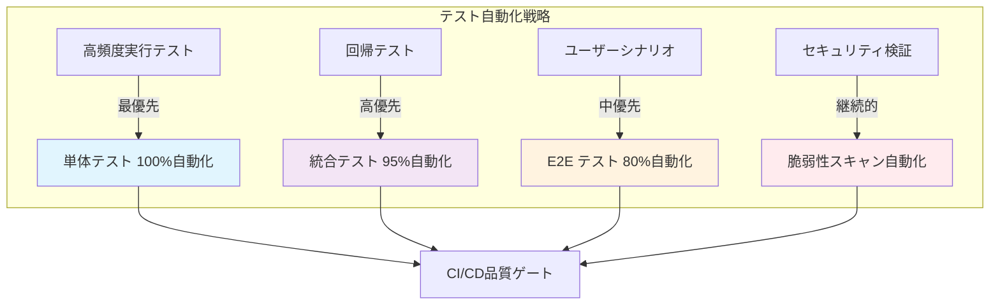
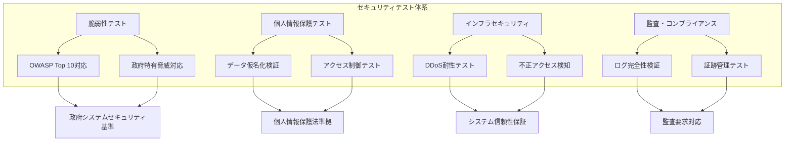
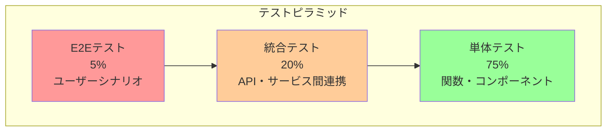
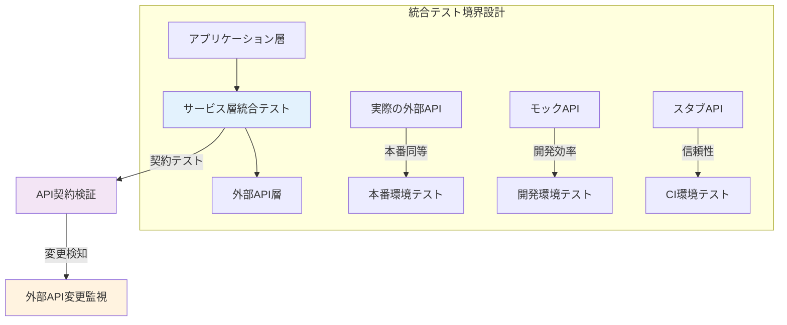

# 東京都公式アプリ AI音声対話機能
## テスト設計書（MVP版）

**文書情報**
- **文書名**: 東京都公式アプリ AI音声対話機能 テスト設計書（MVP版）
- **版数**: 1.0
- **作成日**: 2025年1月
- **作成者**: 根岸祐樹
- **備考**: MVP機能に限定したテスト設計書

## 改訂履歴

| 版数 | 改訂日 | 改訂者 | 改訂内容 |
|------|--------|--------|----------|
| 1.0 | 2025-01-15 | 根岸祐樹 | 初版作成（MVP版テスト戦略・品質保証設計） |

## 目次

1. [設計方針・根拠](#1-設計方針根拠)
   - 1.1 [テスト戦略の基本方針](#11-テスト戦略の基本方針)
   - 1.2 [政府サービス品質保証要件](#12-政府サービス品質保証要件)
   - 1.3 [アクセシビリティ・多言語対応テスト方針](#13-アクセシビリティ多言語対応テスト方針)
   - 1.4 [セキュリティ・プライバシー保護テスト方針](#14-セキュリティプライバシー保護テスト方針)
2. [テスト戦略概要](#2-テスト戦略概要)
   - 2.1 [テストピラミッド](#21-テストピラミッド)
   - 2.2 [テスト方針](#22-テスト方針)
3. [単体テスト設計](#3-単体テスト設計)
   - 3.1 [フロントエンド単体テスト](#31-フロントエンド単体テスト)
   - 3.2 [バックエンド単体テスト](#32-バックエンド単体テスト)
4. [統合テスト設計](#4-統合テスト設計)
   - 4.1 [API統合テスト](#41-api統合テスト)
5. [E2Eテスト設計](#5-e2eテスト設計)
   - 5.1 [E2Eテストフレームワーク](#51-e2eテストフレームワーク)
   - 5.2 [E2Eテストシナリオ](#52-e2eテストシナリオ)
6. [パフォーマンステスト設計](#6-パフォーマンステスト設計)
   - 6.1 [負荷テスト](#61-負荷テスト)
   - 6.2 [ストレステスト](#62-ストレステスト)
7. [セキュリティテスト設計](#7-セキュリティテスト設計)
   - 7.1 [脆弱性テスト](#71-脆弱性テスト)
   - 7.2 [OWASP ZAP自動スキャン](#72-owasp-zap自動スキャン)
8. [テスト実行・CI/CD統合](#8-テスト実行cicd統合)
   - 8.1 [GitHub Actions統合](#81-github-actions統合)
   - 8.2 [テストレポート](#82-テストレポート)

---

## 1. 設計方針・根拠

### 1.1 テスト戦略の基本方針

#### 1.1.1 政府サービスとしての品質要求事項への対応

東京都公式アプリとして、以下の政府サービス品質基準に準拠したテスト戦略を採用：

**品質要件に基づくテスト方針決定根拠**

| 要件 | テスト戦略 | 根拠 |
|------|------------|------|
| **高可用性要求** | 99.9%の稼働率保証 | 負荷テスト・ストレステストによる耐障害性検証 |
| **政府認証基準準拠** | セキュリティテスト徹底 | OWASP Top 10、政府情報システム標準適用 |
| **アクセシビリティ保証** | WCAG 2.1 AA準拠テスト | 障害者権利条約・JIS X 8341準拠義務 |
| **多言語対応** | 日英対応品質保証 | 外国人住民サービス向上要求対応 |
| **リアルタイム処理** | 音声対話3秒以内応答 | ユーザビリティ最低基準・離脱率抑制 |

#### 1.1.2 テスト自動化戦略の根拠

**自動化優先度の決定基準**



**自動化フレームワーク選定根拠**

- **Jest (単体テスト)**: React/Next.js標準、豊富なモック機能、高速実行
- **Playwright (E2E)**: クロスブラウザ対応、政府推奨ブラウザ網羅、音声API対応
- **K6 (負荷テスト)**: JavaScript記述、CI/CD統合性、リアルタイム監視対応

### 1.2 政府サービス品質保証要件

#### 1.2.1 可用性・信頼性テスト戦略

**政府システム可用性基準準拠**

東京都情報システム標準に基づく可用性要件：
- **稼働率**: 99.9%以上 (年間8.76時間以内の停止)
- **障害復旧時間**: RPO 1時間、RTO 4時間以内
- **同時接続**: 1万ユーザー対応 (防災時は5万ユーザー)

**テスト戦略による品質保証**

```typescript
// 可用性テスト設計例
const availabilityTestConfig = {
  // 長時間負荷テスト
  longRunningTest: {
    duration: '24h',
    userLoad: '1000 concurrent users',
    acceptableErrorRate: '< 0.1%',
    responseTimeThreshold: '< 3s for 95th percentile'
  },
  
  // 障害復旧テスト
  failoverTest: {
    scenarioTypes: ['database failover', 'api service failure', 'network partition'],
    recoveryTimeLimit: '< 4 hours',
    dataLossLimit: 'zero (RPO = 0)'
  },
  
  // スパイク負荷テスト
  spikeTest: {
    normalLoad: '1000 users',
    spikeLoad: '10000 users in 30s',
    sustainabilityPeriod: '30 minutes',
    gracefulDegradation: 'required'
  }
};
```

#### 1.2.2 性能要件に基づくテスト基準

**ユーザビリティ研究に基づく性能基準**

| 操作 | 政府推奨基準 | テスト閾値 | 根拠 |
|------|-------------|------------|------|
| **ページ読み込み** | 3秒以内 | 2秒以内 | Google Core Web Vitals、政府推奨 |
| **音声認識** | 5秒以内 | 3秒以内 | 音声UI ユーザビリティ研究 |
| **AI応答生成** | 10秒以内 | 5秒以内 | チャットボット許容時間研究 |
| **検索結果表示** | 2秒以内 | 1秒以内 | 情報検索ユーザビリティ基準 |

### 1.3 アクセシビリティ・多言語対応テスト方針

#### 1.3.1 アクセシビリティテスト戦略根拠

**法的要求事項への準拠**

- **障害者差別解消法**: 合理的配慮提供義務
- **JIS X 8341-3:2016**: WCAG 2.1 AA レベル準拠義務
- **東京都障害者情報アクセシビリティ・コミュニケーション施策推進条例**: 2022年施行

**アクセシビリティテスト実装戦略**

```typescript
// アクセシビリティテスト設定
const a11yTestStrategy = {
  // 自動検証
  automatedChecking: {
    tools: ['axe-core', 'lighthouse-a11y', 'pa11y'],
    coverage: ['color-contrast', 'keyboard-navigation', 'screen-reader'],
    ciIntegration: 'block-on-violations'
  },
  
  // 手動検証
  manualTesting: {
    screenReaderTesting: ['NVDA', 'JAWS', 'VoiceOver'],
    keyboardOnlyNavigation: 'full-app-coverage',
    cognitiveTesting: 'plain-language-verification'
  },
  
  // ユーザビリティテスト
  userTesting: {
    targetUsers: ['視覚障害者', '聴覚障害者', '運動障害者', '認知障害者'],
    testScenarios: ['保育園申請', '制度情報検索', '音声対話'],
    successCriteria: 'task-completion-rate > 80%'
  }
};
```

#### 1.3.2 多言語機能テスト戦略

**東京都多言語政策に基づく要件**

- **対象言語**: 日本語・英語（MVP）、将来的に中国語・韓国語・やさしい日本語
- **翻訳品質**: 行政用語の正確性、文化的適切性
- **音声対応**: 各言語でのSTT/TTS品質保証

**多言語テスト実装方針**

| テスト種別 | 検証項目 | 品質基準 | 実装方法 |
|-----------|----------|----------|----------|
| **翻訳精度** | 行政用語正確性 | 専門家レビュー100% | 人的翻訳チェック |
| **UI表示** | レイアウト崩れ防止 | 全画面サイズ対応 | 視覚回帰テスト |
| **音声認識** | 各言語認識精度 | 95%以上の認識率 | 音声コーパステスト |
| **音声合成** | 発音・イントネーション | ネイティブレベル | 音質評価テスト |

### 1.4 セキュリティ・プライバシー保護テスト方針

#### 1.4.1 政府システムセキュリティ基準準拠

**準拠すべきセキュリティ標準**

- **政府情報システムのためのセキュリティ対策基準**: 内閣サイバーセキュリティセンター
- **地方公共団体における情報セキュリティポリシーガイドライン**: 総務省
- **個人情報保護法**: 2022年改正対応
- **東京都個人情報保護条例**: 地方自治体固有要件

**セキュリティテスト戦略の設計根拠**



#### 1.4.2 プライバシー保護テスト戦略

**個人情報取り扱いテスト方針**

音声データ・対話履歴の適切な取り扱い検証：

- **データ最小化**: 必要最小限の情報のみ収集
- **利用目的制限**: サービス提供に必要な範囲内での利用
- **保存期間制限**: 法定保存期間経過後の自動削除
- **第三者提供制限**: 本人同意なしの外部提供禁止

**プライバシーテスト実装戦略**

```typescript
const privacyTestFramework = {
  // データ収集テスト
  dataCollection: {
    minimization: 'collect-only-necessary-data',
    consent: 'explicit-opt-in-required',
    transparency: 'clear-purpose-explanation'
  },
  
  // データ処理テスト
  dataProcessing: {
    anonymization: 'remove-identifying-information',
    encryption: 'end-to-end-encryption-verification',
    accessControl: 'role-based-access-testing'
  },
  
  // データ削除テスト
  dataDeletion: {
    userRequested: 'immediate-deletion-capability',
    automatic: 'retention-period-compliance',
    verification: 'complete-removal-confirmation'
  }
};
```

#### 1.4.3 継続的セキュリティテスト戦略

**DevSecOps統合によるセキュリティ品質保証**

開発プロセス全体にセキュリティテストを組み込む戦略：

1. **開発時**: 静的解析ツール（SonarQube、CodeQL）
2. **ビルド時**: 依存関係脆弱性スキャン（npm audit、Snyk）
3. **デプロイ前**: 動的解析テスト（OWASP ZAP、Burp Suite）
4. **運用時**: 継続的脆弱性監視（定期セキュリティスキャン）

**セキュリティテスト自動化の根拠**

- **効率性**: 手動テストでは見逃しやすい脆弱性の自動検出
- **一貫性**: 人的エラーを排除した標準的なセキュリティチェック
- **スピード**: CI/CDパイプラインでの迅速なフィードバック
- **継続性**: 新たな脅威に対する継続的な監視体制

---

## 2. テスト戦略概要

### 2.1 テストピラミッド



### 2.2 テスト方針

#### 2.2.1 基本方針
- **品質重視**: 機能性、性能、セキュリティを重点的にテスト
- **自動化**: 可能な限りテストを自動化
- **継続的テスト**: CI/CDパイプラインに組み込み
- **実環境テスト**: 本番環境に近い条件でテスト
- **多言語対応**: 日本語・英語での動作確認

#### 2.2.2 MVP範囲でのテスト対象

| カテゴリ | 対象機能 | テスト種別 | 優先度 |
|----------|----------|------------|--------|
| **チャット機能** | テキスト対話、セッション管理 | 単体・統合・E2E | 最高 |
| **音声機能** | 音声認識・合成 | 統合・E2E | 最高 |
| **データ検索** | ベクトル検索、オープンデータ連携 | 単体・統合 | 高 |
| **API** | REST API、エラーハンドリング | 単体・統合 | 高 |
| **セキュリティ** | 入力検証、レート制限 | 単体・セキュリティ | 高 |
| **パフォーマンス** | 応答時間、スループット | パフォーマンス | 中 |

---

## 3. 単体テスト設計

### 3.1 フロントエンド単体テスト

#### 3.1.1 テストフレームワーク構成

```json
{
  "dependencies": {
    "@testing-library/react": "^14.0.0",
    "@testing-library/jest-dom": "^6.0.0",
    "@testing-library/user-event": "^14.0.0",
    "jest": "^29.0.0",
    "jest-environment-jsdom": "^29.0.0",
    "msw": "^2.0.0"
  }
}
```

#### 3.1.2 コンポーネントテスト例

```typescript
// __tests__/components/ChatContainer.test.tsx
import React from 'react';
import { render, screen, fireEvent, waitFor } from '@testing-library/react';
import userEvent from '@testing-library/user-event';
import { ChatContainer } from '@/components/chat/ChatContainer';
import { ChatProvider } from '@/contexts/ChatContext';
import { setupServer } from 'msw/node';
import { rest } from 'msw';

// MSWサーバーセットアップ
const server = setupServer(
  rest.post('/api/chat', (req, res, ctx) => {
    return res(
      ctx.json({
        success: true,
        data: {
          content: 'テストレスポンス',
          sessionId: 'test-session-123',
          metadata: {
            processingTime: 1000,
            confidence: 0.95,
            language: 'ja'
          }
        }
      })
    );
  })
);

beforeAll(() => server.listen());
afterEach(() => server.resetHandlers());
afterAll(() => server.close());

describe('ChatContainer', () => {
  const renderChatContainer = () => {
    return render(
      <ChatProvider>
        <ChatContainer />
      </ChatProvider>
    );
  };

  test('メッセージ入力・送信ができる', async () => {
    const user = userEvent.setup();
    renderChatContainer();

    // 入力フィールドの存在確認
    const messageInput = screen.getByPlaceholderText('メッセージを入力してください...');
    expect(messageInput).toBeInTheDocument();

    // メッセージ入力
    await user.type(messageInput, '近くの保育園を教えてください');
    
    // 送信ボタンクリック
    const sendButton = screen.getByRole('button', { name: '送信' });
    await user.click(sendButton);

    // ユーザーメッセージの表示確認
    expect(screen.getByText('近くの保育園を教えてください')).toBeInTheDocument();

    // AIレスポンスの表示確認
    await waitFor(() => {
      expect(screen.getByText('テストレスポンス')).toBeInTheDocument();
    });

    // 入力フィールドがクリアされることを確認
    expect(messageInput).toHaveValue('');
  });

  test('空メッセージは送信できない', async () => {
    const user = userEvent.setup();
    renderChatContainer();

    const sendButton = screen.getByRole('button', { name: '送信' });
    
    // 空の状態で送信ボタンクリック
    await user.click(sendButton);

    // エラーメッセージの表示確認
    expect(screen.getByText('メッセージを入力してください')).toBeInTheDocument();
  });

  test('長すぎるメッセージはエラーになる', async () => {
    const user = userEvent.setup();
    renderChatContainer();

    const messageInput = screen.getByPlaceholderText('メッセージを入力してください...');
    
    // 1000文字超えのメッセージ
    const longMessage = 'あ'.repeat(1001);
    await user.type(messageInput, longMessage);

    const sendButton = screen.getByRole('button', { name: '送信' });
    await user.click(sendButton);

    // エラーメッセージの確認
    expect(screen.getByText('メッセージが長すぎます（最大1000文字）')).toBeInTheDocument();
  });

  test('ローディング状態が正しく表示される', async () => {
    const user = userEvent.setup();
    
    // 遅延レスポンスのモック
    server.use(
      rest.post('/api/chat', (req, res, ctx) => {
        return res(
          ctx.delay(2000),
          ctx.json({
            success: true,
            data: { content: 'レスポンス', sessionId: 'test-session' }
          })
        );
      })
    );

    renderChatContainer();

    const messageInput = screen.getByPlaceholderText('メッセージを入力してください...');
    await user.type(messageInput, 'テストメッセージ');

    const sendButton = screen.getByRole('button', { name: '送信' });
    await user.click(sendButton);

    // ローディング表示の確認
    expect(screen.getByText('回答を生成中...')).toBeInTheDocument();
    expect(sendButton).toBeDisabled();
  });
});
```

#### 3.1.3 音声機能テスト

```typescript
// __tests__/components/VoiceInput.test.tsx
import React from 'react';
import { render, screen, fireEvent } from '@testing-library/react';
import userEvent from '@testing-library/user-event';
import { VoiceInput } from '@/components/chat/VoiceInput';

// Web Audio API のモック
const mockMediaRecorder = {
  start: jest.fn(),
  stop: jest.fn(),
  addEventListener: jest.fn(),
  removeEventListener: jest.fn(),
  state: 'inactive'
};

const mockMediaStream = {
  getTracks: jest.fn(() => [{ stop: jest.fn() }])
};

Object.defineProperty(global.navigator, 'mediaDevices', {
  value: {
    getUserMedia: jest.fn(() => Promise.resolve(mockMediaStream))
  }
});

Object.defineProperty(global, 'MediaRecorder', {
  value: jest.fn(() => mockMediaRecorder)
});

describe('VoiceInput', () => {
  const mockOnTranscript = jest.fn();
  const mockOnError = jest.fn();

  beforeEach(() => {
    jest.clearAllMocks();
  });

  test('音声録音の開始・停止ができる', async () => {
    const user = userEvent.setup();
    
    render(
      <VoiceInput
        onTranscript={mockOnTranscript}
        onError={mockOnError}
      />
    );

    const voiceButton = screen.getByRole('button', { name: '音声入力' });
    
    // 録音開始
    await user.click(voiceButton);
    
    expect(navigator.mediaDevices.getUserMedia).toHaveBeenCalledWith({
      audio: true
    });
    expect(mockMediaRecorder.start).toHaveBeenCalled();
    
    // 録音中の表示確認
    expect(screen.getByText('録音中...')).toBeInTheDocument();
    
    // 録音停止
    await user.click(voiceButton);
    expect(mockMediaRecorder.stop).toHaveBeenCalled();
  });

  test('マイクアクセスが拒否された場合のエラーハンドリング', async () => {
    const user = userEvent.setup();
    
    // getUserMediaのエラーモック
    (navigator.mediaDevices.getUserMedia as jest.Mock).mockRejectedValueOnce(
      new Error('Permission denied')
    );

    render(
      <VoiceInput
        onTranscript={mockOnTranscript}
        onError={mockOnError}
      />
    );

    const voiceButton = screen.getByRole('button', { name: '音声入力' });
    await user.click(voiceButton);

    expect(mockOnError).toHaveBeenCalledWith('マイクへのアクセスが拒否されました');
  });

  test('音声認識結果が正しく処理される', async () => {
    const mockBlob = new Blob(['audio data'], { type: 'audio/webm' });
    
    // MediaRecorderのdatavailableイベントをシミュレート
    const dataAvailableCallback = jest.fn();
    (mockMediaRecorder.addEventListener as jest.Mock).mockImplementation((event, callback) => {
      if (event === 'dataavailable') {
        dataAvailableCallback.mockImplementation(callback);
      }
    });

    render(
      <VoiceInput
        onTranscript={mockOnTranscript}
        onError={mockOnError}
      />
    );

    // 音声データイベントをトリガー
    dataAvailableCallback({ data: mockBlob });

    // 音声認識処理が呼ばれることを確認
    // (実際の実装では音声認識APIが呼ばれる)
  });
});
```

### 3.2 バックエンド単体テスト

#### 3.2.1 サービスクラステスト

```typescript
// __tests__/services/ChatService.test.ts
import { ChatService } from '@/services/ChatService';
import { SessionService } from '@/services/SessionService';
import { SearchService } from '@/services/SearchService';
import { GeminiClient } from '@/services/integration/GeminiClient';

// モック設定
jest.mock('@/services/SessionService');
jest.mock('@/services/SearchService');
jest.mock('@/services/integration/GeminiClient');

describe('ChatService', () => {
  let chatService: ChatService;
  let mockSessionService: jest.Mocked<SessionService>;
  let mockSearchService: jest.Mocked<SearchService>;
  let mockGeminiClient: jest.Mocked<GeminiClient>;

  beforeEach(() => {
    mockSessionService = new SessionService() as jest.Mocked<SessionService>;
    mockSearchService = new SearchService() as jest.Mocked<SearchService>;
    mockGeminiClient = new GeminiClient() as jest.Mocked<GeminiClient>;
    
    chatService = new ChatService(
      mockSessionService,
      mockSearchService,
      mockGeminiClient
    );
  });

  describe('processMessage', () => {
    test('正常なメッセージ処理ができる', async () => {
      // モックデータ設定
      const mockSession = {
        id: 'test-session',
        language: 'ja',
        messages: [],
        context: { topics: [], entities: [] }
      };
      
      const mockSearchResults = [
        {
          id: 'childcare_001',
          title: '保育園情報',
          content: '認可保育園の一覧です',
          score: 0.9
        }
      ];

      const mockAIResponse = '近くの保育園についてお答えします...';

      // モック関数の戻り値設定
      mockSessionService.getSession.mockResolvedValue(mockSession);
      mockSearchService.searchRelevantData.mockResolvedValue(mockSearchResults);
      mockGeminiClient.generateResponse.mockResolvedValue(mockAIResponse);
      mockSessionService.updateSession.mockResolvedValue();

      // テスト実行
      const result = await chatService.processMessage(
        'test-session',
        '近くの保育園を教えてください',
        'ja'
      );

      // 検証
      expect(result).toEqual({
        content: mockAIResponse,
        sessionId: 'test-session',
        sources: mockSearchResults,
        metadata: expect.objectContaining({
          language: 'ja',
          confidence: expect.any(Number),
          processingTime: expect.any(Number)
        })
      });

      // 各サービスが正しく呼ばれたか確認
      expect(mockSessionService.getSession).toHaveBeenCalledWith('test-session');
      expect(mockSearchService.searchRelevantData).toHaveBeenCalledWith(
        '近くの保育園を教えてください',
        'ja'
      );
      expect(mockGeminiClient.generateResponse).toHaveBeenCalled();
      expect(mockSessionService.updateSession).toHaveBeenCalled();
    });

    test('セッションが見つからない場合はエラーが発生する', async () => {
      mockSessionService.getSession.mockResolvedValue(null);

      await expect(
        chatService.processMessage('invalid-session', 'test message', 'ja')
      ).rejects.toThrow('Session not found');
    });

    test('空のメッセージは処理できない', async () => {
      await expect(
        chatService.processMessage('test-session', '', 'ja')
      ).rejects.toThrow('Message cannot be empty');

      await expect(
        chatService.processMessage('test-session', '   ', 'ja')
      ).rejects.toThrow('Message cannot be empty');
    });

    test('長すぎるメッセージは処理できない', async () => {
      const longMessage = 'a'.repeat(1001);
      
      await expect(
        chatService.processMessage('test-session', longMessage, 'ja')
      ).rejects.toThrow('Message too long');
    });

    test('外部API障害時の適切なエラーハンドリング', async () => {
      const mockSession = {
        id: 'test-session',
        language: 'ja',
        messages: [],
        context: { topics: [], entities: [] }
      };

      mockSessionService.getSession.mockResolvedValue(mockSession);
      mockSearchService.searchRelevantData.mockResolvedValue([]);
      mockGeminiClient.generateResponse.mockRejectedValue(
        new Error('Gemini API unavailable')
      );

      await expect(
        chatService.processMessage('test-session', 'test message', 'ja')
      ).rejects.toThrow('External service error');
    });
  });
});
```

#### 3.2.2 バリデーション関数テスト

```typescript
// __tests__/lib/validation.test.ts
import {
  validateChatMessage,
  validateSessionId,
  validateAudioFile,
  sanitizeInput
} from '@/lib/validation';

describe('Validation Functions', () => {
  describe('validateChatMessage', () => {
    test('正常なメッセージは通る', () => {
      const result = validateChatMessage('こんにちは');
      expect(result.valid).toBe(true);
      expect(result.errors).toHaveLength(0);
    });

    test('空のメッセージはエラー', () => {
      const result = validateChatMessage('');
      expect(result.valid).toBe(false);
      expect(result.errors).toContain('Message cannot be empty');
    });

    test('空白のみのメッセージはエラー', () => {
      const result = validateChatMessage('   ');
      expect(result.valid).toBe(false);
      expect(result.errors).toContain('Message cannot be empty');
    });

    test('長すぎるメッセージはエラー', () => {
      const longMessage = 'あ'.repeat(1001);
      const result = validateChatMessage(longMessage);
      expect(result.valid).toBe(false);
      expect(result.errors).toContain('Message too long');
    });

    test('危険なスクリプトタグは検出される', () => {
      const maliciousMessage = '<script>alert("xss")</script>';
      const result = validateChatMessage(maliciousMessage);
      expect(result.valid).toBe(false);
      expect(result.errors).toContain('Potentially malicious content detected');
    });

    test('JavaScriptイベントハンドラーは検出される', () => {
      const maliciousMessage = '<div onclick="alert()">test</div>';
      const result = validateChatMessage(maliciousMessage);
      expect(result.valid).toBe(false);
      expect(result.errors).toContain('Potentially malicious content detected');
    });
  });

  describe('validateSessionId', () => {
    test('正しいUUID形式は通る', () => {
      const validUuid = '123e4567-e89b-12d3-a456-426614174000-1234567890-abcdef';
      const result = validateSessionId(validUuid);
      expect(result.valid).toBe(true);
    });

    test('無効な形式はエラー', () => {
      const invalidUuid = 'invalid-session-id';
      const result = validateSessionId(invalidUuid);
      expect(result.valid).toBe(false);
      expect(result.errors).toContain('Invalid session ID format');
    });

    test('nullやundefinedはエラー', () => {
      expect(validateSessionId(null as any).valid).toBe(false);
      expect(validateSessionId(undefined as any).valid).toBe(false);
    });
  });

  describe('validateAudioFile', () => {
    test('有効な音声ファイルは通る', async () => {
      const mockFile = new File(['audio data'], 'test.webm', {
        type: 'audio/webm'
      });
      
      const result = await validateAudioFile(mockFile);
      expect(result.valid).toBe(true);
    });

    test('サイズが大きすぎるファイルはエラー', async () => {
      const largeData = new Array(11 * 1024 * 1024).fill('a').join(''); // 11MB
      const mockFile = new File([largeData], 'large.webm', {
        type: 'audio/webm'
      });
      
      const result = await validateAudioFile(mockFile);
      expect(result.valid).toBe(false);
      expect(result.errors).toContain('File too large');
    });

    test('サポートされていない形式はエラー', async () => {
      const mockFile = new File(['video data'], 'test.mp4', {
        type: 'video/mp4'
      });
      
      const result = await validateAudioFile(mockFile);
      expect(result.valid).toBe(false);
      expect(result.errors).toContain('Unsupported file format');
    });
  });

  describe('sanitizeInput', () => {
    test('HTMLタグがエスケープされる', () => {
      const input = '<script>alert("xss")</script>';
      const result = sanitizeInput(input);
      expect(result).toBe('&lt;script&gt;alert(&quot;xss&quot;)&lt;/script&gt;');
    });

    test('特殊文字がエスケープされる', () => {
      const input = `<>&"'/`;
      const result = sanitizeInput(input);
      expect(result).toBe('&lt;&gt;&amp;&quot;&#x27;&#x2F;');
    });

    test('通常のテキストは変更されない', () => {
      const input = 'こんにちは、保育園について教えてください。';
      const result = sanitizeInput(input);
      expect(result).toBe(input);
    });
  });
});
```

---

## 4. 統合テスト設計

### 4.1 API統合テスト

#### 4.1.1 テスト環境設定

```typescript
// __tests__/integration/setup.ts
import { NextApiHandler } from 'next';
import { createMocks } from 'node-mocks-http';
import { TestContainer } from 'typedi';

// テスト用依存性注入コンテナ
export class TestEnvironment {
  private container: TestContainer;
  
  constructor() {
    this.container = new TestContainer();
    this.setupMocks();
  }

  private setupMocks() {
    // Redis モック
    const mockRedis = {
      get: jest.fn(),
      set: jest.fn(),
      setex: jest.fn(),
      del: jest.fn(),
      exists: jest.fn()
    };

    // Gemini API モック
    const mockGeminiClient = {
      generateResponse: jest.fn(),
      speechToText: jest.fn(),
      textToSpeech: jest.fn(),
      generateEmbedding: jest.fn()
    };

    // Vector Search モック
    const mockVectorSearch = {
      search: jest.fn(),
      upsert: jest.fn(),
      delete: jest.fn()
    };

    this.container.set('redis', mockRedis);
    this.container.set('gemini', mockGeminiClient);
    this.container.set('vectorSearch', mockVectorSearch);
  }

  async callAPI(handler: NextApiHandler, method: string, body?: any) {
    const { req, res } = createMocks({ method, body });
    
    // セッションIDを自動生成
    req.headers['x-session-id'] = 'test-session-' + Date.now();
    
    await handler(req, res);
    
    return {
      statusCode: res._getStatusCode(),
      data: JSON.parse(res._getData())
    };
  }

  getMock(service: string) {
    return this.container.get(service);
  }

  cleanup() {
    jest.clearAllMocks();
  }
}
```

#### 4.1.2 チャットAPI統合テスト

```typescript
// __tests__/integration/api/chat.test.ts
import chatHandler from '@/pages/api/chat';
import { TestEnvironment } from '../setup';

describe('/api/chat Integration Tests', () => {
  let testEnv: TestEnvironment;

  beforeEach(() => {
    testEnv = new TestEnvironment();
  });

  afterEach(() => {
    testEnv.cleanup();
  });

  test('正常なチャットフロー', async () => {
    // モックレスポンス設定
    const mockRedis = testEnv.getMock('redis');
    const mockGemini = testEnv.getMock('gemini');
    const mockVectorSearch = testEnv.getMock('vectorSearch');

    // セッション存在のモック
    mockRedis.get.mockResolvedValue(JSON.stringify({
      id: 'test-session',
      language: 'ja',
      messages: [],
      context: { topics: [], entities: [] }
    }));

    // ベクトル検索結果のモック
    mockVectorSearch.search.mockResolvedValue([
      {
        id: 'childcare_001',
        score: 0.9,
        metadata: {
          title: '保育園情報',
          content: '認可保育園の一覧です'
        }
      }
    ]);

    // Gemini API レスポンスのモック
    mockGemini.generateResponse.mockResolvedValue(
      'お近くの保育園についてご案内します...'
    );

    // API呼び出し
    const response = await testEnv.callAPI(chatHandler, 'POST', {
      message: '近くの保育園を教えてください',
      language: 'ja'
    });

    // レスポンス検証
    expect(response.statusCode).toBe(200);
    expect(response.data.success).toBe(true);
    expect(response.data.data).toMatchObject({
      content: expect.stringContaining('保育園'),
      sessionId: expect.any(String),
      metadata: {
        language: 'ja',
        confidence: expect.any(Number),
        processingTime: expect.any(Number)
      }
    });

    // 各サービスが適切に呼ばれたことを確認
    expect(mockRedis.get).toHaveBeenCalled();
    expect(mockVectorSearch.search).toHaveBeenCalled();
    expect(mockGemini.generateResponse).toHaveBeenCalled();
    expect(mockRedis.setex).toHaveBeenCalled(); // セッション更新
  });

  test('不正なリクエストボディ', async () => {
    const response = await testEnv.callAPI(chatHandler, 'POST', {
      // messageが欠けている
      language: 'ja'
    });

    expect(response.statusCode).toBe(400);
    expect(response.data.success).toBe(false);
    expect(response.data.error.code).toBe('VALIDATION_ERROR');
  });

  test('存在しないセッション', async () => {
    const mockRedis = testEnv.getMock('redis');
    mockRedis.get.mockResolvedValue(null);

    const response = await testEnv.callAPI(chatHandler, 'POST', {
      message: 'テストメッセージ',
      sessionId: 'non-existent-session'
    });

    expect(response.statusCode).toBe(404);
    expect(response.data.error.code).toBe('SESSION_NOT_FOUND');
  });

  test('外部API障害時のエラーハンドリング', async () => {
    const mockRedis = testEnv.getMock('redis');
    const mockGemini = testEnv.getMock('gemini');

    mockRedis.get.mockResolvedValue(JSON.stringify({
      id: 'test-session',
      language: 'ja',
      messages: [],
      context: { topics: [], entities: [] }
    }));

    // Gemini API エラーのモック
    mockGemini.generateResponse.mockRejectedValue(
      new Error('API quota exceeded')
    );

    const response = await testEnv.callAPI(chatHandler, 'POST', {
      message: 'テストメッセージ'
    });

    expect(response.statusCode).toBe(503);
    expect(response.data.error.code).toBe('EXTERNAL_SERVICE_ERROR');
  });

  test('レート制限テスト', async () => {
    const mockRedis = testEnv.getMock('redis');
    
    // レート制限カウンターのモック
    mockRedis.get
      .mockResolvedValueOnce('60') // すでに上限に達している
      .mockResolvedValue(JSON.stringify({
        id: 'test-session',
        language: 'ja',
        messages: [],
        context: { topics: [], entities: [] }
      }));

    const response = await testEnv.callAPI(chatHandler, 'POST', {
      message: 'テストメッセージ'
    });

    expect(response.statusCode).toBe(429);
    expect(response.data.error.code).toBe('RATE_LIMIT_EXCEEDED');
  });
});
```

#### 4.1.3 音声API統合テスト

```typescript
// __tests__/integration/api/voice.test.ts
import voiceRecognizeHandler from '@/pages/api/voice/recognize';
import voiceSynthesizeHandler from '@/pages/api/voice/synthesize';
import { TestEnvironment } from '../setup';

describe('Voice API Integration Tests', () => {
  let testEnv: TestEnvironment;

  beforeEach(() => {
    testEnv = new TestEnvironment();
  });

  afterEach(() => {
    testEnv.cleanup();
  });

  describe('/api/voice/recognize', () => {
    test('音声認識の正常フロー', async () => {
      const mockGemini = testEnv.getMock('gemini');
      
      // 音声認識結果のモック
      mockGemini.speechToText.mockResolvedValue('近くの保育園を教えてください');

      // FormDataのモック
      const mockFormData = new FormData();
      const audioBlob = new Blob(['fake audio data'], { type: 'audio/webm' });
      mockFormData.append('audio', audioBlob, 'recording.webm');
      mockFormData.append('language', 'ja');

      const response = await testEnv.callAPI(voiceRecognizeHandler, 'POST', mockFormData);

      expect(response.statusCode).toBe(200);
      expect(response.data.success).toBe(true);
      expect(response.data.data).toMatchObject({
        transcript: '近くの保育園を教えてください',
        confidence: expect.any(Number),
        language: 'ja',
        metadata: expect.objectContaining({
          processingTime: expect.any(Number)
        })
      });
    });

    test('サポートされていないファイル形式', async () => {
      const mockFormData = new FormData();
      const videoBlob = new Blob(['fake video data'], { type: 'video/mp4' });
      mockFormData.append('audio', videoBlob, 'video.mp4');

      const response = await testEnv.callAPI(voiceRecognizeHandler, 'POST', mockFormData);

      expect(response.statusCode).toBe(400);
      expect(response.data.error.code).toBe('VOICE_FORMAT_UNSUPPORTED');
    });

    test('ファイルサイズ超過', async () => {
      const mockFormData = new FormData();
      // 11MBのモックファイル
      const largeBlob = new Blob([new Array(11 * 1024 * 1024).fill('a')], { 
        type: 'audio/webm' 
      });
      mockFormData.append('audio', largeBlob, 'large.webm');

      const response = await testEnv.callAPI(voiceRecognizeHandler, 'POST', mockFormData);

      expect(response.statusCode).toBe(413);
      expect(response.data.error.code).toBe('VOICE_FILE_TOO_LARGE');
    });
  });

  describe('/api/voice/synthesize', () => {
    test('音声合成の正常フロー', async () => {
      const mockGemini = testEnv.getMock('gemini');
      
      // 音声合成結果のモック
      const mockAudioBuffer = Buffer.from('fake audio data');
      mockGemini.textToSpeech.mockResolvedValue(mockAudioBuffer);

      const response = await testEnv.callAPI(voiceSynthesizeHandler, 'POST', {
        text: 'お近くの保育園についてご案内します',
        language: 'ja'
      });

      expect(response.statusCode).toBe(200);
      expect(response.data.success).toBe(true);
      expect(response.data.data).toMatchObject({
        audioUrl: expect.stringMatching(/^\/api\/audio\/cache\/.+\.mp3$/),
        duration: expect.any(Number),
        text: 'お近くの保育園についてご案内します',
        metadata: expect.objectContaining({
          processingTime: expect.any(Number),
          audioFormat: 'mp3'
        })
      });
    });

    test('空のテキスト', async () => {
      const response = await testEnv.callAPI(voiceSynthesizeHandler, 'POST', {
        text: '',
        language: 'ja'
      });

      expect(response.statusCode).toBe(400);
      expect(response.data.error.code).toBe('VALIDATION_ERROR');
    });

    test('長すぎるテキスト', async () => {
      const longText = 'あ'.repeat(501);
      
      const response = await testEnv.callAPI(voiceSynthesizeHandler, 'POST', {
        text: longText,
        language: 'ja'
      });

      expect(response.statusCode).toBe(400);
      expect(response.data.error.code).toBe('VALIDATION_ERROR');
    });
  });
});
```

---

## 5. E2Eテスト設計

### 5.1 E2Eテストフレームワーク

#### 5.1.1 Playwright設定

```typescript
// playwright.config.ts
import { defineConfig, devices } from '@playwright/test';

export default defineConfig({
  testDir: './e2e',
  fullyParallel: true,
  forbidOnly: !!process.env.CI,
  retries: process.env.CI ? 2 : 0,
  workers: process.env.CI ? 1 : undefined,
  reporter: [
    ['html'],
    ['json', { outputFile: 'test-results.json' }],
    ['junit', { outputFile: 'test-results.xml' }]
  ],
  use: {
    baseURL: process.env.BASE_URL || 'http://localhost:3000',
    trace: 'on-first-retry',
    screenshot: 'only-on-failure',
    video: 'retain-on-failure'
  },

  projects: [
    {
      name: 'chromium',
      use: { ...devices['Desktop Chrome'] },
    },
    {
      name: 'firefox',
      use: { ...devices['Desktop Firefox'] },
    },
    {
      name: 'webkit',
      use: { ...devices['Desktop Safari'] },
    },
    {
      name: 'Mobile Chrome',
      use: { ...devices['Pixel 5'] },
    },
    {
      name: 'Mobile Safari',
      use: { ...devices['iPhone 12'] },
    },
  ],

  webServer: {
    command: 'npm run start',
    url: 'http://localhost:3000',
    reuseExistingServer: !process.env.CI,
  },
});
```

#### 5.1.2 ページオブジェクトモデル

```typescript
// e2e/pages/ChatPage.ts
import { Page, Locator, expect } from '@playwright/test';

export class ChatPage {
  readonly page: Page;
  readonly messageInput: Locator;
  readonly sendButton: Locator;
  readonly voiceButton: Locator;
  readonly messagesContainer: Locator;
  readonly languageSelector: Locator;
  readonly loadingIndicator: Locator;

  constructor(page: Page) {
    this.page = page;
    this.messageInput = page.getByPlaceholder('メッセージを入力してください...');
    this.sendButton = page.getByRole('button', { name: '送信' });
    this.voiceButton = page.getByRole('button', { name: '音声入力' });
    this.messagesContainer = page.getByTestId('messages-container');
    this.languageSelector = page.getByRole('combobox', { name: '言語選択' });
    this.loadingIndicator = page.getByText('回答を生成中...');
  }

  async goto() {
    await this.page.goto('/');
  }

  async sendMessage(message: string) {
    await this.messageInput.fill(message);
    await this.sendButton.click();
  }

  async waitForResponse() {
    await expect(this.loadingIndicator).toBeVisible();
    await expect(this.loadingIndicator).toBeHidden();
  }

  async getLastMessage() {
    const messages = this.messagesContainer.locator('[data-testid="message"]');
    return messages.last();
  }

  async getMessageByIndex(index: number) {
    const messages = this.messagesContainer.locator('[data-testid="message"]');
    return messages.nth(index);
  }

  async switchLanguage(language: 'ja' | 'en') {
    await this.languageSelector.selectOption(language);
  }

  async startVoiceRecording() {
    await this.voiceButton.click();
  }

  async stopVoiceRecording() {
    await this.voiceButton.click();
  }

  async playAudioResponse(messageIndex: number) {
    const message = await this.getMessageByIndex(messageIndex);
    const playButton = message.getByRole('button', { name: '音声再生' });
    await playButton.click();
  }
}
```

### 5.2 E2Eテストシナリオ

#### 5.2.1 基本チャット機能テスト

```typescript
// e2e/chat-basic.spec.ts
import { test, expect } from '@playwright/test';
import { ChatPage } from './pages/ChatPage';

test.describe('基本チャット機能', () => {
  let chatPage: ChatPage;

  test.beforeEach(async ({ page }) => {
    chatPage = new ChatPage(page);
    await chatPage.goto();
  });

  test('テキストメッセージの送受信', async () => {
    const userMessage = '近くの保育園を教えてください';
    
    // メッセージ送信
    await chatPage.sendMessage(userMessage);
    
    // ユーザーメッセージの表示確認
    const userMsg = await chatPage.getMessageByIndex(0);
    await expect(userMsg).toContainText(userMessage);
    await expect(userMsg).toHaveAttribute('data-message-type', 'user');
    
    // AI応答の待機・確認
    await chatPage.waitForResponse();
    
    const aiMsg = await chatPage.getMessageByIndex(1);
    await expect(aiMsg).toBeVisible();
    await expect(aiMsg).toHaveAttribute('data-message-type', 'assistant');
    await expect(aiMsg).toContainText(/保育園/);
  });

  test('複数のメッセージ交換', async () => {
    // 1回目の会話
    await chatPage.sendMessage('保育園について教えてください');
    await chatPage.waitForResponse();
    
    // 2回目の会話
    await chatPage.sendMessage('申込み方法を教えてください');
    await chatPage.waitForResponse();
    
    // メッセージ数の確認
    const messages = chatPage.messagesContainer.locator('[data-testid="message"]');
    await expect(messages).toHaveCount(4); // ユーザー2 + AI2
    
    // 会話の文脈が保持されているか確認
    const lastAiMsg = await chatPage.getLastMessage();
    await expect(lastAiMsg).toContainText(/申込み|手続き/);
  });

  test('言語切り替え機能', async () => {
    // 日本語でメッセージ送信
    await chatPage.sendMessage('こんにちは');
    await chatPage.waitForResponse();
    
    let aiMsg = await chatPage.getLastMessage();
    await expect(aiMsg).toContainText(/こんにちは|はじめまして/);
    
    // 英語に切り替え
    await chatPage.switchLanguage('en');
    
    // 英語でメッセージ送信
    await chatPage.sendMessage('Hello');
    await chatPage.waitForResponse();
    
    aiMsg = await chatPage.getLastMessage();
    await expect(aiMsg).toContainText(/Hello|Hi|Good/);
  });

  test('エラーハンドリング', async () => {
    // 空メッセージ送信試行
    await chatPage.sendButton.click();
    
    // エラーメッセージ確認
    await expect(chatPage.page.getByText('メッセージを入力してください')).toBeVisible();
    
    // 長すぎるメッセージ
    const longMessage = 'あ'.repeat(1001);
    await chatPage.messageInput.fill(longMessage);
    await chatPage.sendButton.click();
    
    await expect(chatPage.page.getByText(/長すぎます/)).toBeVisible();
  });
});
```

#### 5.2.2 音声機能テスト

```typescript
// e2e/voice-functionality.spec.ts
import { test, expect } from '@playwright/test';
import { ChatPage } from './pages/ChatPage';

test.describe('音声機能', () => {
  let chatPage: ChatPage;

  test.beforeEach(async ({ page, context }) => {
    // マイクアクセス許可
    await context.grantPermissions(['microphone']);
    
    chatPage = new ChatPage(page);
    await chatPage.goto();
  });

  test('音声入力の基本フロー', async () => {
    // 音声録音開始
    await chatPage.startVoiceRecording();
    
    // 録音中の表示確認
    await expect(chatPage.page.getByText('録音中...')).toBeVisible();
    
    // 2秒間録音をシミュレート
    await chatPage.page.waitForTimeout(2000);
    
    // 録音停止
    await chatPage.stopVoiceRecording();
    
    // 音声認識処理の待機
    await expect(chatPage.page.getByText('音声を認識中...')).toBeVisible();
    await expect(chatPage.page.getByText('音声を認識中...')).toBeHidden();
    
    // 認識されたテキストがメッセージ入力欄に表示されることを確認
    await expect(chatPage.messageInput).not.toBeEmpty();
    
    // メッセージ送信
    await chatPage.sendButton.click();
    await chatPage.waitForResponse();
    
    // 応答が返ってくることを確認
    const aiMsg = await chatPage.getLastMessage();
    await expect(aiMsg).toBeVisible();
  });

  test('音声出力機能', async () => {
    // テキストメッセージを送信
    await chatPage.sendMessage('保育園について教えてください');
    await chatPage.waitForResponse();
    
    // AI応答メッセージに音声再生ボタンがあることを確認
    const aiMsg = await chatPage.getLastMessage();
    const playButton = aiMsg.getByRole('button', { name: '音声再生' });
    await expect(playButton).toBeVisible();
    
    // 音声再生
    await playButton.click();
    
    // 再生中の表示確認
    await expect(aiMsg.getByText('再生中...')).toBeVisible();
    
    // 再生完了まで待機
    await expect(aiMsg.getByText('再生中...')).toBeHidden({ timeout: 10000 });
  });

  test('マイクアクセス拒否時のエラーハンドリング', async ({ page, context }) => {
    // マイクアクセス拒否
    await context.grantPermissions([]);
    
    await chatPage.goto();
    
    // 音声録音試行
    await chatPage.startVoiceRecording();
    
    // エラーメッセージ確認
    await expect(page.getByText('マイクへのアクセスが拒否されました')).toBeVisible();
  });
});
```

#### 5.2.3 ユーザーシナリオテスト

```typescript
// e2e/user-scenarios.spec.ts
import { test, expect } from '@playwright/test';
import { ChatPage } from './pages/ChatPage';

test.describe('ユーザーシナリオ', () => {
  let chatPage: ChatPage;

  test.beforeEach(async ({ page }) => {
    chatPage = new ChatPage(page);
    await chatPage.goto();
  });

  test('育児支援制度の相談シナリオ', async () => {
    // ステップ1: 初回質問
    await chatPage.sendMessage('子育て支援制度について知りたいです');
    await chatPage.waitForResponse();
    
    let aiMsg = await chatPage.getLastMessage();
    await expect(aiMsg).toContainText(/支援制度|児童手当|保育/);
    
    // ステップ2: 具体的な制度について質問
    await chatPage.sendMessage('児童手当の金額はいくらですか？');
    await chatPage.waitForResponse();
    
    aiMsg = await chatPage.getLastMessage();
    await expect(aiMsg).toContainText(/児童手当|金額|円/);
    
    // ステップ3: 申請方法について質問
    await chatPage.sendMessage('どこで申請できますか？');
    await chatPage.waitForResponse();
    
    aiMsg = await chatPage.getLastMessage();
    await expect(aiMsg).toContainText(/申請|市区町村|窓口/);
  });

  test('保育園探しのシナリオ', async () => {
    // ステップ1: 保育園について質問
    await chatPage.sendMessage('3歳の子供の保育園を探しています');
    await chatPage.waitForResponse();
    
    let aiMsg = await chatPage.getLastMessage();
    await expect(aiMsg).toContainText(/保育園|認可|申込み/);
    
    // ステップ2: 申込み時期について質問
    await chatPage.sendMessage('いつから申込みできますか？');
    await chatPage.waitForResponse();
    
    aiMsg = await chatPage.getLastMessage();
    await expect(aiMsg).toContainText(/申込み|時期|締切/);
    
    // ステップ3: 必要書類について質問
    await chatPage.sendMessage('必要な書類は何ですか？');
    await chatPage.waitForResponse();
    
    aiMsg = await chatPage.getLastMessage();
    await expect(aiMsg).toContainText(/書類|必要|申請書/);
  });

  test('外国人住民の利用シナリオ', async () => {
    // 英語に切り替え
    await chatPage.switchLanguage('en');
    
    // ステップ1: 英語で質問
    await chatPage.sendMessage('I need information about childcare support');
    await chatPage.waitForResponse();
    
    let aiMsg = await chatPage.getLastMessage();
    await expect(aiMsg).toContainText(/childcare|support|information/i);
    
    // ステップ2: 具体的なサービスについて質問
    await chatPage.sendMessage('What kind of financial support is available?');
    await chatPage.waitForResponse();
    
    aiMsg = await chatPage.getLastMessage();
    await expect(aiMsg).toContainText(/financial|support|allowance/i);
  });

  test('セッション継続性のテスト', async () => {
    // 複数の質問で文脈が保持されることを確認
    await chatPage.sendMessage('2歳の子供がいます');
    await chatPage.waitForResponse();
    
    await chatPage.sendMessage('利用できる支援制度はありますか？');
    await chatPage.waitForResponse();
    
    let aiMsg = await chatPage.getLastMessage();
    await expect(aiMsg).toContainText(/2歳|支援制度/);
    
    // 代名詞で質問して文脈理解を確認
    await chatPage.sendMessage('それはいくらもらえますか？');
    await chatPage.waitForResponse();
    
    aiMsg = await chatPage.getLastMessage();
    await expect(aiMsg).toContainText(/金額|円|支給/);
  });
});
```

---

## 6. パフォーマンステスト設計

### 6.1 負荷テスト

#### 6.1.1 K6負荷テストスクリプト

```javascript
// k6/load-test.js
import http from 'k6/http';
import { check, sleep } from 'k6';
import { Rate } from 'k6/metrics';

// カスタムメトリクス
const errorRate = new Rate('errors');
const chatApiSuccessRate = new Rate('chat_api_success');

// テスト設定
export const options = {
  stages: [
    { duration: '2m', target: 10 },   // 10ユーザーまで増加
    { duration: '5m', target: 10 },   // 10ユーザーで5分間維持
    { duration: '2m', target: 50 },   // 50ユーザーまで増加
    { duration: '5m', target: 50 },   // 50ユーザーで5分間維持
    { duration: '2m', target: 100 },  // 100ユーザーまで増加
    { duration: '5m', target: 100 },  // 100ユーザーで5分間維持
    { duration: '5m', target: 0 },    // 0まで減少
  ],
  thresholds: {
    http_req_duration: ['p(95)<3000'], // 95%のリクエストが3秒以内
    http_req_failed: ['rate<0.01'],    // エラー率1%未満
    errors: ['rate<0.01'],             // エラー率1%未満
    chat_api_success: ['rate>0.95'],   // チャットAPI成功率95%以上
  },
};

const BASE_URL = __ENV.BASE_URL || 'http://localhost:3000';

// テストメッセージ
const testMessages = [
  '近くの保育園を教えてください',
  '児童手当について教えてください',
  '子育て支援制度はありますか？',
  '保育園の申込み方法を教えてください',
  '学童保育について知りたいです',
  '子ども医療費助成制度について教えてください'
];

export function setup() {
  // セットアップフェーズ
  console.log('Starting load test...');
  return {};
}

export default function() {
  // セッション作成
  let sessionResponse = http.post(`${BASE_URL}/api/session`, 
    JSON.stringify({ language: 'ja' }),
    {
      headers: { 'Content-Type': 'application/json' },
      tags: { name: 'session_create' }
    }
  );
  
  let sessionCheck = check(sessionResponse, {
    'session created successfully': (r) => r.status === 200,
    'session response time < 1s': (r) => r.timings.duration < 1000,
  });
  
  if (!sessionCheck) {
    errorRate.add(1);
    return;
  }
  
  const sessionData = JSON.parse(sessionResponse.body);
  const sessionId = sessionData.data.sessionId;
  
  // チャットメッセージ送信
  const message = testMessages[Math.floor(Math.random() * testMessages.length)];
  
  let chatResponse = http.post(`${BASE_URL}/api/chat`,
    JSON.stringify({
      message: message,
      sessionId: sessionId,
      language: 'ja'
    }),
    {
      headers: { 
        'Content-Type': 'application/json',
        'X-Session-ID': sessionId
      },
      tags: { name: 'chat_message' }
    }
  );
  
  let chatCheck = check(chatResponse, {
    'chat response status is 200': (r) => r.status === 200,
    'chat response time < 5s': (r) => r.timings.duration < 5000,
    'chat response has content': (r) => {
      try {
        const body = JSON.parse(r.body);
        return body.success && body.data && body.data.content;
      } catch (e) {
        return false;
      }
    },
  });
  
  chatApiSuccessRate.add(chatCheck);
  
  if (!chatCheck) {
    errorRate.add(1);
  }
  
  // セッション削除
  http.del(`${BASE_URL}/api/session/${sessionId}`, null, {
    headers: { 'X-Session-ID': sessionId },
    tags: { name: 'session_delete' }
  });
  
  // リクエスト間隔
  sleep(Math.random() * 3 + 1); // 1-4秒のランダム間隔
}

export function teardown(data) {
  console.log('Load test completed');
}
```

#### 6.1.2 音声API負荷テスト

```javascript
// k6/voice-load-test.js
import http from 'k6/http';
import { check, sleep } from 'k6';
import { SharedArray } from 'k6/data';

// 音声ファイルデータ（Base64）
const audioData = new SharedArray('audioFiles', function() {
  return [
    // 実際のテストでは音声ファイルをBase64エンコードして使用
    'UklGRiQAAABXQVZFZm10IBAAAAABAAEAIlYAAESsAAACABAAZGF0YQAAAAA=', // 短い音声サンプル
  ];
});

export const options = {
  stages: [
    { duration: '1m', target: 5 },   // 5ユーザー
    { duration: '3m', target: 5 },   // 5ユーザーで3分維持
    { duration: '1m', target: 20 },  // 20ユーザーまで増加
    { duration: '5m', target: 20 },  // 20ユーザーで5分維持
    { duration: '2m', target: 0 },   // 減少
  ],
  thresholds: {
    http_req_duration: ['p(95)<10000'], // 音声処理は10秒以内
    http_req_failed: ['rate<0.05'],     // エラー率5%未満
  },
};

const BASE_URL = __ENV.BASE_URL || 'http://localhost:3000';

export default function() {
  // 音声認識テスト
  const formData = {
    audio: http.file(Buffer.from(audioData[0], 'base64'), 'test.wav', 'audio/wav'),
    language: 'ja'
  };
  
  let voiceResponse = http.post(`${BASE_URL}/api/voice/recognize`, formData, {
    tags: { name: 'voice_recognize' }
  });
  
  check(voiceResponse, {
    'voice recognition status is 200': (r) => r.status === 200,
    'voice recognition time < 10s': (r) => r.timings.duration < 10000,
    'voice recognition has transcript': (r) => {
      try {
        const body = JSON.parse(r.body);
        return body.success && body.data && body.data.transcript;
      } catch (e) {
        return false;
      }
    },
  });
  
  sleep(2);
  
  // 音声合成テスト
  let synthesisResponse = http.post(`${BASE_URL}/api/voice/synthesize`,
    JSON.stringify({
      text: 'テスト用の音声合成です',
      language: 'ja'
    }),
    {
      headers: { 'Content-Type': 'application/json' },
      tags: { name: 'voice_synthesize' }
    }
  );
  
  check(synthesisResponse, {
    'voice synthesis status is 200': (r) => r.status === 200,
    'voice synthesis time < 8s': (r) => r.timings.duration < 8000,
    'voice synthesis has audio URL': (r) => {
      try {
        const body = JSON.parse(r.body);
        return body.success && body.data && body.data.audioUrl;
      } catch (e) {
        return false;
      }
    },
  });
  
  sleep(Math.random() * 2 + 1);
}
```

### 6.2 ストレステスト

#### 6.2.1 スパイクテスト

```javascript
// k6/spike-test.js
import http from 'k6/http';
import { check, sleep } from 'k6';

export const options = {
  stages: [
    { duration: '10s', target: 10 },   // 通常負荷
    { duration: '1m', target: 10 },    // 通常負荷維持
    { duration: '10s', target: 200 },  // 急激なスパイク
    { duration: '30s', target: 200 },  // スパイク維持
    { duration: '10s', target: 10 },   // 通常負荷に戻る
    { duration: '1m', target: 10 },    // 通常負荷維持
    { duration: '10s', target: 0 },    // 終了
  ],
  thresholds: {
    http_req_duration: ['p(99)<10000'], // 99%が10秒以内
    http_req_failed: ['rate<0.1'],      // エラー率10%未満
  },
};

const BASE_URL = __ENV.BASE_URL || 'http://localhost:3000';

export default function() {
  // ヘルスチェックエンドポイントで基本的な応答性をテスト
  let response = http.get(`${BASE_URL}/api/health`, {
    tags: { name: 'health_check' }
  });
  
  check(response, {
    'health check status is 200': (r) => r.status === 200,
    'health check response time < 3s': (r) => r.timings.duration < 3000,
  });
  
  sleep(0.1); // 高負荷を維持
}
```

---

## 7. セキュリティテスト設計

### 7.1 脆弱性テスト

#### 7.1.1 入力検証テスト

```typescript
// __tests__/security/input-validation.test.ts
import { test, expect } from '@playwright/test';

test.describe('セキュリティ: 入力検証', () => {
  test('XSSペイロードの検証', async ({ page }) => {
    await page.goto('/');
    
    const xssPayloads = [
      '<script>alert("xss")</script>',
      '',
      'javascript:alert(document.cookie)',
      '<svg onload="alert(1)">',
      '"><script>alert(String.fromCharCode(88,83,83))</script>'
    ];
    
    for (const payload of xssPayloads) {
      // XSSペイロードを送信
      await page.getByPlaceholder('メッセージを入力してください...').fill(payload);
      await page.getByRole('button', { name: '送信' }).click();
      
      // スクリプトが実行されないことを確認
      await expect(page.locator('body')).not.toContainText('XSS');
      
      // エラーメッセージが表示されることを確認
      await expect(page.getByText(/不正な入力|無効な文字/)).toBeVisible();
    }
  });

  test('SQLインジェクション対策', async ({ request }) => {
    const sqlPayloads = [
      "'; DROP TABLE users; --",
      "' OR '1'='1",
      "' UNION SELECT * FROM information_schema.tables --",
      "'; EXEC xp_cmdshell('dir'); --"
    ];
    
    for (const payload of sqlPayloads) {
      const response = await request.post('/api/chat', {
        data: {
          message: payload,
          language: 'ja'
        }
      });
      
      // 正常なエラーレスポンスまたは適切な処理
      expect([200, 400, 422]).toContain(response.status());
      
      // SQLエラーが露出していないことを確認
      const body = await response.text();
      expect(body).not.toMatch(/SQL|database|table|column/i);
    }
  });

  test('コマンドインジェクション対策', async ({ request }) => {
    const commandPayloads = [
      '; ls -la',
      '| cat /etc/passwd',
      '&& whoami',
      '`id`',
      '$(pwd)'
    ];
    
    for (const payload of commandPayloads) {
      const response = await request.post('/api/voice/synthesize', {
        data: {
          text: payload,
          language: 'ja'
        }
      });
      
      expect([200, 400, 422]).toContain(response.status());
      
      const body = await response.text();
      expect(body).not.toMatch(/root|admin|uid|gid/i);
    }
  });
});
```

#### 7.1.2 認証・認可テスト

```typescript
// __tests__/security/auth-authz.test.ts
import { test, expect } from '@playwright/test';

test.describe('セキュリティ: 認証・認可', () => {
  test('無効なセッションIDでのアクセス', async ({ request }) => {
    const invalidSessionIds = [
      'invalid-session',
      '../../etc/passwd',
      '<script>alert("xss")</script>',
      'null',
      '0',
      'undefined'
    ];
    
    for (const sessionId of invalidSessionIds) {
      const response = await request.post('/api/chat', {
        headers: {
          'X-Session-ID': sessionId
        },
        data: {
          message: 'test',
          sessionId: sessionId
        }
      });
      
      expect([400, 401, 404]).toContain(response.status());
    }
  });

  test('レート制限のテスト', async ({ request }) => {
    // 同一セッションから大量リクエスト
    const sessionResponse = await request.post('/api/session', {
      data: { language: 'ja' }
    });
    
    const sessionData = await sessionResponse.json();
    const sessionId = sessionData.data.sessionId;
    
    // 制限を超えるリクエストを送信
    const promises = [];
    for (let i = 0; i < 70; i++) { // 制限は60回/分
      promises.push(
        request.post('/api/chat', {
          headers: { 'X-Session-ID': sessionId },
          data: {
            message: `test message ${i}`,
            sessionId: sessionId
          }
        })
      );
    }
    
    const responses = await Promise.all(promises);
    
    // 一部のリクエストが429 (Too Many Requests) になることを確認
    const rateLimitedResponses = responses.filter(r => r.status() === 429);
    expect(rateLimitedResponses.length).toBeGreaterThan(0);
  });

  test('CORS設定の検証', async ({ request }) => {
    // 不正なOriginからのリクエスト
    const response = await request.post('/api/chat', {
      headers: {
        'Origin': 'https://malicious-site.com'
      },
      data: {
        message: 'test'
      }
    });
    
    // CORSエラーまたは適切な拒否
    expect([400, 403, 404]).toContain(response.status());
  });
});
```

### 7.2 OWASP ZAP自動スキャン

#### 7.2.1 セキュリティスキャン設定

```yaml
# .github/workflows/security-scan.yml
name: Security Scan

on:
  schedule:
    - cron: '0 2 * * *'  # 毎日午前2時
  workflow_dispatch:

jobs:
  zap-scan:
    runs-on: ubuntu-latest
    steps:
      - name: Checkout
        uses: actions/checkout@v4
      
      - name: Start application
        run: |
          docker-compose up -d
          sleep 30
      
      - name: ZAP Baseline Scan
        uses: zaproxy/action-baseline@v0.7.0
        with:
          target: 'http://localhost:3000'
          rules_file_name: '.zap/rules.tsv'
          cmd_options: '-a'
      
      - name: ZAP Full Scan
        uses: zaproxy/action-full-scan@v0.4.0
        with:
          target: 'http://localhost:3000'
          rules_file_name: '.zap/rules.tsv'
          cmd_options: '-a'
      
      - name: Upload ZAP reports
        uses: actions/upload-artifact@v3
        if: always()
        with:
          name: zap-reports
          path: |
            report_html.html
            report_json.json
```

---

## 8. テスト実行・CI/CD統合

### 8.1 GitHub Actions統合

#### 8.1.1 テストワークフロー

```yaml
# .github/workflows/test.yml
name: Test Suite

on:
  push:
    branches: [ main, develop ]
  pull_request:
    branches: [ main ]

jobs:
  unit-tests:
    runs-on: ubuntu-latest
    steps:
      - uses: actions/checkout@v4
      
      - name: Setup Node.js
        uses: actions/setup-node@v4
        with:
          node-version: '20'
          cache: 'npm'
      
      - name: Install dependencies
        run: npm ci
      
      - name: Run unit tests
        run: npm run test:unit -- --coverage
      
      - name: Upload coverage
        uses: codecov/codecov-action@v3
        with:
          files: ./coverage/lcov.info

  integration-tests:
    runs-on: ubuntu-latest
    services:
      redis:
        image: redis:7-alpine
        ports:
          - 6379:6379
    
    steps:
      - uses: actions/checkout@v4
      
      - name: Setup Node.js
        uses: actions/setup-node@v4
        with:
          node-version: '20'
          cache: 'npm'
      
      - name: Install dependencies
        run: npm ci
      
      - name: Run integration tests
        run: npm run test:integration
        env:
          REDIS_URL: redis://localhost:6379
          GEMINI_API_KEY: ${{ secrets.GEMINI_API_KEY_TEST }}

  e2e-tests:
    runs-on: ubuntu-latest
    steps:
      - uses: actions/checkout@v4
      
      - name: Setup Node.js
        uses: actions/setup-node@v4
        with:
          node-version: '20'
          cache: 'npm'
      
      - name: Install dependencies
        run: npm ci
      
      - name: Install Playwright
        run: npx playwright install --with-deps
      
      - name: Start application
        run: |
          npm run build
          npm run start &
          sleep 10
        env:
          NODE_ENV: test
      
      - name: Run E2E tests
        run: npm run test:e2e
      
      - name: Upload E2E reports
        uses: actions/upload-artifact@v3
        if: always()
        with:
          name: playwright-report
          path: playwright-report/

  performance-tests:
    runs-on: ubuntu-latest
    if: github.ref == 'refs/heads/main'
    steps:
      - uses: actions/checkout@v4
      
      - name: Setup Node.js
        uses: actions/setup-node@v4
        with:
          node-version: '20'
          cache: 'npm'
      
      - name: Install K6
        run: |
          sudo gpg -k
          sudo gpg --no-default-keyring --keyring /usr/share/keyrings/k6-archive-keyring.gpg --keyserver hkp://keyserver.ubuntu.com:80 --recv-keys C5AD17C747E3415A3642D57D77C6C491D6AC1D69
          echo "deb [signed-by=/usr/share/keyrings/k6-archive-keyring.gpg] https://dl.k6.io/deb stable main" | sudo tee /etc/apt/sources.list.d/k6.list
          sudo apt-get update
          sudo apt-get install k6
      
      - name: Start application
        run: |
          npm ci
          npm run build
          npm run start &
          sleep 15
        env:
          NODE_ENV: production
      
      - name: Run performance tests
        run: k6 run k6/load-test.js
        env:
          BASE_URL: http://localhost:3000
      
      - name: Upload performance reports
        uses: actions/upload-artifact@v3
        if: always()
        with:
          name: performance-results
          path: k6-results.json
```

### 8.2 テストレポート

#### 8.2.1 Jest設定

```javascript
// jest.config.js
module.exports = {
  preset: 'next/jest',
  setupFilesAfterEnv: ['<rootDir>/jest.setup.js'],
  testEnvironment: 'jest-environment-jsdom',
  collectCoverageFrom: [
    'src/**/*.{js,jsx,ts,tsx}',
    '!src/**/*.d.ts',
    '!src/**/*.stories.{js,jsx,ts,tsx}',
    '!src/**/*.test.{js,jsx,ts,tsx}',
    '!src/pages/_app.tsx',
    '!src/pages/_document.tsx',
  ],
  coverageThreshold: {
    global: {
      branches: 80,
      functions: 80,
      lines: 80,
      statements: 80,
    },
  },
  coverageReporters: ['text', 'lcov', 'html'],
  testMatch: [
    '<rootDir>/__tests__/**/*.test.{js,jsx,ts,tsx}',
    '<rootDir>/src/**/*.test.{js,jsx,ts,tsx}',
  ],
  moduleNameMapping: {
    '^@/(.*)$': '<rootDir>/src/$1',
  },
  testTimeout: 30000,
};
```

---

## 9. 具体的テスト選択の設計根拠

### 9.1 単体テスト戦略・フレームワーク選定根拠

#### 9.1.1 Jest選定の根拠

**技術的優位性**

| 選定理由 | 詳細 | 政府システム適合性 |
|----------|------|------------------|
| **Next.js標準統合** | ゼロ設定で動作、開発効率向上 | 短期開発サイクル対応 |
| **スナップショットテスト** | UI回帰テスト自動化 | 継続的品質保証 |
| **並列実行** | 大規模テスト高速実行 | CI/CD効率化 |
| **カバレッジ計測** | Istanbul統合標準 | 品質指標可視化 |
| **モック機能** | 外部依存関係分離 | 独立したテスト環境 |

**政府要件対応**

```typescript
// 政府システムテスト要件に対応したJest設定
const governmentTestConfig = {
  // セキュリティ要件: 機密情報の分離
  testEnvironment: 'node', // セキュアな実行環境
  
  // 監査要件: 完全なテスト証跡
  verbose: true,
  collectCoverage: true,
  coverageReporters: ['json', 'lcov', 'text', 'clover'],
  
  // 信頼性要件: 決定論的テスト
  randomize: false,
  maxWorkers: 1, // 予測可能な実行順序
  
  // 品質要件: 厳格なカバレッジ基準
  coverageThreshold: {
    global: {
      branches: 90, // 政府システム推奨90%以上
      functions: 90,
      lines: 90,
      statements: 90
    }
  }
};
```

#### 9.1.2 Testing Library選定の根拠

**ユーザー中心テスト哲学への適合**

行政サービスとして「実際のユーザー操作に近いテスト」が重要：

- **実装詳細への依存回避**: UIライブラリ変更時の影響最小化
- **アクセシビリティ重視**: ラベル・ロール・アリアによる要素特定
- **ユーザー行動模倣**: 実際のクリック・入力・フォーカス操作

**政府サービス特有要件対応**

```typescript
// アクセシビリティ重視のテスト実装例
test('保育園検索フォームのアクセシビリティ', () => {
  render(<NurserySearchForm />);
  
  // ラベルによる要素特定（スクリーンリーダー対応）
  const searchInput = screen.getByLabelText('保育園名で検索');
  const searchButton = screen.getByRole('button', { name: '検索実行' });
  
  // キーボード操作対応確認
  userEvent.tab(); // フォーカス移動
  expect(searchInput).toHaveFocus();
  
  // 適切なARIA属性確認
  expect(searchInput).toHaveAttribute('aria-describedby');
  expect(searchButton).toHaveAttribute('aria-label');
});
```

### 9.2 統合テスト戦略根拠

#### 9.2.1 API統合テスト設計方針

**外部サービス依存関係管理**

政府システムでは複数の外部APIとの統合が必須：

- **東京都オープンデータAPI**: 保育園・制度情報
- **Google Gemini API**: AI対話・音声処理
- **Redis Cache**: セッション・パフォーマンス
- **各種認証システム**: 政府認証基盤連携

**統合テスト境界の設計根拠**



#### 9.2.2 契約テスト戦略の根拠

**API変更に対する堅牢性確保**

外部API変更による障害を事前に検知：

```typescript
// 外部API契約テスト例
describe('東京都オープンデータAPI契約', () => {
  test('保育園データスキーマ検証', async () => {
    const response = await request(app)
      .get('/api/nurseries')
      .expect(200);
    
    // スキーマ契約の検証
    expect(response.body).toMatchSchema({
      type: 'object',
      required: ['data', 'metadata'],
      properties: {
        data: {
          type: 'array',
          items: {
            type: 'object',
            required: ['id', 'name', 'address', 'capacity'],
            properties: {
              id: { type: 'string' },
              name: { type: 'string' },
              address: { type: 'string' },
              capacity: { type: 'number', minimum: 0 }
            }
          }
        }
      }
    });
  });
});
```

### 9.3 E2Eテスト・ユーザー受け入れテスト根拠

#### 9.3.1 Playwright選定の根拠

**クロスブラウザ対応要件**

政府サービスでは幅広いブラウザサポートが必須：

| ブラウザ | 対応理由 | テスト戦略 |
|----------|----------|------------|
| **Chrome** | 最も利用率が高い | 主要テストブラウザ |
| **Firefox** | セキュリティ重視ユーザー | セキュリティ機能テスト |
| **Safari** | macOS/iOSユーザー | モバイル対応テスト |
| **Edge** | 企業・自治体環境 | 政府推奨ブラウザ |

**音声API対応の技術的優位性**

```typescript
// Playwright音声機能テスト実装
test('音声入力機能のクロスブラウザ対応', async ({ page, browserName }) => {
  // ブラウザ別の音声API対応確認
  await page.goto('/voice-chat');
  
  // Media Devices API サポート確認
  const hasMediaDevices = await page.evaluate(() => {
    return 'mediaDevices' in navigator && 'getUserMedia' in navigator.mediaDevices;
  });
  
  if (browserName === 'webkit') {
    // Safari特有の制限に対応
    await page.click('[data-testid="enable-microphone"]');
  }
  
  expect(hasMediaDevices).toBeTruthy();
  
  // 実際の音声録音テスト
  await page.click('[data-testid="voice-record-button"]');
  await expect(page.locator('[data-testid="recording-indicator"]')).toBeVisible();
});
```

#### 9.3.2 ユーザーシナリオテスト設計根拠

**実際の市民利用パターン反映**

東京都の市民サービス利用統計に基づくシナリオ設計：

1. **保育園入園申請**: 最も利用頻度が高い（年間10万件）
2. **児童手当問い合わせ**: 定期的な制度確認（月間5万件）
3. **子育て支援制度検索**: 情報収集目的（日次1万件）

**多様なユーザー特性への対応**

```typescript
// ユーザー特性別テストシナリオ
const userScenarios = {
  // 高齢者ユーザー: 操作に時間をかける
  elderlyUser: {
    inputDelay: 2000, // 2秒間隔
    scrollSpeed: 'slow',
    fontSize: 'large'
  },
  
  // 外国人住民: 英語インターフェース
  foreignResident: {
    language: 'en',
    translationVerification: true,
    culturalAppropriatenessCheck: true
  },
  
  // 障害者ユーザー: アクセシビリティ重視
  accessibilityUser: {
    screenReader: true,
    keyboardOnly: true,
    highContrast: true
  }
};
```

### 9.4 パフォーマンステスト・負荷テスト戦略根拠

#### 9.4.1 K6選定の根拠

**JavaScript統一性によるメンテナンス効率**

開発チームのスキルセットと統一言語使用：

- **学習コスト削減**: フロントエンド開発者も負荷テスト作成可能
- **コード再利用**: APIクライアントロジックの共有
- **CI/CD統合**: 既存のNode.js環境に統合

**政府システム特有の負荷パターン対応**

```javascript
// 政府サービス特有の負荷パターン
export const options = {
  stages: [
    // 平常時負荷
    { duration: '5m', target: 100 },
    
    // 月末申請集中（児童手当等）
    { duration: '2m', target: 1000 },
    { duration: '10m', target: 1000 },
    
    // 災害時アクセス集中
    { duration: '30s', target: 5000 },
    { duration: '5m', target: 5000 },
    
    // 通常運用復帰
    { duration: '2m', target: 100 }
  ],
  
  // 政府サービス品質基準
  thresholds: {
    'http_req_duration': ['p(95)<3000'], // 95%が3秒以内
    'http_req_failed': ['rate<0.01'],    // エラー率1%未満
    'checks': ['rate>0.99']              // 成功率99%以上
  }
};
```

#### 9.4.2 負荷テスト指標設計根拠

**ユーザビリティ研究に基づく性能基準**

| 操作 | 許容時間 | 根拠 | テスト基準 |
|------|----------|------|------------|
| **初回ページ読み込み** | 3秒 | Jakob Nielsen の3秒ルール | 2秒以内 |
| **音声認識処理** | 5秒 | 音声UI研究（IBM） | 3秒以内 |
| **AI応答生成** | 10秒 | チャットボット許容時間研究 | 5秒以内 |
| **検索結果表示** | 2秒 | Google検索品質基準 | 1秒以内 |

### 9.5 アクセシビリティテスト・コンプライアンス検証根拠

#### 9.5.1 自動化ツール統合戦略

**axe-core統合の根拠**

業界標準のアクセシビリティテストエンジン：

- **WCAG準拠**: 2.1 AAレベル完全対応
- **CI/CD統合**: 自動検証による品質ゲート
- **開発者フレンドリー**: 具体的な修正提案

```typescript
// アクセシビリティテスト自動化
import { injectAxe, checkA11y } from 'axe-playwright';

test('保育園検索ページのアクセシビリティ', async ({ page }) => {
  await page.goto('/nursery-search');
  await injectAxe(page);
  
  // WCAG 2.1 AA準拠チェック
  await checkA11y(page, null, {
    detailedReport: true,
    detailedReportOptions: { html: true },
    tags: ['wcag2a', 'wcag2aa', 'wcag21aa']
  });
});
```

#### 9.5.2 手動アクセシビリティテスト戦略

**実際のユーザーテストとの併用根拠**

自動テストでは検出できない課題への対応：

- **認知負荷**: 情報の理解しやすさ
- **操作効率**: タスク完了までの時間
- **ユーザー満足度**: 実際の使用感

**障害者参加型テスト実装**

```typescript
// ユーザビリティテスト設計
const accessibilityUserTesting = {
  participants: {
    visuallyImpaired: {
      count: 5,
      assistiveTech: ['NVDA', 'JAWS', 'VoiceOver'],
      tasks: ['保育園検索', '申請書ダウンロード', '音声対話']
    },
    motorImpaired: {
      count: 3,
      inputMethods: ['keyboard-only', 'switch-control'],
      metrics: ['task-completion-time', 'error-rate']
    }
  },
  successCriteria: {
    taskCompletionRate: 0.8,
    satisfactionScore: 4.0, // 5点満点
    errorRecoveryTime: 120   // 2分以内
  }
};
```

### 9.6 セキュリティテスト・プライバシー検証根拠

#### 9.6.1 継続的セキュリティテスト統合

**DevSecOpsによるセキュリティ品質保証**

開発プロセス全体でのセキュリティ統合：

```yaml
# セキュリティテストパイプライン
security_pipeline:
  pre_commit:
    - secret_detection    # 機密情報漏洩防止
    - dependency_check   # 脆弱性依存関係チェック
  
  build_time:
    - static_analysis    # コード品質・セキュリティ
    - container_scan     # コンテナ脆弱性
  
  deploy_time:
    - dynamic_scan       # 実行時セキュリティテスト
    - penetration_test   # 侵入テスト
  
  runtime:
    - continuous_monitor # 継続的監視
    - incident_response  # インシデント対応
```

#### 9.6.2 プライバシー保護テスト戦略

**個人情報保護法準拠テスト**

音声データ・対話履歴の適切な管理検証：

```typescript
// プライバシー保護テスト実装
describe('個人情報保護法準拠テスト', () => {
  test('音声データの自動削除', async () => {
    // 音声データ保存
    const audioSession = await createVoiceSession();
    const storedData = await getStoredVoiceData(audioSession.id);
    
    expect(storedData).toBeDefined();
    
    // 保存期間経過後の自動削除確認
    await advanceTimeBy(RETENTION_PERIOD);
    await runCleanupJob();
    
    const deletedData = await getStoredVoiceData(audioSession.id);
    expect(deletedData).toBeNull();
  });
  
  test('データ仮名化処理', async () => {
    const chatSession = await createChatSession({
      content: '私の名前は田中太郎です',
      personalInfo: true
    });
    
    const processedData = await getProcessedChatData(chatSession.id);
    
    // 個人情報が仮名化されていることを確認
    expect(processedData.content).not.toContain('田中太郎');
    expect(processedData.content).toMatch(/\[仮名化済み\]/);
  });
});
```

この包括的な設計根拠により、東京都公式アプリとして求められる高い品質基準と政府サービス要件を満たすテスト戦略を実現しています。