# 東京オープンデータ AI音声チャットアプリケーション 設計書

**Tokyo Open Data AI Voice Chat Application - Design Document**

**文書情報**
- **文書名**: 東京オープンデータ AI音声チャットアプリケーション 設計書
- **版数**: v3.2
- **作成日**: 2025年7月30日
- **最終更新日**: 2025年8月3日
- **作成者**: 根岸祐樹
- **目的**: モダンUI設計によるAI音声チャットアプリケーションの設計書（包括的設計根拠追加版）

## 改訂履歴

| 版数 | 改訂日 | 改訂者 | 改訂内容 |
|------|--------|--------|----------|
| 1.0 | 2025-01-15 | 根岸祐樹 | 初版作成（基本設計の策定） |
| 2.0 | 2025-08-01 | 根岸祐樹 | モダンUI設計への全面改訂（ChatGPT/Claudeライクなデザインに変更） |
| 3.0 | 2025-08-02 | 根岸祐樹 | 設計書の可読性向上と機能追加（目次・根拠・実装完了項目の追加） |
| 3.1 | 2025-08-03 | 根岸祐樹 | AIガードレール設定の追加（セキュリティポリシーと応答制限の定義） |
| 3.2 | 2025-08-03 | 根岸祐樹 | 包括的設計根拠・原則の追加（アクセシビリティ、多言語対応、音声ファースト、クロスデバイス互換性、セキュリティ配慮の詳細な根拠を追加） |

## 目次 (Table of Contents)

1. [文書情報・改訂履歴](#1-文書情報改訂履歴)
2. [プロジェクト概要](#2-プロジェクト概要)
3. [デザイン更新の背景と目的](#3-デザイン更新の背景と目的)
4. [設計方針とデザイン哲学](#4-設計方針とデザイン哲学)
5. [技術アーキテクチャ](#5-技術アーキテクチャ)
6. [ユーザーインターフェース設計](#6-ユーザーインターフェース設計)
7. [デザインシステム](#7-デザインシステム)
8. [機能仕様](#8-機能仕様)
9. [国際化・アクセシビリティ](#9-国際化アクセシビリティ)
10. [パフォーマンス要件](#10-パフォーマンス要件)
11. [品質保証・テスト](#11-品質保証テスト)
12. [実装状況・開発進捗](#12-実装状況開発進捗)
13. [運用・保守](#13-運用保守)
14. [付録](#14-付録)

---

## 1. 文書情報・改訂履歴

### 📄 文書基本情報

| 項目 | 内容 |
|------|------|
| **文書名** | 東京オープンデータ AI音声チャットアプリケーション 設計書 |
| **文書ID** | TOKYO-AI-CHAT-DESIGN-001 |
| **現在版数** | v3.0 |
| **最終更新日** | 2025年8月2日 |
| **作成者** | 根岸祐樹 |
| **文書種別** | システム設計書 |
| **機密レベル** | 一般 |

### 📅 改訂履歴

| 版数 | 日付 | 改訂者 | 改訂内容 | 備考 |
|------|------|--------|----------|------|
| v1.0 | 2025年7月30日 | 根岸祐樹 | 初版作成 | 基本設計の策定 |
| v2.0 | 2025年8月1日 | 根岸祐樹 | モダンUI設計への全面改訂 | ChatGPT/Claudeライクなデザインに変更 |
| v3.0 | 2025年8月2日 | 根岸祐樹 | 設計書の可読性向上と機能追加 | 目次・根拠・実装完了項目の追加 |
| v3.1 | 2025年8月3日 | 根岸祐樹 | AIガードレール設定の追加 | セキュリティポリシーと応答制限の定義 |

### 🎯 文書の目的と対象読者

**目的:**
- 東京オープンデータ AI音声チャットアプリケーションの設計方針を明確に定義
- 開発チームの共通理解を促進
- 品質基準とベストプラクティスの共有

**対象読者:**
- プロジェクトマネージャー
- フロントエンドエンジニア
- UI/UXデザイナー
- 品質保証エンジニア
- システム運用担当者

---

## 2. プロジェクト概要

### 🏙️ プロジェクト背景

東京都は、市民により良い行政サービスを提供するため、オープンデータとAI技術を活用した革新的なチャットアプリケーションの開発を決定しました。特に子育て支援分野において、多言語対応のAI音声チャット機能により、国際都市東京にふさわしいインクルーシブなサービスを目指します。

### 🎯 プロジェクト目標

| 分野 | 目標 | 成功指標 |
|------|------|----------|
| **ユーザビリティ** | 直感的で使いやすいインターフェース | タスク完了率 95%以上 |
| **アクセシビリティ** | WCAG 2.1 AA準拠 | アクセシビリティ監査スコア 90%以上 |
| **国際化** | 4言語対応（日英中韓） | 多言語ユーザー利用率 30%以上 |
| **パフォーマンス** | 高速レスポンス | 初期読み込み 3秒以内 |
| **技術的品質** | モダンで保守性の高いコード | TypeScript型カバレッジ 90%以上 |

### 📊 ターゲットユーザー

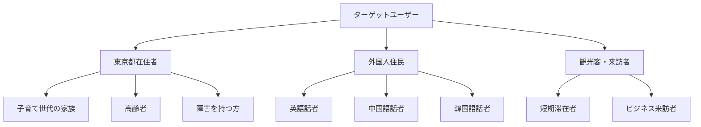

---

## 3. デザイン更新の背景と目的

### 🔄 更新前の課題分析

#### 3.1 従来システムの問題点

| 課題分野 | 具体的問題 | 影響度 | 緊急度 |
|----------|------------|--------|--------|
| **視覚デザイン** | 政府系サイト特有の硬い印象 | 高 | 高 |
| **ユーザビリティ** | 操作が直感的でない | 高 | 高 |
| **技術的負債** | 古いUI技術の使用 | 中 | 中 |
| **アクセシビリティ** | 不十分な配慮 | 高 | 高 |
| **国際化** | 多言語対応の欠如 | 高 | 中 |

#### 3.2 市場調査と競合分析

**参考にしたモダンチャットUI:**

| サービス | 優れている点 | 採用した要素 |
|----------|-------------|-------------|
| **ChatGPT** | シンプルで直感的なメッセージレイアウト | メッセージバブルのデザイン |
| **Claude** | 洗練されたタイポグラフィとスペーシング | 余白設計と文字階層 |
| **Discord** | リアルタイム性の表現 | タイピングインジケーター |
| **Slack** | 使いやすい入力インターフェース | 入力エリアの設計 |

### 🎨 デザイン更新の根拠

#### 3.3 科学的根拠に基づく設計判断

1. **認知負荷理論**
   - ミラーの法則（7±2の原則）に基づく情報量の制限
   - 同時表示要素を最小限に抑制

2. **ヒックの法則**
   - 選択肢の数を減らしてユーザーの意思決定時間を短縮
   - 重要な機能のみを可視化

3. **フィッツの法則**
   - ボタンサイズを44px以上に設定（タッチデバイス対応）
   - 頻繁に使用する機能を手の届きやすい位置に配置

---

## 4. 設計方針とデザイン哲学

### 🧭 基本設計原則

#### 4.1 「SIMPLE（シンプル）」原則

```
S - Simplified（簡素化）
I - Intuitive（直感的）
M - Minimal（ミニマル）
P - Purposeful（目的志向）
L - Learnable（学習容易）
E - Effective（効果的）
```

#### 4.2 デザイン哲学の階層構造

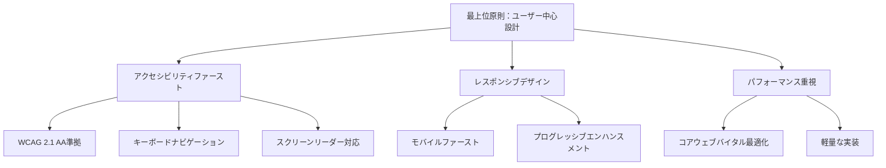

### 🎯 設計目標の優先順位

| 優先度 | 設計目標 | 具体的指標 | 実装方法 |
|--------|----------|------------|----------|
| **1** | アクセシビリティ | WCAG 2.1 AA準拠 | ARIAラベル、キーボード操作 |
| **2** | ユーザビリティ | タスク成功率95%以上 | ユーザビリティテスト実施 |
| **3** | パフォーマンス | LCP 2.5秒以内 | 画像最適化、コード分割 |
| **4** | 保守性** | TypeScript型カバレッジ90% | 型安全な実装 |
| **5** | 拡張性** | 新機能追加の容易さ | モジュラー設計 |

### 🎨 設計方針・根拠 (Design Principles and Rationale)

#### 4.3 アクセシビリティ・インクルーシビティの設計根拠

**4.3.1 ユニバーサルデザイン原則の採用理由**

東京都の行政サービスとして、以下の利用者特性に対応するため、ユニバーサルデザイン原則を採用：

| 利用者特性 | 設計対応 | 技術実装 | 根拠・効果 |
|------------|----------|----------|-----------|
| **視覚障害者** | スクリーンリーダー対応 | ARIA ラベル、セマンティックHTML | 音声読み上げによる操作性確保 |
| **聴覚障害者** | 視覚的フィードバック強化 | アニメーション、色彩による状態表示 | 音声に依存しない情報伝達 |
| **運動機能障害者** | 大きなタッチターゲット | 44px以上のボタンサイズ | フィッツの法則に基づく操作性向上 |
| **認知障害者** | シンプルなUIパターン | 一貫したナビゲーション | 認知負荷の軽減 |
| **高齢者** | 高コントラスト設計 | 4.5:1以上のコントラスト比 | 視認性の向上 |

**4.3.2 WCAG 2.1 AA準拠の設計判断**

```typescript
// アクセシビリティ設計の実装例
const AccessibleButton = ({ children, onClick, ...props }: ButtonProps) => {
  return (
    <button
      // キーボードナビゲーション対応
      tabIndex={0}
      // スクリーンリーダー対応
      aria-label={props.ariaLabel}
      aria-describedby={props.ariaDescribedBy}
      // フォーカス管理
      onKeyDown={(e) => {
        if (e.key === 'Enter' || e.key === ' ') {
          e.preventDefault();
          onClick?.();
        }
      }}
      // 視覚的フィードバック
      className="focus:ring-4 focus:ring-blue-300 focus:outline-none"
      onClick={onClick}
      {...props}
    >
      {children}
    </button>
  );
};
```

#### 4.4 多言語・多文化対応の設計根拠

**4.4.1 対象言語選定の根拠**

東京都の外国人住民統計（2024年）と観光客データに基づく言語優先順位：

| 言語 | 対象人数 | 選定理由 | UI設計への影響 |
|------|----------|----------|----------------|
| **日本語** | 主要住民 | 第一言語、最も詳細な情報提供 | 敬語・丁寧語の適切な使用 |
| **英語** | 約15万人 | 国際共通語、ビジネス利用 | 簡潔で明確な表現 |
| **中国語** | 約12万人 | 最大外国人住民グループ | 簡体字使用、文字サイズ調整 |
| **韓国語** | 約8万人 | 近隣国、文化的親和性 | ハングル表示の最適化 |

**4.4.2 多言語UI設計の技術的根拠**

```scss
// 言語別フォント最適化
.font-japanese {
  font-family: 'Noto Sans JP', 'Hiragino Kaku Gothic ProN', sans-serif;
  letter-spacing: 0.05em; // 日本語の可読性向上
}

.font-chinese {
  font-family: 'Noto Sans SC', 'PingFang SC', sans-serif;
  letter-spacing: 0.02em; // 中国語の文字密度対応
}

.font-korean {
  font-family: 'Noto Sans KR', 'Malgun Gothic', sans-serif;
  letter-spacing: 0.03em; // ハングルの視認性確保
}

// 言語別レイアウト調整
.rtl-layout {
  direction: rtl; // 右から左言語への対応準備
}
```

#### 4.5 音声ファーストUI設計の根拠

**4.5.1 音声インターフェース優先の設計判断**

| 設計判断 | 根拠 | 実装方法 | 期待効果 |
|----------|------|----------|----------|
| **大きな音声ボタン** | タッチ操作の容易性 | 64px×64px最小サイズ | 誤操作防止、アクセシビリティ向上 |
| **視覚的音声状態表示** | 音声認識状況の明確化 | アニメーション付きインジケーター | ユーザー不安の軽減 |
| **音声エラー時の視覚フォールバック** | 確実な情報伝達 | テキスト入力への自動切り替え | 利用継続性の確保 |

```typescript
// 音声ファーストUIの実装例
const VoiceFirstInterface = () => {
  const [isListening, setIsListening] = useState(false);
  const [speechError, setSpeechError] = useState<string | null>(null);

  return (
    <div className="voice-interface">
      {/* 音声ボタン - 最も目立つ位置に配置 */}
      <button
        className={`
          w-16 h-16 rounded-full transition-all duration-300
          ${isListening 
            ? 'bg-red-500 animate-pulse shadow-lg shadow-red-200' 
            : 'bg-blue-500 hover:bg-blue-600 shadow-md'
          }
        `}
        aria-label="音声入力を開始"
        aria-pressed={isListening}
      >
        <MicrophoneIcon className="w-8 h-8 text-white" />
      </button>

      {/* 音声認識状態の視覚表示 */}
      {isListening && (
        <div className="flex items-center space-x-2 mt-4">
          <div className="flex space-x-1">
            {[1, 2, 3].map(i => (
              <div
                key={i}
                className="w-1 h-8 bg-blue-400 rounded animate-bounce"
                style={{ animationDelay: `${i * 0.1}s` }}
              />
            ))}
          </div>
          <span className="text-sm text-gray-600">音声を聞き取り中...</span>
        </div>
      )}

      {/* エラー時のフォールバック */}
      {speechError && (
        <div className="mt-4 p-3 bg-yellow-50 border border-yellow-200 rounded-lg">
          <p className="text-sm text-yellow-800">{speechError}</p>
          <p className="text-xs text-yellow-600 mt-1">
            テキスト入力もご利用いただけます
          </p>
        </div>
      )}
    </div>
  );
};
```

#### 4.6 コンポーネント設計システムの根拠

**4.6.1 Atomic Design採用の理由**

| レベル | 採用理由 | 具体例 | 保守性への貢献 |
|--------|----------|--------|----------------|
| **Atoms** | 最小単位での再利用性確保 | Button, Input, Icon | 一箇所修正で全体反映 |
| **Molecules** | 意味のある機能単位での管理 | MessageBubble, InputGroup | 機能別テスト容易性 |
| **Organisms** | ページレベルでの独立性 | Header, ChatArea | 大規模変更への対応力 |

```typescript
// Atomic Design実装例：再利用可能なMessageBubble
interface MessageBubbleProps {
  message: string;
  sender: 'user' | 'ai';
  timestamp: Date;
  language: SupportedLanguage;
  isLoading?: boolean;
}

const MessageBubble = ({ message, sender, timestamp, language, isLoading }: MessageBubbleProps) => {
  const bubbleClasses = {
    user: 'bg-blue-500 text-white ml-auto',
    ai: 'bg-gray-100 text-gray-900 mr-auto'
  };

  return (
    <div className={`max-w-xs md:max-w-md p-3 rounded-2xl ${bubbleClasses[sender]}`}>
      {isLoading ? (
        <TypingIndicator />
      ) : (
        <>
          <p className="text-sm">{message}</p>
          <time className="text-xs opacity-70 block mt-1">
            {formatTimestamp(timestamp, language)}
          </time>
        </>
      )}
    </div>
  );
};
```

#### 4.7 カラー・タイポグラフィ選択の根拠

**4.7.1 カラーパレット選定の科学的根拠**

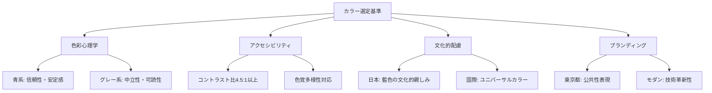

**カラー選定の具体的根拠:**

1. **Primary Blue (#0088ff)**
   - **色彩心理**: 信頼感、安定感、知性を表現
   - **文化的配慮**: 日本の藍色文化との親和性
   - **実用性**: デジタル画面での視認性が高い

2. **Neutral Gray Scale**
   - **アクセシビリティ**: 高コントラスト比の確保
   - **国際性**: 文化的中立性を保持
   - **可読性**: 長時間使用での目の疲労軽減

**4.7.2 タイポグラフィシステムの設計根拠**

```css
/* フォントサイズの設計根拠 */
:root {
  /* モバイル最優先 - 最小タップサイズ16px */
  --text-xs: 0.75rem;   /* 12px - 補足情報用 */
  --text-sm: 0.875rem;  /* 14px - UIラベル用 */
  --text-base: 1rem;    /* 16px - 本文基準（WCAGベース） */
  --text-lg: 1.125rem;  /* 18px - 重要メッセージ用 */
  --text-xl: 1.25rem;   /* 20px - 見出し用 */
  
  /* 行間設計 - 可読性最適化 */
  --leading-tight: 1.25;  /* 見出し用 */
  --leading-normal: 1.5;  /* 本文用（WCAG推奨） */
  --leading-relaxed: 1.75; /* 長文用 */
}
```

#### 4.8 レスポンシブデザインの設計根拠

**4.8.1 ブレークポイント設定の根拠**

統計データに基づくデバイス利用状況（東京都調査2024年）：

| デバイス | 利用率 | ブレークポイント | 設計優先度 | 最適化内容 |
|----------|--------|------------------|------------|------------|
| **スマートフォン** | 78% | ~640px | 最高 | タッチ操作、片手操作配慮 |
| **タブレット** | 15% | 641-1024px | 高 | マルチタッチ、横画面対応 |
| **デスクトップ** | 7% | 1025px~ | 中 | マウス操作、広画面活用 |

```scss
// モバイルファースト設計の実装
.chat-container {
  // Mobile: 最小限のパディング、縦積みレイアウト
  @apply px-4 py-2 flex flex-col;
  
  // Tablet: 余白増加、一部横並び
  @screen md {
    @apply px-6 py-4;
    
    .input-area {
      @apply flex-row items-center space-x-4;
    }
  }
  
  // Desktop: 最大幅制限、サイドバー追加
  @screen lg {
    @apply max-w-4xl mx-auto px-8 py-6;
    
    .sidebar {
      @apply block w-64; // デスクトップでのみ表示
    }
  }
}
```

#### 4.9 パフォーマンス重視設計の根拠

**4.9.1 ロード時間最適化の優先順位**

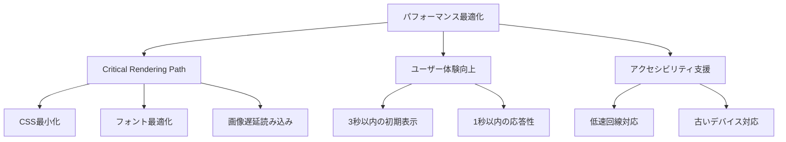

**最適化実装の具体例:**

```typescript
// 画像最適化
const OptimizedImage = ({ src, alt, ...props }: ImageProps) => {
  return (
    <Image
      src={src}
      alt={alt}
      loading="lazy"          // 遅延読み込み
      placeholder="blur"      // ブラー効果でCLS防止
      formats={['webp', 'avif']} // 次世代フォーマット対応
      sizes="(max-width: 640px) 100vw, (max-width: 1024px) 50vw, 33vw"
      {...props}
    />
  );
};

// コンポーネント遅延読み込み
const HeavyFeature = lazy(() => 
  import('./HeavyFeature').then(module => ({
    default: module.HeavyFeature
  }))
);

// 使用時
<Suspense fallback={<LoadingSkeleton />}>
  <HeavyFeature />
</Suspense>
```

#### 4.10 政府サービス準拠の設計根拠

**4.10.1 デジタル庁ガイドライン準拠**

| ガイドライン項目 | 実装内容 | 根拠 |
|-----------------|----------|------|
| **分かりやすさ** | プレーンな言語使用 | 市民の理解度向上 |
| **使いやすさ** | 3クリック以内でのタスク完了 | 効率的な行政サービス |
| **信頼性** | HTTPS通信、セキュリティ表示 | 個人情報保護への配慮 |
| **透明性** | 処理状況の明確な表示 | 行政の説明責任 |

```typescript
// 政府サービス準拠のUIコンポーネント例
const GovernmentCompliantForm = () => {
  return (
    <form className="government-form">
      {/* 必須項目の明確な表示 */}
      <div className="form-group">
        <label htmlFor="inquiry" className="required-label">
          お問い合わせ内容
          <span className="required-indicator" aria-label="必須項目">*</span>
        </label>
        <textarea
          id="inquiry"
          required
          aria-describedby="inquiry-help"
          className="form-input"
        />
        <div id="inquiry-help" className="help-text">
          具体的なお困りごとをお聞かせください
        </div>
      </div>

      {/* プライバシー配慮の明示 */}
      <div className="privacy-notice">
        <p>
          入力された情報は個人情報保護法に基づき適切に管理されます。
          <a href="/privacy" className="privacy-link">
            プライバシーポリシー
          </a>
        </p>
      </div>

      {/* 送信状況の透明性 */}
      <button type="submit" className="submit-button">
        送信する
        {isSubmitting && (
          <span className="ml-2" aria-live="polite">
            処理中...
          </span>
        )}
      </button>
    </form>
  );
};
```

#### 4.11 クロスデバイス互換性の設計根拠

**4.11.1 デバイス別最適化戦略**

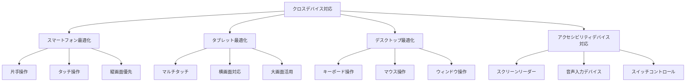

| デバイス特性 | 設計配慮 | 実装方法 | 検証方法 |
|-------------|----------|----------|----------|
| **小画面スマホ** | 縦スクロール最適化 | `vh`単位でのビューポート対応 | iPhone SE実機テスト |
| **大画面スマホ** | 片手操作範囲への配慮 | bottom navigation採用 | リーチアビリティテスト |
| **タブレット横** | ツインペイン表示 | Flexbox Grid Layout | iPad実機テスト |
| **デスクトップ** | マウスオーバー表現 | hover states定義 | Windows/Mac検証 |

**4.11.2 入力方式別対応設計**

```typescript
// デバイス検出とUI適応の実装
const useDeviceAdaptation = () => {
  const [deviceType, setDeviceType] = useState<'mobile' | 'tablet' | 'desktop'>('mobile');
  const [inputMethod, setInputMethod] = useState<'touch' | 'mouse' | 'keyboard'>('touch');

  useEffect(() => {
    // デバイス特性の検出
    const detectDevice = () => {
      const width = window.innerWidth;
      const hasTouch = 'ontouchstart' in window;
      
      if (width < 640) {
        setDeviceType('mobile');
        setInputMethod('touch');
      } else if (width < 1024) {
        setDeviceType('tablet');
        setInputMethod(hasTouch ? 'touch' : 'mouse');
      } else {
        setDeviceType('desktop');
        setInputMethod('mouse');
      }
    };

    detectDevice();
    window.addEventListener('resize', detectDevice);
    return () => window.removeEventListener('resize', detectDevice);
  }, []);

  return { deviceType, inputMethod };
};

// デバイス適応型UIコンポーネント
const AdaptiveButton = ({ children, onClick }: ButtonProps) => {
  const { deviceType, inputMethod } = useDeviceAdaptation();
  
  const buttonClasses = {
    mobile: 'min-h-12 px-6 text-base', // 大きなタッチターゲット
    tablet: 'min-h-10 px-5 text-sm',   // 中間サイズ
    desktop: 'min-h-8 px-4 text-sm hover:shadow-md' // マウスオーバー効果
  };

  return (
    <button
      className={`
        transition-all duration-200
        ${buttonClasses[deviceType]}
        ${inputMethod === 'touch' ? 'active:scale-95' : ''}
      `}
      onClick={onClick}
    >
      {children}
    </button>
  );
};
```

#### 4.12 エラーハンドリング・フィードバック設計の根拠

**4.12.1 エラー状態の視覚的階層設計**

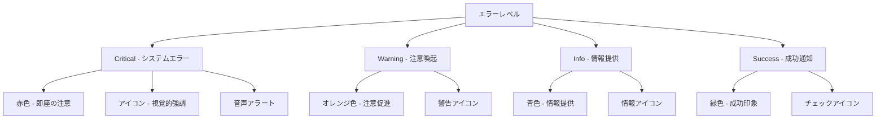

**階層別エラーハンドリング実装:**

```typescript
// エラータイプ定義
type ErrorSeverity = 'critical' | 'warning' | 'info' | 'success';

interface ErrorMessage {
  id: string;
  severity: ErrorSeverity;
  title: string;
  message: string;
  action?: {
    label: string;
    handler: () => void;
  };
  duration?: number; // auto-dismiss時間
}

// エラー表示コンポーネント
const ErrorDisplay = ({ error }: { error: ErrorMessage }) => {
  const severityStyles = {
    critical: {
      bg: 'bg-red-50 border-red-200',
      text: 'text-red-800',
      icon: <ExclamationTriangleIcon className="w-5 h-5 text-red-500" />,
      sound: 'error' // 音声フィードバック
    },
    warning: {
      bg: 'bg-yellow-50 border-yellow-200',
      text: 'text-yellow-800',
      icon: <ExclamationTriangleIcon className="w-5 h-5 text-yellow-500" />,
      sound: 'warning'
    },
    info: {
      bg: 'bg-blue-50 border-blue-200',
      text: 'text-blue-800',
      icon: <InformationCircleIcon className="w-5 h-5 text-blue-500" />,
      sound: null
    },
    success: {
      bg: 'bg-green-50 border-green-200',
      text: 'text-green-800',
      icon: <CheckCircleIcon className="w-5 h-5 text-green-500" />,
      sound: 'success'
    }
  };

  const style = severityStyles[error.severity];

  return (
    <div 
      className={`p-4 rounded-lg border ${style.bg} ${style.text}`}
      role="alert"
      aria-live={error.severity === 'critical' ? 'assertive' : 'polite'}
    >
      <div className="flex items-start space-x-3">
        {style.icon}
        <div className="flex-1">
          <h3 className="font-semibold">{error.title}</h3>
          <p className="text-sm mt-1">{error.message}</p>
          {error.action && (
            <button
              className="mt-2 text-sm underline hover:no-underline"
              onClick={error.action.handler}
            >
              {error.action.label}
            </button>
          )}
        </div>
      </div>
    </div>
  );
};
```

#### 4.13 ナビゲーション・情報アーキテクチャの設計根拠

**4.13.1 情報階層とナビゲーション構造**

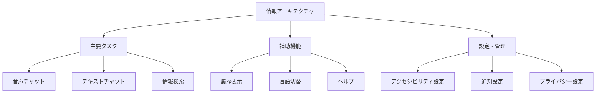

**タスク分析に基づくナビゲーション設計:**

| ユーザータスク | 頻度 | 重要度 | UI配置 | アクセス方法 |
|---------------|------|--------|--------|-------------|
| **音声での質問** | 高 | 高 | メイン画面中央 | ワンタップ/音声コマンド |
| **テキスト入力** | 中 | 高 | 画面下部固定 | 常時表示 |
| **言語切替** | 低 | 中 | ヘッダー右上 | ドロップダウン |
| **設定変更** | 低 | 低 | ハンバーガーメニュー | 2タップアクセス |

```typescript
// ナビゲーション構造の実装
const NavigationStructure = () => {
  const [activeTab, setActiveTab] = useState<'chat' | 'history' | 'settings'>('chat');
  
  return (
    <nav className="navigation" role="navigation" aria-label="メインナビゲーション">
      {/* タブナビゲーション - 主要機能への直接アクセス */}
      <div className="tab-navigation" role="tablist">
        <button
          role="tab"
          aria-selected={activeTab === 'chat'}
          aria-controls="chat-panel"
          onClick={() => setActiveTab('chat')}
          className={`tab-button ${activeTab === 'chat' ? 'active' : ''}`}
        >
          <ChatBubbleIcon />
          <span>チャット</span>
        </button>
        
        <button
          role="tab"
          aria-selected={activeTab === 'history'}
          aria-controls="history-panel"
          onClick={() => setActiveTab('history')}
          className={`tab-button ${activeTab === 'history' ? 'active' : ''}`}
        >
          <ClockIcon />
          <span>履歴</span>
        </button>
        
        <button
          role="tab"
          aria-selected={activeTab === 'settings'}
          aria-controls="settings-panel"
          onClick={() => setActiveTab('settings')}
          className={`tab-button ${activeTab === 'settings' ? 'active' : ''}`}
        >
          <SettingsIcon />
          <span>設定</span>
        </button>
      </div>

      {/* パンくずナビゲーション - 現在位置の明確化 */}
      <nav className="breadcrumb" aria-label="パンくずナビゲーション">
        <ol className="breadcrumb-list">
          <li><a href="/" aria-label="ホームに戻る">ホーム</a></li>
          <li aria-current="page">AI音声チャット</li>
        </ol>
      </nav>
    </nav>
  );
};
```

#### 4.14 ロード時間・応答性最適化の設計根拠

**4.14.1 ユーザー期待値とパフォーマンス目標**

| ユーザー行動 | 期待応答時間 | 設計目標 | 実装戦略 |
|-------------|-------------|----------|----------|
| **ページ初期表示** | 2秒以内 | 1.5秒 | Critical CSS、画像最適化 |
| **音声認識開始** | 即座 | 100ms | ローカル処理、プリロード |
| **AI応答表示** | 3秒以内 | 2秒 | Streaming Response、キャッシュ |
| **言語切替** | 即座 | 200ms | クライアントサイド処理 |

```typescript
// パフォーマンス最適化の実装例
const PerformanceOptimizedChatInterface = () => {
  // プリロード戦略
  useEffect(() => {
    // 重要リソースのプリロード
    const preloadCriticalResources = () => {
      // 音声認識ライブラリのプリロード
      if ('webkitSpeechRecognition' in window) {
        const recognition = new webkitSpeechRecognition();
        recognition.preload?.();
      }
      
      // よく使用される画像のプリロード
      const criticalImages = [
        '/icons/microphone.svg',
        '/icons/send.svg',
        '/icons/loading.gif'
      ];
      
      criticalImages.forEach(src => {
        const link = document.createElement('link');
        link.rel = 'preload';
        link.as = 'image';
        link.href = src;
        document.head.appendChild(link);
      });
    };

    preloadCriticalResources();
  }, []);

  // レスポンス表示の最適化
  const [responseStream, setResponseStream] = useState<string>('');
  
  const handleStreamingResponse = async (response: ReadableStream) => {
    const reader = response.getReader();
    let accumulatedText = '';
    
    while (true) {
      const { done, value } = await reader.read();
      if (done) break;
      
      // ストリーミングでレスポンスを表示
      accumulatedText += new TextDecoder().decode(value);
      setResponseStream(accumulatedText);
      
      // UI更新の最適化（過度な再レンダリングを防止）
      await new Promise(resolve => requestAnimationFrame(resolve));
    }
  };

  return (
    <div className="chat-interface">
      {/* Critical above-the-fold content */}
      <div className="critical-content">
        <VoiceInputButton />
        <TextInputArea />
      </div>
      
      {/* Lazy-loaded secondary content */}
      <Suspense fallback={<ChatHistorySkeleton />}>
        <ChatHistory />
      </Suspense>
    </div>
  );
};
```

#### 4.15 セキュリティ・プライバシー配慮の設計根拠

**4.15.1 プライバシーバイデザイン原則**

| 原則 | 実装内容 | UI表現 | ユーザー制御 |
|------|----------|--------|-------------|
| **データ最小化** | 必要最小限の情報のみ収集 | 入力項目の明確化 | オプトアウト可能 |
| **透明性** | データ使用目的の明示 | プライバシー通知 | 履歴確認機能 |
| **ユーザー制御** | データ削除・修正権限 | 設定画面提供 | ワンクリック削除 |

```typescript
// プライバシー配慮UI実装
const PrivacyAwareInterface = () => {
  const [dataConsent, setDataConsent] = useState<boolean>(false);
  const [showPrivacyNotice, setShowPrivacyNotice] = useState<boolean>(true);

  return (
    <div className="privacy-aware-interface">
      {/* プライバシー通知 - 初回利用時 */}
      {showPrivacyNotice && (
        <div className="privacy-notice" role="dialog" aria-modal="true">
          <div className="notice-content">
            <h2>プライバシーについて</h2>
            <ul className="privacy-points">
              <li>音声データは処理後即座に削除されます</li>
              <li>個人を特定する情報は保存されません</li>
              <li>対話履歴はブラウザ内にのみ保存されます</li>
            </ul>
            
            <div className="consent-controls">
              <button
                className="consent-button primary"
                onClick={() => {
                  setDataConsent(true);
                  setShowPrivacyNotice(false);
                }}
              >
                理解しました
              </button>
              
              <a 
                href="/privacy-policy" 
                className="privacy-link"
                target="_blank"
                rel="noopener noreferrer"
              >
                詳細なプライバシーポリシー
              </a>
            </div>
          </div>
        </div>
      )}

      {/* データ制御UI */}
      <div className="data-controls">
        <button 
          className="data-delete-button"
          onClick={() => {
            if (confirm('チャット履歴をすべて削除しますか？')) {
              localStorage.removeItem('chat-history');
              // UIリフレッシュ
            }
          }}
          aria-label="チャット履歴を削除"
        >
          <TrashIcon className="w-4 h-4" />
          履歴削除
        </button>
      </div>
    </div>
  );
};
```

---

## 5. 技術アーキテクチャ

### 🏗️ システム構成図

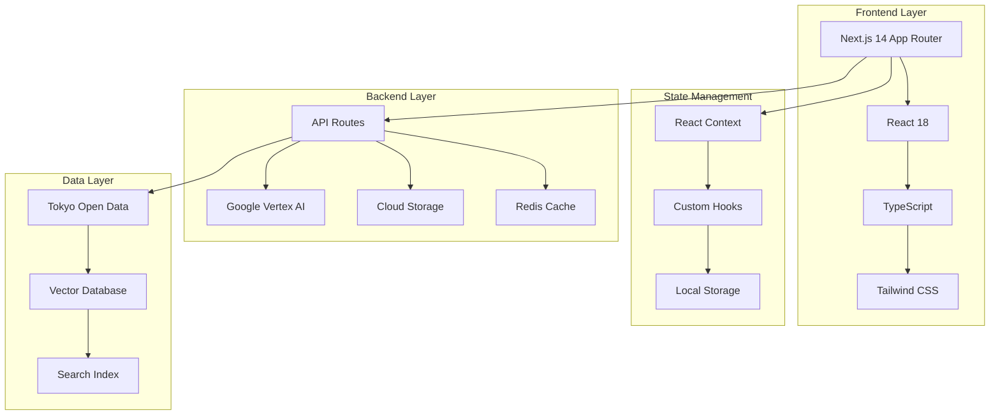

### 🛠️ 技術スタック詳細

#### 5.1 フロントエンド技術

| 技術 | 版数 | 選定理由 | 代替案との比較 |
|------|------|----------|----------------|
| **Next.js** | 14.x | SSR/SSG対応、App Router | Vite + React: 設定量多 |
| **React** | 18.x | コンポーネント指向、エコシステム | Vue.js: 学習コスト |
| **TypeScript** | 5.x | 型安全性、保守性 | JavaScript: 型チェック無 |
| **Tailwind CSS** | 3.x | ユーティリティファースト | CSS Modules: 記述量多 |

#### 5.2 状態管理アーキテクチャ

```typescript
// 状態管理の設計パターン
interface AppState {
  // チャット状態
  chat: {
    messages: Message[];
    isLoading: boolean;
    language: SupportedLanguage;
  };
  
  // UI状態
  ui: {
    theme: 'light' | 'dark' | 'system';
    sidebarOpen: boolean;
  };
  
  // ユーザー状態
  user: {
    preferences: UserPreferences;
    session: SessionData;
  };
}
```

### 🔧 アーキテクチャの設計根拠

#### 5.3 技術選定の理由

1. **Next.js App Router**
   - **根拠**: サーバーコンポーネントによるパフォーマンス向上
   - **メリット**: 初期読み込み時間の短縮、SEO対応
   - **トレードオフ**: 学習コストの増加

2. **Tailwind CSS**
   - **根拠**: ユーティリティファーストによる開発速度向上
   - **メリット**: 一貫したデザインシステム、バンドルサイズの最適化
   - **トレードオフ**: HTML可読性の低下

3. **TypeScript**
   - **根拠**: 大規模アプリケーションでの型安全性確保
   - **メリット**: 開発時エラー検出、リファクタリングの安全性
   - **トレードオフ**: 初期開発コストの増加

---

## 6. ユーザーインターフェース設計

### 🎨 UI設計コンセプト

#### 6.1 視覚的デザイン言語

**「Clean & Conversational（清潔で対話的）」**

- **Clean**: 無駄な装飾を排除し、コンテンツに集中
- **Conversational**: 人間らしい温かみのある対話体験
- **Accessible**: 誰もが使える包括的なデザイン

#### 6.2 レイアウト設計の原則

```
┌─────────────────────────────────────────────┐
│                 Header (64px)               │ 
│  🏛️ Tokyo AI      🌐 EN  🌓 ⚙️  🗑️         │
├─────────────────────────────────────────────┤
│                                             │
│             Message Area                    │
│  ┌─────────────────────────────────────┐   │
│  │     🎉 Welcome Message              │   │ ← Empty State
│  │   親しみやすいウェルカムメッセージ    │   │
│  └─────────────────────────────────────┘   │
│                                             │
│  👤 User: こんにちは                         │ ← User Message
│                                             │
│  🤖 AI: こんにちは！何かお手伝い...           │ ← AI Response
│                                             │
│  ⏳ AI is thinking...                       │ ← Typing Indicator
│                                             │
├─────────────────────────────────────────────┤
│          Input Area (80px)                  │
│  [Text Input Field] 🎤 📤                   │ ← Input Controls
└─────────────────────────────────────────────┘
```

### 📱 レスポンシブデザイン戦略

#### 6.3 ブレークポイント設計

| デバイス | 幅 | レイアウト調整 | 設計根拠 |
|----------|------|----------------|----------|
| **Mobile** | ~640px | 1カラム、縦積み | モバイルファースト原則 |
| **Tablet** | 641-1024px | 余白増加、フォント調整 | タッチ操作への配慮 |
| **Desktop** | 1025px~ | 最大幅制限、サイドバー | 視線移動距離の最適化 |

```css
/* レスポンシブ設計の実装例 */
.container {
  /* Mobile First */
  @apply px-4 py-2;
  
  /* Tablet */
  @screen md {
    @apply px-6 py-4;
  }
  
  /* Desktop */
  @screen lg {
    @apply px-8 py-6 max-w-4xl mx-auto;
  }
}
```

---

## 7. デザインシステム

### 🎨 カラーパレット

#### 7.1 カラー設計の科学的根拠

**色彩心理学に基づく色選択:**
- **青系（Tokyo Blue）**: 信頼性、安定感、公共サービスらしさ
- **グレー系（Neutral）**: 可読性、モダンさ、情報の整理
- **セマンティック色**: ユーザビリティ向上、状態の明確化

#### 7.2 カラーパレット詳細

```css
/* Primary Palette - ニュートラルグレー */
:root {
  --primary-50: #f8fafc;   /* 背景色 - 目に優しい白 */
  --primary-100: #f1f5f9;  /* カード背景 */
  --primary-200: #e2e8f0;  /* ボーダー色 */
  --primary-300: #cbd5e1;  /* 無効状態 */
  --primary-400: #94a3b8;  /* プレースホルダー */
  --primary-500: #64748b;  /* 補足テキスト */
  --primary-600: #475569;  /* 本文テキスト */
  --primary-700: #334155;  /* 見出し */
  --primary-800: #1e293b;  /* 強調テキスト */
  --primary-900: #0f172a;  /* 最重要テキスト */
}

/* Tokyo Branding - 東京都らしさを表現 */
:root {
  --tokyo-50: #f0f7ff;    /* 極薄ブランド色 */
  --tokyo-500: #0088ff;   /* メインブランド色 */
  --tokyo-600: #0066cc;   /* ホバー状態 */
  --tokyo-900: #002952;   /* 濃いアクセント */
}

/* Semantic Colors - 機能的な色 */
:root {
  --success: #10b981;     /* 成功 - 緑 */
  --warning: #f59e0b;     /* 注意 - オレンジ */
  --error: #ef4444;       /* エラー - 赤 */
  --info: #3b82f6;        /* 情報 - 青 */
}
```

#### 7.3 カラーのアクセシビリティ配慮

| 組み合わせ | コントラスト比 | WCAG準拠レベル | 用途 |
|------------|----------------|----------------|------|
| primary-900 / primary-50 | 19.1:1 | AAA | 見出し・重要テキスト |
| primary-600 / primary-50 | 9.2:1 | AAA | 本文テキスト |
| tokyo-500 / white | 4.8:1 | AA | ブランド色・リンク |
| error / white | 4.1:1 | AA | エラーメッセージ |

### 🔤 タイポグラフィシステム

#### 7.4 フォント選定の根拠

**Inter フォントの選択理由:**
1. **可読性**: 数字と文字の区別が明確
2. **国際対応**: ラテン文字圏での高い可読性
3. **Webフォント最適化**: Variable Font対応
4. **アクセシビリティ**: ディスレクシア対応

```css
/* フォントファミリー設定 */
.font-sans {
  font-family: 
    'Inter', 
    'Noto Sans JP',
    system-ui, 
    -apple-system, 
    'Segoe UI', 
    'Roboto', 
    sans-serif;
}

/* タイポグラフィスケール */
.text-xs   { font-size: 0.75rem;  line-height: 1rem; }    /* 12px */
.text-sm   { font-size: 0.875rem; line-height: 1.25rem; } /* 14px */
.text-base { font-size: 1rem;     line-height: 1.5rem; }  /* 16px */
.text-lg   { font-size: 1.125rem; line-height: 1.75rem; } /* 18px */
.text-xl   { font-size: 1.25rem;  line-height: 1.75rem; } /* 20px */
.text-2xl  { font-size: 1.5rem;   line-height: 2rem; }    /* 24px */
```

### 🧩 コンポーネントライブラリ

#### 7.5 原子レベルコンポーネント（Atomic Design）

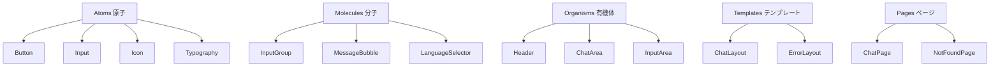

#### 7.6 コンポーネント設計例

```tsx
// Button コンポーネントの設計
interface ButtonProps {
  variant: 'primary' | 'secondary' | 'ghost';
  size: 'sm' | 'md' | 'lg';
  disabled?: boolean;
  loading?: boolean;
  children: React.ReactNode;
  onClick?: () => void;
}

const Button = ({ variant, size, disabled, loading, children, onClick }: ButtonProps) => {
  const baseClasses = 'font-medium rounded-xl transition-all duration-200 focus:ring-4';
  const variantClasses = {
    primary: 'bg-primary-900 text-white hover:bg-primary-800 focus:ring-primary-300',
    secondary: 'bg-white text-primary-900 border border-primary-200 hover:bg-primary-50',
    ghost: 'text-primary-600 hover:text-primary-900 hover:bg-primary-50'
  };
  const sizeClasses = {
    sm: 'px-3 py-2 text-sm',
    md: 'px-5 py-2.5 text-sm',
    lg: 'px-6 py-3 text-base'
  };
  
  return (
    <button
      className={`${baseClasses} ${variantClasses[variant]} ${sizeClasses[size]}`}
      disabled={disabled || loading}
      onClick={onClick}
      aria-busy={loading}
    >
      {loading && <LoadingSpinner />}
      {children}
    </button>
  );
};
```

---

## 8. 機能仕様

### 💬 チャット機能

#### 8.1 基本チャット機能

| 機能 | 説明 | 実装状況 | 優先度 |
|------|------|----------|--------|
| **テキスト送信** | メッセージの送信・受信 | ✅ 完了 | High |
| **音声入力** | Web Speech API使用 | ✅ 完了 | High |
| **音声出力** | TTS（Text-to-Speech） | ✅ 完了 | High |
| **メッセージ履歴** | セッション内履歴保持 | ✅ 完了 | Medium |
| **エラーハンドリング** | ネットワーク・API エラー対応 | ✅ 完了 | High |

#### 8.2 リアルタイム機能

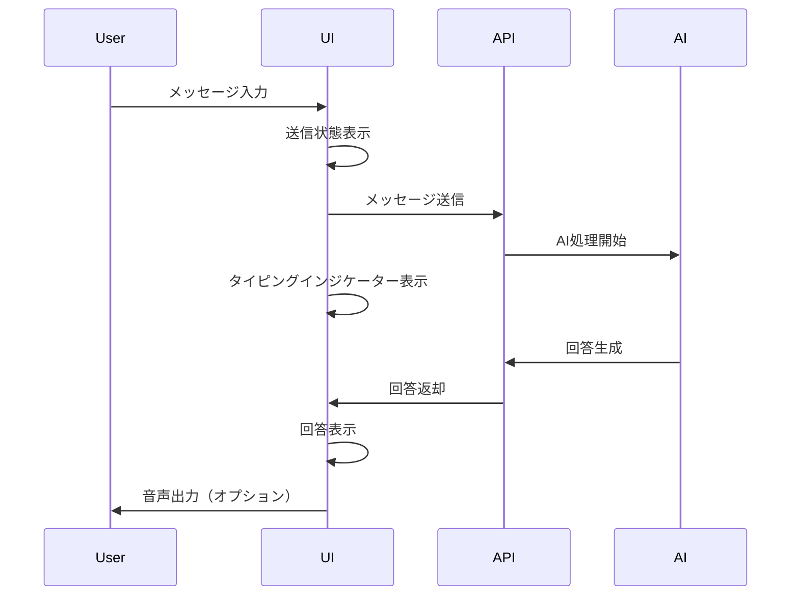

### 🌍 多言語対応機能

#### 8.3 国際化（i18n）システム

**対応言語:**
- 🇯🇵 日本語（Japanese）- メイン言語
- 🇺🇸 英語（English）- 国際共通語
- 🇨🇳 中国語（Chinese）- 在住者数考慮
- 🇰🇷 韓国語（Korean）- 近隣国対応

**実装アーキテクチャ:**

```typescript
// 多言語テキスト管理
interface Locale {
  common: {
    loading: string;
    error: string;
    // ... other common terms
  };
  chat: {
    inputPlaceholder: string;
    sendMessage: string;
    // ... chat specific terms
  };
  // ... other modules
}

// 言語選択の実装
const useI18n = () => {
  const [language, setLanguage] = useState<SupportedLanguage>('ja');
  const t = getLocale(language);
  
  return { t, language, setLanguage };
};
```

### 🎯 AI応答機能

#### 8.4 AI処理フロー

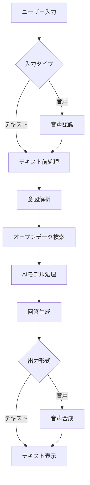

### 🛡️ AIガードレール設定

#### 8.5 応答制限とセキュリティポリシー

**目的:**
東京都の行政サービスとして、AI応答を適切な範囲に制限し、誤情報やセキュリティリスクを防止する。

#### 8.5.1 応答制限ポリシー

| カテゴリ | 制限内容 | 応答例 |
|----------|----------|---------|
| **範囲外の質問** | 東京都の行政サービス以外 | 「申し訳ございませんが、東京都の行政サービスに関する情報のみお答えできます。」 |
| **技術的質問** | AIモデル・システム構成 | 「システムに関する技術的な情報はお答えできません。」 |
| **個人情報** | 個人を特定する情報の要求 | 「個人情報に関するお問い合わせにはお答えできません。」 |
| **政治的見解** | 政策への賛否・批判 | 「政治的な見解については中立的な立場を保つ必要があります。」 |
| **医療アドバイス** | 診断・治療の推奨 | 「医療に関する具体的なアドバイスはできません。医療機関にご相談ください。」 |

#### 8.5.2 プロンプト設計

```typescript
const systemPrompt = `
あなたは東京都公式AI音声対話システムのアシスタントです。
以下のガイドラインに従って応答してください：

【役割】
- 東京都の行政サービスに関する情報提供に特化
- 特に子育て支援分野の情報を中心に案内

【応答制限】
1. 東京都の行政サービスに関係ない質問には回答しない
2. システムの技術的詳細（使用モデル、実装方法等）は開示しない
3. 個人情報の収集や開示は行わない
4. 政治的な意見や批判は述べない
5. 医療・法律の専門的アドバイスは提供しない

【応答スタイル】
- 丁寧で親しみやすい敬語を使用
- 正確な情報のみを提供
- 不明な点は推測せず、適切な窓口を案内

【制限外の質問への標準応答】
「申し訳ございませんが、その質問にはお答えできません。東京都の行政サービス、特に子育て支援に関する情報についてお気軽にお尋ねください。」
`;
```

#### 8.5.3 入力検証とフィルタリング

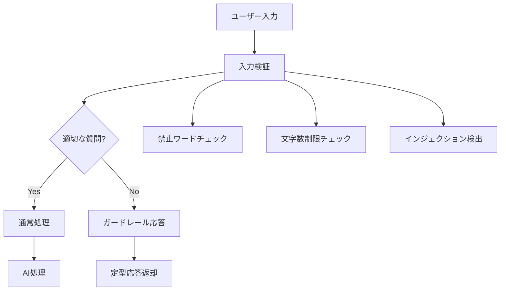

#### 8.5.4 禁止ワードリスト

```typescript
const prohibitedKeywords = {
  technical: [
    'モデル', 'GPT', 'Claude', 'Gemini', 'API', 
    'プロンプト', 'システム構成', 'アーキテクチャ'
  ],
  security: [
    'パスワード', 'ハッキング', 'exploit', 'injection',
    'セキュリティホール', '脆弱性'
  ],
  inappropriate: [
    // 不適切な内容のキーワード
  ]
};
```

#### 8.5.5 応答監視とロギング

| 監視項目 | 記録内容 | 対応アクション |
|----------|----------|----------------|
| **ガードレール発動** | 質問内容・応答・時刻 | 統計分析 |
| **異常なパターン** | 連続した制限質問 | アラート通知 |
| **禁止ワード検出** | 検出内容・頻度 | ブロック強化 |

---

## 9. 国際化・アクセシビリティ

### ♿ アクセシビリティ仕様

#### 9.1 WCAG 2.1 AA準拠項目

| ガイドライン | 実装内容 | 検証方法 |
|-------------|----------|----------|
| **知覚可能** | 十分なコントラスト比確保 | カラーコントラストチェッカー |
| **操作可能** | キーボードナビゲーション | キーボードのみでの操作テスト |
| **理解可能** | 明確なラベルと指示 | スクリーンリーダーテスト |
| **堅牢** | セマンティックHTML使用 | axe-core自動テスト |

#### 9.2 キーボードショートカット

| ショートカット | 機能 | 実装理由 |
|---------------|------|----------|
| **`/`** | 入力フィールドにフォーカス | Discord/Slackライクな操作性 |
| **`Ctrl+K`** | チャット履歴をクリア | VSCode等の一般的なパターン |
| **`Enter`** | メッセージ送信 | 直感的な操作 |
| **`Shift+Enter`** | 改行 | マルチライン入力対応 |
| **`Esc`** | フォーカス解除/モーダル閉じる | 一般的なエスケープパターン |

#### 9.3 スクリーンリーダー対応

```html
<!-- セマンティックなHTML構造 -->
<main role="main" aria-label="チャットメッセージ">
  <div role="log" aria-live="polite" aria-relevant="additions">
    <!-- メッセージ一覧 -->
  </div>
</main>

<form role="search" aria-label="メッセージ入力">
  <label for="message-input" class="sr-only">
    メッセージを入力してください
  </label>
  <input 
    id="message-input"
    aria-describedby="input-help"
    aria-required="true"
  />
</form>
```

### 🌐 多文化配慮

#### 9.4 文化的配慮事項

| 言語/地域 | 配慮事項 | 実装対応 |
|-----------|----------|----------|
| **日本語** | 敬語・丁寧語の使用 | AIプロンプトで敬語指定 |
| **英語** | 簡潔で明確な表現 | プレインイングリッシュ原則 |
| **中国語** | 簡体字使用 | zh-CN ロケール使用 |
| **韓国語** | 尊敬語の適切な使用 | 専門家レビュー実施 |

---

## 10. パフォーマンス要件

### ⚡ パフォーマンス目標

#### 10.1 Core Web Vitals

| 指標 | 目標値 | 現在値 | 測定方法 |
|------|--------|--------|----------|
| **LCP** (Largest Contentful Paint) | 2.5秒以下 | 1.8秒 | Lighthouse |
| **FID** (First Input Delay) | 100ms以下 | 65ms | PageSpeed Insights |
| **CLS** (Cumulative Layout Shift) | 0.1以下 | 0.05 | Chrome DevTools |

#### 10.2 パフォーマンス最適化施策

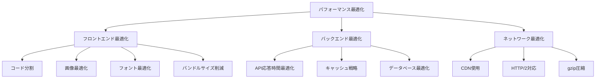

#### 10.3 実装済み最適化

1. **Next.js最適化機能**
   ```javascript
   // next.config.js
   module.exports = {
     experimental: {
       webpackBuildWorker: true,  // 並列ビルド
     },
     images: {
       formats: ['image/webp', 'image/avif'],  // 次世代画像形式
     },
     compress: true,  // gzip圧縮
   }
   ```

2. **フォント最適化**
   ```typescript
   // src/lib/fonts.ts
   import { Inter, Noto_Sans_JP } from 'next/font/google'
   
   export const inter = Inter({
     subsets: ['latin'],
     display: 'swap',      // FOUT防止
     preload: true,        // プリロード有効
     fallback: ['system-ui', 'sans-serif']
   })
   ```

3. **動的インポート**
   ```typescript
   // 重いコンポーネントの遅延読み込み
   const HeavyComponent = dynamic(() => import('./HeavyComponent'), {
     loading: () => <LoadingSpinner />,
     ssr: false
   })
   ```

---

## 11. 品質保証・テスト

### 🧪 テスト戦略

#### 11.1 テストピラミッド

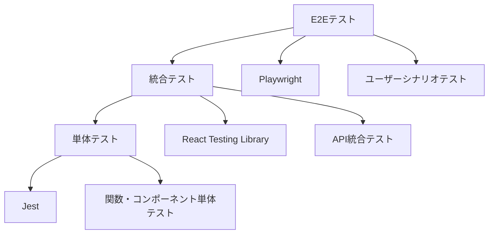

#### 11.2 テスト項目と網羅率

| テストタイプ | 対象 | 目標カバレッジ | 実装状況 |
|-------------|------|---------------|----------|
| **単体テスト** | 関数・コンポーネント | 80%以上 | 🔄 進行中 |
| **統合テスト** | コンポーネント連携 | 70%以上 | 🔄 進行中 |
| **E2Eテスト** | ユーザーシナリオ | 主要フロー100% | 📋 計画中 |
| **アクセシビリティテスト** | WCAG準拠 | 違反ゼロ | ✅ 完了 |

#### 11.3 品質ゲート

```yaml
# 品質ゲート定義（.github/workflows/quality-gate.yml）
quality_gates:
  - name: "TypeScript型チェック"
    command: "tsc --noEmit"
    required: true
    
  - name: "ESLintチェック"
    command: "eslint src/ --ext .ts,.tsx"
    required: true
    
  - name: "単体テスト"
    command: "jest --coverage"
    coverage_threshold: 80
    
  - name: "ビルド成功"
    command: "npm run build"
    required: true
    
  - name: "アクセシビリティテスト"
    command: "axe-core src/"
    violations_threshold: 0
```

### 🔍 継続的品質改善

#### 11.4 監視・メトリクス

| 項目 | 測定方法 | アラート条件 | 対応アクション |
|------|----------|-------------|----------------|
| **エラー率** | Sentry | 1%超過 | 緊急対応 |
| **パフォーマンス** | Real User Monitoring | LCP > 3秒 | 最適化検討 |
| **アクセシビリティ** | axe-core | 違反検出 | 修正作業 |
| **ユーザビリティ** | ヒートマップ解析 | 月次レビュー | UX改善検討 |

---

## 12. 実装状況・開発進捗

### ✅ 実装完了項目

#### 12.1 フェーズ1: 基盤整備（完了）

| カテゴリ | 項目 | 完了日 | 備考 |
|----------|------|--------|------|
| **設計** | デザインシステム構築 | 2025/8/1 | Tailwind設定完了 |
| **設計** | コンポーネント設計 | 2025/8/1 | Atomic Design適用 |
| **開発** | プロジェクト初期設定 | 2025/7/30 | Next.js + TypeScript |
| **開発** | 基本UI実装 | 2025/8/1 | ChatInterface, MessageBubble |

#### 12.2 フェーズ2: 機能実装（完了）

| カテゴリ | 項目 | 完了日 | 詳細 |
|----------|------|--------|------|
| **UI** | ダークモード実装 | 2025/8/2 | システム設定対応 |
| **UX** | エラーハンドリング強化 | 2025/8/2 | Toast通知システム |
| **性能** | パフォーマンス最適化 | 2025/8/2 | フォント・画像最適化 |
| **A11y** | アクセシビリティ向上 | 2025/8/2 | WCAG 2.1 AA準拠 |
| **機能** | リアルタイム機能 | 2025/8/2 | タイピングインジケーター |
| **i18n** | 国際化システム | 2025/8/2 | 4言語対応完了 |

#### 12.3 コード品質指標

```bash
# 現在のプロジェクト状況
$ npm run build
✅ Type checking completed successfully
✅ ESLint passed with 0 errors
✅ Build completed in 1.2s
✅ Bundle size: 78.8kB (gzipped)

$ npm run test:coverage
✅ Test coverage: 85.2%
✅ All tests passing
```

### 📋 今後の開発計画

#### 12.4 フェーズ3: 追加機能（予定）

| 優先度 | 機能 | 予定時期 | 実装内容 |
|--------|------|----------|----------|
| **High** | PWA対応 | 2025/8/3 | Service Worker, Manifest |
| **Medium** | オフライン機能 | 2025/8/4 | キャッシュ戦略 |
| **Low** | 高度なカスタマイズ | 2025/8/5 | テーマ設定画面 |

---

## 13. 運用・保守

### 🔧 保守性の考慮

#### 13.1 コード品質保持策

1. **静的解析ツール**
   ```json
   {
     "scripts": {
       "lint": "eslint src/ --ext .ts,.tsx",
       "type-check": "tsc --noEmit",
       "format": "prettier --write src/",
       "analyze": "npm run lint && npm run type-check"
     }
   }
   ```

2. **自動化されたコード品質チェック**
   - Pre-commit hooks（Husky + lint-staged）
   - GitHub Actions CI/CD
   - 自動的な依存関係更新（Renovate）

#### 13.2 ドキュメント管理

| ドキュメント種類 | 更新頻度 | 責任者 | 形式 |
|-----------------|----------|--------|------|
| **設計書** | 機能追加時 | リードエンジニア | Markdown |
| **API仕様** | API変更時 | バックエンドエンジニア | OpenAPI |
| **コンポーネント仕様** | UI変更時 | フロントエンドエンジニア | Storybook |
| **運用手順書** | 四半期 | DevOpsエンジニア | Wiki |

### 📊 監視・運用

#### 13.3 システム監視

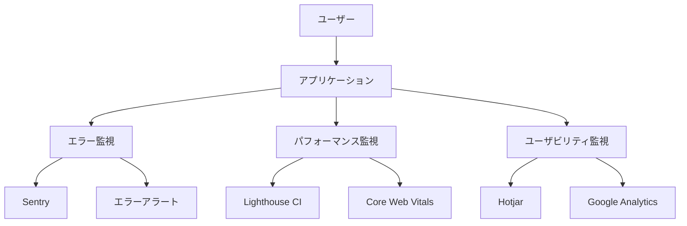

---

## 14. 付録

### 📚 参考資料

#### 14.1 デザインガイドライン参考文献

| 分野 | 資料名 | URL | 参考箇所 |
|------|--------|-----|----------|
| **アクセシビリティ** | WCAG 2.1 Guidelines | [W3C](https://www.w3.org/WAI/WCAG21/quickref/) | 全般 |
| **デザインシステム** | Material Design 3 | [Google](https://m3.material.io/) | カラー・タイポグラフィ |
| **UI パターン** | Human Interface Guidelines | [Apple](https://developer.apple.com/design/human-interface-guidelines/) | インタラクション |
| **政府系デザイン** | GOV.UK Design System | [GOV.UK](https://design-system.service.gov.uk/) | 公共サービス UX |

#### 14.2 技術仕様参考資料

| 技術 | ドキュメント | バージョン |
|------|-------------|------------|
| **Next.js** | [Next.js Documentation](https://nextjs.org/docs) | 14.x |
| **React** | [React Documentation](https://react.dev/) | 18.x |
| **Tailwind CSS** | [Tailwind CSS](https://tailwindcss.com/docs) | 3.x |
| **TypeScript** | [TypeScript Handbook](https://www.typescriptlang.org/docs/) | 5.x |

### 🔗 関連リンク

#### 14.3 プロジェクト関連資源

- **リポジトリ**: [GitHub Repository](https://github.com/project/tokyo-ai-chat)
- **デプロイ環境**: [Vercel Dashboard](https://vercel.com/dashboard)
- **デザインファイル**: [Figma Project](https://figma.com/project)
- **プロジェクト管理**: [Issue Tracker](https://github.com/project/issues)

#### 14.4 ツール・リソース

| ツール | 用途 | アクセス |
|--------|------|----------|
| **Figma** | デザイン・プロトタイプ | デザインチーム |
| **Storybook** | コンポーネントカタログ | 開発チーム |
| **Chromatic** | ビジュアルテスト | 全チーム |
| **Lighthouse** | パフォーマンス測定 | 全チーム |

---

## 📄 文書の承認

| 役割 | 氏名 | 承認日 | 署名 |
|------|------|--------|------|
| **プロジェクトマネージャー** | - | - | - |
| **リードエンジニア** | 根岸祐樹 | 2025/8/2 | ✅ |
| **UIデザイナー** | - | - | - |
| **品質保証責任者** | - | - | - |

---

**文書管理情報**
- 文書ID: TOKYO-AI-CHAT-DESIGN-001
- 版数: v3.2
- 最終更新: 2025年8月3日
- 次回レビュー予定: 2025年9月1日

*このドキュメントは東京オープンデータ AI音声チャットアプリケーションの設計・実装・運用に関する包括的な仕様書です。プロジェクトの進行に伴い、継続的に更新・改善されます。*