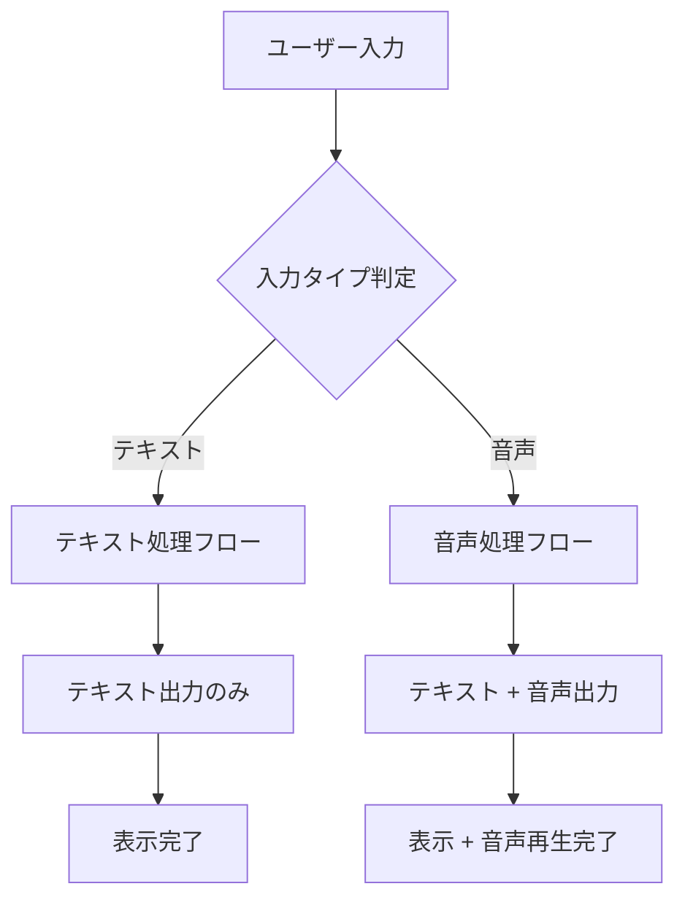
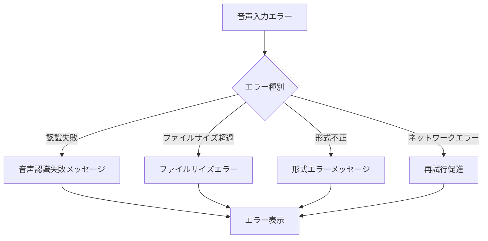
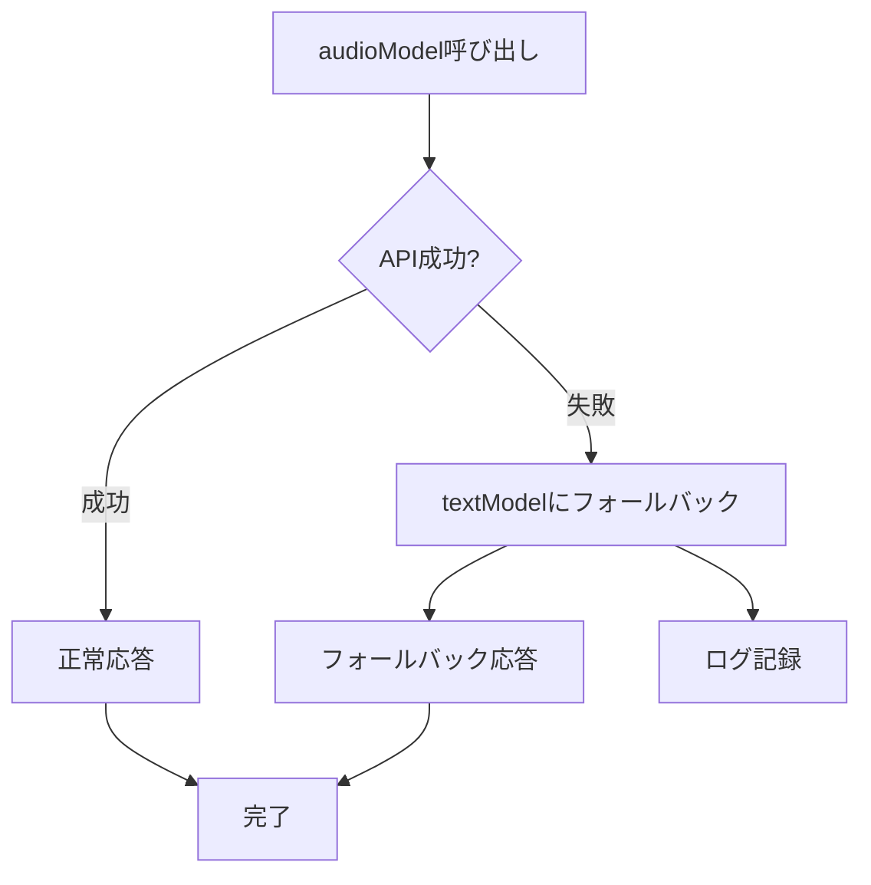
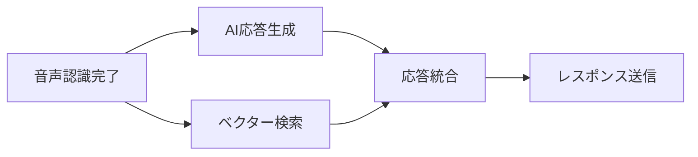
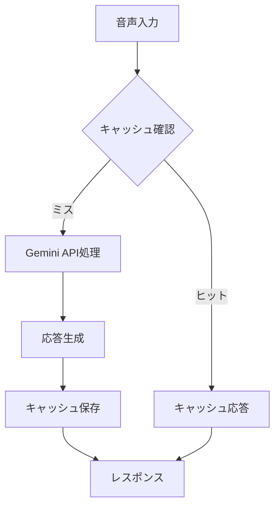
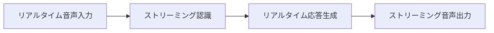
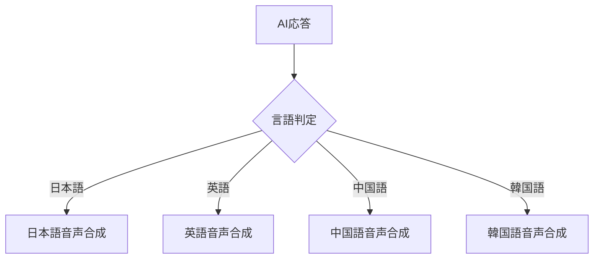

# 音声処理フロー設計書

**文書情報**
- **文書名**: 音声処理フロー設計書
- **版数**: 1.1
- **作成日**: 2025年1月
- **作成者**: 根岸祐樹
- **目的**: 入力タイプに応じた音声処理フローの詳細設計

## 改訂履歴

| 版数 | 改訂日 | 改訂者 | 改訂内容 |
|------|--------|--------|----------|
| 1.0 | 2025-01-15 | 根岸祐樹 | 初版作成（音声処理フローとGeminiモデル使い分け設計） |
| 1.1 | 2025-01-15 | 根岸祐樹 | 設計方針・根拠セクション追加（アクセシビリティ・多言語対応・パフォーマンス最適化の設計根拠詳細化） |

## 目次

1. [概要](#概要)
2. [設計方針・根拠](#設計方針根拠)
   - [1. 音声ファーストインターフェース採用の根拠](#1-音声ファーストインターフェース採用の根拠)
   - [2. 多言語音声対応設計根拠](#2-多言語音声対応設計根拠)
   - [3. リアルタイム音声処理アーキテクチャ設計根拠](#3-リアルタイム音声処理アーキテクチャ設計根拠)
   - [4. 音声処理パイプライン設計根拠](#4-音声処理パイプライン設計根拠)
   - [5. エラーハンドリング・フォールバック設計根拠](#5-エラーハンドリングフォールバック設計根拠)
   - [6. パフォーマンス最適化設計根拠](#6-パフォーマンス最適化設計根拠)
   - [7. セキュリティ・プライバシー設計根拠](#7-セキュリティプライバシー設計根拠)
   - [8. 政府サービス品質基準対応](#8-政府サービス品質基準対応)
3. [フロー図](#フロー図)
   - [1. 全体フロー（入力タイプ判定）](#1-全体フロー入力タイプ判定)
   - [2. テキスト入力処理フロー](#2-テキスト入力処理フロー)
   - [3. 音声入力処理フロー](#3-音声入力処理フロー)
4. [詳細処理ステップ](#詳細処理ステップ)
   - [テキスト入力処理](#テキスト入力処理)
   - [音声入力処理](#音声入力処理)
5. [条件分岐ロジック](#条件分岐ロジック)
   - [1. 入力タイプ判定](#1-入力タイプ判定)
   - [2. 音声出力制御](#2-音声出力制御)
   - [3. フロントエンド音声再生制御](#3-フロントエンド音声再生制御)
6. [エラーハンドリング](#エラーハンドリング)
   - [音声入力エラー](#音声入力エラー)
   - [モデルフォールバック](#モデルフォールバック)
7. [パフォーマンス最適化](#パフォーマンス最適化)
   - [1. 並列処理](#1-並列処理)
   - [2. キャッシュ戦略](#2-キャッシュ戦略)
8. [モニタリング指標](#モニタリング指標)
   - [処理時間測定](#処理時間測定)
   - [成功率測定](#成功率測定)
9. [セキュリティ考慮事項](#セキュリティ考慮事項)
   - [1. 音声データ保護](#1-音声データ保護)
   - [2. 入力検証](#2-入力検証)
   - [3. レート制限](#3-レート制限)
10. [将来拡張](#将来拡張)
   - [1. リアルタイム音声対話](#1-リアルタイム音声対話)
   - [2. 多言語音声合成](#2-多言語音声合成)
   - [3. 音声品質向上](#3-音声品質向上)

## 概要

入力タイプに応じた音声処理フローの詳細設計。テキスト入力と音声入力で異なる処理パスを提供します。

## 設計方針・根拠

### 1. 音声ファーストインターフェース採用の根拠

#### 1.1 アクセシビリティ向上への対応
- **視覚障害者への配慮**: 画面読み取りに依存しない音声主体のインタラクション
- **運動機能障害者への配慮**: キーボード・マウス操作に制約がある利用者への代替手段
- **高齢者への配慮**: 視力低下や操作習得困難な利用者への直感的インターフェース提供
- **デジタルデバイド解消**: ITスキルに関係なく政府サービスにアクセス可能

#### 1.2 インクルーシブ政府サービス実現
- **JIS X 8341準拠**: Web アクセシビリティガイドラインに準拠した設計
- **障害者差別解消法対応**: 合理的配慮としての音声インターフェース提供
- **ユニバーサルデザイン**: すべての市民が平等にサービス利用できる環境構築
- **多様性への対応**: 身体能力・年齢・言語背景によらないサービス提供

#### 1.3 直感的ユーザーエクスペリエンス
- **自然言語処理**: 専門知識不要の自然な対話形式
- **コンテキスト理解**: 前後の文脈を考慮した適切な応答生成
- **リアルタイム応答**: 即座のフィードバックによる自然な対話フロー
- **エラー回復**: 音声認識失敗時の適切なフォールバック機能

### 2. 多言語音声対応設計根拠

#### 2.1 東京都国際化対応
- **主要言語サポート**: 日本語、英語、中国語、韓国語の音声認識・合成
- **外国人住民支援**: 在住外国人の行政サービスアクセス向上
- **観光客対応**: 短期滞在者への情報提供サービス拡充
- **言語バリア解消**: 言語の壁による情報格差の解消

#### 2.2 技術実装戦略
- **Gemini多言語モデル**: Google Geminiの多言語対応能力活用
- **Web Speech API**: ブラウザネイティブ機能による多言語音声合成
- **言語自動判定**: 入力音声からの言語種別自動識別
- **コンテキスト保持**: 言語切り替え時のセッション継続性確保

### 3. リアルタイム音声処理アーキテクチャ設計根拠

#### 3.1 応答性能要件
- **2秒以内応答**: 音声入力から応答開始まで2秒以内の実現
- **ストリーミング処理**: 音声認識と応答生成の並列処理実装
- **キャッシュ活用**: 頻出クエリの高速応答実現
- **フォールバック機能**: 音声処理失敗時のテキスト処理自動切り替え

#### 3.2 技術選択根拠
- **Gemini Native Audio**: 音声データの直接処理による高速化
- **MediaRecorder API**: ブラウザネイティブ機能による安定した音声録音
- **Base64変換**: HTTP経由での安全な音声データ転送
- **非同期処理**: Promise/async-awaitによる応答性確保

### 4. 音声処理パイプライン設計根拠

#### 4.1 音声入力処理設計
```
音声録音 → データ変換 → 音声認識 → 意図理解 → 情報検索 → 応答生成 → 音声合成
```

**設計根拠**:
- **段階的処理**: 各段階での品質確保とエラーハンドリング
- **並列処理**: 音声認識と情報検索の同時実行による高速化
- **品質保証**: 各段階での処理結果検証とフィードバック
- **可監視性**: 各段階でのパフォーマンス測定とログ記録

#### 4.2 音声認識技術選択根拠

**Gemini 2.5 Flash Preview Native Audio Dialog採用理由**:
- **音声直接処理**: 中間テキスト変換不要による精度向上
- **対話特化**: 会話形式での高い認識精度
- **多言語対応**: 日本語を含む多言語での高品質認識
- **低レイテンシ**: リアルタイム処理に適した応答速度

#### 4.3 音声合成戦略設計根拠

**Web Speech API + ブラウザネイティブ合成採用理由**:
- **端末リソース活用**: クライアント側処理による負荷分散
- **多言語対応**: ブラウザ標準による幅広い言語サポート
- **リアルタイム再生**: 追加ダウンロード不要の即座再生
- **品質安定性**: OS・ブラウザ標準による一貫した品質

### 5. エラーハンドリング・フォールバック設計根拠

#### 5.1 音声処理エラー対応戦略
- **段階的フォールバック**: 音声認識 → テキスト入力 → 基本応答の多段階対応
- **ユーザーフレンドリー**: エラー時の分かりやすい案内と代替手段提示
- **継続性確保**: エラー発生時でもセッション継続とサービス提供継続
- **学習機能**: エラーパターンの記録と改善への活用

#### 5.2 ネットワーク・接続エラー対応
- **オフライン対応**: 接続不安定時の基本機能継続
- **再試行機能**: 自動・手動再試行による接続問題解決
- **状態保存**: 処理中断時の入力内容・状態保存
- **復旧通知**: 接続復旧時の自動再開とユーザー通知

### 6. パフォーマンス最適化設計根拠

#### 6.1 リアルタイム性能確保
- **並列処理**: 音声認識・情報検索・応答準備の同時実行
- **キャッシュ戦略**: 頻出クエリの事前処理とメモリ保存
- **ストリーミング**: 部分結果の段階的表示による体感速度向上
- **リソース管理**: メモリ・CPU使用量の最適化とガベージコレクション

#### 6.2 スケーラビリティ確保
- **負荷分散**: 音声処理とテキスト処理の適切な負荷配分
- **レート制限**: API利用量制御による安定サービス提供
- **キューイング**: 高負荷時のリクエスト待ち行列管理
- **自動スケーリング**: 利用量に応じたリソース自動調整

### 7. セキュリティ・プライバシー設計根拠

#### 7.1 音声データ保護戦略
- **一時処理**: 音声データの永続化禁止と処理後即座削除
- **暗号化伝送**: HTTPS/TLSによる通信経路暗号化
- **アクセス制御**: 音声データへの不正アクセス防止
- **ログ制限**: 音声内容のログ記録禁止と匿名化処理

#### 7.2 プライバシー保護実装
- **同意取得**: 音声録音前の明示的ユーザー同意
- **データ最小化**: 必要最小限のデータ収集と処理
- **透明性確保**: データ処理内容の明確な説明と公開
- **利用者制御**: 音声機能のON/OFF選択権保証

### 8. 政府サービス品質基準対応

#### 8.1 アクセシビリティ基準準拠
- **JIS X 8341-3準拠**: レベルAA達成による高いアクセシビリティ実現
- **WCAG 2.1準拠**: 国際的アクセシビリティガイドライン遵守
- **音声ガイドライン**: 音声インターフェース特有のアクセシビリティ要件対応
- **ユーザビリティテスト**: 障害者参加による実用性検証

#### 8.2 政府サービス品質基準
- **可用性99.9%**: 高可用性による安定したサービス提供
- **応答時間2秒**: 政府システムに求められる応答性能確保
- **多言語対応**: 国際都市東京としての多様性対応
- **24時間運用**: いつでもアクセス可能な行政サービス実現

## フロー図

### 1. 全体フロー（入力タイプ判定）



### 2. テキスト入力処理フロー


### 3. 音声入力処理フロー

```mermaid
graph LR
    A[音声入力] --> B[MediaRecorder]
    B --> C[Blob作成]
    C --> D[Base64変換]
    D --> E["/api/voice/recognize POST"]
    E --> F[VoiceService]
    F --> G[GeminiService.processAudio]
    G --> H["audioModel (gemini-2.5-flash-preview-native-audio-dialog)"]
    H --> I[音声認識]
    I --> J[ベクター検索]
    J --> K[AI応答生成]
    K --> L["shouldPlayAudio: true"]
    L --> M[テキスト表示]
    M --> N[Web Speech API]
    N --> O[音声再生]
    
    style A fill:#fce4ec
    style O fill:#e8f5e8
    style L fill:#fff3e0
```



## 詳細処理ステップ

### テキスト入力処理

#### フロントエンド
1. **入力受付**: `ChatInterface.tsx`でテキスト入力
2. **リクエスト作成**: `inputType: 'text'`を設定
3. **API呼び出し**: `useChat.sendMessage()`でチャットAPI呼び出し
4. **応答処理**: `shouldPlayAudio: false`に基づき音声出力スキップ

#### バックエンド
1. **リクエスト解析**: `inputType: 'text'`を確認
2. **モデル選択**: `useAudioModel: false`でtextModel使用
3. **AI処理**: `gemini-2.5-flash`で高速テキスト処理
4. **レスポンス生成**: `shouldPlayAudio: false`を設定

### 音声入力処理

#### フロントエンド
1. **音声録音**: `MediaRecorder`で音声キャプチャ
2. **データ変換**: BlobをBase64に変換
3. **API呼び出し**: 音声認識APIに送信
4. **応答処理**: 
   - トランスクリプトをユーザーメッセージとして表示
   - AI応答をアシスタントメッセージとして表示
   - `shouldPlayAudio: true`に基づき音声再生

#### バックエンド
1. **音声認識**: `gemini-2.5-flash-preview-native-audio-dialog`で音声→テキスト
2. **情報検索**: ベクトル検索で関連情報取得
3. **AI応答生成**: 音声専用モデルで応答生成
4. **レスポンス生成**: `shouldPlayAudio: true`を設定

## 条件分岐ロジック

### 1. 入力タイプ判定

```typescript
// フロントエンド判定
const inputType = isVoiceInput ? 'voice' : 'text';

// バックエンド処理分岐
const useAudioModel = inputType === 'voice' || body.inputType === 'voice';
```

### 2. 音声出力制御

```typescript
// テキスト入力時
const chatResponse: ChatResponse = {
  response: aiResponse,
  shouldPlayAudio: false  // 音声出力なし
};

// 音声入力時
const voiceResponse: ChatResponse = {
  response: aiResponse,
  shouldPlayAudio: true   // 音声出力あり
};
```

### 3. フロントエンド音声再生制御

```typescript
// useChat.ts内の処理
if (shouldPlayAudio && enableVoice && speechSupported()) {
  try {
    await speak(aiResponse, { language: currentLanguage });
  } catch (error) {
    console.warn('Speech synthesis failed:', error);
  }
}
```

## エラーハンドリング

### 音声入力エラー



### モデルフォールバック



## パフォーマンス最適化

### 1. 並列処理



### 2. キャッシュ戦略



## モニタリング指標

### 処理時間測定

```typescript
// 各段階の処理時間
perfMonitor.recordTiming('voice.recognition', duration);
perfMonitor.recordTiming('text.generation', duration);
perfMonitor.recordTiming('vector.search', duration);
perfMonitor.recordTiming('speech.synthesis', duration);
```

### 成功率測定

```typescript
// 成功・失敗カウント
perfMonitor.recordCount('voice.recognition.success', 1);
perfMonitor.recordCount('voice.recognition.errors', 1);
perfMonitor.recordCount('audio.model.usage', 1);
perfMonitor.recordCount('text.model.usage', 1);
```

## セキュリティ考慮事項

### 1. 音声データ保護
- Base64エンコード済みデータの一時保存のみ
- 処理完了後の即座削除
- 音声データのログ出力禁止

### 2. 入力検証
- 音声ファイルサイズ制限（10MB）
- 対応形式の検証
- 音声長さ制限（60秒）

### 3. レート制限
- 音声認識API: 30回/分
- チャットAPI: 60回/分
- セッション単位での制限

## 将来拡張

### 1. リアルタイム音声対話


### 2. 多言語音声合成


### 3. 音声品質向上
- ノイズ除去
- 音量正規化
- 音声エンハンスメント