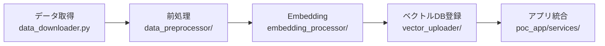

# 東京都音声対話システム AI Assistant

## プロジェクト概要

東京都の複合的社会課題（自然災害リスク増大、外国人住民急増、デジタルデバイド）に対応するため、音声・テキスト対話が可能なAIアシスタントシステムを開発。保育園情報を中心とした行政サービス案内を多言語で提供します。

**基本理念**: 「誰一人取り残さない、インクルーシブな行政サービスの実現」

## 🚀 実装完了状況

### ✅ 完了済み実装

#### フロントエンド
- **Next.js 14**: App Router、TypeScript、Tailwind CSS
- **音声インターフェース**: 録音、再生、リアルタイム処理
- **テキストチャット**: メッセージ履歴、リアルタイムタイピング
- **多言語対応**: 日本語・英語切り替え
- **セッション管理**: 自動セッション作成・復元

#### API エンドポイント
- **セッション管理**: `/api/session` - 作成、取得、更新、削除
- **チャット処理**: `/api/chat` - テキスト対話、キャッシュ、検索
- **音声認識**: `/api/voice/recognize` - 音声→テキスト変換
- **ヘルスチェック**: `/api/health` - システム状態監視

#### サービス層
- **RedisService**: セッション管理、キャッシュ、レート制限
- **GeminiService**: AI応答生成、音声認識改善
- **コンテキスト管理**: 言語設定、セッション状態

## 🔐 認証・セキュリティ

### Google Cloud Platform認証

本プロジェクトでは、GCP環境での安全な運用のためADC（Application Default Credentials）認証を推奨しています。

#### セキュリティ機能
- ✅ **レート制限**: API呼び出し回数制限（チャット: 60回/分、音声: 30回/分）
- ✅ **入力検証**: XSS対策、文字数制限、形式チェック
- ✅ **エラーハンドリング**: 本番環境での詳細情報非表示
- ✅ **セッション管理**: Redis使用、有効期限管理

#### 認証設定方法

**ローカル開発環境**:
```bash
gcloud auth application-default login
```

**本番環境**:
- GCP Service Account使用
- 最小権限原則でIAM設定

## 📋 システム構成

### アーキテクチャ概要

```
┌─────────────────┐    ┌─────────────────┐    ┌─────────────────┐
│   Next.js 14    │    │  API Routes     │    │  Google Cloud   │
│   (フロント)     │    │  (バックエンド)  │    │                 │
│                 │    │                 │    │                 │
│ • 音声UI        │◄──►│ • /api/chat     │◄──►│ • Gemini API    │
│ • チャットUI    │    │ • /api/session  │    │ • Redis         │
│ • 言語切替      │    │ • /api/voice    │    │ • Vector Search │
│ • セッション    │    │ • /api/health   │    │ • TTS/STT       │
└─────────────────┘    └─────────────────┘    └─────────────────┘
```

### 技術スタック

| カテゴリ | 技術 | 用途 |
|----------|------|------|
| **フロントエンド** | Next.js 14 + TypeScript | React UI、型安全性 |
| **スタイリング** | Tailwind CSS | レスポンシブデザイン |
| **API** | Next.js API Routes | サーバーサイド処理 |
| **AI/ML** | Google Gemini API | テキスト生成・改善 |
| **キャッシュ** | Redis | セッション・レート制限 |
| **音声** | Web Audio API | ブラウザ音声処理 |
| **デプロイ** | Cloud Run | コンテナ実行 |
| **開発** | TypeScript | 型安全な開発 |

## 🚀 クイックスタート

### 1. 前提条件

- Node.js 18以上
- npm または yarn
- Google Cloud アカウント（本番環境用）

### 2. セットアップ
```bash
# リポジトリクローン
git clone <repository-url>
cd TokyoOpenDataHackathon

# 依存関係インストール
npm install

# 環境変数設定（オプション）
cp .env.example .env.local
# 必要に応じて .env.local を編集
```

### 3. 開発サーバー起動

```bash
# 開発サーバー起動
npm run dev

# TypeScript型チェック
npm run type-check

# リント実行
npm run lint
```

### 4. アクセス

- **メインアプリ**: http://localhost:3000
- **API エンドポイント**: http://localhost:3000/api
- **ヘルスチェック**: http://localhost:3000/api/health

## 📖 使用方法

### 1. セッション作成

アプリケーションを開くと自動的にセッションが作成され、ブラウザに保存されます。

### 2. テキスト対話

1. メイン画面で「テキストモード」を選択
2. メッセージ入力欄に質問を入力
3. Enterキーまたは送信ボタンでメッセージ送信
4. 保育園情報や子育て支援について質問できます

### 3. 音声対話

1. メイン画面で「音声モード」を選択  
2. 「録音開始」ボタンをクリック
3. マイクに向かって話す
4. 「録音停止」ボタンで音声送信
5. 音声認識結果とAI応答を確認

### 4. 言語切り替え

- 画面右上の言語選択で日本語・英語を切り替え
- セッション設定は自動保存されます

### 5. セッション管理

- セッション情報は自動的にブラウザに保存
- ページリロード後も前回の状態を復元
- 有効期限は1時間です

## 🔧 API エンドポイント

### セッション管理
- `POST /api/session` - セッション作成
- `GET /api/session/[sessionId]` - セッション取得
- `PATCH /api/session/[sessionId]` - セッション設定更新
- `DELETE /api/session/[sessionId]` - セッション削除

### チャット機能
- `POST /api/chat` - テキスト対話（レート制限: 60回/分）
  - キャッシュ機能付き（5分間）
  - 関連情報検索
  - 音声応答生成オプション

### 音声機能
- `POST /api/voice/recognize` - 音声認識（レート制限: 30回/分）
  - サポート形式: webm, mp3, wav, m4a
  - 最大ファイルサイズ: 10MB
  - Gemini API使用の認識結果改善

### システム監視
- `GET /api/health` - ヘルスチェック
  - Redis接続状態
  - Gemini API状態
  - システムメトリクス

## 🧪 テスト・開発

```bash
# 型チェック
npm run type-check

# リント実行
npm run lint

# ビルドテスト
npm run build

# 本番モード起動
npm start
```

## 📁 プロジェクト構造

```
src/
├── app/                    # Next.js App Router
│   ├── api/               # API Routes
│   │   ├── chat/          # チャット API
│   │   ├── session/       # セッション管理 API
│   │   ├── voice/         # 音声処理 API
│   │   └── health/        # ヘルスチェック API
│   ├── layout.tsx         # ルートレイアウト
│   └── page.tsx           # メインページ
├── components/            # Reactコンポーネント
│   ├── chat/              # チャット関連
│   └── voice/             # 音声関連
├── lib/                   # ライブラリ・サービス
│   ├── context/           # React Context
│   └── services/          # バックエンドサービス
└── types/                 # TypeScript型定義
```

## 🚀 今後の拡張予定

### MVP段階での実装予定
- **実際のGemini Live API統合**
- **Vector Search実装**（保育園データ検索）
- **音声合成機能追加**
- **ユーザー認証機能**

### 将来拡張
- **多言語拡張**（中国語・韓国語）
- **災害情報対応**
- **PWA対応**（オフライン機能）
- **スマートフォンアプリ化**

## 📞 サポート・トラブルシューティング

### よくある問題

1. **開発サーバーが起動しない**
   ```bash
   # Node.jsバージョン確認
   node --version  # 18以上必要
   
   # 依存関係の再インストール
   rm -rf node_modules package-lock.json
   npm install
   ```

2. **型エラーが発生する**
   ```bash
   # TypeScript型チェック
   npm run type-check
   
   # 型定義の確認
   npm install --save-dev @types/node
   ```

3. **API呼び出しエラー**
   - ブラウザのDevToolsでネットワークタブを確認
   - レート制限（60回/分）に引っかかっていないか確認
   - セッションが有効か確認

4. **音声機能が動作しない**
   - ブラウザがマイクアクセスを許可しているか確認
   - HTTPS環境での実行（本番環境）
   - サポートされている音声形式か確認

### 開発時のログ確認

```bash
# Next.js開発サーバーログ
npm run dev

# ブラウザコンソールでエラー確認
# Network タブでAPI通信確認
```

## 📄 ライセンス

このプロジェクトは東京都のオープンイノベーションの一環として開発されています。

---

**プロジェクト目的**: 東京都の複合的社会課題解決を通じた「誰一人取り残さない、インクルーシブな行政サービス」の実現

**開発状況**: Next.js 14 + TypeScript による音声・テキスト対話機能の MVP 実装完了

## 設計書一覧

### 📋 設計書体系全体図

```
要件定義書 (完成)
    ↓
基本設計書 (完成)
    ↓
┌─詳細設計書──┬─UI/UX設計書──┬─API設計書────┐
│              │              │              │
├─DB設計書────┼─セキュリティ──┼─インフラ設計──┤
│              │設計書        │書            │
└─テスト計画──┴─運用設計書────┴─移行計画書──┘
                                  ↓
                              品質保証計画書
```

### 📊 設計書詳細一覧

| No | 設計書名 | 状態 | 依存関係 | 主な内容 | 対象読者 | 優先度 |
|----|---------|----|----------|----------|----------|--------|
| **1** | **要件定義書** | ✅ **完成** | - | 社会課題分析、機能・非機能要件、MVP範囲 | 全ステークホルダー | 🔴 最高 |
| **2** | **基本設計書** | ✅ **完成** | 要件定義書 | システム構成、コンポーネント設計、技術選定 | 開発チーム、PM | 🔴 最高 |
| **3** | **詳細設計書** | ✅ **完成** | 基本設計書 | 実装レベル詳細仕様、コーディングルール統合 | エンジニア | 🟠 高 |
| **4** | **API設計書** | ⏸️ 未着手 | 基本設計書 | REST API仕様、WebSocket仕様、認証方式 | フロント・バックエンド | 🟠 高 |
| **5** | **UI/UX設計書** | ⏸️ 未着手 | 要件定義書、基本設計書 | 画面遷移、ワイヤーフレーム、アクセシビリティ | デザイナー、フロントエンド | 🟠 高 |
| **6** | **データベース設計書** | ⏸️ 未着手 | 基本設計書 | テーブル設計、ER図、インデックス設計 | バックエンド、DBA | 🟡 中 |
| **7** | **セキュリティ設計書** | ⏸️ 未着手 | 基本設計書 | 脅威分析、認証・認可、暗号化方式 | セキュリティエンジニア | 🟠 高 |
| **8** | **インフラ設計書** | ⏸️ 未着手 | 基本設計書 | GCP構成、ネットワーク、監視設計 | インフラエンジニア | 🟡 中 |
| **9** | **テスト計画書** | ⏸️ 未着手 | 詳細設計書、API設計書 | テスト戦略、テストケース、自動化計画 | QA、テストエンジニア | 🟡 中 |
| **10** | **運用設計書** | ⏸️ 未着手 | インフラ設計書 | 監視、ログ、アラート、バックアップ | 運用チーム | 🟡 中 |
| **11** | **移行計画書** | ⏸️ 未着手 | 全設計書 | 段階的リリース、データ移行、切り戻し | PM、運用チーム | 🔵 低 |
| **12** | **品質保証計画書** | ⏸️ 未着手 | テスト計画書 | 品質基準、レビュー体制、承認フロー | QA、PM | 🔵 低 |

### 🏗️ 段階別設計・開発計画

#### **Phase 1: 基盤設計（完了済み）**
- ✅ 要件定義書（v2.8）- RAG構成・多言語対応・最新技術更新
- ✅ 基本設計書（v3.7）- RAG構成・統合UI・最新技術統合
- ✅ 詳細設計書（v3.0）- 実装レベル詳細仕様・コーディングルール統合

#### **Phase 2: 実装支援設計（次段階）**
- ⏸️ API設計書 - Gemini API・Vertex Vector Search連携仕様
- ⏸️ UI/UX設計書 - アクセシビリティ・統合UI詳細設計
- ⏸️ データベース設計書 - RAGデータ構造・ベクトルDB設計

#### **Phase 3: 実装支援設計**
- ⏸️ データベース設計書 - MVP用静的データ管理
- ⏸️ セキュリティ設計書 - 最小限セキュリティ要件
- ⏸️ インフラ設計書 - GCP Cloud Run基本構成

#### **Phase 4: 品質・運用設計**
- ⏸️ テスト計画書 - MVP検証計画
- ⏸️ 運用設計書 - 平日9-17時運用体制
- ⏸️ 移行計画書 - 段階的リリース計画
- ⏸️ 品質保証計画書 - MVP品質基準

## 🎯 MVP実装における設計書優先順位

### 🔴 **実装準備完了（Phase 1完了）**
1. ✅ **詳細設計書** - 実装に直結する詳細仕様・コーディングルール統合完成

### 🔴 **最優先（Phase 2）**
1. **API設計書** - Gemini API・Vertex Vector Search連携仕様
2. **UI/UX設計書** - 統合UI・アクセシビリティ実装仕様

### 🟠 **高優先（Phase 3）**
4. **セキュリティ設計書** - MVP最小限セキュリティ
5. **データベース設計書** - 静的データ管理仕様

### 🟡 **中優先（Phase 4）**
6. **インフラ設計書** - Cloud Run基本構成
7. **テスト計画書** - MVP検証体制
8. **運用設計書** - 基本運用体制

### 🔵 **低優先（将来拡張時）**
9. **移行計画書** - 本格運用移行時
10. **品質保証計画書** - 本格運用時品質管理

## 📁 ファイル構成

### 🗂️ 設計書ファイル構成

```
TokyoOpenDataHackathon/
├── README.md                           # 本ファイル（設計書体系・PoC構造）
├── Documents/
│   ├── requirements_specification.md   # ✅ 要件定義書（v2.8 RAG構成対応版 + 最新技術更新）
│   ├── basic_design_specification.md   # ✅ 基本設計書（v3.7 RAG構成対応版 + 最新技術更新）
│   ├── detailed_design.md             # ✅ 詳細設計書（v3.0 コーディングルール統合版）
│   ├── api_design.md                  # ⏸️ API設計書
│   ├── ui_ux_design.md                # ⏸️ UI/UX設計書
│   ├── database_design.md             # ⏸️ データベース設計書
│   ├── security_design.md             # ⏸️ セキュリティ設計書
│   ├── infrastructure_design.md       # ⏸️ インフラ設計書
│   ├── test_plan.md                   # ⏸️ テスト計画書
│   ├── operations_design.md           # ⏸️ 運用設計書
│   ├── migration_plan.md              # ⏸️ 移行計画書
│   └── quality_assurance_plan.md      # ⏸️ 品質保証計画書
└── Assets/
    ├── diagrams/                       # システム図・ER図等
    ├── wireframes/                     # UI設計図
    └── specifications/                 # 技術仕様書
```

### 🏗️ PoCプロジェクトディレクトリ構造

```
TokyoOpenDataHackathon/
├── README.md                           # プロジェクト概要・設計書体系
├── Documents/                          # 📋 設計書（上記参照）
│
├── poc_app/                           # 🎯 PoCメインアプリケーション
│   ├── main.py                        # Streamlit統合対話UIメイン
│   ├── components/                    # UIコンポーネント
│   │   ├── __init__.py
│   │   ├── voice_ui.py               # 音声入力UI（streamlit-webrtc）
│   │   ├── chat_ui.py                # テキスト入力UI
│   │   ├── language_selector.py      # 言語選択UI
│   │   └── history_display.py        # 対話履歴表示
│   ├── services/                      # ビジネスロジック
│   │   ├── __init__.py
│   │   ├── gemini_service.py         # Gemini Live API統合
│   │   ├── embedding_service.py      # Gemini Embedding API
│   │   ├── vector_search_service.py  # Vertex Vector Search
│   │   └── rag_service.py            # RAG統合処理
│   ├── utils/                         # ユーティリティ
│   │   ├── __init__.py
│   │   ├── audio_utils.py            # 音声処理ユーティリティ
│   │   ├── text_utils.py             # テキスト処理ユーティリティ
│   │   └── config.py                 # 設定管理
│   └── requirements.txt               # Python依存関係
│
├── rag_pipeline/                      # 🔄 RAGパイプライン処理
│   ├── cloud_functions/               # Cloud Functions
│   │   ├── data_preprocessor/         # BATCH-002: データ前処理
│   │   │   ├── main.py               # 前処理メイン処理
│   │   │   ├── text_processor.py     # テキスト抽出・分割
│   │   │   ├── chunk_splitter.py     # 512トークン分割
│   │   │   └── requirements.txt
│   │   ├── embedding_processor/       # BATCH-003: Embedding処理
│   │   │   ├── main.py               # Embeddingメイン処理
│   │   │   ├── gemini_embedder.py    # Gemini Embedding API呼び出し
│   │   │   ├── vector_generator.py   # ベクトル・メタデータ生成
│   │   │   └── requirements.txt
│   │   └── vector_uploader/           # BATCH-004: ベクトルDB登録
│   │       ├── main.py               # ベクトル登録メイン処理
│   │       ├── vertex_client.py      # Vertex Vector Search登録
│   │       ├── index_builder.py      # インデックス構築
│   │       └── requirements.txt
│   └── scripts/                       # パイプライン実行スクリプト
│       ├── run_pipeline.py           # RAGパイプライン全体実行
│       ├── data_downloader.py        # BATCH-001: オープンデータ取得
│       └── pipeline_monitor.py       # パイプライン監視
│
├── data/                              # 📊 データファイル
│   ├── raw/                          # 元データ（Cloud Storage同期）
│   │   ├── childcare/                # 育児関連データ
│   │   │   ├── childcare_services_2025.json
│   │   │   └── childcare_facilities_2025.json
│   │   └── disaster/                 # 災害関連データ
│   │       ├── emergency_shelters_2025.json
│   │       └── disaster_procedures_2025.json
│   ├── processed/                    # 前処理済みデータ
│   │   ├── chunks/                   # テキストチャンク
│   │   └── metadata/                 # メタデータ
│   └── embeddings/                   # ベクトルデータ
│       ├── vectors.json              # 768次元ベクトル
│       └── vector_metadata.json      # ベクトルメタデータ
│
├── config/                           # ⚙️ 設定ファイル
│   ├── app_config.yaml              # アプリケーション設定
│   ├── gcp_config.yaml              # GCP設定
│   ├── embedding_config.yaml        # Embedding設定
│   └── vector_search_config.yaml    # ベクトル検索設定
│
├── deployment/                       # 🚀 デプロイメント設定
│   ├── docker/                      # Dockerファイル
│   │   ├── Dockerfile               # メインアプリ用Dockerfile
│   │   ├── Dockerfile.pipeline      # パイプライン用Dockerfile
│   │   └── docker-compose.yml       # ローカル開発用
│   ├── gcp/                         # GCP設定
│   │   ├── cloudrun_service.yaml    # Cloud Run設定
│   │   ├── cloudfunctions_deploy.sh # Cloud Functions デプロイスクリプト
│   │   └── vertex_setup.sh          # Vertex Vector Search セットアップ
│   └── terraform/                   # Infrastructure as Code（将来）
│       ├── main.tf                  # Terraformメイン設定
│       └── variables.tf             # 変数定義
│
├── tests/                            # 🧪 テスト・検証
│   ├── unit/                        # 単体テスト
│   │   ├── test_gemini_service.py   # Geminiサービステスト
│   │   ├── test_embedding_service.py # Embeddingサービステスト
│   │   └── test_rag_service.py      # RAGサービステスト
│   ├── integration/                 # 結合テスト
│   │   ├── test_voice_flow.py       # 音声対話フローテスト
│   │   ├── test_chat_flow.py        # チャット対話フローテスト
│   │   └── test_rag_pipeline.py     # RAGパイプラインテスト
│   ├── e2e/                         # E2Eテスト
│   │   ├── test_multilingual.py     # 多言語対応テスト
│   │   └── test_user_scenarios.py   # ユーザーシナリオテスト
│   └── data/                        # テストデータ
│       ├── sample_voice.wav         # サンプル音声
│       ├── sample_childcare.json    # サンプル育児データ
│       └── sample_disaster.json     # サンプル災害データ
│
├── docs/                            # 📚 開発ドキュメント
│   ├── setup_guide.md              # セットアップガイド
│   ├── api_reference.md             # API リファレンス
│   ├── rag_pipeline_guide.md        # RAGパイプライン実行ガイド
│   └── deployment_guide.md          # デプロイメントガイド
│
├── .env.example                     # 環境変数サンプル
├── .gitignore                       # Git無視ファイル
├── requirements.txt                 # プロジェクト全体Python依存関係
└── pyproject.toml                   # Python プロジェクト設定
```

## 🎯 PoC開発ガイド

### 🚀 **PoC開発開始手順**

1. **環境準備**
   ```bash
   # プロジェクトクローン
   git clone <repository-url>
   cd TokyoOpenDataHackathon
   
   # Python環境セットアップ
   python -m venv venv
   source venv/bin/activate  # Windows: venv\Scripts\activate
   pip install -r requirements.txt
   ```

2. **GCP設定**
   ```bash
   # GCPプロジェクト設定
   gcloud config set project your-project-id
   gcloud auth application-default login
   
   # Vertex Vector Search設定
   bash deployment/gcp/vertex_setup.sh
   ```

3. **RAGパイプライン実行**
   ```bash
   # データ取得・パイプライン実行
   python rag_pipeline/scripts/run_pipeline.py
   ```

4. **PoCアプリ起動**
   ```bash
   # Streamlitアプリ起動
   cd poc_app
   streamlit run main.py
   ```

### 📂 **主要ディレクトリ詳細**

| ディレクトリ | 用途 | 開発時の使用方法 |
|-------------|------|-----------------|
| **`poc_app/`** | メインアプリケーション | Streamlit UIと統合処理の開発 |
| **`rag_pipeline/`** | RAGパイプライン | Cloud Functions・データ処理の開発 |
| **`data/`** | データ管理 | ローカル開発用データ（Cloud Storage同期） |
| **`config/`** | 設定管理 | 環境固有設定・API キー管理 |
| **`deployment/`** | デプロイメント | GCP環境へのデプロイ設定 |
| **`tests/`** | テスト・検証 | 機能テスト・品質確認 |

### 🔄 **RAGパイプライン開発フロー**



### 🧪 **テスト・検証方法**

```bash
# 単体テスト実行
python -m pytest tests/unit/

# 統合テスト実行  
python -m pytest tests/integration/

# RAGパイプラインテスト
python tests/integration/test_rag_pipeline.py

# 多言語対応テスト
python tests/e2e/test_multilingual.py
```

## 🎯 MVP成功のための重要ポイント

### ✅ **完成済み基盤**
- **社会課題に根ざした要件**: 災害リスク・外国人住民・デジタルデバイド
- **最新技術統合基本設計**: Gemini 2.5 Flash・FastRTC・Cloud Run RAG構成
- **詳細設計完成**: クラス設計・シーケンス図・IPO・最新技術更新提案
- **明確な入出力仕様**: 音声入力→音声+テキスト、チャット入力→テキストのみ
- **RAGパイプライン設計**: Cloud Storage→前処理→Embedding→ベクトルDB→検索

### 🎯 **PoC実装重点項目**
- **統合UI開発**: `poc_app/main.py`での音声・テキスト・言語統合UI（詳細設計完成）
- **RAGサービス実装**: `poc_app/services/rag_service.py`での検索・生成統合処理
- **RAGパイプライン**: `rag_pipeline/`でのデータ処理・ベクトル化・検索機能
- **Gemini統合**: `poc_app/services/`でのLive API・Embedding API統合
- **多言語対応**: 日英中韓4言語での音声・テキスト処理

---

**プロジェクト目的**: 東京都の複合的社会課題解決を通じた「誰一人取り残さない、インクルーシブな行政サービス」の実現
